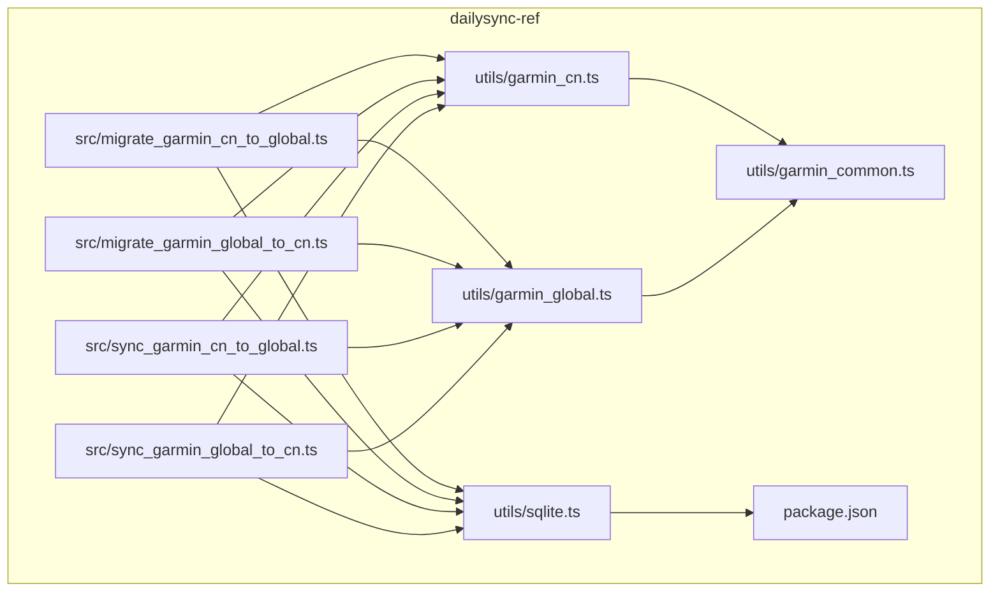
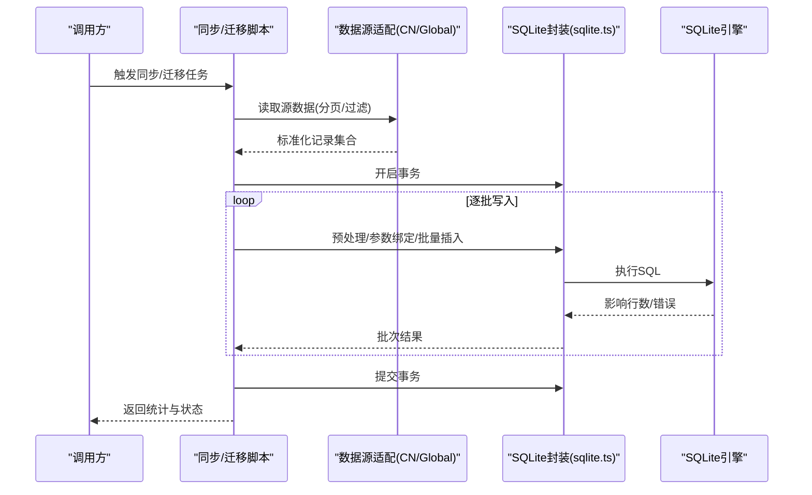
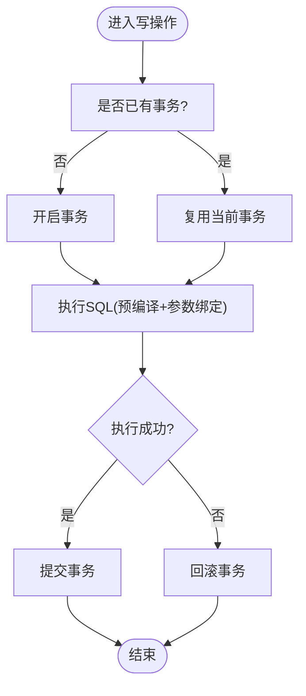
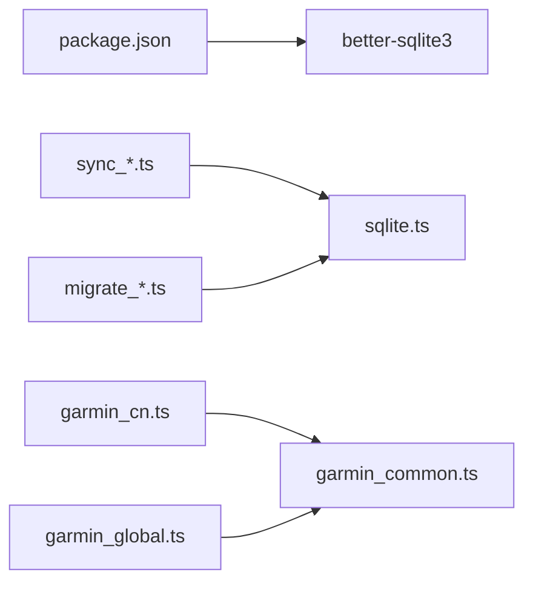

# 数据库操作

<cite>
**本文引用的文件**   
- [sqlite.ts](file://dailysync-ref/src/utils/sqlite.ts)
- [garmin_common.ts](file://dailysync-ref/src/utils/garmin_common.ts)
- [garmin_cn.ts](file://dailysync-ref/src/utils/garmin_cn.ts)
- [garmin_global.ts](file://dailysync-ref/src/utils/garmin_global.ts)
- [migrate_garmin_cn_to_global.ts](file://dailysync-ref/src/migrate_garmin_cn_to_global.ts)
- [migrate_garmin_global_to_cn.ts](file://dailysync-ref/src/migrate_garmin_global_to_cn.ts)
- [sync_garmin_cn_to_global.ts](file://dailysync-ref/src/sync_garmin_cn_to_global.ts)
- [sync_garmin_global_to_cn.ts](file://dailysync-ref/src/sync_garmin_global_to_cn.ts)
- [package.json](file://dailysync-ref/package.json)
</cite>

## 目录
1. [简介](#简介)
2. [项目结构](#项目结构)
3. [核心组件](#核心组件)
4. [架构总览](#架构总览)
5. [详细组件分析](#详细组件分析)
6. [依赖关系分析](#依赖关系分析)
7. [性能考虑](#性能考虑)
8. [故障排查指南](#故障排查指南)
9. [结论](#结论)
10. [附录](#附录)

## 简介
本文件为“数据库操作”模块的权威文档，聚焦于 SQLite 的连接管理、事务处理与查询优化；数据模型定义、表结构与索引策略；CRUD 封装与批量处理技巧；迁移脚本编写规范与版本管理；数据类型映射、约束检查与数据完整性验证；以及性能监控、备份恢复与故障恢复的最佳实践。内容基于仓库中 dailysync-ref 子项目的 TypeScript 实现进行提炼与总结，旨在帮助开发者快速理解并高效使用数据库能力。

## 项目结构
本项目采用按功能域组织的方式：
- utils 层提供通用工具与数据库抽象（SQLite 连接、事务、SQL 执行等）
- 业务同步与迁移逻辑位于 src 根目录，分别负责 Garmin CN/Global 之间的双向同步与迁移
- package.json 声明运行时依赖（如 better-sqlite3）

图表来源
- [sqlite.ts](file://dailysync-ref/src/utils/sqlite.ts)
- [garmin_common.ts](file://dailysync-ref/src/utils/garmin_common.ts)
- [garmin_cn.ts](file://dailysync-ref/src/utils/garmin_cn.ts)
- [garmin_global.ts](file://dailysync-ref/src/utils/garmin_global.ts)
- [migrate_garmin_cn_to_global.ts](file://dailysync-ref/src/migrate_garmin_cn_to_global.ts)
- [migrate_garmin_global_to_cn.ts](file://dailysync-ref/src/migrate_garmin_global_to_cn.ts)
- [sync_garmin_cn_to_global.ts](file://dailysync-ref/src/sync_garmin_cn_to_global.ts)
- [sync_garmin_global_to_cn.ts](file://dailysync-ref/src/sync_garmin_global_to_cn.ts)
- [package.json](file://dailysync-ref/package.json)

章节来源
- [package.json](file://dailysync-ref/package.json)

## 核心组件
- SQLite 连接与执行封装：统一创建连接、准备语句、参数绑定、结果集读取与错误处理
- 事务管理器：支持嵌套或串行事务、失败回滚、资源释放
- 数据模型与类型映射：将 TypeScript 类型与 SQLite 存储类型对齐，确保序列化/反序列化一致性
- 同步与迁移编排：协调源端读取、目标端写入、冲突解决与幂等性保障

章节来源
- [sqlite.ts](file://dailysync-ref/src/utils/sqlite.ts)
- [garmin_common.ts](file://dailysync-ref/src/utils/garmin_common.ts)

## 架构总览
整体架构围绕“数据源适配 + 数据库抽象 + 同步/迁移编排”展开：
- 数据源适配层：garmin_cn.ts、garmin_global.ts 负责从各自数据源拉取数据并进行标准化
- 数据库抽象层：sqlite.ts 提供连接、事务、SQL 执行、批处理等能力
- 编排层：迁移与同步脚本组合上述能力，完成跨库/跨源的数据流转与一致性保证

图表来源
- [sync_garmin_cn_to_global.ts](file://dailysync-ref/src/sync_garmin_cn_to_global.ts)
- [sync_garmin_global_to_cn.ts](file://dailysync-ref/src/sync_garmin_global_to_cn.ts)
- [migrate_garmin_cn_to_global.ts](file://dailysync-ref/src/migrate_garmin_cn_to_global.ts)
- [migrate_garmin_global_to_cn.ts](file://dailysync-ref/src/migrate_garmin_global_to_cn.ts)
- [sqlite.ts](file://dailysync-ref/src/utils/sqlite.ts)
- [garmin_cn.ts](file://dailysync-ref/src/utils/garmin_cn.ts)
- [garmin_global.ts](file://dailysync-ref/src/utils/garmin_global.ts)

## 详细组件分析

### SQLite 连接与执行封装
- 连接管理
  - 单例或池化连接：根据运行环境选择进程内单连接或轻量连接池
  - 连接生命周期：启动时初始化、关闭时释放句柄与缓存
- 事务处理
  - 显式事务边界：所有写操作包裹在事务中，失败自动回滚
  - 嵌套事务：通过保存点实现可重试的子事务
- 查询优化
  - 预编译语句复用：减少解析开销
  - 批量写入：使用 IN 列表或临时表合并多行插入
  - 只读路径优化：禁用 WAL 外的额外日志、合理设置 PRAGMA
- 错误处理
  - 统一异常包装：区分 SQL 语法错误、约束冲突、IO 错误
  - 重试策略：对瞬态错误（锁竞争）进行指数退避重试

图表来源
- [sqlite.ts](file://dailysync-ref/src/utils/sqlite.ts)

章节来源
- [sqlite.ts](file://dailysync-ref/src/utils/sqlite.ts)

### 数据模型与表结构设计
- 设计原则
  - 规范化与反规范化的平衡：热点字段冗余以提升读取性能
  - 主键与唯一约束：确保实体唯一性与引用完整性
  - 外键约束：启用外键检查以维护关联一致性
- 典型表族
  - 运动记录表：时间戳、类型、时长、距离、配速等
  - 设备与用户信息表：设备标识、用户ID、元数据
  - 同步状态表：源/目标游标、最后同步时间、状态码
- 索引策略
  - 复合索引：按查询条件顺序建立（时间范围+类型+用户）
  - 覆盖索引：命中常用 SELECT 列以减少回表
  - 去重索引：唯一索引防止重复导入

章节来源
- [garmin_common.ts](file://dailysync-ref/src/utils/garmin_common.ts)
- [garmin_cn.ts](file://dailysync-ref/src/utils/garmin_cn.ts)
- [garmin_global.ts](file://dailysync-ref/src/utils/garmin_global.ts)

### CRUD 封装与批量处理
- 标准 CRUD
  - Create：批量 INSERT OR IGNORE / REPLACE 控制幂等
  - Read：分页查询、条件过滤、排序与投影
  - Update：增量更新与并发安全（乐观锁/版本号）
  - Delete：软删除标记与定时清理
- 批量处理技巧
  - 分片写入：每批固定大小，避免单次过大导致内存峰值
  - 临时表装载：先批量写入临时表，再原子合并到目标表
  - UPSERT：利用 ON CONFLICT 实现“存在则更新，不存在则插入”
- 事务边界
  - 最小化事务粒度：仅包裹必要写操作
  - 长事务拆分：大任务拆分为多个短事务，降低锁竞争

章节来源
- [sqlite.ts](file://dailysync-ref/src/utils/sqlite.ts)
- [garmin_common.ts](file://dailysync-ref/src/utils/garmin_common.ts)

### 迁移脚本与版本管理
- 脚本职责
  - 建表与变更：DDL 变更、索引重建、数据清洗
  - 数据迁移：跨库/跨源字段映射、默认值填充、历史数据修复
- 版本管理
  - 版本号命名：语义化版本（v1.0.0）
  - 幂等性：重复执行不产生副作用
  - 回滚策略：保留反向脚本与快照
- 执行流程
  - 校验依赖：目标库版本、外部服务可用性
  - 灰度执行：先在测试库验证，再在生产执行
  - 审计记录：记录每次迁移的执行时间与影响行数

章节来源
- [migrate_garmin_cn_to_global.ts](file://dailysync-ref/src/migrate_garmin_cn_to_global.ts)
- [migrate_garmin_global_to_cn.ts](file://dailysync-ref/src/migrate_garmin_global_to_cn.ts)

### 同步流程与一致性保障
- 同步模式
  - 全量同步：首次或重置后完整复制
  - 增量同步：基于时间戳或游标的差异同步
- 一致性机制
  - 幂等写入：唯一键+UPSERT 避免重复
  - 断点续传：记录已处理游标，失败后可恢复
  - 冲突解决：时间戳优先、版本号比较或自定义策略
- 监控与告警
  - 指标采集：QPS、延迟、错误率、队列长度
  - 健康检查：连接可用、磁盘空间、锁等待

章节来源
- [sync_garmin_cn_to_global.ts](file://dailysync-ref/src/sync_garmin_cn_to_global.ts)
- [sync_garmin_global_to_cn.ts](file://dailysync-ref/src/sync_garmin_global_to_cn.ts)

### 数据类型映射与完整性验证
- 类型映射
  - 字符串：TEXT，限制长度与字符集
  - 数值：INTEGER/FLOAT，精度与范围校验
  - 布尔：INTEGER(0/1)，统一转换
  - 日期：ISO8601 字符串或 UNIX 时间戳
- 约束检查
  - NOT NULL、UNIQUE、CHECK 约束
  - 外键约束与级联策略
- 数据验证
  - 输入校验：格式、范围、依赖关系
  - 输出校验：序列化前后一致性

章节来源
- [garmin_common.ts](file://dailysync-ref/src/utils/garmin_common.ts)
- [sqlite.ts](file://dailysync-ref/src/utils/sqlite.ts)

## 依赖关系分析
- 运行时依赖
  - better-sqlite3：高性能 SQLite 驱动，适合 Node.js 进程内使用
- 模块耦合
  - 同步/迁移脚本强依赖 sqlite.ts 的事务与执行能力
  - garmin_cn/global 依赖 garmin_common 的公共类型与工具函数

图表来源
- [package.json](file://dailysync-ref/package.json)
- [sqlite.ts](file://dailysync-ref/src/utils/sqlite.ts)
- [garmin_common.ts](file://dailysync-ref/src/utils/garmin_common.ts)
- [garmin_cn.ts](file://dailysync-ref/src/utils/garmin_cn.ts)
- [garmin_global.ts](file://dailysync-ref/src/utils/garmin_global.ts)
- [sync_garmin_cn_to_global.ts](file://dailysync-ref/src/sync_garmin_cn_to_global.ts)
- [sync_garmin_global_to_cn.ts](file://dailysync-ref/src/sync_garmin_global_to_cn.ts)
- [migrate_garmin_cn_to_global.ts](file://dailysync-ref/src/migrate_garmin_cn_to_global.ts)
- [migrate_garmin_global_to_cn.ts](file://dailysync-ref/src/migrate_garmin_global_to_cn.ts)

章节来源
- [package.json](file://dailysync-ref/package.json)

## 性能考虑
- 连接与事务
  - 复用连接与预编译语句，减少对象创建与 SQL 解析
  - 合理划分事务边界，避免长事务持有锁过久
- I/O 与存储
  - 启用 WAL 模式提升并发读写性能
  - 调整页大小与缓存大小，匹配数据规模
- 查询优化
  - 使用 EXPLAIN ANALYZE 定位慢查询
  - 构建合适索引，避免全表扫描
- 批处理
  - 批量写入优于逐条插入
  - 使用临时表+原子合并减少锁竞争
- 监控
  - 采集关键指标：连接数、事务耗时、锁等待、磁盘 IO
  - 定期生成慢查询报告与索引建议

[本节为通用指导，无需特定文件来源]

## 故障排查指南
- 常见问题
  - 数据库被锁定：检查未提交事务、长事务、并发写入冲突
  - 磁盘空间不足：清理旧日志与备份，扩容磁盘
  - 索引失效：重建索引、检查统计信息
- 诊断步骤
  - 查看错误堆栈与 SQL 文本
  - 启用详细日志与慢查询日志
  - 使用 EXPLAIN 分析执行计划
- 恢复策略
  - 从备份恢复：冷备/热备结合
  - 断点续跑：基于游标或时间戳恢复
  - 降级方案：只读模式或限流保护

章节来源
- [sqlite.ts](file://dailysync-ref/src/utils/sqlite.ts)

## 结论
本模块以 sqlite.ts 为核心，提供稳定高效的 SQLite 连接、事务与批处理能力；配合 garmin_cn/global 的数据适配与统一的 garmin_common 类型体系，实现了可靠的同步与迁移流程。通过合理的表结构、索引策略与事务边界设计，可在高并发场景下保持良好性能与一致性。建议持续完善监控与告警，形成闭环的运维体系。

[本节为总结性内容，无需特定文件来源]

## 附录
- 最佳实践清单
  - 始终使用事务包裹写操作
  - 使用预编译语句与参数绑定
  - 批量写入与 UPSERT 提升吞吐与幂等性
  - 启用 WAL 与合适的外键约束
  - 建立覆盖索引与唯一索引
  - 记录迁移版本与审计日志
  - 定期备份与演练恢复
- 参考实现位置
  - SQLite 封装：[sqlite.ts](file://dailysync-ref/src/utils/sqlite.ts)
  - 公共类型与工具：[garmin_common.ts](file://dailysync-ref/src/utils/garmin_common.ts)
  - 数据源适配：[garmin_cn.ts](file://dailysync-ref/src/utils/garmin_cn.ts)、[garmin_global.ts](file://dailysync-ref/src/utils/garmin_global.ts)
  - 迁移脚本：[migrate_garmin_cn_to_global.ts](file://dailysync-ref/src/migrate_garmin_cn_to_global.ts)、[migrate_garmin_global_to_cn.ts](file://dailysync-ref/src/migrate_garmin_global_to_cn.ts)
  - 同步脚本：[sync_garmin_cn_to_global.ts](file://dailysync-ref/src/sync_garmin_cn_to_global.ts)、[sync_garmin_global_to_cn.ts](file://dailysync-ref/src/sync_garmin_global_to_cn.ts)
  - 依赖声明：[package.json](file://dailysync-ref/package.json)