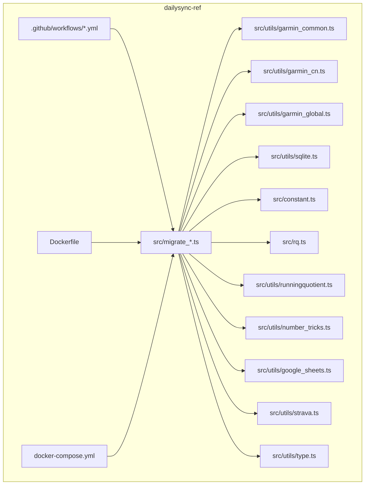
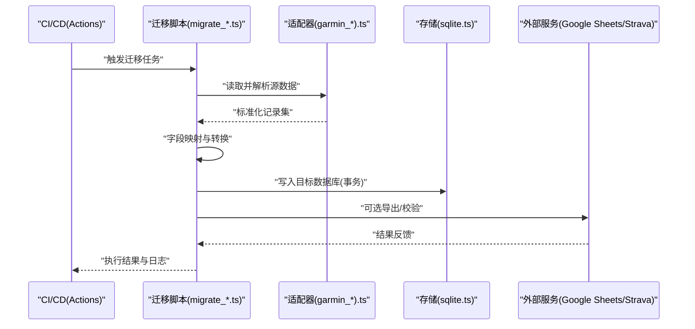
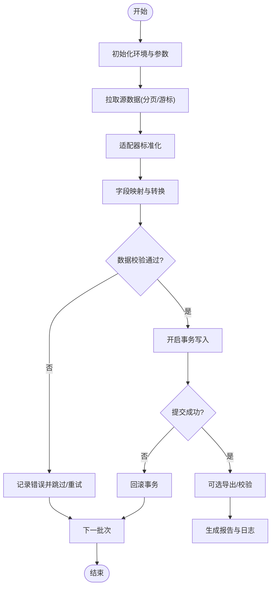
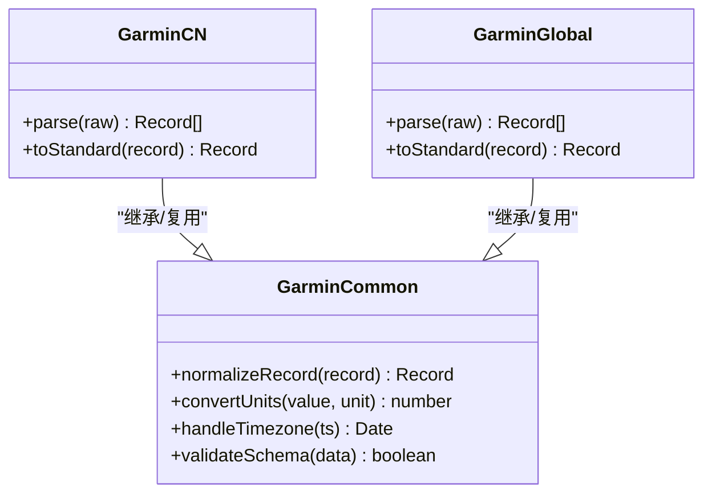
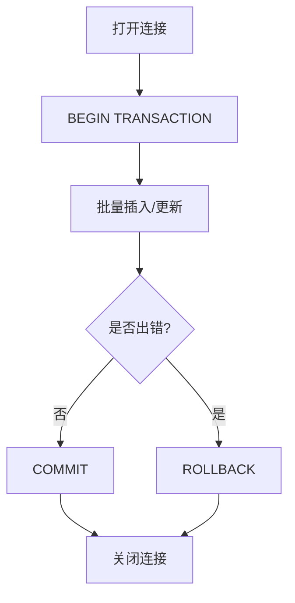
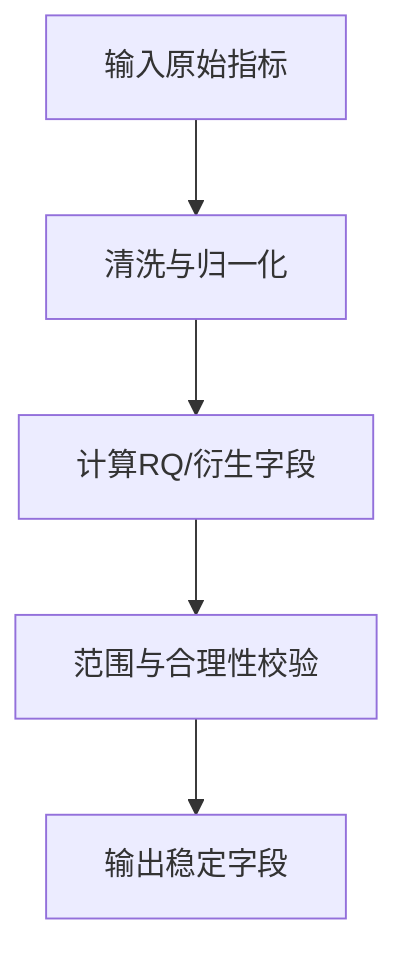
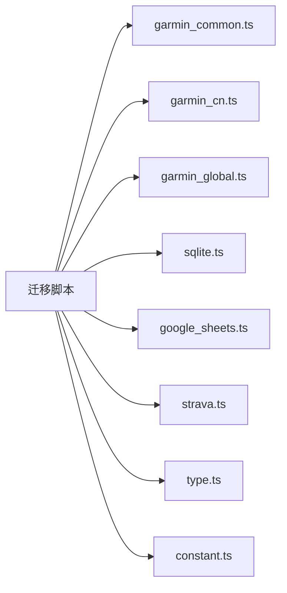

# 数据迁移工具

<cite>
**本文档引用的文件**   
- [README.md](file://README.md)
- [package.json](file://dailysync-ref/package.json)
- [migrate_garmin_cn_to_global.ts](file://dailysync-ref/src/migrate_garmin_cn_to_global.ts)
- [migrate_garmin_global_to_cn.ts](file://dailysync-ref/src/migrate_garmin_global_to_cn.ts)
- [sync_garmin_cn_to_global.ts](file://dailysync-ref/src/sync_garmin_cn_to_global.ts)
- [sync_garmin_global_to_cn.ts](file://dailysync-ref/src/sync_garmin_global_to_cn.ts)
- [garmin_common.ts](file://dailysync-ref/src/utils/garmin_common.ts)
- [garmin_cn.ts](file://dailysync-ref/src/utils/garmin_cn.ts)
- [garmin_global.ts](file://dailysync-ref/src/utils/garmin_global.ts)
- [sqlite.ts](file://dailysync-ref/src/utils/sqlite.ts)
- [constant.ts](file://dailysync-ref/src/constant.ts)
- [rq.ts](file://dailysync-ref/src/rq.ts)
- [runningquotient.ts](file://dailysync-ref/src/utils/runningquotient.ts)
- [number_tricks.ts](file://dailysync-ref/src/utils/number_tricks.ts)
- [google_sheets.ts](file://dailysync-ref/src/utils/google_sheets.ts)
- [strava.ts](file://dailysync-ref/src/utils/strava.ts)
- [type.ts](file://dailysync-ref/src/utils/type.ts)
- [daily_sync_rq.yml](file://dailysync-ref/.github/workflows/daily_sync_rq.yml)
- [migrate_garmin_cn_to_garmin_global.yml](file://dailysync-ref/.github/workflows/migrate_garmin_cn_to_garmin_global.yml)
- [migrate_garmin_global_to_garmin_cn.yml](file://dailysync-ref/.github/workflows/migrate_garmin_global_to_garmin_cn.yml)
- [sync_garmin_cn_to_garmin_global.yml](file://dailysync-ref/.github/workflows/sync_garmin_cn_to_garmin_global.yml)
- [sync_garmin_global_to_garmin_cn.yml](file://dailysync-ref/.github/workflows/sync_garmin_global_to_garmin_cn.yml)
- [Dockerfile](file://dailysync-ref/Dockerfile)
- [docker-compose.yml](file://dailysync-ref/docker-compose.yml)
</cite>

## 目录
1. [简介](#简介)
2. [项目结构](#项目结构)
3. [核心组件](#核心组件)
4. [架构总览](#架构总览)
5. [详细组件分析](#详细组件分析)
6. [依赖关系分析](#依赖关系分析)
7. [性能考量](#性能考量)
8. [故障排查指南](#故障排查指南)
9. [结论](#结论)
10. [附录](#附录)

## 简介
本文件为 Garmin 数据迁移工具的完整技术文档，聚焦于不同版本与区域（Garmin CN 与 Garmin Global）之间的数据迁移。内容涵盖：
- 数据结构映射与字段转换规则
- 数据完整性校验策略
- 增量迁移、回滚机制与断点续传设计
- 迁移配置示例（源格式、目标结构与转换规则）
- 错误处理、日志记录与进度监控
- 常见问题解决方案与最佳实践

该工具基于 TypeScript 实现，提供双向迁移能力（CN↔Global），并通过 GitHub Actions 进行自动化调度，支持容器化部署与本地开发调试。

## 项目结构
仓库包含小程序前端与云端函数，以及独立的 dailysync-ref 迁移工程。迁移相关代码集中在 dailysync-ref 目录中，采用“按功能域组织”的结构：
- src：迁移与同步脚本、常量、类型定义、工具库
- utils：各数据源适配与通用工具（SQLite、Google Sheets、Strava、数值计算等）
- .github/workflows：CI/CD 工作流，触发同步与迁移任务
- Dockerfile 与 docker-compose.yml：容器化运行环境

图表来源
- [migrate_garmin_cn_to_global.ts:1-200](file://dailysync-ref/src/migrate_garmin_cn_to_global.ts#L1-L200)
- [migrate_garmin_global_to_cn.ts:1-200](file://dailysync-ref/src/migrate_garmin_global_to_cn.ts#L1-L200)
- [garmin_common.ts:1-200](file://dailysync-ref/src/utils/garmin_common.ts#L1-L200)
- [garmin_cn.ts:1-200](file://dailysync-ref/src/utils/garmin_cn.ts#L1-L200)
- [garmin_global.ts:1-200](file://dailysync-ref/src/utils/garmin_global.ts#L1-L200)
- [sqlite.ts:1-200](file://dailysync-ref/src/utils/sqlite.ts#L1-L200)
- [constant.ts:1-200](file://dailysync-ref/src/constant.ts#L1-L200)
- [rq.ts:1-200](file://dailysync-ref/src/rq.ts#L1-L200)
- [runningquotient.ts:1-200](file://dailysync-ref/src/utils/runningquotient.ts#L1-L200)
- [number_tricks.ts:1-200](file://dailysync-ref/src/utils/number_tricks.ts#L1-L200)
- [google_sheets.ts:1-200](file://dailysync-ref/src/utils/google_sheets.ts#L1-L200)
- [strava.ts:1-200](file://dailysync-ref/src/utils/strava.ts#L1-L200)
- [type.ts:1-200](file://dailysync-ref/src/utils/type.ts#L1-L200)
- [daily_sync_rq.yml:1-200](file://dailysync-ref/.github/workflows/daily_sync_rq.yml#L1-L200)
- [migrate_garmin_cn_to_garmin_global.yml:1-200](file://dailysync-ref/.github/workflows/migrate_garmin_cn_to_garmin_global.yml#L1-L200)
- [migrate_garmin_global_to_garmin_cn.yml:1-200](file://dailysync-ref/.github/workflows/migrate_garmin_global_to_garmin_cn.yml#L1-L200)
- [sync_garmin_cn_to_garmin_global.yml:1-200](file://dailysync-ref/.github/workflows/sync_garmin_cn_to_garmin_global.yml#L1-L200)
- [sync_garmin_global_to_garmin_cn.yml:1-200](file://dailysync-ref/.github/workflows/sync_garmin_global_to_garmin_cn.yml#L1-L200)
- [Dockerfile:1-200](file://dailysync-ref/Dockerfile#L1-L200)
- [docker-compose.yml:1-200](file://dailysync-ref/docker-compose.yml#L1-L200)

章节来源
- [README.md:1-200](file://README.md#L1-L200)
- [package.json:1-200](file://dailysync-ref/package.json#L1-L200)

## 核心组件
- 迁移入口脚本
  - 中国到全球：[migrate_garmin_cn_to_global.ts](file://dailysync-ref/src/migrate_garmin_cn_to_global.ts)
  - 全球到中国：[migrate_garmin_global_to_cn.ts](file://dailysync-ref/src/migrate_garmin_global_to_cn.ts)
- 同步入口脚本
  - 中国到全球同步：[sync_garmin_cn_to_global.ts](file://dailysync-ref/src/sync_garmin_cn_to_global.ts)
  - 全球到中国同步：[sync_garmin_global_to_cn.ts](file://dailysync-ref/src/sync_garmin_global_to_cn.ts)
- 领域适配层
  - 公共逻辑：[garmin_common.ts](file://dailysync-ref/src/utils/garmin_common.ts)
  - 中国区适配：[garmin_cn.ts](file://dailysync-ref/src/utils/garmin_cn.ts)
  - 全球区适配：[garmin_global.ts](file://dailysync-ref/src/utils/garmin_global.ts)
- 存储与外部集成
  - SQLite 操作：[sqlite.ts](file://dailysync-ref/src/utils/sqlite.ts)
  - Google Sheets 集成：[google_sheets.ts](file://dailysync-ref/src/utils/google_sheets.ts)
  - Strava 集成：[strava.ts](file://dailysync-ref/src/utils/strava.ts)
- 常量与类型
  - 常量定义：[constant.ts](file://dailysync-ref/src/constant.ts)
  - 类型定义：[type.ts](file://dailysync-ref/src/utils/type.ts)
- 指标计算
  - 跑步商（Running Quotient）：[rq.ts](file://dailysync-ref/src/rq.ts)、[runningquotient.ts](file://dailysync-ref/src/utils/runningquotient.ts)
  - 数值工具：[number_tricks.ts](file://dailysync-ref/src/utils/number_tricks.ts)

章节来源
- [migrate_garmin_cn_to_global.ts:1-200](file://dailysync-ref/src/migrate_garmin_cn_to_global.ts#L1-L200)
- [migrate_garmin_global_to_cn.ts:1-200](file://dailysync-ref/src/migrate_garmin_global_to_cn.ts#L1-L200)
- [sync_garmin_cn_to_global.ts:1-200](file://dailysync-ref/src/sync_garmin_cn_to_global.ts#L1-L200)
- [sync_garmin_global_to_cn.ts:1-200](file://dailysync-ref/src/sync_garmin_global_to_cn.ts#L1-L200)
- [garmin_common.ts:1-200](file://dailysync-ref/src/utils/garmin_common.ts#L1-L200)
- [garmin_cn.ts:1-200](file://dailysync-ref/src/utils/garmin_cn.ts#L1-L200)
- [garmin_global.ts:1-200](file://dailysync-ref/src/utils/garmin_global.ts#L1-L200)
- [sqlite.ts:1-200](file://dailysync-ref/src/utils/sqlite.ts#L1-L200)
- [google_sheets.ts:1-200](file://dailysync-ref/src/utils/google_sheets.ts#L1-L200)
- [strava.ts:1-200](file://dailysync-ref/src/utils/strava.ts#L1-L200)
- [constant.ts:1-200](file://dailysync-ref/src/constant.ts#L1-L200)
- [type.ts:1-200](file://dailysync-ref/src/utils/type.ts#L1-L200)
- [rq.ts:1-200](file://dailysync-ref/src/rq.ts#L1-L200)
- [runningquotient.ts:1-200](file://dailysync-ref/src/utils/runningquotient.ts#L1-L200)
- [number_tricks.ts:1-200](file://dailysync-ref/src/utils/number_tricks.ts#L1-L200)

## 架构总览
迁移系统采用“适配器 + 管道”的架构模式：
- 适配器层：针对 Garmin CN/Garmin Global 的数据差异进行解析与标准化
- 管道层：读取、转换、校验、写入，支持事务与断点续传
- 持久化层：SQLite 作为中间态与最终落库；可选 Google Sheets/Strava 作为扩展输出
- 编排层：GitHub Actions 定时或手动触发迁移/同步任务；Docker 提供一致运行环境

图表来源
- [migrate_garmin_cn_to_global.ts:1-200](file://dailysync-ref/src/migrate_garmin_cn_to_global.ts#L1-L200)
- [migrate_garmin_global_to_cn.ts:1-200](file://dailysync-ref/src/migrate_garmin_global_to_cn.ts#L1-L200)
- [garmin_common.ts:1-200](file://dailysync-ref/src/utils/garmin_common.ts#L1-L200)
- [garmin_cn.ts:1-200](file://dailysync-ref/src/utils/garmin_cn.ts#L1-L200)
- [garmin_global.ts:1-200](file://dailysync-ref/src/utils/garmin_global.ts#L1-L200)
- [sqlite.ts:1-200](file://dailysync-ref/src/utils/sqlite.ts#L1-L200)
- [google_sheets.ts:1-200](file://dailysync-ref/src/utils/google_sheets.ts#L1-L200)
- [strava.ts:1-200](file://dailysync-ref/src/utils/strava.ts#L1-L200)

## 详细组件分析

### 迁移入口与流程控制
- 入口脚本负责参数解析、任务编排、进度上报与异常捕获
- 典型流程：初始化 → 拉取源数据 → 适配标准化 → 字段映射 → 校验 → 事务写入 → 导出/校验 → 完成报告
- 支持增量：通过时间戳或唯一键判断新增/更新
- 支持断点续传：记录已处理批次/游标，失败后从断点继续
- 支持回滚：在事务失败时回滚未提交变更，保证一致性

图表来源
- [migrate_garmin_cn_to_global.ts:1-200](file://dailysync-ref/src/migrate_garmin_cn_to_global.ts#L1-L200)
- [migrate_garmin_global_to_cn.ts:1-200](file://dailysync-ref/src/migrate_garmin_global_to_cn.ts#L1-L200)
- [sqlite.ts:1-200](file://dailysync-ref/src/utils/sqlite.ts#L1-L200)

章节来源
- [migrate_garmin_cn_to_global.ts:1-200](file://dailysync-ref/src/migrate_garmin_cn_to_global.ts#L1-L200)
- [migrate_garmin_global_to_cn.ts:1-200](file://dailysync-ref/src/migrate_garmin_global_to_cn.ts#L1-L200)

### 适配器层（Garmin CN / Global）
- 公共逻辑：统一接口、通用字段清洗、单位换算、时区处理
- 区域差异：字段命名、枚举值、缺失字段补齐、业务规则差异
- 数据模型：使用类型定义确保强类型约束与可维护性

图表来源
- [garmin_common.ts:1-200](file://dailysync-ref/src/utils/garmin_common.ts#L1-L200)
- [garmin_cn.ts:1-200](file://dailysync-ref/src/utils/garmin_cn.ts#L1-L200)
- [garmin_global.ts:1-200](file://dailysync-ref/src/utils/garmin_global.ts#L1-L200)
- [type.ts:1-200](file://dailysync-ref/src/utils/type.ts#L1-L200)

章节来源
- [garmin_common.ts:1-200](file://dailysync-ref/src/utils/garmin_common.ts#L1-L200)
- [garmin_cn.ts:1-200](file://dailysync-ref/src/utils/garmin_cn.ts#L1-L200)
- [garmin_global.ts:1-200](file://dailysync-ref/src/utils/garmin_global.ts#L1-L200)
- [type.ts:1-200](file://dailysync-ref/src/utils/type.ts#L1-L200)

### 存储与事务（SQLite）
- 连接管理：连接池、超时与重试
- 事务语义：批量写入包裹在事务中，失败自动回滚
- 索引与约束：主键/唯一键保障去重，外键保障关联完整性
- 断点续传：记录已处理的最大 ID/时间戳，下次从断点继续

图表来源
- [sqlite.ts:1-200](file://dailysync-ref/src/utils/sqlite.ts#L1-L200)

章节来源
- [sqlite.ts:1-200](file://dailysync-ref/src/utils/sqlite.ts#L1-L200)

### 指标计算（跑步商与数值工具）
- 跑步商（RQ）：结合心率、配速、训练负荷等指标计算
- 数值工具：精度控制、单位换算、边界处理
- 用途：在迁移过程中对衍生字段进行一致性计算与校验

图表来源
- [rq.ts:1-200](file://dailysync-ref/src/rq.ts#L1-L200)
- [runningquotient.ts:1-200](file://dailysync-ref/src/utils/runningquotient.ts#L1-L200)
- [number_tricks.ts:1-200](file://dailysync-ref/src/utils/number_tricks.ts#L1-L200)

章节来源
- [rq.ts:1-200](file://dailysync-ref/src/rq.ts#L1-L200)
- [runningquotient.ts:1-200](file://dailysync-ref/src/utils/runningquotient.ts#L1-L200)
- [number_tricks.ts:1-200](file://dailysync-ref/src/utils/number_tricks.ts#L1-L200)

### 外部集成（Google Sheets / Strava）
- Google Sheets：用于报表导出、审计与人工核对
- Strava：可选将部分数据同步至 Strava 平台
- 错误处理：网络重试、限流与降级策略

章节来源
- [google_sheets.ts:1-200](file://dailysync-ref/src/utils/google_sheets.ts#L1-L200)
- [strava.ts:1-200](file://dailysync-ref/src/utils/strava.ts#L1-L200)

### 常量与类型
- 常量：表名、字段名、枚举值、默认值、阈值
- 类型：Record、SourceData、TargetData、MigrationConfig 等

章节来源
- [constant.ts:1-200](file://dailysync-ref/src/constant.ts#L1-L200)
- [type.ts:1-200](file://dailysync-ref/src/utils/type.ts#L1-L200)

## 依赖关系分析
- 模块耦合
  - 迁移脚本依赖适配器与存储层，低耦合高内聚
  - 适配器之间共享公共逻辑，避免重复实现
  - 外部集成可选，不影响核心迁移流程
- 外部依赖
  - SQLite 驱动、网络请求库、加密/签名库（如鉴权）
  - Google Sheets API、Strava API
- 潜在循环依赖
  - 通过分层与接口隔离避免循环引用

图表来源
- [migrate_garmin_cn_to_global.ts:1-200](file://dailysync-ref/src/migrate_garmin_cn_to_global.ts#L1-L200)
- [migrate_garmin_global_to_cn.ts:1-200](file://dailysync-ref/src/migrate_garmin_global_to_cn.ts#L1-L200)
- [garmin_common.ts:1-200](file://dailysync-ref/src/utils/garmin_common.ts#L1-L200)
- [garmin_cn.ts:1-200](file://dailysync-ref/src/utils/garmin_cn.ts#L1-L200)
- [garmin_global.ts:1-200](file://dailysync-ref/src/utils/garmin_global.ts#L1-L200)
- [sqlite.ts:1-200](file://dailysync-ref/src/utils/sqlite.ts#L1-L200)
- [google_sheets.ts:1-200](file://dailysync-ref/src/utils/google_sheets.ts#L1-L200)
- [strava.ts:1-200](file://dailysync-ref/src/utils/strava.ts#L1-L200)
- [type.ts:1-200](file://dailysync-ref/src/utils/type.ts#L1-L200)
- [constant.ts:1-200](file://dailysync-ref/src/constant.ts#L1-L200)

章节来源
- [package.json:1-200](file://dailysync-ref/package.json#L1-L200)

## 性能考量
- 批处理与分页：大体积数据分片处理，降低内存峰值
- 并发控制：限制并行度，避免数据库锁竞争与 API 限流
- 索引优化：为目标表建立合适索引，提升查询与去重效率
- 缓存策略：对只读字典数据（如单位换算表）进行内存缓存
- 资源回收：及时释放连接与临时文件，避免资源泄漏

## 故障排查指南
- 常见错误
  - 字段缺失或类型不匹配：检查适配器映射与类型定义
  - 事务失败：查看 SQL 错误码与约束冲突
  - 网络超时/限流：增加重试退避与速率限制
  - 权限不足：确认 API Key、OAuth 令牌与访问范围
- 日志与追踪
  - 结构化日志：记录请求ID、批次号、关键步骤耗时
  - 错误堆栈：保留上下文信息便于定位
  - 进度上报：记录已处理数量、成功率、失败率
- 回滚与恢复
  - 事务回滚：确保原子性
  - 断点续传：从上次失败位置继续
  - 快照对比：导出前后数据快照进行比对

章节来源
- [sqlite.ts:1-200](file://dailysync-ref/src/utils/sqlite.ts#L1-L200)
- [google_sheets.ts:1-200](file://dailysync-ref/src/utils/google_sheets.ts#L1-L200)
- [strava.ts:1-200](file://dailysync-ref/src/utils/strava.ts#L1-L200)

## 结论
本迁移工具以清晰的适配器与管道架构实现了 Garmin CN/Global 的双向数据迁移，具备增量、回滚与断点续传能力。通过严格的类型与校验、事务化写入与完善的日志体系，保障了数据的一致性与可追溯性。建议在生产环境中启用自动化调度与监控告警，持续优化性能与稳定性。

## 附录

### 迁移配置示例（说明）
- 源数据格式
  - Garmin CN：字段命名、枚举值、时间戳格式、单位体系
  - Garmin Global：字段命名、枚举值、时间戳格式、单位体系
- 目标数据结构
  - 标准 Record 模型：字段类型、必填项、取值范围
  - 索引与约束：主键、唯一键、外键
- 转换规则定义
  - 字段映射表：源字段→目标字段
  - 单位换算：距离、速度、海拔、温度等
  - 时区处理：UTC 与本地时区转换
  - 衍生字段：RQ、训练负荷、强度区间等

### 自动化与部署
- CI/CD
  - 每日定时任务：[daily_sync_rq.yml](file://dailysync-ref/.github/workflows/daily_sync_rq.yml)
  - 迁移任务：[migrate_garmin_cn_to_garmin_global.yml](file://dailysync-ref/.github/workflows/migrate_garmin_cn_to_garmin_global.yml)、[migrate_garmin_global_to_garmin_cn.yml](file://dailysync-ref/.github/workflows/migrate_garmin_global_to_garmin_cn.yml)
  - 同步任务：[sync_garmin_cn_to_garmin_global.yml](file://dailysync-ref/.github/workflows/sync_garmin_cn_to_garmin_global.yml)、[sync_garmin_global_to_garmin_cn.yml](file://dailysync-ref/.github/workflows/sync_garmin_global_to_garmin_cn.yml)
- 容器化
  - Dockerfile：[Dockerfile](file://dailysync-ref/Dockerfile)
  - 编排：[docker-compose.yml](file://dailysync-ref/docker-compose.yml)

章节来源
- [daily_sync_rq.yml:1-200](file://dailysync-ref/.github/workflows/daily_sync_rq.yml#L1-L200)
- [migrate_garmin_cn_to_garmin_global.yml:1-200](file://dailysync-ref/.github/workflows/migrate_garmin_cn_to_garmin_global.yml#L1-L200)
- [migrate_garmin_global_to_garmin_cn.yml:1-200](file://dailysync-ref/.github/workflows/migrate_garmin_global_to_garmin_cn.yml#L1-L200)
- [sync_garmin_cn_to_garmin_global.yml:1-200](file://dailysync-ref/.github/workflows/sync_garmin_cn_to_garmin_global.yml#L1-L200)
- [sync_garmin_global_to_garmin_cn.yml:1-200](file://dailysync-ref/.github/workflows/sync_garmin_global_to_garmin_cn.yml#L1-L200)
- [Dockerfile:1-200](file://dailysync-ref/Dockerfile#L1-L200)
- [docker-compose.yml:1-200](file://dailysync-ref/docker-compose.yml#L1-L200)