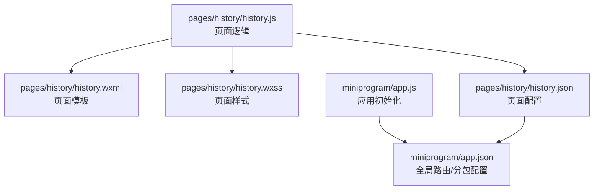
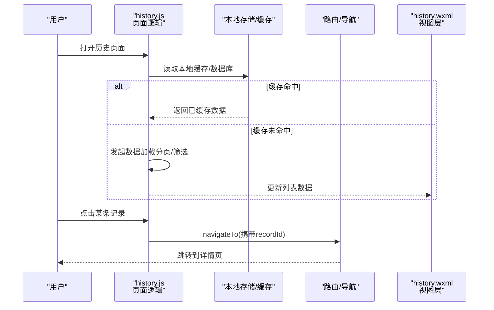
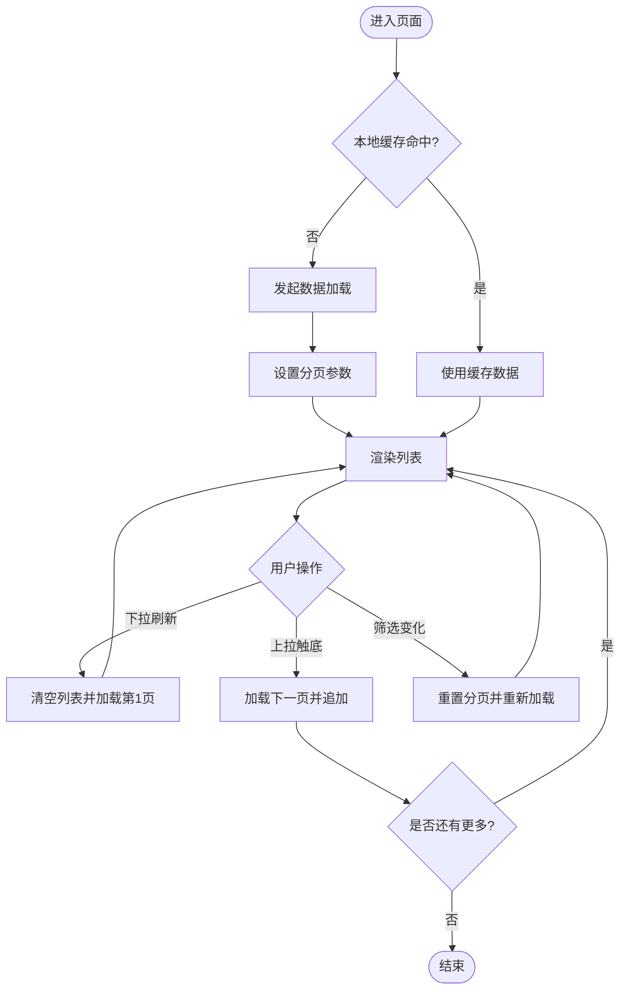
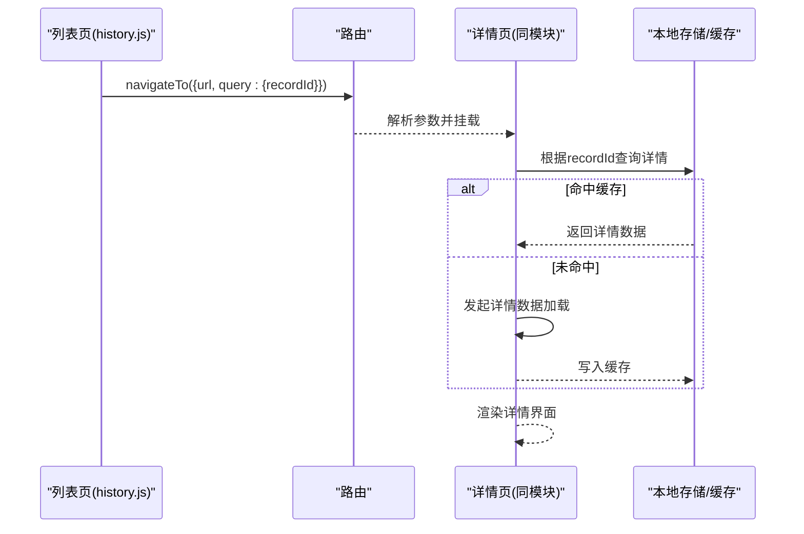
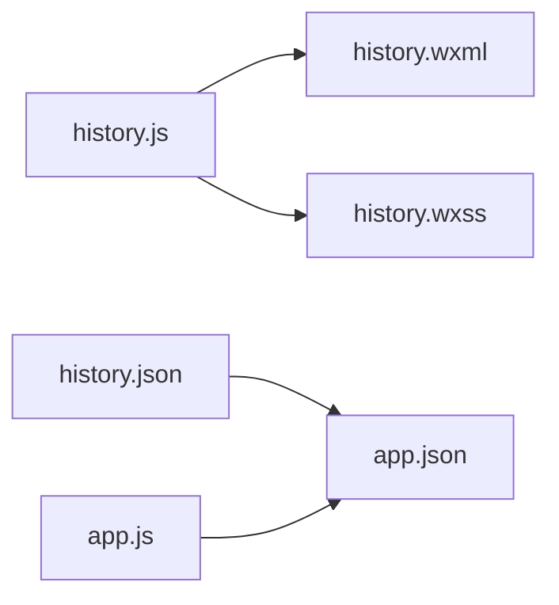

# 历史记录查看

<cite>
**本文引用的文件**   
- [history.js](file://miniprogram/pages/history/history.js)
- [history.wxml](file://miniprogram/pages/history/history.wxml)
- [history.wxss](file://miniprogram/pages/history/history.wxss)
- [history.json](file://miniprogram/pages/history/history.json)
- [app.js](file://miniprogram/app.js)
- [app.json](file://miniprogram/app.json)
</cite>

## 目录
1. [简介](#简介)
2. [项目结构](#项目结构)
3. [核心组件](#核心组件)
4. [架构总览](#架构总览)
5. [详细组件分析](#详细组件分析)
6. [依赖关系分析](#依赖关系分析)
7. [性能考虑](#性能考虑)
8. [故障排查指南](#故障排查指南)
9. [结论](#结论)
10. [附录](#附录)

## 简介
本文件面向“小程序历史记录查看”功能，围绕运动记录的列表展示、详情查看与数据筛选进行系统化说明。内容覆盖数据加载流程、分页处理、UI渲染策略、本地存储结构与数据格式定义、查询优化策略等，既适合初学者快速上手，也为有经验的开发者提供深入的技术细节与可落地的优化建议。

## 项目结构
历史记录查看功能位于 pages/history 目录下，包含页面逻辑、模板、样式与配置四个文件；应用级入口与路由分别由 app.js 与 app.json 管理。

图表来源
- [history.js](file://miniprogram/pages/history/history.js)
- [history.wxml](file://miniprogram/pages/history/history.wxml)
- [history.wxss](file://miniprogram/pages/history/history.wxss)
- [history.json](file://miniprogram/pages/history/history.json)
- [app.js](file://miniprogram/app.js)
- [app.json](file://miniprogram/app.json)

章节来源
- [history.js](file://miniprogram/pages/history/history.js)
- [history.wxml](file://miniprogram/pages/history/history.wxml)
- [history.wxss](file://miniprogram/pages/history/history.wxss)
- [history.json](file://miniprogram/pages/history/history.json)
- [app.js](file://miniprogram/app.js)
- [app.json](file://miniprogram/app.json)

## 核心组件
- 页面逻辑层（history.js）：负责数据获取、分页、筛选、状态管理与 UI 更新。
- 模板层（history.wxml）：负责列表渲染、详情跳转、交互事件绑定。
- 样式层（history.wxss）：负责布局与视觉呈现。
- 页面配置（history.json）：声明导航栏、下拉刷新、上拉触底等能力。
- 应用入口（app.js / app.json）：提供全局配置、路由与可能的全局数据或工具方法。

章节来源
- [history.js](file://miniprogram/pages/history/history.js)
- [history.wxml](file://miniprogram/pages/history/history.wxml)
- [history.wxss](file://miniprogram/pages/history/history.wxss)
- [history.json](file://miniprogram/pages/history/history.json)
- [app.js](file://miniprogram/app.js)
- [app.json](file://miniprogram/app.json)

## 架构总览
历史记录查看采用典型的小程序页面架构：页面逻辑通过 wx API 与系统能力交互，结合本地存储与可选的云函数/后端接口完成数据加载与持久化。列表页与详情页通过路由参数传递记录标识，实现从列表到详情的跳转。

图表来源
- [history.js](file://miniprogram/pages/history/history.js)
- [history.wxml](file://miniprogram/pages/history/history.wxml)

## 详细组件分析

### 列表展示与分页
- 数据加载流程
  - 首次进入页面时，优先检查本地缓存是否命中；若命中则直接渲染，否则触发数据加载。
  - 支持按时间范围、类型等条件进行筛选，并在切换筛选条件时重置分页状态。
  - 使用分页参数（如 page/pageSize）控制每次请求的数据量，避免一次性加载过多数据导致卡顿。
- 分页处理
  - 上拉触底时判断是否还有下一页数据，若有则追加至现有列表，保持滚动位置稳定。
  - 下拉刷新时清空当前列表并重新加载第一页数据。
- 渲染策略
  - 列表项采用轻量数据结构，仅包含必要字段以提升渲染性能。
  - 使用 wx:key 提升列表渲染效率，避免不必要的重排重绘。

图表来源
- [history.js](file://miniprogram/pages/history/history.js)
- [history.wxml](file://miniprogram/pages/history/history.wxml)

章节来源
- [history.js](file://miniprogram/pages/history/history.js)
- [history.wxml](file://miniprogram/pages/history/history.wxml)

### 详情查看
- 跳转机制
  - 列表项点击后，通过路由参数传递记录唯一标识（如 recordId），调用页面跳转 API 进入详情页。
- 数据获取
  - 详情页根据传入的 recordId 从本地存储或云端接口获取完整记录信息。
  - 若本地无缓存，则按需加载并写入缓存，以便后续快速访问。
- 渲染与交互
  - 详情页渲染完整字段（如距离、配速、轨迹、时间等），并提供返回按钮回到列表页。

图表来源
- [history.js](file://miniprogram/pages/history/history.js)
- [history.wxml](file://miniprogram/pages/history/history.wxml)

章节来源
- [history.js](file://miniprogram/pages/history/history.js)
- [history.wxml](file://miniprogram/pages/history/history.wxml)

### 数据筛选与查询优化
- 筛选维度
  - 常见维度包括日期范围、运动类型、强度区间等。切换筛选条件时应重置分页并重新加载。
- 查询优化策略
  - 前端缓存：对常用筛选结果进行短期缓存，减少重复请求。
  - 增量更新：在分页场景下，仅追加新数据而非全量替换。
  - 去重合并：当存在并发请求或网络重试时，确保数据一致性。
  - 懒加载：仅在需要时加载详情数据，降低首屏压力。

章节来源
- [history.js](file://miniprogram/pages/history/history.js)

### 本地存储结构与数据格式
- 存储结构
  - 列表缓存：以键值形式存储分页后的列表片段，键名可包含筛选条件与页码，便于精准命中。
  - 详情缓存：以记录 ID 为键存储完整详情对象，避免重复请求。
- 数据格式定义
  - 列表项：包含基础展示字段（如标题、时间、摘要、缩略图等）。
  - 详情项：包含完整业务字段（如距离、时长、配速、轨迹点、设备信息等）。
- 读写策略
  - 写：先更新内存态，再异步持久化，保证 UI 响应速度。
  - 读：优先内存态，其次本地存储，最后远端接口。

章节来源
- [history.js](file://miniprogram/pages/history/history.js)

### UI 渲染与交互
- 列表渲染
  - 使用 wx:key 提升渲染性能，避免频繁重建节点。
  - 空状态与加载中状态需友好提示，提升用户体验。
- 交互反馈
  - 下拉刷新与上拉触底需提供明确的状态指示。
  - 错误状态应给出重试入口与提示信息。

章节来源
- [history.wxml](file://miniprogram/pages/history/history.wxml)
- [history.wxss](file://miniprogram/pages/history/history.wxss)

## 依赖关系分析
- 页面内部依赖
  - history.js 依赖 history.wxml 与 history.wxss 完成视图渲染与样式应用。
  - history.json 声明页面能力（如下拉刷新、上拉触底）与导航配置。
- 应用级依赖
  - app.js 提供应用初始化与全局工具方法（如有）。
  - app.json 管理全局路由与分包策略，影响页面加载性能。

图表来源
- [history.js](file://miniprogram/pages/history/history.js)
- [history.wxml](file://miniprogram/pages/history/history.wxml)
- [history.wxss](file://miniprogram/pages/history/history.wxss)
- [history.json](file://miniprogram/pages/history/history.json)
- [app.js](file://miniprogram/app.js)
- [app.json](file://miniprogram/app.json)

章节来源
- [history.js](file://miniprogram/pages/history/history.js)
- [history.wxml](file://miniprogram/pages/history/history.wxml)
- [history.wxss](file://miniprogram/pages/history/history.wxss)
- [history.json](file://miniprogram/pages/history/history.json)
- [app.js](file://miniprogram/app.js)
- [app.json](file://miniprogram/app.json)

## 性能考虑
- 首屏优化
  - 优先使用本地缓存渲染首屏，必要时显示骨架屏占位。
  - 控制首屏字段数量，延迟加载非关键数据。
- 列表性能
  - 合理使用 wx:key，避免复杂计算在渲染路径中。
  - 大列表分页加载，避免一次性渲染过多节点。
- 存储优化
  - 合理设计缓存键，避免键冲突与过期混乱。
  - 定期清理无用缓存，释放存储空间。
- 网络优化
  - 合并请求与防抖节流，减少重复请求。
  - 失败重试与降级策略，提升鲁棒性。

[本节为通用指导，不直接分析具体文件]

## 故障排查指南
- 常见问题
  - 列表不更新：检查缓存键是否正确、分页参数是否重置、wx:key 是否稳定。
  - 详情无法加载：确认路由参数传递是否正确、缓存键是否存在、接口返回是否符合预期。
  - 性能卡顿：排查渲染路径中的重计算、过大列表未分页、频繁同步 I/O。
- 调试建议
  - 使用小程序开发者工具的 Network 面板观察请求与缓存命中情况。
  - 在关键路径添加日志输出，定位问题阶段。
  - 模拟弱网与失败场景，验证降级与重试逻辑。

章节来源
- [history.js](file://miniprogram/pages/history/history.js)
- [history.wxml](file://miniprogram/pages/history/history.wxml)

## 结论
历史记录查看功能通过清晰的页面分层、合理的缓存与分页策略、以及友好的交互设计，实现了高效稳定的列表展示与详情查看体验。建议在后续迭代中持续优化缓存命中率、减少不必要渲染、完善错误处理与监控，以进一步提升性能与稳定性。

[本节为总结性内容，不直接分析具体文件]

## 附录
- 相关页面与配置
  - 页面逻辑：history.js
  - 页面模板：history.wxml
  - 页面样式：history.wxss
  - 页面配置：history.json
  - 应用入口：app.js
  - 应用配置：app.json

章节来源
- [history.js](file://miniprogram/pages/history/history.js)
- [history.wxml](file://miniprogram/pages/history/history.wxml)
- [history.wxss](file://miniprogram/pages/history/history.wxss)
- [history.json](file://miniprogram/pages/history/history.json)
- [app.js](file://miniprogram/app.js)
- [app.json](file://miniprogram/app.json)