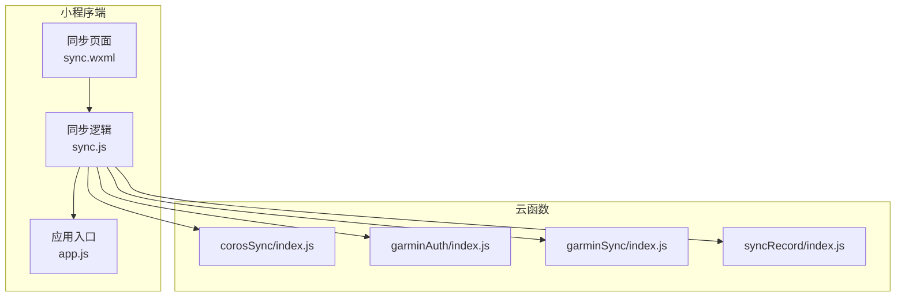
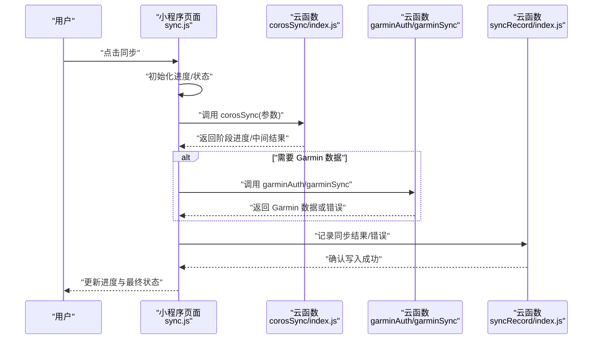
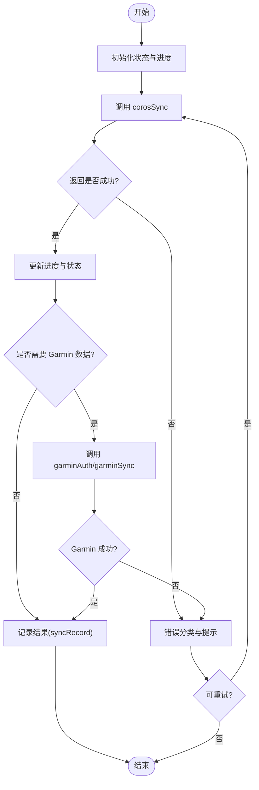
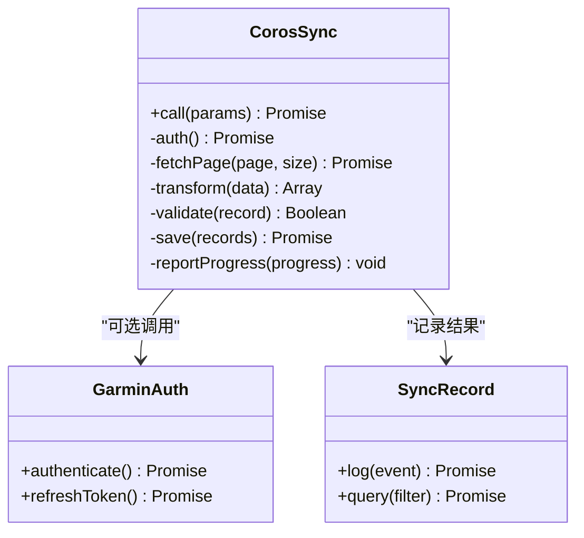
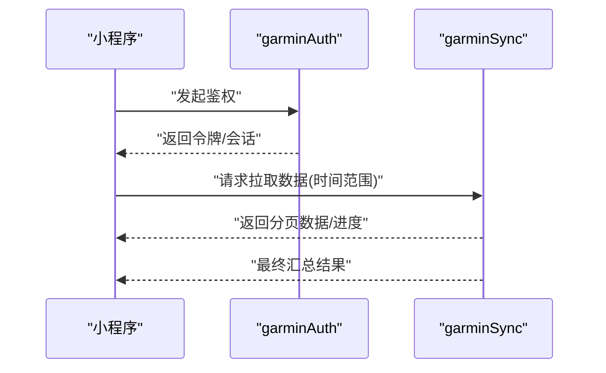
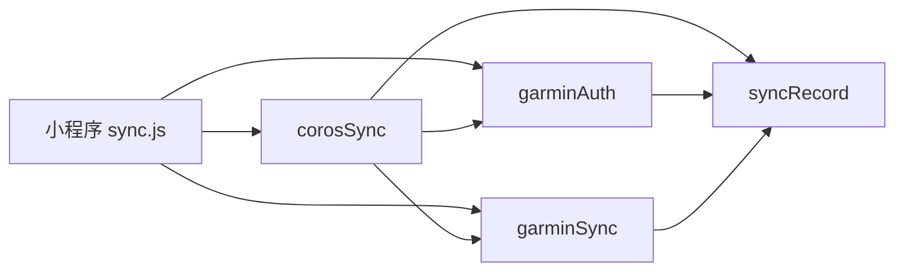

# 数据同步功能

<cite>
**本文引用的文件**   
- [miniprogram/pages/sync/sync.js](file://miniprogram/pages/sync/sync.js)
- [miniprogram/pages/sync/sync.wxml](file://miniprogram/pages/sync/sync.wxml)
- [miniprogram/app.js](file://miniprogram/app.js)
- [cloudfunctions/corosSync/index.js](file://cloudfunctions/corosSync/index.js)
- [cloudfunctions/garminAuth/index.js](file://cloudfunctions/garminAuth/index.js)
- [cloudfunctions/garminSync/index.js](file://cloudfunctions/garminSync/index.js)
- [cloudfunctions/syncRecord/index.js](file://cloudfunctions/syncRecord/index.js)
</cite>

## 目录
1. [简介](#简介)
2. [项目结构](#项目结构)
3. [核心组件](#核心组件)
4. [架构总览](#架构总览)
5. [详细组件分析](#详细组件分析)
6. [依赖关系分析](#依赖关系分析)
7. [性能考量](#性能考量)
8. [故障排查指南](#故障排查指南)
9. [结论](#结论)
10. [附录](#附录)

## 简介
本文件面向小程序“数据同步”能力，重点覆盖 Garmin 数据同步、Coros（高驰）数据同步、进度显示、错误处理与异常恢复机制。文档从整体架构到具体实现进行分层说明，既适合初学者快速上手，也为有经验的开发者提供深入的技术细节。内容涵盖：
- 小程序端同步流程控制与 UI 状态管理
- 云函数 corosSync 的调用方式与交互协议
- 网络请求处理与重试策略
- 本地数据存储与增量同步
- 错误分类、提示与恢复路径

## 项目结构
本项目采用“小程序前端 + 云函数后端”的分层架构：
- 小程序端负责用户交互、进度展示、状态管理与调用云函数
- 云函数负责第三方平台鉴权与数据拉取、转换与落库
- 关键目录与职责：
  - miniprogram/pages/sync：同步页面逻辑与视图
  - cloudfunctions/corosSync：Coros 数据同步入口
  - cloudfunctions/garminAuth/garminSync：Garmin 鉴权与数据同步
  - cloudfunctions/syncRecord：记录同步结果与日志

图表来源
- [miniprogram/pages/sync/sync.js](file://miniprogram/pages/sync/sync.js)
- [miniprogram/pages/sync/sync.wxml](file://miniprogram/pages/sync/sync.wxml)
- [miniprogram/app.js](file://miniprogram/app.js)
- [cloudfunctions/corosSync/index.js](file://cloudfunctions/corosSync/index.js)
- [cloudfunctions/garminAuth/index.js](file://cloudfunctions/garminAuth/index.js)
- [cloudfunctions/garminSync/index.js](file://cloudfunctions/garminSync/index.js)
- [cloudfunctions/syncRecord/index.js](file://cloudfunctions/syncRecord/index.js)

章节来源
- [miniprogram/pages/sync/sync.js](file://miniprogram/pages/sync/sync.js)
- [miniprogram/pages/sync/sync.wxml](file://miniprogram/pages/sync/sync.wxml)
- [miniprogram/app.js](file://miniprogram/app.js)
- [cloudfunctions/corosSync/index.js](file://cloudfunctions/corosSync/index.js)
- [cloudfunctions/garminAuth/index.js](file://cloudfunctions/garminAuth/index.js)
- [cloudfunctions/garminSync/index.js](file://cloudfunctions/garminSync/index.js)
- [cloudfunctions/syncRecord/index.js](file://cloudfunctions/syncRecord/index.js)

## 核心组件
- 同步页面（sync.js / sync.wxml）
  - 负责触发同步、维护进度与状态、渲染 UI、处理用户操作
  - 通过 wx.cloud.callFunction 调用云函数，并监听返回结果更新界面
- 云函数 corosSync（index.js）
  - 作为 Coros 数据同步的统一入口，封装鉴权、分页拉取、数据清洗与入库
- 云函数 garminAuth/garminSync
  - 负责 Garmin 账号鉴权与数据拉取，可能涉及 OAuth 或 Cookie 会话维持
- 云函数 syncRecord
  - 记录每次同步的结果、错误信息与时间戳，便于追踪与回溯

章节来源
- [miniprogram/pages/sync/sync.js](file://miniprogram/pages/sync/sync.js)
- [miniprogram/pages/sync/sync.wxml](file://miniprogram/pages/sync/sync.wxml)
- [cloudfunctions/corosSync/index.js](file://cloudfunctions/corosSync/index.js)
- [cloudfunctions/garminAuth/index.js](file://cloudfunctions/garminAuth/index.js)
- [cloudfunctions/garminSync/index.js](file://cloudfunctions/garminSync/index.js)
- [cloudfunctions/syncRecord/index.js](file://cloudfunctions/syncRecord/index.js)

## 架构总览
下图展示了从用户点击“同步”到数据落库的整体流程，包括小程序端状态流转、云函数调用链路与错误处理分支。

图表来源
- [miniprogram/pages/sync/sync.js](file://miniprogram/pages/sync/sync.js)
- [cloudfunctions/corosSync/index.js](file://cloudfunctions/corosSync/index.js)
- [cloudfunctions/garminAuth/index.js](file://cloudfunctions/garminAuth/index.js)
- [cloudfunctions/garminSync/index.js](file://cloudfunctions/garminSync/index.js)
- [cloudfunctions/syncRecord/index.js](file://cloudfunctions/syncRecord/index.js)

## 详细组件分析

### 小程序同步页面（sync.js / sync.wxml）
- 职责
  - 管理同步生命周期：准备、进行中、完成、失败
  - 维护进度条与百分比，实时更新 UI
  - 调用云函数 corosSync，并根据返回结果推进状态
  - 处理网络异常、超时、业务错误，给出友好提示
  - 将关键事件与结果写入 syncRecord，便于后续审计
- 关键流程
  - 用户触发同步 -> 初始化状态 -> 调用 corosSync -> 根据返回更新进度 -> 必要时调用 Garmin 相关云函数 -> 记录结果 -> 结束
- 错误处理
  - 网络错误：重试策略（指数退避）、降级提示
  - 业务错误：解析错误码，区分鉴权失败、数据为空、格式不合法等
  - 超时：设置合理超时阈值，提示用户稍后重试
- 本地存储
  - 使用小程序本地缓存保存上次同步时间与批次信息，支持增量同步
  - 在失败时保留断点信息，支持续传

图表来源
- [miniprogram/pages/sync/sync.js](file://miniprogram/pages/sync/sync.js)
- [miniprogram/pages/sync/sync.wxml](file://miniprogram/pages/sync/sync.wxml)
- [cloudfunctions/corosSync/index.js](file://cloudfunctions/corosSync/index.js)
- [cloudfunctions/garminAuth/index.js](file://cloudfunctions/garminAuth/index.js)
- [cloudfunctions/garminSync/index.js](file://cloudfunctions/garminSync/index.js)
- [cloudfunctions/syncRecord/index.js](file://cloudfunctions/syncRecord/index.js)

章节来源
- [miniprogram/pages/sync/sync.js](file://miniprogram/pages/sync/sync.js)
- [miniprogram/pages/sync/sync.wxml](file://miniprogram/pages/sync/sync.wxml)

### 云函数 corosSync（index.js）
- 职责
  - 统一入口：接收小程序传入的参数（如时间范围、设备 ID、分页大小等）
  - 鉴权与会话：获取 Coros 访问令牌或会话，处理过期刷新
  - 数据拉取：按页拉取运动记录，合并去重，转换为内部模型
  - 数据校验：字段完整性、类型校验、数值范围检查
  - 数据落库：批量写入数据库，保证事务性与幂等性
  - 进度上报：阶段性返回进度（已拉取页数、已入库数量、预计总量）
- 错误处理
  - 网络异常：捕获并分类（超时、连接失败、HTTP 错误）
  - 业务异常：无数据、权限不足、参数非法
  - 重试策略：对瞬时错误进行有限次重试，避免雪崩
- 幂等与一致性
  - 基于唯一键（如记录 ID+时间戳）去重，避免重复入库
  - 失败回滚或补偿写入，确保数据一致性

图表来源
- [cloudfunctions/corosSync/index.js](file://cloudfunctions/corosSync/index.js)
- [cloudfunctions/garminAuth/index.js](file://cloudfunctions/garminAuth/index.js)
- [cloudfunctions/syncRecord/index.js](file://cloudfunctions/syncRecord/index.js)

章节来源
- [cloudfunctions/corosSync/index.js](file://cloudfunctions/corosSync/index.js)

### Garmin 鉴权与同步（garminAuth/index.js / garminSync/index.js）
- 鉴权流程
  - 首次登录：引导用户授权，获取访问令牌与刷新令牌
  - 令牌管理：本地或云端安全存储，自动刷新过期令牌
  - 会话保持：维持 Cookie 或 Token，减少重复登录
- 数据同步
  - 分页拉取 Garmin 活动记录，按时间范围过滤
  - 数据清洗：单位换算、字段映射、缺失值填充
  - 去重与合并：与已有记录比对，避免重复
  - 错误处理：网络重试、限流等待、部分失败隔离

图表来源
- [cloudfunctions/garminAuth/index.js](file://cloudfunctions/garminAuth/index.js)
- [cloudfunctions/garminSync/index.js](file://cloudfunctions/garminSync/index.js)

章节来源
- [cloudfunctions/garminAuth/index.js](file://cloudfunctions/garminAuth/index.js)
- [cloudfunctions/garminSync/index.js](file://cloudfunctions/garminSync/index.js)

### 同步记录（syncRecord/index.js）
- 职责
  - 记录每次同步的开始时间、结束时间、状态、错误信息
  - 支持查询历史同步记录，用于问题定位与统计
- 数据结构
  - 包含：任务 ID、来源（Coros/Garmin）、状态、进度、错误码、错误消息、时间戳
- 查询接口
  - 按时间范围、来源、状态筛选，便于运维与审计

章节来源
- [cloudfunctions/syncRecord/index.js](file://cloudfunctions/syncRecord/index.js)

## 依赖关系分析
- 小程序端依赖
  - 云函数 corosSync：主同步入口
  - 云函数 garminAuth/garminSync：Garmin 数据源
  - 云函数 syncRecord：日志与审计
- 云函数间依赖
  - corosSync 可选择调用 garminAuth/garminSync
  - 所有云函数均可能调用 syncRecord 记录结果

图表来源
- [miniprogram/pages/sync/sync.js](file://miniprogram/pages/sync/sync.js)
- [cloudfunctions/corosSync/index.js](file://cloudfunctions/corosSync/index.js)
- [cloudfunctions/garminAuth/index.js](file://cloudfunctions/garminAuth/index.js)
- [cloudfunctions/garminSync/index.js](file://cloudfunctions/garminSync/index.js)
- [cloudfunctions/syncRecord/index.js](file://cloudfunctions/syncRecord/index.js)

章节来源
- [miniprogram/pages/sync/sync.js](file://miniprogram/pages/sync/sync.js)
- [cloudfunctions/corosSync/index.js](file://cloudfunctions/corosSync/index.js)
- [cloudfunctions/garminAuth/index.js](file://cloudfunctions/garminAuth/index.js)
- [cloudfunctions/garminSync/index.js](file://cloudfunctions/garminSync/index.js)
- [cloudfunctions/syncRecord/index.js](file://cloudfunctions/syncRecord/index.js)

## 性能考量
- 分页与批处理
  - 合理设置分页大小，平衡内存与网络开销
  - 批量写入数据库，减少 I/O 次数
- 并发与限流
  - 对第三方 API 进行速率限制，避免被封禁
  - 控制并发度，防止资源争用
- 缓存与增量同步
  - 使用本地缓存记录最后同步时间，仅拉取新增数据
  - 服务端去重，避免重复计算与写入
- 超时与重试
  - 设置合理的超时阈值与重试次数
  - 指数退避策略，降低瞬时压力

[本节为通用指导，无需特定文件引用]

## 故障排查指南
- 常见问题
  - 鉴权失败：检查令牌有效期与刷新逻辑
  - 数据为空：确认时间范围与设备绑定是否正确
  - 网络超时：检查网络环境与第三方服务可用性
  - 数据不一致：核对去重键与字段映射规则
- 定位方法
  - 查看 syncRecord 中的错误码与消息
  - 检查小程序控制台与云函数日志
  - 复现步骤：缩小时间范围，逐步验证
- 恢复策略
  - 失败重试：针对瞬时错误进行有限次重试
  - 断点续传：基于进度与批次信息继续同步
  - 数据修复：对缺失或错误数据进行补录与修正

章节来源
- [cloudfunctions/syncRecord/index.js](file://cloudfunctions/syncRecord/index.js)
- [miniprogram/pages/sync/sync.js](file://miniprogram/pages/sync/sync.js)

## 结论
本数据同步功能通过小程序端与云函数的协同，实现了 Coros 与 Garmin 数据的稳定同步。核心要点包括：
- 清晰的流程控制与状态管理
- 健壮的异常处理与重试机制
- 完善的进度反馈与用户体验
- 可靠的本地存储与增量同步
- 完整的日志记录与可观测性

建议持续优化分页策略、并发控制与缓存机制，以提升性能与稳定性。

[本节为总结性内容，无需特定文件引用]

## 附录
- 术语表
  - 云函数：微信小程序提供的服务端运行环境
  - 鉴权：身份认证与授权过程
  - 幂等：多次执行同一操作结果一致
  - 增量同步：仅同步新增或变更的数据
- 参考文件
  - 小程序同步页面：[miniprogram/pages/sync/sync.js](file://miniprogram/pages/sync/sync.js)、[miniprogram/pages/sync/sync.wxml](file://miniprogram/pages/sync/sync.wxml)
  - 应用入口：[miniprogram/app.js](file://miniprogram/app.js)
  - 云函数：[cloudfunctions/corosSync/index.js](file://cloudfunctions/corosSync/index.js)、[cloudfunctions/garminAuth/index.js](file://cloudfunctions/garminAuth/index.js)、[cloudfunctions/garminSync/index.js](file://cloudfunctions/garminSync/index.js)、[cloudfunctions/syncRecord/index.js](file://cloudfunctions/syncRecord/index.js)