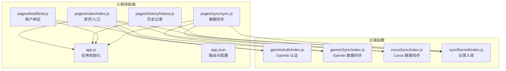
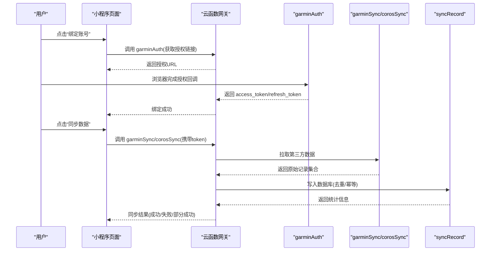
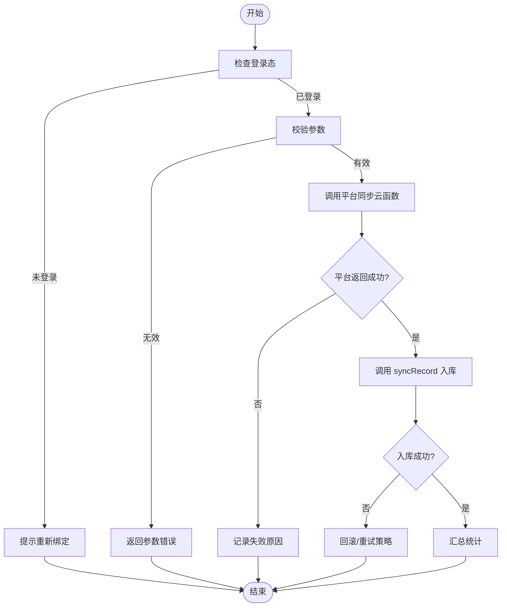
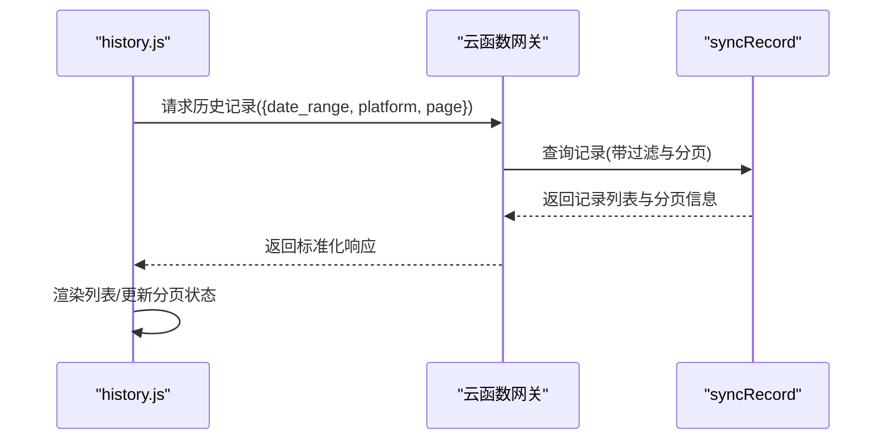
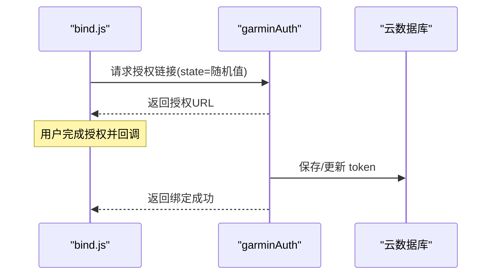
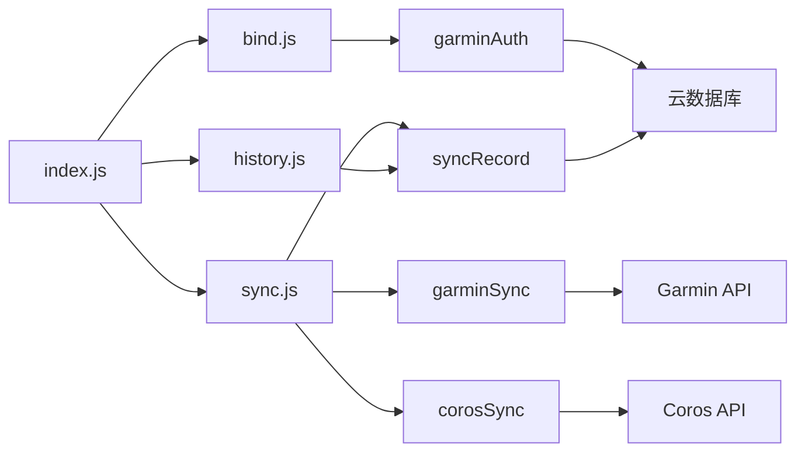

# 核心功能

<cite>
**本文引用的文件**   
- [miniprogram/app.js](file://miniprogram/app.js)
- [miniprogram/app.json](file://miniprogram/app.json)
- [miniprogram/pages/index/index.js](file://miniprogram/pages/index/index.js)
- [miniprogram/pages/history/history.js](file://miniprogram/pages/history/history.js)
- [miniprogram/pages/bind/bind.js](file://miniprogram/pages/bind/bind.js)
- [miniprogram/pages/sync/sync.js](file://miniprogram/pages/sync/sync.js)
- [cloudfunctions/corosSync/index.js](file://cloudfunctions/corosSync/index.js)
- [cloudfunctions/garminAuth/index.js](file://cloudfunctions/garminAuth/index.js)
- [cloudfunctions/garminSync/index.js](file://cloudfunctions/garminSync/index.js)
- [cloudfunctions/syncRecord/index.js](file://cloudfunctions/syncRecord/index.js)
</cite>

## 目录
1. [简介](#简介)
2. [项目结构](#项目结构)
3. [核心组件](#核心组件)
4. [架构总览](#架构总览)
5. [详细组件分析](#详细组件分析)
6. [依赖关系分析](#依赖关系分析)
7. [性能考虑](#性能考虑)
8. [故障排查指南](#故障排查指南)
9. [结论](#结论)
10. [附录](#附录)

## 简介
本文件面向微信小程序“核心功能模块”的技术文档，聚焦以下关键能力：数据同步、历史记录查看、账户绑定。文档从系统架构、组件职责、数据流与调用关系、接口定义与业务模型入手，结合云函数与小程序页面代码进行逐层解析，并提供常见问题与优化建议，帮助初学者快速上手，同时为有经验的开发者提供足够的技术深度。

## 项目结构
本项目采用“小程序前端 + 云端函数”的常见架构：
- 小程序端（miniprogram）负责用户交互、状态管理、调用云函数。
- 云端函数（cloudfunctions）负责认证、数据同步、记录写入等后端逻辑。
- 配置与路由由 app.json 统一管理，入口在 app.js。

图表来源
- [miniprogram/app.js](file://miniprogram/app.js)
- [miniprogram/app.json](file://miniprogram/app.json)
- [miniprogram/pages/index/index.js](file://miniprogram/pages/index/index.js)
- [miniprogram/pages/history/history.js](file://miniprogram/pages/history/history.js)
- [miniprogram/pages/bind/bind.js](file://miniprogram/pages/bind/bind.js)
- [miniprogram/pages/sync/sync.js](file://miniprogram/pages/sync/sync.js)
- [cloudfunctions/garminAuth/index.js](file://cloudfunctions/garminAuth/index.js)
- [cloudfunctions/garminSync/index.js](file://cloudfunctions/garminSync/index.js)
- [cloudfunctions/corosSync/index.js](file://cloudfunctions/corosSync/index.js)
- [cloudfunctions/syncRecord/index.js](file://cloudfunctions/syncRecord/index.js)

章节来源
- [miniprogram/app.js](file://miniprogram/app.js)
- [miniprogram/app.json](file://miniprogram/app.json)

## 核心组件
- 应用初始化与全局状态（app.js）
  - 负责小程序启动、全局配置、云环境初始化、错误捕获与日志上报。
  - 暴露全局方法供页面统一调用云函数或读取全局状态。
- 首页与入口（index.js）
  - 聚合常用入口：跳转绑定、触发同步、查看历史等。
  - 维护基础 UI 状态与加载提示。
- 历史记录（history.js）
  - 通过云函数查询并展示运动记录列表，支持分页与筛选。
- 账户绑定（bind.js）
  - 引导用户完成第三方平台（如 Garmin/Coros）授权，获取 token 并保存至云数据库。
- 数据同步（sync.js）
  - 发起增量同步任务，协调各平台同步函数，处理进度与结果反馈。

章节来源
- [miniprogram/app.js](file://miniprogram/app.js)
- [miniprogram/pages/index/index.js](file://miniprogram/pages/index/index.js)
- [miniprogram/pages/history/history.js](file://miniprogram/pages/history/history.js)
- [miniprogram/pages/bind/bind.js](file://miniprogram/pages/bind/bind.js)
- [miniprogram/pages/sync/sync.js](file://miniprogram/pages/sync/sync.js)

## 架构总览
整体流程遵循“前端轻、云端重”的设计：
- 前端仅做参数组装、UI 渲染与错误提示。
- 云端函数承担认证、拉取第三方数据、数据清洗与入库。
- 数据一致性通过幂等键与去重策略保障。

图表来源
- [miniprogram/pages/bind/bind.js](file://miniprogram/pages/bind/bind.js)
- [miniprogram/pages/sync/sync.js](file://miniprogram/pages/sync/sync.js)
- [cloudfunctions/garminAuth/index.js](file://cloudfunctions/garminAuth/index.js)
- [cloudfunctions/garminSync/index.js](file://cloudfunctions/garminSync/index.js)
- [cloudfunctions/corosSync/index.js](file://cloudfunctions/corosSync/index.js)
- [cloudfunctions/syncRecord/index.js](file://cloudfunctions/syncRecord/index.js)

## 详细组件分析

### 数据同步（sync.js + 云函数）
- 触发方式
  - 用户在 sync 页面选择同步目标（如 Garmin/Coros），点击开始同步。
- 参数约定
  - platform: 平台标识（如 garmin/coros）
  - token: 访问令牌（由绑定流程获得）
  - since_id: 增量起始 ID（可选）
  - limit: 单次拉取上限（可选）
- 返回值约定
  - code: 状态码（0 表示成功）
  - data: { total, success, failed, message }
  - message: 人类可读消息
- 处理流程
  - 校验参数与登录态
  - 调用对应平台云函数拉取数据
  - 将原始数据交由 syncRecord 进行清洗与入库
  - 汇总结果并返回前端

图表来源
- [miniprogram/pages/sync/sync.js](file://miniprogram/pages/sync/sync.js)
- [cloudfunctions/garminSync/index.js](file://cloudfunctions/garminSync/index.js)
- [cloudfunctions/corosSync/index.js](file://cloudfunctions/corosSync/index.js)
- [cloudfunctions/syncRecord/index.js](file://cloudfunctions/syncRecord/index.js)

章节来源
- [miniprogram/pages/sync/sync.js](file://miniprogram/pages/sync/sync.js)
- [cloudfunctions/garminSync/index.js](file://cloudfunctions/garminSync/index.js)
- [cloudfunctions/corosSync/index.js](file://cloudfunctions/corosSync/index.js)
- [cloudfunctions/syncRecord/index.js](file://cloudfunctions/syncRecord/index.js)

### 历史记录查看（history.js）
- 查询条件
  - date_range: 日期范围（start/end）
  - platform: 平台过滤（可选）
  - page/page_size: 分页参数
- 返回结构
  - list: 记录数组（含 id、title、date、platform、stats 等）
  - pagination: { total, page, pageSize, hasMore }
- 交互要点
  - 首次进入自动拉取第一页
  - 下拉刷新与上拉加载更多
  - 空状态与错误提示

图表来源
- [miniprogram/pages/history/history.js](file://miniprogram/pages/history/history.js)
- [cloudfunctions/syncRecord/index.js](file://cloudfunctions/syncRecord/index.js)

章节来源
- [miniprogram/pages/history/history.js](file://miniprogram/pages/history/history.js)
- [cloudfunctions/syncRecord/index.js](file://cloudfunctions/syncRecord/index.js)

### 账户绑定（bind.js）
- 绑定流程
  - 生成授权链接（携带 state 防 CSRF）
  - 用户完成授权后回调到云函数
  - 云函数换取 token 并持久化
- 安全要点
  - state 校验
  - token 加密存储
  - 错误码映射与友好提示
- 返回结构
  - code: 状态码
  - data: { bindStatus, platform, message }

图表来源
- [miniprogram/pages/bind/bind.js](file://miniprogram/pages/bind/bind.js)
- [cloudfunctions/garminAuth/index.js](file://cloudfunctions/garminAuth/index.js)

章节来源
- [miniprogram/pages/bind/bind.js](file://miniprogram/pages/bind/bind.js)
- [cloudfunctions/garminAuth/index.js](file://cloudfunctions/garminAuth/index.js)

### 应用初始化与路由（app.js / app.json）
- app.js
  - 初始化云环境、全局错误处理、日志埋点
  - 暴露全局方法：getCloud(), callCloudFunction(name, params)
- app.json
  - 注册页面路由、窗口样式、tabBar 配置
  - 控制权限与网络超时等全局行为

章节来源
- [miniprogram/app.js](file://miniprogram/app.js)
- [miniprogram/app.json](file://miniprogram/app.json)

## 依赖关系分析
- 页面与云函数的耦合
  - 页面通过统一的云函数调用封装减少重复代码
  - 云函数之间职责清晰：认证、同步、入库分离
- 外部依赖
  - 第三方平台 API（Garmin/Coros）
  - 云数据库（用于持久化 token 与记录）

图表来源
- [miniprogram/pages/index/index.js](file://miniprogram/pages/index/index.js)
- [miniprogram/pages/bind/bind.js](file://miniprogram/pages/bind/bind.js)
- [miniprogram/pages/sync/sync.js](file://miniprogram/pages/sync/sync.js)
- [miniprogram/pages/history/history.js](file://miniprogram/pages/history/history.js)
- [cloudfunctions/garminAuth/index.js](file://cloudfunctions/garminAuth/index.js)
- [cloudfunctions/garminSync/index.js](file://cloudfunctions/garminSync/index.js)
- [cloudfunctions/corosSync/index.js](file://cloudfunctions/corosSync/index.js)
- [cloudfunctions/syncRecord/index.js](file://cloudfunctions/syncRecord/index.js)

章节来源
- [miniprogram/pages/index/index.js](file://miniprogram/pages/index/index.js)
- [miniprogram/pages/bind/bind.js](file://miniprogram/pages/bind/bind.js)
- [miniprogram/pages/sync/sync.js](file://miniprogram/pages/sync/sync.js)
- [miniprogram/pages/history/history.js](file://miniprogram/pages/history/history.js)
- [cloudfunctions/garminAuth/index.js](file://cloudfunctions/garminAuth/index.js)
- [cloudfunctions/garminSync/index.js](file://cloudfunctions/garminSync/index.js)
- [cloudfunctions/corosSync/index.js](file://cloudfunctions/corosSync/index.js)
- [cloudfunctions/syncRecord/index.js](file://cloudfunctions/syncRecord/index.js)

## 性能考虑
- 增量同步
  - 使用 since_id 避免全量拉取，降低带宽与耗时
- 分页与限流
  - 合理设置 page_size，避免一次性返回过多数据
  - 对第三方 API 增加退避重试与并发限制
- 缓存策略
  - 对静态资源与热点数据做本地缓存，减少重复请求
- 错误恢复
  - 失败任务可重试，保证最终一致性

## 故障排查指南
- 绑定失败
  - 检查 state 是否一致、回调域名是否配置正确
  - 确认 token 是否成功保存
- 同步失败
  - 检查 token 是否过期，必要时刷新
  - 查看平台 API 返回的错误码与限流提示
- 历史记录为空
  - 确认是否已完成绑定与至少一次同步
  - 检查查询条件与分页参数是否正确
- 通用建议
  - 打开调试模式，查看云函数日志
  - 对异常路径增加更详细的错误码与消息

## 结论
本项目以清晰的职责划分与稳定的调用契约实现了“绑定—同步—查看”的核心闭环。通过云函数解耦第三方平台差异，前端保持轻量，便于扩展更多平台与功能。建议在后续迭代中完善监控与告警、增强错误恢复与重试机制，并持续优化数据入库的性能与一致性。

## 附录
- 术语说明
  - 云函数：运行在云端的 Node.js 函数，用于处理认证、数据同步与入库
  - 幂等键：确保相同操作多次执行不会产生副作用的唯一标识
  - 增量同步：基于上次同步位置继续拉取新数据的策略
- 参考实现路径
  - 页面入口与路由：[miniprogram/app.json](file://miniprogram/app.json)
  - 应用初始化：[miniprogram/app.js](file://miniprogram/app.js)
  - 绑定流程：[miniprogram/pages/bind/bind.js](file://miniprogram/pages/bind/bind.js)、[cloudfunctions/garminAuth/index.js](file://cloudfunctions/garminAuth/index.js)
  - 同步流程：[miniprogram/pages/sync/sync.js](file://miniprogram/pages/sync/sync.js)、[cloudfunctions/garminSync/index.js](file://cloudfunctions/garminSync/index.js)、[cloudfunctions/corosSync/index.js](file://cloudfunctions/corosSync/index.js)
  - 记录查询与入库：[miniprogram/pages/history/history.js](file://miniprogram/pages/history/history.js)、[cloudfunctions/syncRecord/index.js](file://cloudfunctions/syncRecord/index.js)