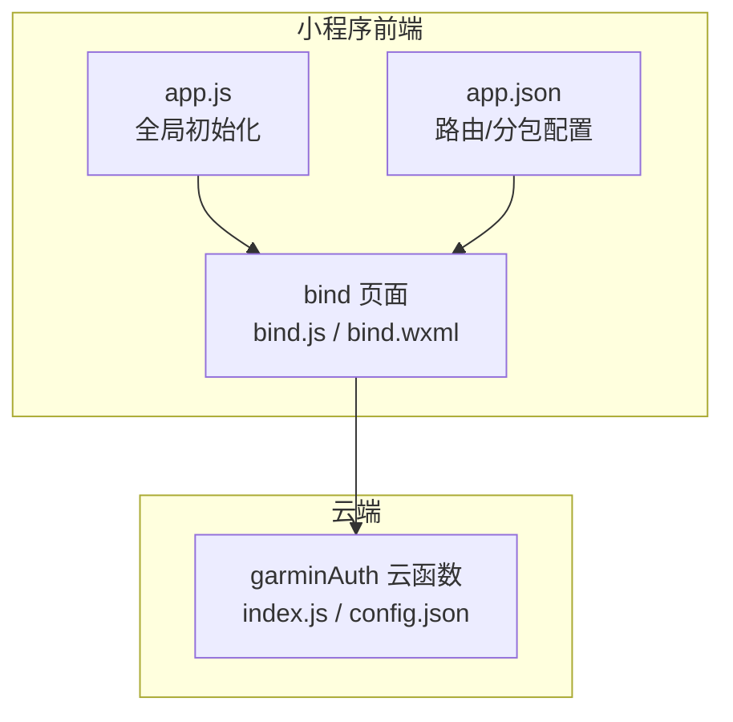
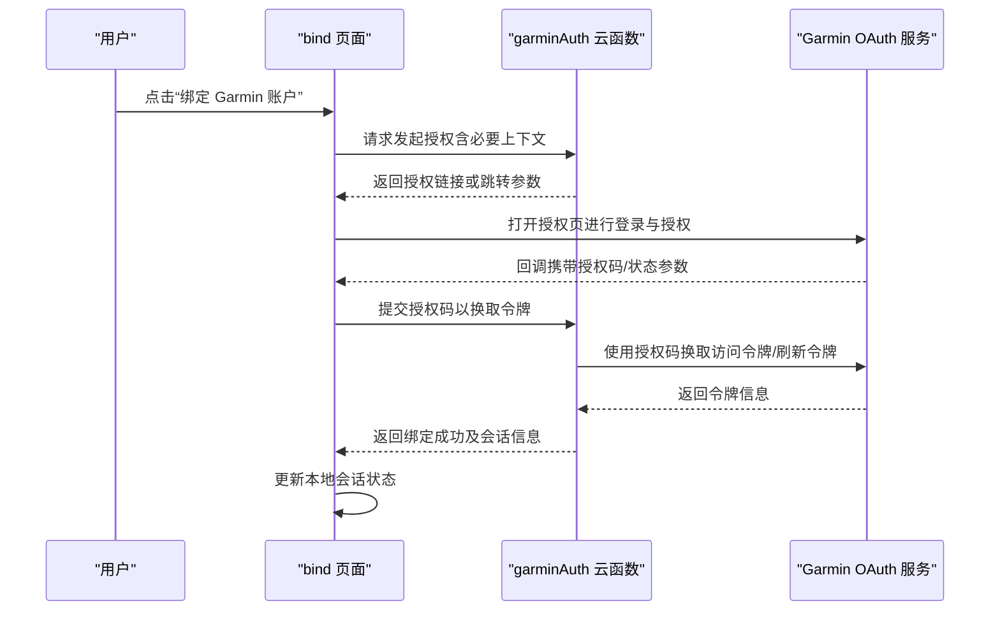
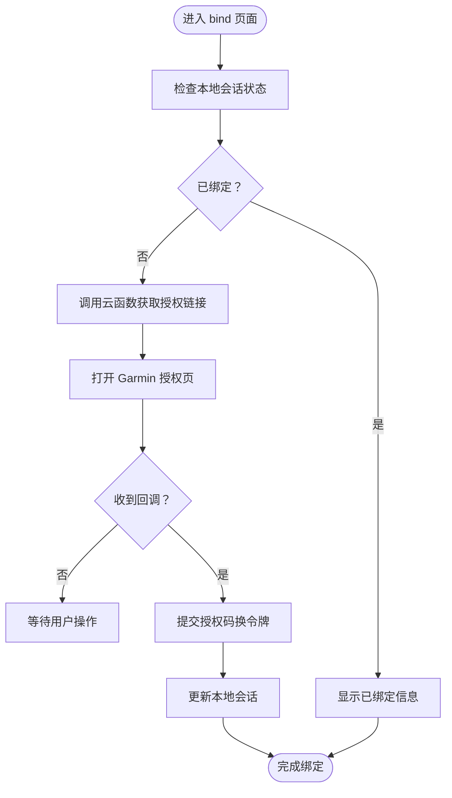
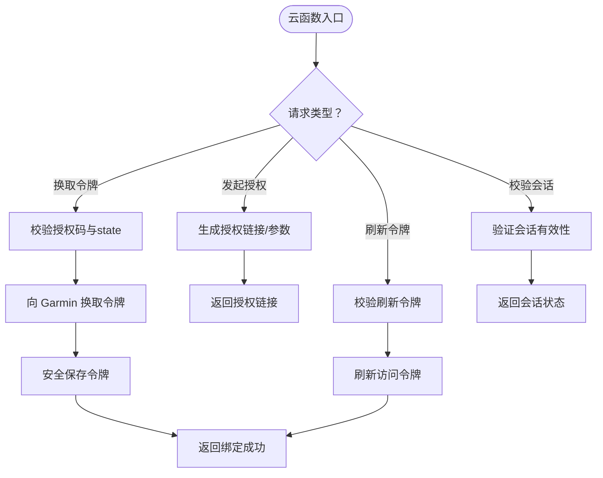
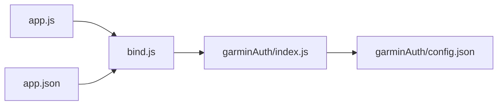

# 账户绑定功能

<cite>
**本文引用的文件**   
- [miniprogram/pages/bind/bind.js](file://miniprogram/pages/bind/bind.js)
- [miniprogram/pages/bind/bind.wxml](file://miniprogram/pages/bind/bind.wxml)
- [cloudfunctions/garminAuth/index.js](file://cloudfunctions/garminAuth/index.js)
- [cloudfunctions/garminAuth/config.json](file://cloudfunctions/garminAuth/config.json)
- [miniprogram/app.js](file://miniprogram/app.js)
- [miniprogram/app.json](file://miniprogram/app.json)
</cite>

## 目录
1. [简介](#简介)
2. [项目结构](#项目结构)
3. [核心组件](#核心组件)
4. [架构总览](#架构总览)
5. [详细组件分析](#详细组件分析)
6. [依赖关系分析](#依赖关系分析)
7. [性能与安全性考虑](#性能与安全性考虑)
8. [故障排查指南](#故障排查指南)
9. [结论](#结论)
10. [附录](#附录)

## 简介
本文件面向小程序“账户绑定”功能，重点阐述 Garmin 账户授权、OAuth 认证流程与会话管理的安全实现。文档涵盖：
- 前端页面如何发起授权并处理回调
- 云函数 garminAuth 的交互协议、状态校验与令牌管理
- 错误处理策略与安全最佳实践
- 常见问题定位与解决方案

目标是让初学者快速上手，同时为有经验的开发者提供足够的技术深度。

## 项目结构
与账户绑定相关的代码主要分布在以下位置：
- 小程序前端页面：bind（授权入口与结果展示）
- 云函数：garminAuth（负责 Garmin OAuth 流程与令牌管理）
- 应用配置：app.js、app.json（全局初始化与路由）

图表来源
- [miniprogram/pages/bind/bind.js](file://miniprogram/pages/bind/bind.js)
- [miniprogram/pages/bind/bind.wxml](file://miniprogram/pages/bind/bind.wxml)
- [cloudfunctions/garminAuth/index.js](file://cloudfunctions/garminAuth/index.js)
- [cloudfunctions/garminAuth/config.json](file://cloudfunctions/garminAuth/config.json)
- [miniprogram/app.js](file://miniprogram/app.js)
- [miniprogram/app.json](file://miniprogram/app.json)

章节来源
- [miniprogram/pages/bind/bind.js](file://miniprogram/pages/bind/bind.js)
- [miniprogram/pages/bind/bind.wxml](file://miniprogram/pages/bind/bind.wxml)
- [cloudfunctions/garminAuth/index.js](file://cloudfunctions/garminAuth/index.js)
- [cloudfunctions/garminAuth/config.json](file://cloudfunctions/garminAuth/config.json)
- [miniprogram/app.js](file://miniprogram/app.js)
- [miniprogram/app.json](file://miniprogram/app.json)

## 核心组件
- 前端授权入口（bind 页面）
  - 负责触发 Garmin 授权流程、接收回调参数、调用云函数完成绑定
  - 维护本地会话状态（如是否已绑定、用户标识等）
- 云函数 garminAuth
  - 对外暴露统一的接口，用于发起授权、交换令牌、刷新令牌、校验会话
  - 安全地存储与管理访问令牌与刷新令牌
  - 返回标准化的响应格式供前端消费

章节来源
- [miniprogram/pages/bind/bind.js](file://miniprogram/pages/bind/bind.js)
- [cloudfunctions/garminAuth/index.js](file://cloudfunctions/garminAuth/index.js)

## 架构总览
下图展示了从用户点击“绑定 Garmin 账户”到完成绑定的端到端流程，包括前端、云函数与 Garmin 服务之间的交互。

图表来源
- [miniprogram/pages/bind/bind.js](file://miniprogram/pages/bind/bind.js)
- [cloudfunctions/garminAuth/index.js](file://cloudfunctions/garminAuth/index.js)

## 详细组件分析

### 前端 bind 页面
职责与要点：
- 触发授权：构造必要的上下文参数（如小程序 openid 或匿名标识），调用云函数获取授权链接或跳转参数
- 处理回调：监听授权回调，提取授权码与状态参数，再次调用云函数完成令牌交换
- 会话管理：在本地缓存绑定状态与用户标识，避免重复授权；在页面生命周期中检查会话有效性
- 错误处理：对网络异常、授权失败、令牌无效等情况给出明确提示，并提供重试入口

关键流程（概念图）：

章节来源
- [miniprogram/pages/bind/bind.js](file://miniprogram/pages/bind/bind.js)
- [miniprogram/pages/bind/bind.wxml](file://miniprogram/pages/bind/bind.wxml)

### 云函数 garminAuth
职责与要点：
- 统一接口：提供“发起授权”“换取令牌”“刷新令牌”“校验会话”等能力
- 安全存储：将访问令牌与刷新令牌安全持久化（建议加密存储），并设置合理的过期时间
- 状态校验：校验回调中的 state 参数，防止 CSRF 攻击
- 错误处理：对授权失败、令牌过期、网络异常等场景返回标准化错误码与消息
- 最小权限：仅暴露必要的字段给前端，避免泄露敏感信息

关键流程（概念图）：

章节来源
- [cloudfunctions/garminAuth/index.js](file://cloudfunctions/garminAuth/index.js)
- [cloudfunctions/garminAuth/config.json](file://cloudfunctions/garminAuth/config.json)

### 会话管理与令牌生命周期
- 会话状态
  - 前端通过本地缓存记录“是否已绑定”“用户标识”“最近更新时间”
  - 每次进入相关页面时检查会话有效性，必要时触发静默刷新
- 令牌管理
  - 访问令牌有效期较短，刷新令牌有效期较长
  - 云函数负责刷新逻辑，前端仅在需要时请求刷新
  - 令牌变更时同步更新前端会话状态

章节来源
- [miniprogram/pages/bind/bind.js](file://miniprogram/pages/bind/bind.js)
- [cloudfunctions/garminAuth/index.js](file://cloudfunctions/garminAuth/index.js)

## 依赖关系分析
- 前端依赖
  - bind 页面依赖云函数 garminAuth 提供的接口
  - app.js 负责全局初始化（如环境配置、鉴权前置条件）
  - app.json 定义页面路由与分包，确保 bind 页面可被正确加载
- 云函数依赖
  - garminAuth 依赖 Garmin OAuth 服务与外部网络
  - 依赖配置文件（config.json）管理密钥与域名等敏感信息

图表来源
- [miniprogram/pages/bind/bind.js](file://miniprogram/pages/bind/bind.js)
- [cloudfunctions/garminAuth/index.js](file://cloudfunctions/garminAuth/index.js)
- [cloudfunctions/garminAuth/config.json](file://cloudfunctions/garminAuth/config.json)
- [miniprogram/app.js](file://miniprogram/app.js)
- [miniprogram/app.json](file://miniprogram/app.json)

章节来源
- [miniprogram/pages/bind/bind.js](file://miniprogram/pages/bind/bind.js)
- [cloudfunctions/garminAuth/index.js](file://cloudfunctions/garminAuth/index.js)
- [cloudfunctions/garminAuth/config.json](file://cloudfunctions/garminAuth/config.json)
- [miniprogram/app.js](file://miniprogram/app.js)
- [miniprogram/app.json](file://miniprogram/app.json)

## 性能与安全性考虑
- 性能优化
  - 减少不必要的云函数调用，利用本地缓存与会话状态判断
  - 批量刷新令牌与延迟刷新策略，降低网络开销
  - 合理设置超时与重试次数，提升用户体验
- 安全最佳实践
  - 严格校验 state 参数，防止 CSRF 攻击
  - 令牌加密存储，避免明文泄露
  - 最小权限原则，前端仅接收必要字段
  - 使用 HTTPS 与安全的传输通道
  - 定期轮换密钥与令牌，限制令牌作用域

[本节为通用指导，不直接分析具体文件]

## 故障排查指南
常见问题与解决思路：
- 授权失败
  - 检查授权链接是否正确、回调地址是否配置一致
  - 确认客户端 ID/密钥配置无误
- 令牌无效或过期
  - 优先尝试刷新令牌；若刷新失败，引导用户重新授权
  - 检查刷新令牌是否被篡改或过期
- 会话不一致
  - 清理本地缓存后重试
  - 核对云函数返回的会话状态与前端缓存是否一致
- 网络异常
  - 增加重试机制与友好提示
  - 检查网络环境与代理设置

章节来源
- [miniprogram/pages/bind/bind.js](file://miniprogram/pages/bind/bind.js)
- [cloudfunctions/garminAuth/index.js](file://cloudfunctions/garminAuth/index.js)

## 结论
通过前端 bind 页面与云函数 garminAuth 的协同，实现了 Garmin 账户绑定的完整闭环。关键在于：
- 清晰的授权与回调流程
- 严格的会话与令牌管理
- 完善的错误处理与安全策略
遵循本文档的实践建议，可在保证安全性的前提下提升用户体验与系统稳定性。

[本节为总结性内容，不直接分析具体文件]

## 附录
- 术语表
  - OAuth：开放授权标准，用于第三方应用安全访问资源
  - 访问令牌：短期有效的凭证，用于访问受保护资源
  - 刷新令牌：长期有效的凭证，用于获取新的访问令牌
  - 会话：用户登录状态的抽象，包含用户标识与有效期
- 参考路径
  - 前端授权入口：[miniprogram/pages/bind/bind.js](file://miniprogram/pages/bind/bind.js)
  - 云函数实现：[cloudfunctions/garminAuth/index.js](file://cloudfunctions/garminAuth/index.js)
  - 配置管理：[cloudfunctions/garminAuth/config.json](file://cloudfunctions/garminAuth/config.json)

[本节为补充信息，不直接分析具体文件]