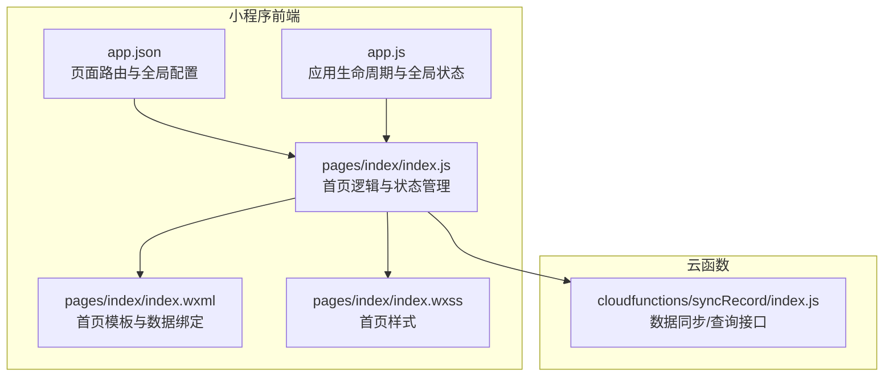
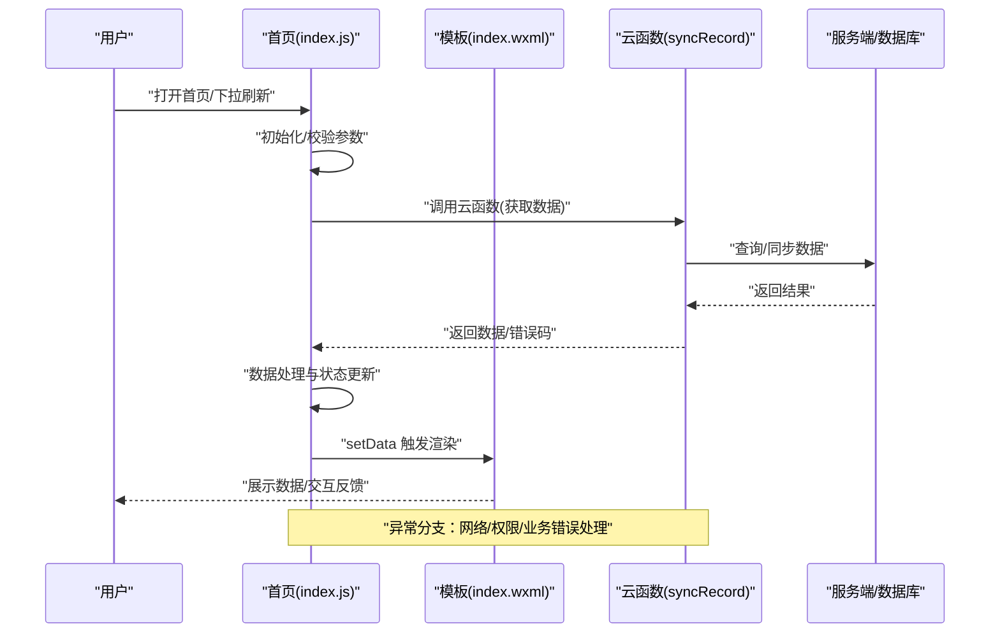
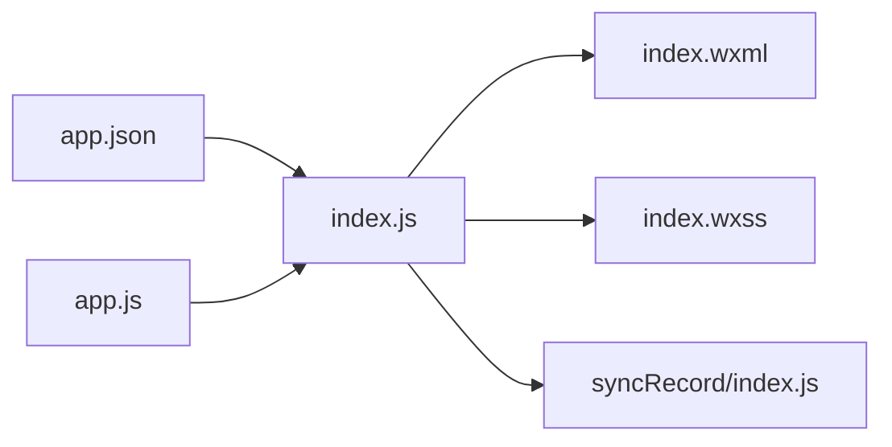

# 首页功能

<cite>
**本文引用的文件**   
- [miniprogram/pages/index/index.js](file://miniprogram/pages/index/index.js)
- [miniprogram/pages/index/index.wxml](file://miniprogram/pages/index/index.wxml)
- [miniprogram/pages/index/index.wxss](file://miniprogram/pages/index/index.wxss)
- [miniprogram/app.js](file://miniprogram/app.js)
- [miniprogram/app.json](file://miniprogram/app.json)
- [cloudfunctions/syncRecord/index.js](file://cloudfunctions/syncRecord/index.js)
</cite>

## 目录
1. [简介](#简介)
2. [项目结构](#项目结构)
3. [核心组件](#核心组件)
4. [架构总览](#架构总览)
5. [详细组件分析](#详细组件分析)
6. [依赖关系分析](#依赖关系分析)
7. [性能考虑](#性能考虑)
8. [故障排查指南](#故障排查指南)
9. [结论](#结论)
10. [附录](#附录)

## 简介
本文件面向小程序“首页”功能的开发与维护，围绕数据展示、用户交互与状态管理进行系统化说明。内容涵盖页面初始化逻辑、数据获取与处理、界面渲染流程、与云函数的调用关系、错误处理机制以及性能优化策略。文档兼顾初学者友好性与资深开发者的技术深度，配合图示帮助快速理解整体设计与实现要点。

## 项目结构
首页相关代码位于 miniprogram/pages/index 目录下，包含页面逻辑（index.js）、模板（index.wxml）与样式（index.wxss）。应用级入口与配置分别位于 app.js 与 app.json。云函数用于后端数据同步与聚合，首页通过小程序云能力调用。

图表来源
- [miniprogram/app.json](file://miniprogram/app.json)
- [miniprogram/app.js](file://miniprogram/app.js)
- [miniprogram/pages/index/index.js](file://miniprogram/pages/index/index.js)
- [miniprogram/pages/index/index.wxml](file://miniprogram/pages/index/index.wxml)
- [miniprogram/pages/index/index.wxss](file://miniprogram/pages/index/index.wxss)
- [cloudfunctions/syncRecord/index.js](file://cloudfunctions/syncRecord/index.js)

章节来源
- [miniprogram/pages/index/index.js](file://miniprogram/pages/index/index.js)
- [miniprogram/pages/index/index.wxml](file://miniprogram/pages/index/index.wxml)
- [miniprogram/pages/index/index.wxss](file://miniprogram/pages/index/index.wxss)
- [miniprogram/app.js](file://miniprogram/app.js)
- [miniprogram/app.json](file://miniprogram/app.json)
- [cloudfunctions/syncRecord/index.js](file://cloudfunctions/syncRecord/index.js)

## 核心组件
- 页面逻辑层（index.js）：负责页面生命周期、数据请求、状态更新、事件处理与错误处理。
- 模板层（index.wxml）：定义数据绑定、列表渲染、条件显示与交互事件。
- 样式层（index.wxss）：布局与视觉表现。
- 应用层（app.js/app.json）：全局配置、启动流程与页面注册。
- 云函数（syncRecord/index.js）：提供数据同步与查询能力，供首页调用。

章节来源
- [miniprogram/pages/index/index.js](file://miniprogram/pages/index/index.js)
- [miniprogram/pages/index/index.wxml](file://miniprogram/pages/index/index.wxml)
- [miniprogram/pages/index/index.wxss](file://miniprogram/pages/index/index.wxss)
- [miniprogram/app.js](file://miniprogram/app.js)
- [miniprogram/app.json](file://miniprogram/app.json)
- [cloudfunctions/syncRecord/index.js](file://cloudfunctions/syncRecord/index.js)

## 架构总览
首页采用典型的小程序前后端分离模式：前端通过云函数访问后端数据，页面状态由本地数据驱动视图渲染。关键流程包括：
- 页面初始化：在 onShow/onLoad 中触发数据加载或刷新。
- 数据获取：调用云函数获取最新数据，失败时降级或提示。
- 数据处理：对返回数据进行清洗、排序、分页等。
- 界面渲染：通过数据绑定与列表渲染更新 UI。
- 用户交互：点击、下拉刷新、上拉加载更多等事件处理。

图表来源
- [miniprogram/pages/index/index.js](file://miniprogram/pages/index/index.js)
- [miniprogram/pages/index/index.wxml](file://miniprogram/pages/index/index.wxml)
- [cloudfunctions/syncRecord/index.js](file://cloudfunctions/syncRecord/index.js)

## 详细组件分析

### 页面逻辑层（index.js）
- 生命周期与初始化
  - onLoad：页面首次加载，执行必要初始化（如读取全局配置、设置默认筛选条件）。
  - onShow：每次显示页面时触发，适合做轻量刷新或状态恢复。
  - onPullDownRefresh：下拉刷新时重置分页并重新拉取数据。
  - onReachBottom：触底时加载更多数据。
- 数据获取与处理
  - 调用云函数获取数据，统一封装为 Promise，便于错误处理与重试。
  - 对返回数据进行去重、排序、字段映射与格式化。
  - 维护分页状态（当前页、是否有更多、加载中标志）。
- 状态管理与渲染
  - 使用 setData 更新页面数据，避免频繁全量更新，尽量增量更新。
  - 将复杂计算结果缓存到本地变量，减少重复计算。
- 用户交互
  - 点击事件：跳转详情、收藏、分享等。
  - 搜索与筛选：防抖处理，合并多次输入后发起请求。
- 错误处理
  - 捕获网络异常、云函数报错与业务错误码，给出友好提示。
  - 支持重试机制与降级展示（如空状态占位图）。

章节来源
- [miniprogram/pages/index/index.js](file://miniprogram/pages/index/index.js)

### 模板层（index.wxml）
- 数据绑定
  - 使用 {{}} 绑定数据，结合 wx:for 渲染列表，wx:if 控制条件显示。
- 交互事件
  - bindtap/catchtap 绑定点击事件，@input 监听输入变化。
- 性能优化
  - 合理使用 key 提升列表渲染性能。
  - 避免在模板中进行复杂计算，必要时在 JS 层预处理。

章节来源
- [miniprogram/pages/index/index.wxml](file://miniprogram/pages/index/index.wxml)

### 样式层（index.wxss）
- 布局与响应式
  - 使用 Flex 布局适配不同屏幕尺寸。
  - 合理划分间距与字号，保证可读性。
- 性能优化
  - 避免过度嵌套与复杂选择器。
  - 使用图片懒加载与压缩资源。

章节来源
- [miniprogram/pages/index/index.wxss](file://miniprogram/pages/index/index.wxss)

### 应用层（app.js / app.json）
- app.json
  - 注册首页路径与导航栏配置。
  - 配置 tabBar、窗口背景色等全局样式。
- app.js
  - 应用启动流程，初始化全局状态（如用户信息、主题、语言）。
  - 提供全局方法（如日志上报、埋点、错误收集）。

章节来源
- [miniprogram/app.json](file://miniprogram/app.json)
- [miniprogram/app.js](file://miniprogram/app.js)

### 云函数（syncRecord/index.js）
- 职责
  - 接收小程序端请求，校验参数与权限。
  - 查询/同步数据，返回标准化结果。
- 错误处理
  - 统一错误码与消息，便于前端解析与展示。
  - 记录关键日志，辅助定位问题。
- 性能优化
  - 分页与过滤参数支持，减少不必要的数据传输。
  - 缓存热点数据，降低数据库压力。

章节来源
- [cloudfunctions/syncRecord/index.js](file://cloudfunctions/syncRecord/index.js)

## 依赖关系分析
首页模块依赖应用配置与云函数接口，内部模块间耦合度低，职责清晰。

图表来源
- [miniprogram/app.json](file://miniprogram/app.json)
- [miniprogram/app.js](file://miniprogram/app.js)
- [miniprogram/pages/index/index.js](file://miniprogram/pages/index/index.js)
- [miniprogram/pages/index/index.wxml](file://miniprogram/pages/index/index.wxml)
- [miniprogram/pages/index/index.wxss](file://miniprogram/pages/index/index.wxss)
- [cloudfunctions/syncRecord/index.js](file://cloudfunctions/syncRecord/index.js)

章节来源
- [miniprogram/app.json](file://miniprogram/app.json)
- [miniprogram/app.js](file://miniprogram/app.js)
- [miniprogram/pages/index/index.js](file://miniprogram/pages/index/index.js)
- [miniprogram/pages/index/index.wxml](file://miniprogram/pages/index/index.wxml)
- [miniprogram/pages/index/index.wxss](file://miniprogram/pages/index/index.wxss)
- [cloudfunctions/syncRecord/index.js](file://cloudfunctions/syncRecord/index.js)

## 性能考虑
- 数据层
  - 分页加载与增量更新，避免一次性加载大量数据。
  - 对重复请求进行去重与缓存，缩短响应时间。
- 渲染层
  - 使用 wx:key 提升列表渲染效率。
  - 避免在模板中进行复杂运算，提前在 JS 层处理。
- 交互层
  - 输入框防抖与节流，减少无效请求。
  - 长列表虚拟滚动（如需要）以提升滚动性能。
- 网络层
  - 合理设置超时与重试策略。
  - 使用 HTTPS 与 CDN 加速静态资源。

[本节为通用指导，不直接分析具体文件]

## 故障排查指南
- 常见问题
  - 云函数调用失败：检查网络、权限与函数部署状态。
  - 数据为空：确认后端数据源与接口返回格式。
  - 渲染卡顿：检查 setData 频率与模板复杂度。
- 调试建议
  - 开启小程序开发者工具的 Network 面板，查看请求与响应。
  - 在云函数中打印关键日志，定位问题根因。
  - 使用 console.log 与断点调试页面逻辑。
- 错误处理最佳实践
  - 统一错误码与提示文案，提升用户体验。
  - 对关键操作增加重试与降级策略。

章节来源
- [miniprogram/pages/index/index.js](file://miniprogram/pages/index/index.js)
- [cloudfunctions/syncRecord/index.js](file://cloudfunctions/syncRecord/index.js)

## 结论
首页功能通过清晰的前后端分离架构与良好的状态管理，实现了高效的数据展示与流畅的用户交互。遵循本文档中的设计原则与优化策略，可进一步提升稳定性与性能。建议在迭代过程中持续监控关键指标，及时优化瓶颈点。

[本节为总结性内容，不直接分析具体文件]

## 附录
- 术语表
  - 云函数：运行在云端的服务端代码，供小程序调用。
  - setData：小程序框架提供的更新页面数据的方法。
  - 下拉刷新：用户下拉页面触发数据刷新。
  - 上拉加载：用户滚动到底部时自动加载下一页数据。
- 参考链接
  - 小程序官方文档：https://developers.weixin.qq.com/miniprogram/dev/framework/
  - 云开发文档：https://developers.weixin.qq.com/miniprogram/dev/wxcloud/basis/getting-started.html

[本节为补充信息，不直接分析具体文件]