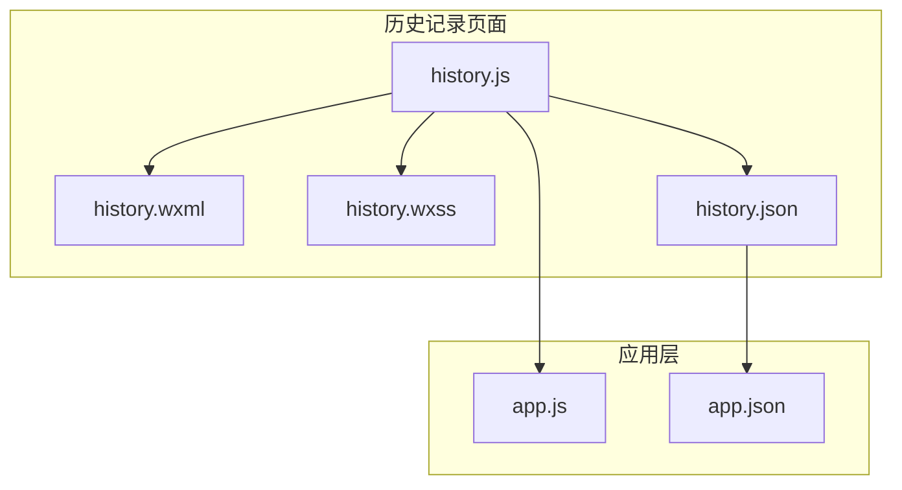
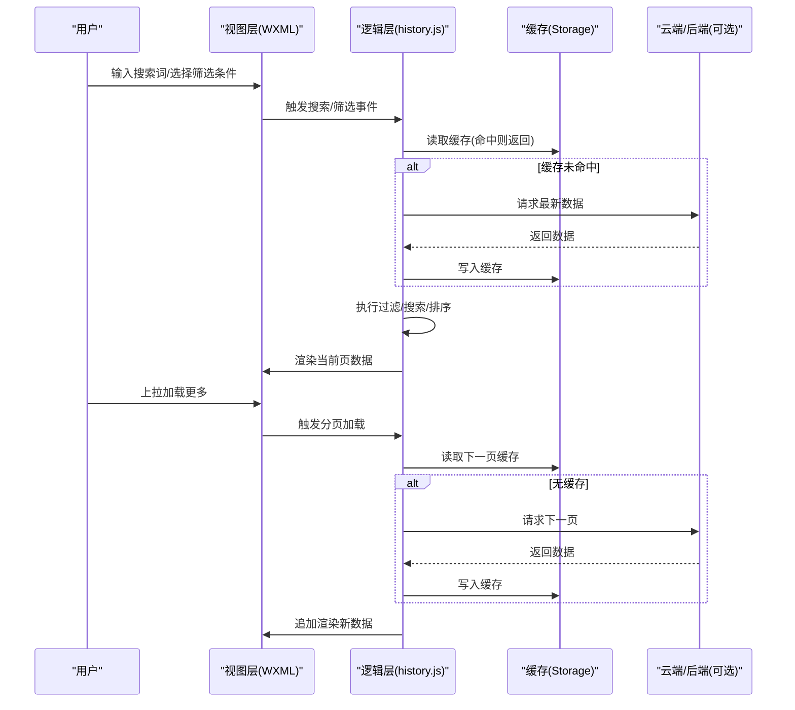
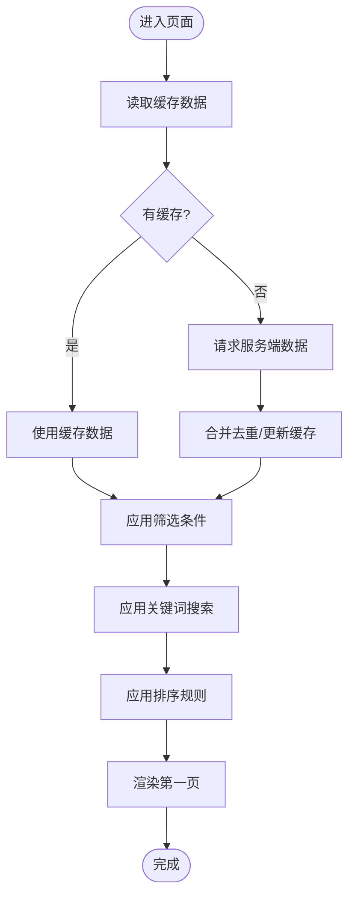
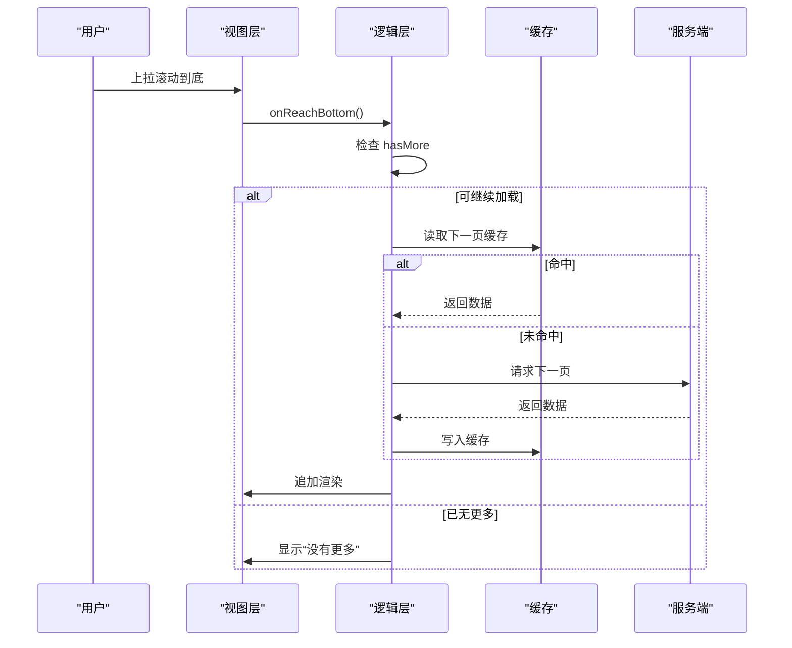
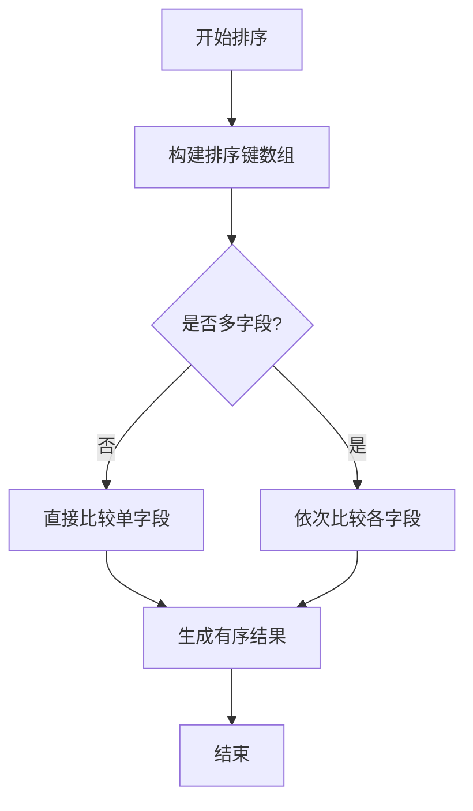
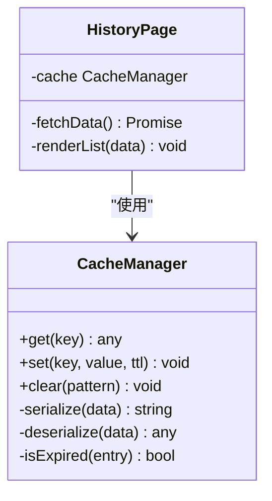
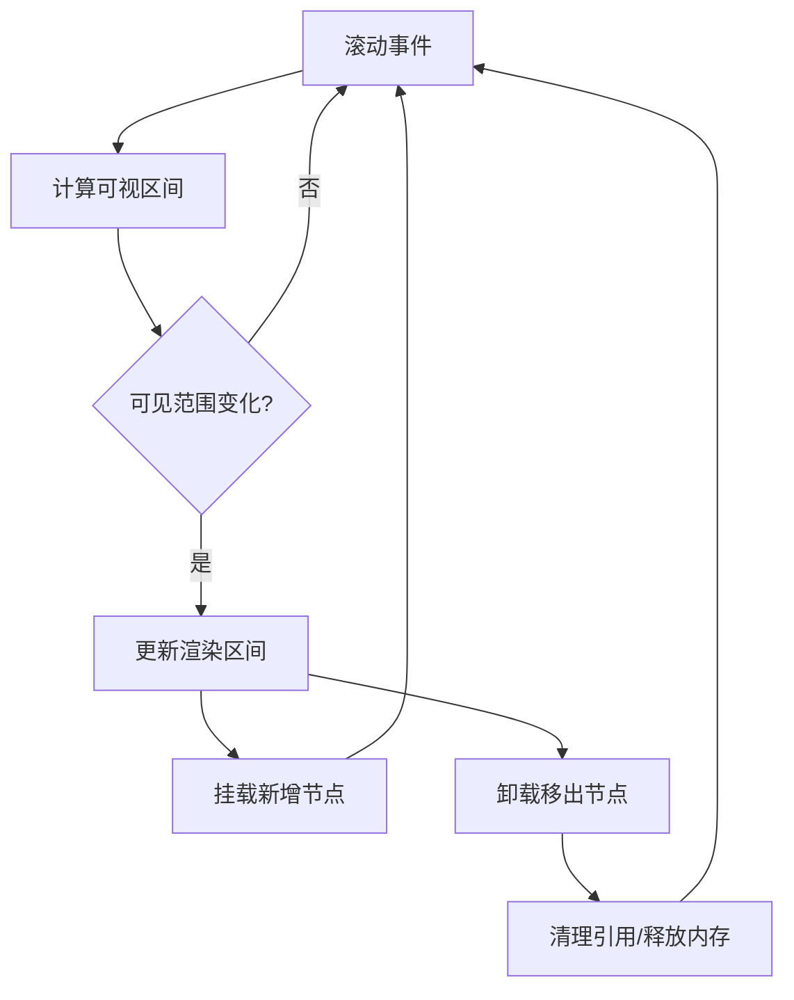
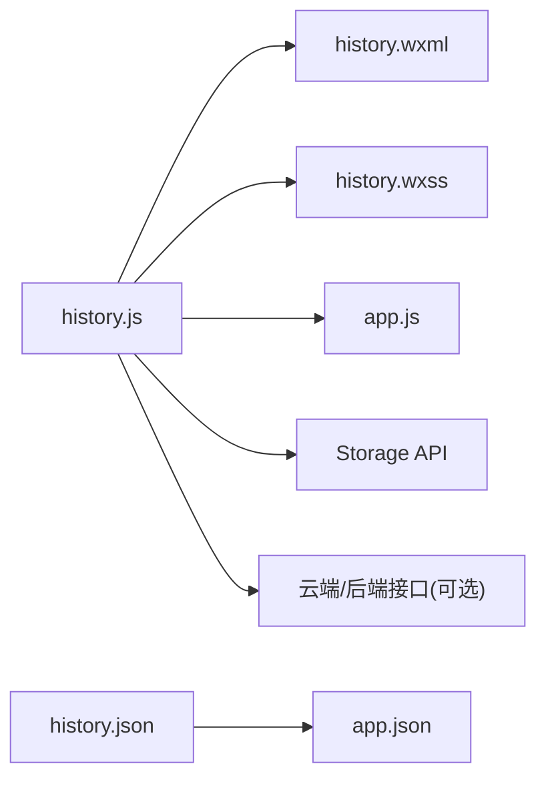

# 历史记录页面组件

<cite>
**本文档引用的文件**   
- [history.js](file://miniprogram/pages/history/history.js)
- [history.wxml](file://miniprogram/pages/history/history.wxml)
- [history.wxss](file://miniprogram/pages/history/history.wxss)
- [history.json](file://miniprogram/pages/history/history.json)
- [app.js](file://miniprogram/app.js)
- [app.json](file://miniprogram/app.json)
</cite>

## 目录
1. [简介](#简介)
2. [项目结构](#项目结构)
3. [核心组件](#核心组件)
4. [架构总览](#架构总览)
5. [详细组件分析](#详细组件分析)
6. [依赖分析](#依赖分析)
7. [性能考虑](#性能考虑)
8. [故障排查指南](#故障排查指南)
9. [结论](#结论)
10. [附录](#附录)

## 简介
本文件为小程序“历史记录”页面组件的完整技术文档，聚焦历史数据展示界面、列表渲染与分页加载、数据过滤/搜索/排序、本地存储与缓存策略、性能优化、虚拟滚动与内存管理最佳实践，以及大数据量处理与用户体验改进建议。文档以代码级分析为基础，辅以架构图、流程图和时序图，帮助开发者快速理解并高效扩展该功能。

## 项目结构
“历史记录”页面位于 miniprogram/pages/history 目录下，包含逻辑、模板、样式与配置四个文件：
- history.js：页面逻辑（数据获取、过滤/搜索/排序、分页、本地缓存）
- history.wxml：页面模板（搜索栏、筛选条件、列表项、分页控件）
- history.wxss：页面样式
- history.json：页面配置（导航、自定义组件引用等）

图表来源
- [history.js](file://miniprogram/pages/history/history.js)
- [history.wxml](file://miniprogram/pages/history/history.wxml)
- [history.wxss](file://miniprogram/pages/history/history.wxss)
- [history.json](file://miniprogram/pages/history/history.json)
- [app.js](file://miniprogram/app.js)
- [app.json](file://miniprogram/app.json)

章节来源
- [history.js](file://miniprogram/pages/history/history.js)
- [history.wxml](file://miniprogram/pages/history/history.wxml)
- [history.wxss](file://miniprogram/pages/history/history.wxss)
- [history.json](file://miniprogram/pages/history/history.json)
- [app.js](file://miniprogram/app.js)
- [app.json](file://miniprogram/app.json)

## 核心组件
- 搜索与筛选
  - 支持按关键字模糊匹配、按时间范围/类型等维度筛选
  - 输入防抖与节流，避免频繁重算
- 列表渲染与分页
  - 首屏加载固定条数，上拉加载更多
  - 分页参数：页码、每页大小、总条数
- 排序逻辑
  - 支持按时间、名称、评分等多字段排序
  - 排序键组合与稳定性保证
- 本地存储与缓存
  - 使用小程序 Storage API 做持久化缓存
  - 缓存命中优先，网络失败回退到本地
- 性能优化
  - 列表虚拟化（按需渲染可视区域）
  - 增量更新与差量渲染
  - 图片懒加载与占位图

章节来源
- [history.js](file://miniprogram/pages/history/history.js)
- [history.wxml](file://miniprogram/pages/history/history.wxml)

## 架构总览
历史记录页面采用“视图-逻辑-存储”分层设计：
- 视图层（WXML/WXSS）：负责搜索框、筛选面板、列表项、分页控件的布局与交互
- 逻辑层（JS）：聚合数据源、执行过滤/搜索/排序、分页控制、缓存读写、事件分发
- 存储层（Storage/可选数据库）：本地缓存历史数据与查询结果，提升二次打开速度

图表来源
- [history.js](file://miniprogram/pages/history/history.js)
- [history.wxml](file://miniprogram/pages/history/history.wxml)

## 详细组件分析

### 搜索与筛选实现
- 关键词搜索
  - 多字段模糊匹配（标题、描述、标签等）
  - 输入防抖（如 300ms），减少无效计算
- 多维筛选
  - 时间范围、类型、状态等
  - 筛选条件变更时重置页码至第一页
- 性能要点
  - 先过滤后分页，避免对全量数据分页
  - 将高频筛选条件建立索引（如哈希表）

图表来源
- [history.js](file://miniprogram/pages/history/history.js)
- [history.wxml](file://miniprogram/pages/history/history.wxml)

章节来源
- [history.js](file://miniprogram/pages/history/history.js)
- [history.wxml](file://miniprogram/pages/history/history.wxml)

### 列表渲染与分页加载
- 首屏渲染
  - 根据每页大小截取数据，绑定到列表
  - 空态与骨架屏提示
- 上拉加载
  - 监听滚动到底部事件，判断是否继续加载
  - 维护页码与总页数，防止重复请求
- 性能要点
  - 使用 wx:for 稳定 key，避免不必要的重排
  - 大列表启用虚拟化（见下节）

图表来源
- [history.js](file://miniprogram/pages/history/history.js)
- [history.wxml](file://miniprogram/pages/history/history.wxml)

章节来源
- [history.js](file://miniprogram/pages/history/history.js)
- [history.wxml](file://miniprogram/pages/history/history.wxml)

### 排序逻辑
- 多字段排序
  - 支持单字段与组合排序（如时间倒序+名称升序）
  - 稳定排序保证相同键值的相对顺序不变
- 性能要点
  - 排序前确保数据不可变，避免副作用
  - 对大数据集采用分块排序或后端排序

图表来源
- [history.js](file://miniprogram/pages/history/history.js)

章节来源
- [history.js](file://miniprogram/pages/history/history.js)

### 本地存储管理与缓存策略
- 缓存结构
  - 键名规范：page_history_v1_{{filters}}_{{search}}
  - 值结构：{ data, timestamp, expire }
- 缓存策略
  - 读优先：优先从缓存读取，命中则跳过网络请求
  - 写策略：请求成功后写入缓存，设置过期时间
  - 失效策略：超过有效期或筛选条件变化时失效
- 降级与容错
  - 网络失败回退到本地缓存
  - 缓存损坏检测与重建

图表来源
- [history.js](file://miniprogram/pages/history/history.js)

章节来源
- [history.js](file://miniprogram/pages/history/history.js)

### 虚拟滚动与内存管理
- 虚拟滚动原理
  - 仅渲染可视区域内的列表项
  - 通过偏移与高度计算动态挂载/卸载节点
- 内存管理
  - 及时释放不可见节点引用
  - 限制最大渲染数量与缓存池大小
- 实现要点
  - 使用 scroll-view 与固定高度容器
  - 计算 visibleStart/visibleEnd 区间
  - 对图片进行懒加载与压缩

图表来源
- [history.js](file://miniprogram/pages/history/history.js)
- [history.wxml](file://miniprogram/pages/history/history.wxml)

章节来源
- [history.js](file://miniprogram/pages/history/history.js)
- [history.wxml](file://miniprogram/pages/history/history.wxml)

### 列表组件使用与最佳实践
- 组件职责
  - 接收数据、筛选条件、排序规则、分页参数
  - 输出渲染后的列表与分页状态
- 使用方式
  - 父页面传入 props，子组件内部处理渲染与交互
  - 通过回调通知父页面事件（如点击、删除、收藏）
- 最佳实践
  - 保持 props 不可变，避免深层嵌套对象
  - 使用稳定 key，减少重绘
  - 大列表务必启用虚拟化

章节来源
- [history.js](file://miniprogram/pages/history/history.js)
- [history.wxml](file://miniprogram/pages/history/history.wxml)

## 依赖分析
- 页面内依赖
  - history.js 依赖 WXML/WXSS 进行渲染与样式
  - history.json 声明页面配置与组件引用
- 应用层依赖
  - app.js 提供全局方法与生命周期钩子
  - app.json 定义路由与全局样式
- 外部依赖
  - 小程序 Storage API（本地缓存）
  - 可选云函数/后端接口（数据同步）

图表来源
- [history.js](file://miniprogram/pages/history/history.js)
- [history.wxml](file://miniprogram/pages/history/history.wxml)
- [history.wxss](file://miniprogram/pages/history/history.wxss)
- [history.json](file://miniprogram/pages/history/history.json)
- [app.js](file://miniprogram/app.js)
- [app.json](file://miniprogram/app.json)

章节来源
- [history.js](file://miniprogram/pages/history/history.js)
- [history.wxml](file://miniprogram/pages/history/history.wxml)
- [history.wxss](file://miniprogram/pages/history/history.wxss)
- [history.json](file://miniprogram/pages/history/history.json)
- [app.js](file://miniprogram/app.js)
- [app.json](file://miniprogram/app.json)

## 性能考虑
- 渲染性能
  - 首屏只渲染必要字段，延迟加载详情
  - 使用 wx:key 稳定列表项，避免重排
  - 图片懒加载与 WebP 格式
- 计算性能
  - 搜索与筛选使用防抖/节流
  - 大数据集采用后端过滤/排序
- 缓存策略
  - 合理设置 TTL，避免脏数据
  - 区分不同筛选条件的缓存键
- 内存管理
  - 及时释放事件监听与定时器
  - 虚拟滚动限制最大渲染数量
- 网络优化
  - 请求合并与去重
  - 断网重试与降级策略

[本节为通用指导，不直接分析具体文件]

## 故障排查指南
- 常见问题
  - 搜索无结果：检查关键词匹配字段与大小写
  - 分页卡死：检查 hasMore 标志与页码边界
  - 缓存不一致：核对缓存键与过期时间
  - 内存泄漏：检查未清理的事件监听与定时器
- 调试建议
  - 打印关键变量（页码、总数、缓存命中率）
  - 使用小程序开发者工具的 Performance 面板
  - 模拟弱网与断网场景验证降级逻辑

章节来源
- [history.js](file://miniprogram/pages/history/history.js)

## 结论
历史记录页面通过清晰的层次划分与完善的缓存策略，实现了高效的搜索、筛选、排序与分页加载。结合虚拟滚动与内存管理最佳实践，可在大数据量场景下保持流畅体验。建议持续监控性能指标，逐步引入后端能力分担前端压力，进一步提升可扩展性与稳定性。

[本节为总结性内容，不直接分析具体文件]

## 附录
- 术语说明
  - 虚拟滚动：仅渲染可视区域的列表项，降低内存与渲染开销
  - 防抖/节流：限制函数执行频率，提升交互响应性
  - TTL：缓存存活时间，用于自动失效
- 参考路径
  - 页面逻辑：[history.js](file://miniprogram/pages/history/history.js)
  - 页面模板：[history.wxml](file://miniprogram/pages/history/history.wxml)
  - 页面样式：[history.wxss](file://miniprogram/pages/history/history.wxss)
  - 页面配置：[history.json](file://miniprogram/pages/history/history.json)
  - 应用入口：[app.js](file://miniprogram/app.js)
  - 应用配置：[app.json](file://miniprogram/app.json)

[本节为补充信息，不直接分析具体文件]