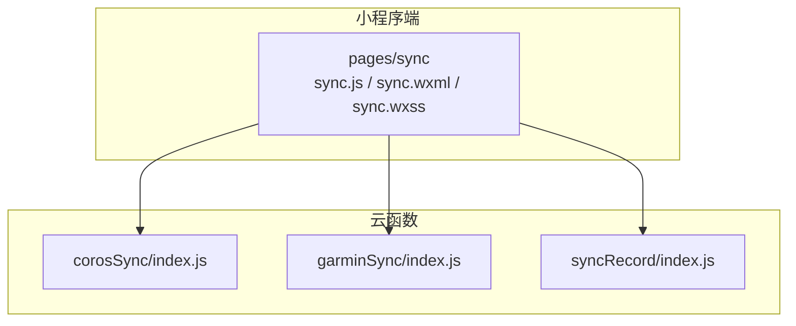
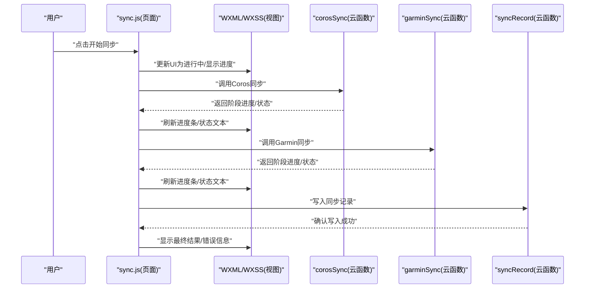
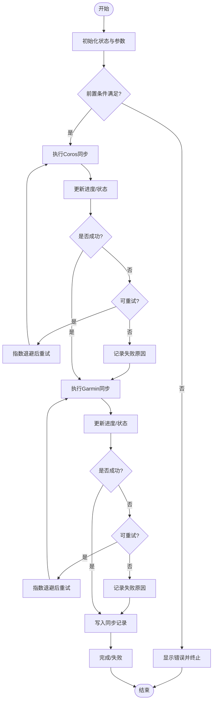
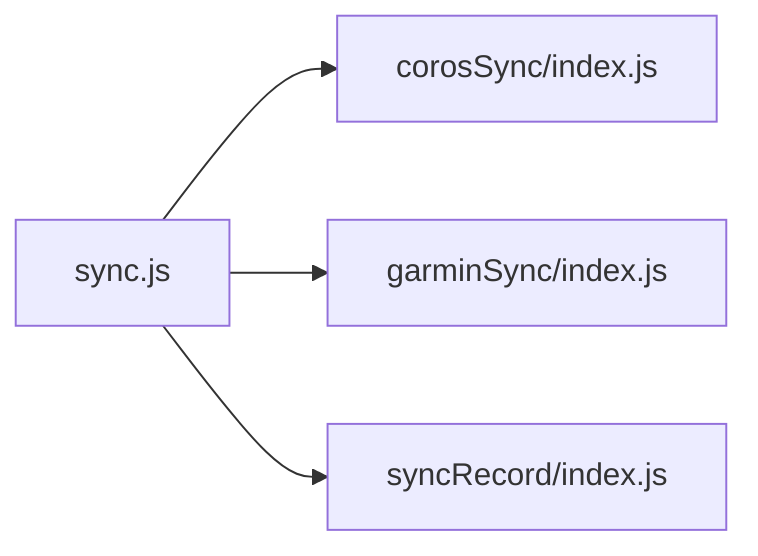

# 同步页面组件

<cite>
**本文引用的文件**   
- [miniprogram/pages/sync/sync.js](file://miniprogram/pages/sync/sync.js)
- [miniprogram/pages/sync/sync.wxml](file://miniprogram/pages/sync/sync.wxml)
- [miniprogram/pages/sync/sync.wxss](file://miniprogram/pages/sync/sync.wxss)
- [cloudfunctions/corosSync/index.js](file://cloudfunctions/corosSync/index.js)
- [cloudfunctions/garminSync/index.js](file://cloudfunctions/garminSync/index.js)
- [cloudfunctions/syncRecord/index.js](file://cloudfunctions/syncRecord/index.js)
</cite>

## 目录
1. [简介](#简介)
2. [项目结构](#项目结构)
3. [核心组件](#核心组件)
4. [架构总览](#架构总览)
5. [详细组件分析](#详细组件分析)
6. [依赖关系分析](#依赖关系分析)
7. [性能考虑](#性能考虑)
8. [故障排查指南](#故障排查指南)
9. [结论](#结论)
10. [附录](#附录)

## 简介
本文件面向“小程序同步页面组件”的完整文档，聚焦数据同步功能的用户界面、进度显示与状态反馈机制。内容涵盖：
- 同步流程的用户交互设计（触发、中断、重试）
- 错误提示与异常处理策略
- 云函数调用与数据同步状态管理
- 异步操作处理、网络请求封装与异常处理
- 性能优化与用户体验改进建议

该文档以代码级为依据，提供可视化图示与可追溯的来源标注，便于开发者快速定位实现细节并进行二次开发。

## 项目结构
与同步功能直接相关的代码位于小程序端 pages/sync 与云函数 corosSync、garminSync、syncRecord。整体职责划分如下：
- 小程序端 sync 页面：负责 UI 渲染、用户交互、进度展示、状态管理与云函数调用。
- 云函数：
  - corosSync：协调或执行 Coros 数据同步逻辑。
  - garminSync：协调或执行 Garmin 数据同步逻辑。
  - syncRecord：记录/更新同步结果与历史。

图表来源
- [miniprogram/pages/sync/sync.js](file://miniprogram/pages/sync/sync.js)
- [cloudfunctions/corosSync/index.js](file://cloudfunctions/corosSync/index.js)
- [cloudfunctions/garminSync/index.js](file://cloudfunctions/garminSync/index.js)
- [cloudfunctions/syncRecord/index.js](file://cloudfunctions/syncRecord/index.js)

章节来源
- [miniprogram/pages/sync/sync.js](file://miniprogram/pages/sync/sync.js)
- [miniprogram/pages/sync/sync.wxml](file://miniprogram/pages/sync/sync.wxml)
- [miniprogram/pages/sync/sync.wxss](file://miniprogram/pages/sync/sync.wxss)
- [cloudfunctions/corosSync/index.js](file://cloudfunctions/corosSync/index.js)
- [cloudfunctions/garminSync/index.js](file://cloudfunctions/garminSync/index.js)
- [cloudfunctions/syncRecord/index.js](file://cloudfunctions/syncRecord/index.js)

## 核心组件
- 同步页面控制器（sync.js）
  - 负责初始化页面状态、绑定事件、发起云函数调用、维护同步任务状态与进度、处理成功/失败回调与重试。
- 同步页面视图（sync.wxml）
  - 包含开始/停止按钮、进度条、状态文本、错误提示区域等。
- 样式（sync.wxss）
  - 控制布局、动画与视觉反馈（如禁用态、加载指示）。
- 云函数（corosSync、garminSync、syncRecord）
  - 分别处理不同数据源的同步逻辑与结果落库。

章节来源
- [miniprogram/pages/sync/sync.js](file://miniprogram/pages/sync/sync.js)
- [miniprogram/pages/sync/sync.wxml](file://miniprogram/pages/sync/sync.wxml)
- [miniprogram/pages/sync/sync.wxss](file://miniprogram/pages/sync/sync.wxss)
- [cloudfunctions/corosSync/index.js](file://cloudfunctions/corosSync/index.js)
- [cloudfunctions/garminSync/index.js](file://cloudfunctions/garminSync/index.js)
- [cloudfunctions/syncRecord/index.js](file://cloudfunctions/syncRecord/index.js)

## 架构总览
下图展示了从用户点击到云函数执行、状态回传与 UI 更新的端到端流程。

图表来源
- [miniprogram/pages/sync/sync.js](file://miniprogram/pages/sync/sync.js)
- [cloudfunctions/corosSync/index.js](file://cloudfunctions/corosSync/index.js)
- [cloudfunctions/garminSync/index.js](file://cloudfunctions/garminSync/index.js)
- [cloudfunctions/syncRecord/index.js](file://cloudfunctions/syncRecord/index.js)

## 详细组件分析

### 同步页面控制器（sync.js）
- 关键职责
  - 维护同步状态机：空闲、进行中、暂停、完成、失败。
  - 管理进度：当前步骤、总步骤、百分比、剩余时间估算。
  - 调用云函数：按顺序或并行调用 corosSync、garminSync，并汇总结果。
  - 错误处理：捕获网络异常、业务异常，提供重试与降级策略。
  - 用户反馈：通过 wx.showToast、wx.showLoading、消息面板等方式反馈状态。
- 典型流程
  - 初始化：读取本地缓存/配置，设置默认状态。
  - 开始同步：校验前置条件（如登录态、权限），进入“进行中”。
  - 分步执行：每步完成后更新进度与状态，必要时进行短暂延迟避免频繁请求。
  - 结束：汇总结果，持久化记录，更新 UI 为完成或失败。
- 重试机制
  - 指数退避：对网络错误采用指数退避重试，限制最大重试次数。
  - 断点续传：支持从上次失败步骤继续（若云函数具备幂等性）。
- 并发控制
  - 串行执行：保证数据一致性时采用串行。
  - 有限并行：对无依赖步骤采用并发，但限制并发度以避免限流。

章节来源
- [miniprogram/pages/sync/sync.js](file://miniprogram/pages/sync/sync.js)

### 同步页面视图（sync.wxml）
- 主要元素
  - 开始/停止按钮：根据状态切换文案与可用性。
  - 进度条：显示当前进度百分比与步骤名称。
  - 状态文本：显示“等待中/同步中/已完成/失败”等。
  - 错误提示区：展示错误码、错误信息与重试入口。
- 交互规则
  - 进行中禁用再次点击开始。
  - 失败时显示“重试”按钮，支持一键重试最近一次失败的步骤。
  - 长时间无响应时提供“取消”能力。

章节来源
- [miniprogram/pages/sync/sync.wxml](file://miniprogram/pages/sync/sync.wxml)

### 样式（sync.wxss）
- 视觉反馈
  - 使用过渡动画平滑切换进度条宽度。
  - 禁用态与高亮态区分明显，提升可读性。
  - 错误提示使用醒目颜色与图标。
- 无障碍与适配
  - 确保在不同屏幕尺寸下布局稳定。
  - 文本最小字号与对比度符合可读性要求。

章节来源
- [miniprogram/pages/sync/sync.wxss](file://miniprogram/pages/sync/sync.wxss)

### 云函数：corosSync/index.js
- 职责
  - 拉取 Coros 数据，进行必要转换与去重。
  - 上报阶段性进度（如已处理条目数/总数）。
  - 处理鉴权失败、配额限制等异常。
- 输出
  - 标准返回结构：状态码、消息、进度对象、数据片段（可选）。

章节来源
- [cloudfunctions/corosSync/index.js](file://cloudfunctions/corosSync/index.js)

### 云函数：garminSync/index.js
- 职责
  - 拉取 Garmin 数据，进行格式标准化。
  - 合并冲突数据，生成差异报告。
  - 上报进度与中间结果。
- 输出
  - 与 corosSync 一致的返回结构，便于统一处理。

章节来源
- [cloudfunctions/garminSync/index.js](file://cloudfunctions/garminSync/index.js)

### 云函数：syncRecord/index.js
- 职责
  - 记录每次同步任务的元数据（开始时间、结束时间、状态、错误信息）。
  - 保存各步骤的进度快照，支持恢复。
  - 提供查询接口供前端展示历史。
- 输出
  - 写入确认、最新快照、历史记录列表。

章节来源
- [cloudfunctions/syncRecord/index.js](file://cloudfunctions/syncRecord/index.js)

### 同步流程图（算法与状态机）

图表来源
- [miniprogram/pages/sync/sync.js](file://miniprogram/pages/sync/sync.js)
- [cloudfunctions/corosSync/index.js](file://cloudfunctions/corosSync/index.js)
- [cloudfunctions/garminSync/index.js](file://cloudfunctions/garminSync/index.js)
- [cloudfunctions/syncRecord/index.js](file://cloudfunctions/syncRecord/index.js)

## 依赖关系分析
- 模块耦合
  - sync.js 依赖三个云函数，形成一对多的调用关系。
  - 云函数之间无直接依赖，通过 syncRecord 进行结果聚合。
- 外部依赖
  - 第三方数据源 API（Coros、Garmin）可能引入限流、鉴权失败等风险。
  - 小程序云开发环境对并发与超时有限制，需合理拆分任务。
- 潜在循环依赖
  - 当前设计无循环依赖；如需在云函数间互相调用，应通过消息队列或事件总线解耦。

图表来源
- [miniprogram/pages/sync/sync.js](file://miniprogram/pages/sync/sync.js)
- [cloudfunctions/corosSync/index.js](file://cloudfunctions/corosSync/index.js)
- [cloudfunctions/garminSync/index.js](file://cloudfunctions/garminSync/index.js)
- [cloudfunctions/syncRecord/index.js](file://cloudfunctions/syncRecord/index.js)

章节来源
- [miniprogram/pages/sync/sync.js](file://miniprogram/pages/sync/sync.js)
- [cloudfunctions/corosSync/index.js](file://cloudfunctions/corosSync/index.js)
- [cloudfunctions/garminSync/index.js](file://cloudfunctions/garminSync/index.js)
- [cloudfunctions/syncRecord/index.js](file://cloudfunctions/syncRecord/index.js)

## 性能考虑
- 网络与并发
  - 限制并发数量，避免触发平台限流。
  - 对大体积数据采用分页拉取与增量同步。
- 计算与内存
  - 避免在主线程进行重型计算，必要时使用 Web Worker（小程序环境下可用替代方案）。
  - 及时释放临时变量，防止内存泄漏。
- 渲染与交互
  - 减少 setData 频率，批量更新状态。
  - 使用骨架屏与占位符提升感知性能。
- 容错与恢复
  - 支持断点续传与幂等写入。
  - 对不稳定网络进行自动重试与降级。

[本节为通用指导，不直接分析具体文件]

## 故障排查指南
- 常见问题
  - 云函数调用超时：检查网络状况与云函数耗时，增加超时阈值或拆分任务。
  - 鉴权失败：确认 Token 有效性及权限范围，必要时引导重新授权。
  - 数据不一致：核对去重与合并逻辑，查看 syncRecord 中的快照。
- 调试手段
  - 启用详细日志，记录关键节点时间与错误堆栈。
  - 使用模拟数据验证边界情况（空数据、超大分页、重复项）。
- 恢复策略
  - 失败步骤重试：基于幂等性与快照恢复。
  - 全量重试：清理中间状态后从头执行。

章节来源
- [miniprogram/pages/sync/sync.js](file://miniprogram/pages/sync/sync.js)
- [cloudfunctions/syncRecord/index.js](file://cloudfunctions/syncRecord/index.js)

## 结论
本同步页面组件通过清晰的状态机、合理的进度反馈与完善的错误处理，提供了稳定且友好的数据同步体验。结合云函数的模块化设计与幂等写入，能够有效应对网络波动与第三方服务限制。建议在后续迭代中持续优化并发控制、增量同步与用户体验细节。

[本节为总结，不直接分析具体文件]

## 附录
- 术语表
  - 进度：当前步骤与总步骤的比例，通常以百分比表示。
  - 幂等：同一操作多次执行与单次执行结果一致。
  - 指数退避：重试间隔随失败次数呈指数增长，降低服务器压力。
- 最佳实践清单
  - 明确状态机与边界条件。
  - 统一错误码与消息格式。
  - 提供可观测性（日志、指标、追踪）。
  - 对用户可见的错误给出可操作的下一步。

[本节为补充信息，不直接分析具体文件]