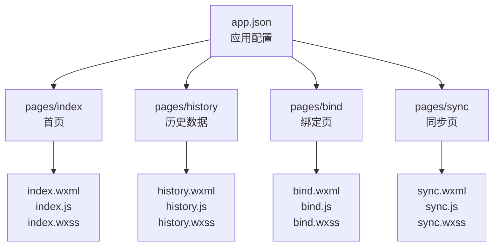
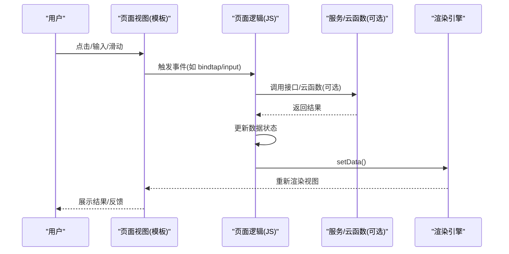
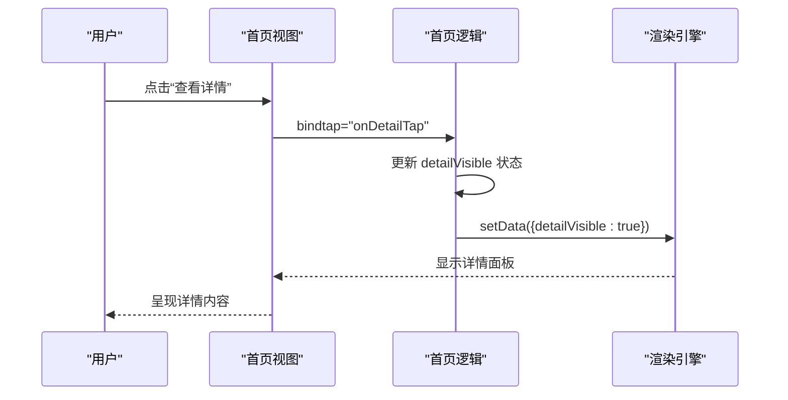
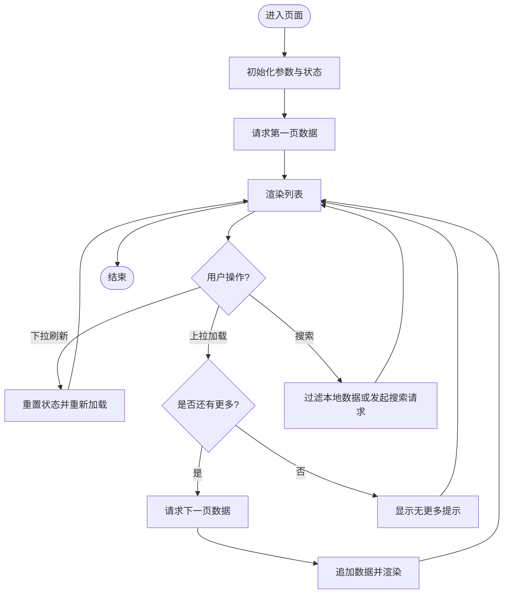
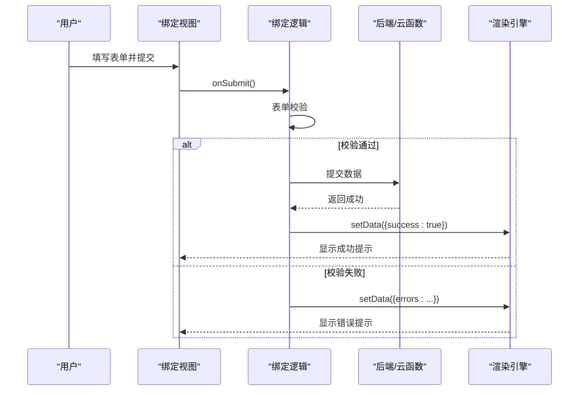
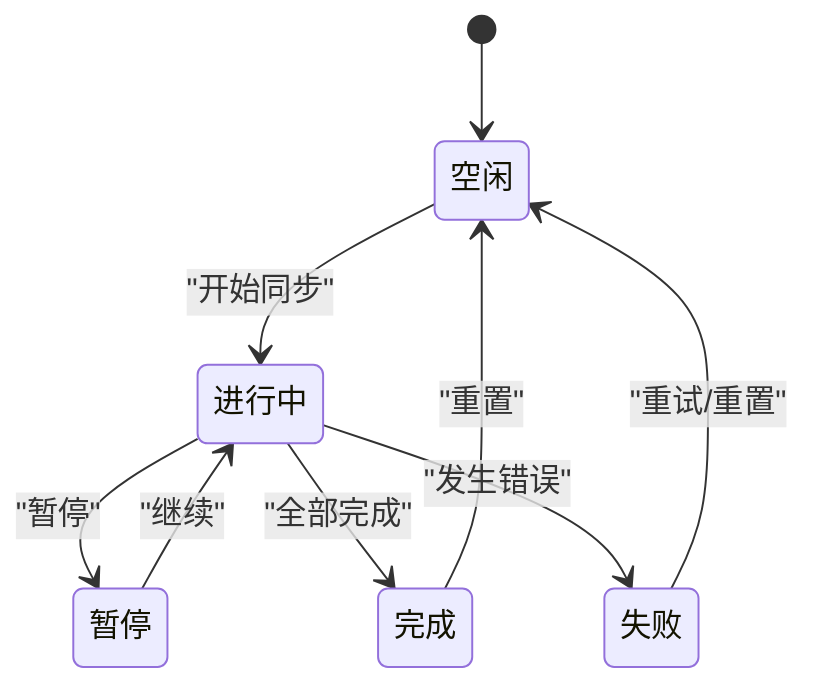
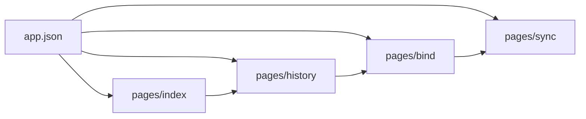

# 界面组件

<cite>
**本文引用的文件**   
- [app.json](file://miniprogram/app.json)
- [index.wxml](file://miniprogram/pages/index/index.wxml)
- [index.js](file://miniprogram/pages/index/index.js)
- [index.wxss](file://miniprogram/pages/index/index.wxss)
- [history.wxml](file://miniprogram/pages/history/history.wxml)
- [history.js](file://miniprogram/pages/history/history.js)
- [history.wxss](file://miniprogram/pages/history/history.wxss)
- [bind.wxml](file://miniprogram/pages/bind/bind.wxml)
- [bind.js](file://miniprogram/pages/bind/bind.js)
- [bind.wxss](file://miniprogram/pages/bind/bind.wxss)
- [sync.wxml](file://miniprogram/pages/sync/sync.wxml)
- [sync.js](file://miniprogram/pages/sync/sync.js)
- [sync.wxss](file://miniprogram/pages/sync/sync.wxss)
</cite>

## 目录
1. [简介](#简介)
2. [项目结构](#项目结构)
3. [核心组件](#核心组件)
4. [架构总览](#架构总览)
5. [详细组件分析](#详细组件分析)
6. [依赖关系分析](#依赖关系分析)
7. [性能考虑](#性能考虑)
8. [故障排查指南](#故障排查指南)
9. [结论](#结论)
10. [附录](#附录)

## 简介
本文件面向微信小程序项目的界面组件，提供从视觉外观、交互行为到属性、事件、插槽与主题定制的完整说明。文档覆盖响应式设计与无障碍访问（a11y）指导原则，记录组件状态、动画与过渡效果，并给出跨浏览器兼容性与性能优化建议。由于当前仓库未包含自定义组件目录，本文以页面级视图作为“界面组件”的载体进行说明，并在需要时指出如何将其抽象为可复用组件。

## 项目结构
小程序采用多页面组织方式，每个页面由 wxml、js、wxss、json 四部分组成：
- 页面入口与路由配置位于 app.json
- 各页面负责自身模板、逻辑与样式
- 公共样式可通过 app.wxss 或全局样式变量管理

图表来源
- [app.json](file://miniprogram/app.json)
- [index.wxml](file://miniprogram/pages/index/index.wxml)
- [history.wxml](file://miniprogram/pages/history/history.wxml)
- [bind.wxml](file://miniprogram/pages/bind/bind.wxml)
- [sync.wxml](file://miniprogram/pages/sync/sync.wxml)

章节来源
- [app.json](file://miniprogram/app.json)

## 核心组件
本项目未定义独立的 components 目录，因此“界面组件”主要由页面模板承担。以下为核心页面/组件的职责概览：
- 首页（index）：展示主要信息卡片、操作入口与基础交互
- 历史（history）：列表展示与滚动加载、筛选与排序
- 绑定（bind）：表单输入、校验与提交反馈
- 同步（sync）：任务进度、状态提示与错误处理

章节来源
- [index.wxml](file://miniprogram/pages/index/index.wxml)
- [history.wxml](file://miniprogram/pages/history/history.wxml)
- [bind.wxml](file://miniprogram/pages/bind/bind.wxml)
- [sync.wxml](file://miniprogram/pages/sync/sync.wxml)

## 架构总览
页面与逻辑通过小程序框架的事件驱动模型协作：模板绑定事件，JS 处理业务逻辑，更新数据后触发视图重渲染。样式层使用 WXSS，支持 rpx 单位实现响应式布局。

图表来源
- [index.js](file://miniprogram/pages/index/index.js)
- [history.js](file://miniprogram/pages/history/history.js)
- [bind.js](file://miniprogram/pages/bind/bind.js)
- [sync.js](file://miniprogram/pages/sync/sync.js)

## 详细组件分析

### 首页组件（index）
- 视觉外观
  - 顶部标题区、内容卡片区、底部操作区
  - 使用统一间距与圆角风格，图标与文字对齐
- 行为与交互
  - 点击按钮跳转或触发动作
  - 列表项点击展开详情
- 属性与事件
  - 通过 data-* 或模板变量控制显示内容
  - 事件包括点击、长按、触摸等
- 插槽与自定义选项
  - 若需复用，可将卡片区域抽离为组件，使用 slot 插入内容
- 响应式与无障碍
  - 使用 rpx 适配不同屏幕
  - 为关键元素添加 aria-label 或 role（在小程序中可使用 arialabel 属性）
- 状态、动画与过渡
  - 使用 wxss transition 实现平滑切换
  - 列表项展开/收起使用 show/hide 类切换
- 样式与主题
  - 通过 CSS 变量或主题色类名切换主色调
- 兼容性
  - 避免使用最新实验性 CSS 特性
  - 注意 iOS/Android 差异（如 flex 对齐）

章节来源
- [index.wxml](file://miniprogram/pages/index/index.wxml)
- [index.js](file://miniprogram/pages/index/index.js)
- [index.wxss](file://miniprogram/pages/index/index.wxss)

#### 首页交互时序图

图表来源
- [index.js](file://miniprogram/pages/index/index.js)
- [index.wxml](file://miniprogram/pages/index/index.wxml)

### 历史组件（history）
- 视觉外观
  - 列表布局、分页指示器、空状态占位
- 行为与交互
  - 上拉加载更多、下拉刷新
  - 搜索框过滤、排序切换
- 属性与事件
  - 列表数据源、每页条数、是否加载中
  - 事件：onLoadMore、onRefresh、onSearch、onSortChange
- 插槽与自定义选项
  - 列表项插槽用于自定义行内容
  - 空状态插槽用于展示提示信息
- 响应式与无障碍
  - 列表项高度自适应文本长度
  - 为搜索框设置 placeholder 与 aria-label
- 状态、动画与过渡
  - 加载骨架屏或转圈动画
  - 新增条目滑入动画
- 样式与主题
  - 主题色应用于选中态与高亮
- 兼容性
  - 长列表使用虚拟滚动思路（分页+懒加载）

章节来源
- [history.wxml](file://miniprogram/pages/history/history.wxml)
- [history.js](file://miniprogram/pages/history/history.js)
- [history.wxss](file://miniprogram/pages/history/history.wxss)

#### 历史列表流程图

图表来源
- [history.js](file://miniprogram/pages/history/history.js)
- [history.wxml](file://miniprogram/pages/history/history.wxml)

### 绑定组件（bind）
- 视觉外观
  - 表单字段、必填标记、错误提示
- 行为与交互
  - 实时校验、提交前二次确认
  - 成功/失败反馈（toast 或弹窗）
- 属性与事件
  - 字段规则、默认值、禁用状态
  - 事件：onInput、onValidate、onSubmit
- 插槽与自定义选项
  - 自定义校验提示文案插槽
  - 提交按钮插槽支持自定义样式
- 响应式与无障碍
  - 移动端键盘适配（inputmode）
  - 错误消息关联 label（aria-describedby）
- 状态、动画与过渡
  - 输入聚焦高亮、错误抖动动画
- 样式与主题
  - 主题色应用于边框与按钮
- 兼容性
  - 注意 Android/iOS 键盘行为差异

章节来源
- [bind.wxml](file://miniprogram/pages/bind/bind.wxml)
- [bind.js](file://miniprogram/pages/bind/bind.js)
- [bind.wxss](file://miniprogram/pages/bind/bind.wxss)

#### 绑定提交序列图

图表来源
- [bind.js](file://miniprogram/pages/bind/bind.js)
- [bind.wxml](file://miniprogram/pages/bind/bind.wxml)

### 同步组件（sync）
- 视觉外观
  - 进度条、状态标签、日志输出区
- 行为与交互
  - 开始/暂停/取消同步
  - 实时日志滚动
- 属性与事件
  - 任务 ID、进度百分比、状态枚举
  - 事件：onStart、onPause、onCancel、onProgress
- 插槽与自定义选项
  - 日志行插槽用于自定义格式
  - 状态图标插槽
- 响应式与无障碍
  - 进度条增加 aria-valuenow/max
  - 日志区自动滚动至底部
- 状态、动画与过渡
  - 进度条渐变、状态切换淡入淡出
- 样式与主题
  - 主题色区分成功/失败/进行中
- 兼容性
  - 长日志使用虚拟滚动或分页加载

章节来源
- [sync.wxml](file://miniprogram/pages/sync/sync.wxml)
- [sync.js](file://miniprogram/pages/sync/sync.js)
- [sync.wxss](file://miniprogram/pages/sync/sync.wxss)

#### 同步状态机图

图表来源
- [sync.js](file://miniprogram/pages/sync/sync.js)
- [sync.wxml](file://miniprogram/pages/sync/sync.wxml)

## 依赖关系分析
页面之间的导航与数据传递通过小程序路由与全局状态管理：
- 路由配置在 app.json
- 页面间通信可使用全局对象或事件总线
- 组件化后可通过 props/events 解耦

图表来源
- [app.json](file://miniprogram/app.json)
- [index.wxml](file://miniprogram/pages/index/index.wxml)
- [history.wxml](file://miniprogram/pages/history/history.wxml)
- [bind.wxml](file://miniprogram/pages/bind/bind.wxml)
- [sync.wxml](file://miniprogram/pages/sync/sync.wxml)

章节来源
- [app.json](file://miniprogram/app.json)

## 性能考虑
- 列表渲染
  - 使用分页与懒加载，避免一次性渲染大量节点
  - 对长列表启用虚拟化（分页+按需渲染）
- 数据更新
  - 减少 setData 调用频率，合并多次更新
  - 仅更新必要字段，避免全量替换
- 样式与布局
  - 合理使用 flex/grid，避免复杂嵌套
  - 使用 rpx 提升适配效率
- 网络请求
  - 合并请求、缓存热点数据
  - 失败重试与超时处理
- 动画与过渡
  - 优先使用 CSS 动画，避免频繁 JS 计算
  - 控制动画数量与时长，避免掉帧

[本节为通用指导，不直接分析具体文件]

## 故障排查指南
- 常见问题
  - 页面无法跳转：检查 app.json 路由配置与路径拼写
  - 表单校验无效：确认事件绑定与校验逻辑顺序
  - 列表不更新：检查 setData 是否被正确调用且数据变化
  - 样式错乱：核对 rpx 与设备像素比，检查父容器尺寸
- 调试技巧
  - 使用微信开发者工具断点与日志输出
  - 打印关键状态与请求参数
  - 逐步缩小问题范围（最小复现）

章节来源
- [index.js](file://miniprogram/pages/index/index.js)
- [history.js](file://miniprogram/pages/history/history.js)
- [bind.js](file://miniprogram/pages/bind/bind.js)
- [sync.js](file://miniprogram/pages/sync/sync.js)

## 结论
本项目以页面为载体承载界面组件，具备清晰的职责划分与良好的可扩展性。通过将页面中的常见模块抽象为可复用组件，可进一步提升代码复用率与维护性。建议在后续迭代中引入组件化与主题系统，完善无障碍支持与性能优化策略。

[本节为总结，不直接分析具体文件]

## 附录
- 响应式设计原则
  - 使用 rpx 与媒体查询适配不同屏幕
  - 合理设置字号与触控区域大小
- 无障碍访问（a11y）
  - 为交互元素提供语义化描述
  - 确保颜色对比度符合 WCAG 标准
- 主题定制
  - 使用 CSS 变量集中管理颜色与字体
  - 提供明暗主题切换能力
- 示例与演示
  - 参考各页面模板与样式文件获取实际用法
  - 在微信开发者工具中运行预览与调试

[本节为补充信息，不直接分析具体文件]