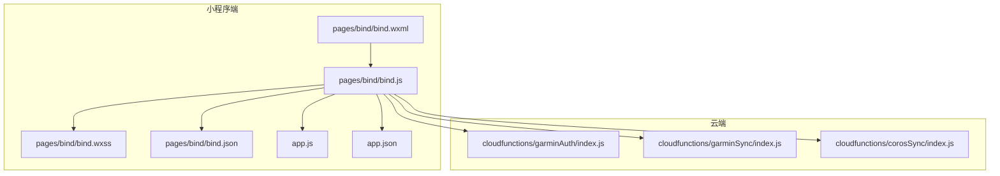
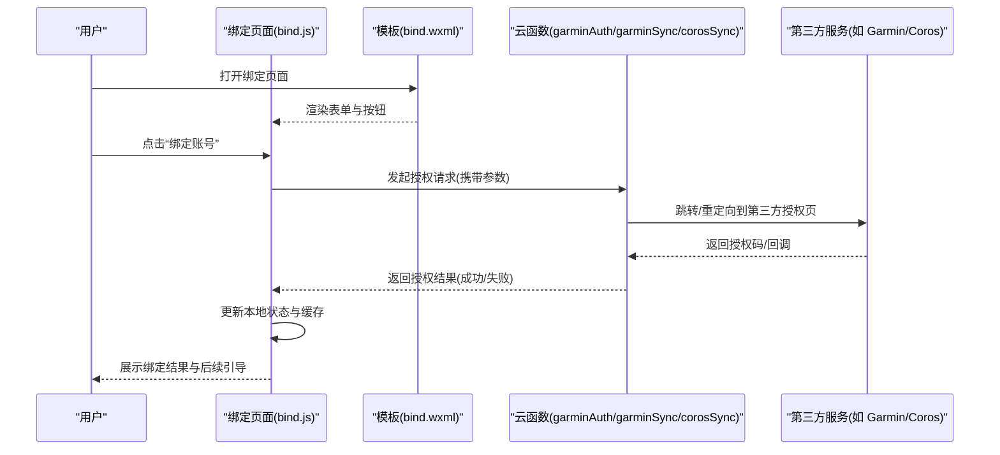
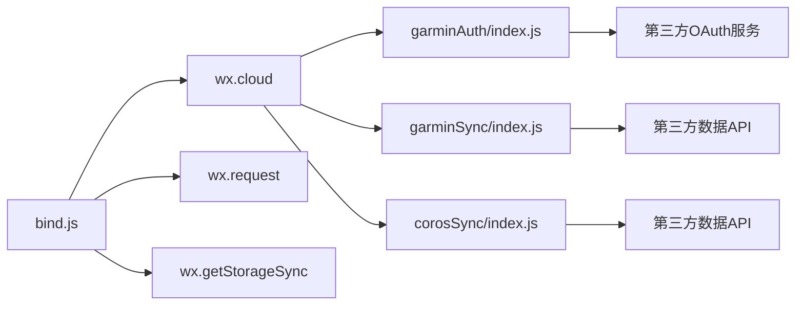

# 绑定页面组件

<cite>
**本文引用的文件**   
- [bind.js](file://miniprogram/pages/bind/bind.js)
- [bind.wxml](file://miniprogram/pages/bind/bind.wxml)
- [bind.wxss](file://miniprogram/pages/bind/bind.wxss)
- [bind.json](file://miniprogram/pages/bind/bind.json)
- [app.js](file://miniprogram/app.js)
- [app.json](file://miniprogram/app.json)
- [garminAuth/index.js](file://cloudfunctions/garminAuth/index.js)
- [garminSync/index.js](file://cloudfunctions/garminSync/index.js)
- [corosSync/index.js](file://cloudfunctions/corosSync/index.js)
</cite>

## 目录
1. [简介](#简介)
2. [项目结构](#项目结构)
3. [核心组件](#核心组件)
4. [架构总览](#架构总览)
5. [详细组件分析](#详细组件分析)
6. [依赖关系分析](#依赖关系分析)
7. [性能考虑](#性能考虑)
8. [故障排查指南](#故障排查指南)
9. [结论](#结论)
10. [附录](#附录)

## 简介
本文件面向“小程序绑定页面组件”，聚焦设备或账户绑定的用户界面、表单验证与授权流程，涵盖绑定状态检查、错误处理与用户引导逻辑。文档同时给出第三方服务集成（如 Garmin/Coros）、OAuth 认证流程、安全与隐私最佳实践，以及多平台兼容性与用户体验优化建议。内容基于仓库中的小程序绑定页面与云函数实现进行梳理，帮助开发者快速理解并扩展绑定能力。

## 项目结构
绑定功能主要位于小程序 pages/bind 目录，配合云函数完成第三方账号授权与数据同步。关键文件包括：
- 页面逻辑与事件处理：bind.js
- 页面结构与模板：bind.wxml
- 样式定义：bind.wxss
- 页面配置：bind.json
- 应用入口与全局配置：app.js、app.json
- 云函数：garminAuth（Garmin 授权）、garminSync（Garmin 同步）、corosSync（Coros 同步）

图表来源
- [bind.wxml:1-200](file://miniprogram/pages/bind/bind.wxml#L1-L200)
- [bind.js:1-200](file://miniprogram/pages/bind/bind.js#L1-L200)
- [bind.wxss:1-200](file://miniprogram/pages/bind/bind.wxss#L1-L200)
- [bind.json:1-50](file://miniprogram/pages/bind/bind.json#L1-L50)
- [app.js:1-200](file://miniprogram/app.js#L1-L200)
- [app.json:1-100](file://miniprogram/app.json#L1-L100)
- [garminAuth/index.js:1-200](file://cloudfunctions/garminAuth/index.js#L1-L200)
- [garminSync/index.js:1-200](file://cloudfunctions/garminSync/index.js#L1-L200)
- [corosSync/index.js:1-200](file://cloudfunctions/corosSync/index.js#L1-L200)

章节来源
- [bind.js:1-200](file://miniprogram/pages/bind/bind.js#L1-L200)
- [bind.wxml:1-200](file://miniprogram/pages/bind/bind.wxml#L1-L200)
- [bind.wxss:1-200](file://miniprogram/pages/bind/bind.wxss#L1-L200)
- [bind.json:1-50](file://miniprogram/pages/bind/bind.json#L1-L50)
- [app.js:1-200](file://miniprogram/app.js#L1-L200)
- [app.json:1-100](file://miniprogram/app.json#L1-L100)

## 核心组件
- 绑定页面 UI：提供账号/设备选择、输入框、按钮、提示等元素，用于引导用户完成绑定。
- 表单验证：对必填项、格式、长度等进行校验，并在提交前拦截非法输入。
- 授权流程：调用云函数发起 OAuth 授权或获取令牌，处理回调与状态更新。
- 绑定状态检查：本地缓存与云端状态双重校验，避免重复授权与不一致。
- 错误处理：网络异常、权限拒绝、第三方服务不可用等场景的友好提示与重试机制。
- 用户引导：根据当前状态展示不同文案与操作入口，提升转化率。

章节来源
- [bind.js:1-200](file://miniprogram/pages/bind/bind.js#L1-L200)
- [bind.wxml:1-200](file://miniprogram/pages/bind/bind.wxml#L1-L200)

## 架构总览
绑定流程采用“小程序前端 + 云函数后端”的分层架构。前端负责交互与状态管理，云函数负责与第三方服务通信（OAuth 授权、令牌交换、数据同步）。

图表来源
- [bind.js:1-200](file://miniprogram/pages/bind/bind.js#L1-L200)
- [bind.wxml:1-200](file://miniprogram/pages/bind/bind.wxml#L1-L200)
- [garminAuth/index.js:1-200](file://cloudfunctions/garminAuth/index.js#L1-L200)
- [garminSync/index.js:1-200](file://cloudfunctions/garminSync/index.js#L1-L200)
- [corosSync/index.js:1-200](file://cloudfunctions/corosSync/index.js#L1-L200)

## 详细组件分析

### 绑定页面 UI 与交互
- 模板结构：包含账号类型选择、输入框、确认按钮、提示信息区域。
- 交互逻辑：监听输入变化触发校验；点击按钮进入授权流程；根据返回结果更新 UI。
- 样式适配：使用 wxss 控制布局与响应式显示，确保在不同屏幕尺寸下体验一致。

章节来源
- [bind.wxml:1-200](file://miniprogram/pages/bind/bind.wxml#L1-L200)
- [bind.wxss:1-200](file://miniprogram/pages/bind/bind.wxss#L1-L200)
- [bind.js:1-200](file://miniprogram/pages/bind/bind.js#L1-L200)

### 表单验证与用户引导
- 必填校验：账号名/邮箱/手机号等字段非空检查。
- 格式校验：邮箱、手机号、密码强度等正则匹配。
- 实时反馈：输入时即时提示错误信息，减少提交失败率。
- 引导策略：未绑定状态显示“立即绑定”，已绑定状态显示“解绑/更换账号”。

章节来源
- [bind.js:1-200](file://miniprogram/pages/bind/bind.js#L1-L200)
- [bind.wxml:1-200](file://miniprogram/pages/bind/bind.wxml#L1-L200)

### 授权流程与状态检查
- 本地状态：通过 app.js 或页面级变量维护绑定状态。
- 云端状态：调用云函数查询第三方绑定情况，避免本地缓存不一致。
- 授权步骤：生成授权链接 -> 用户同意 -> 回调处理 -> 存储令牌 -> 更新状态。
- 幂等性：重复授权应返回相同结果，避免重复绑定。

章节来源
- [bind.js:1-200](file://miniprogram/pages/bind/bind.js#L1-L200)
- [app.js:1-200](file://miniprogram/app.js#L1-L200)
- [garminAuth/index.js:1-200](file://cloudfunctions/garminAuth/index.js#L1-L200)

### 错误处理与重试机制
- 网络错误：超时、断网等场景提示并重试。
- 权限拒绝：定位、相册等权限被拒时引导用户开启。
- 第三方错误：服务不可用、账号不存在等错误分类处理。
- 降级策略：主流程失败时提供备选方案（如手动输入密钥）。

章节来源
- [bind.js:1-200](file://miniprogram/pages/bind/bind.js#L1-L200)
- [garminAuth/index.js:1-200](file://cloudfunctions/garminAuth/index.js#L1-L200)

### 第三方服务集成（Garmin/Coros）
- 授权接口：通过云函数封装 OAuth 流程，隐藏敏感参数。
- 数据同步：授权成功后调用同步接口拉取数据。
- 错误映射：将第三方错误码映射为统一错误对象，便于前端处理。
- 限流保护：防止频繁请求导致第三方服务封禁。

章节来源
- [garminAuth/index.js:1-200](file://cloudfunctions/garminAuth/index.js#L1-L200)
- [garminSync/index.js:1-200](file://cloudfunctions/garminSync/index.js#L1-L200)
- [corosSync/index.js:1-200](file://cloudfunctions/corosSync/index.js#L1-L200)

### 数据持久化与安全
- 本地存储：使用小程序 storage 缓存绑定状态与必要信息。
- 云端存储：敏感数据（如访问令牌）存储在云数据库或加密存储。
- 传输安全：所有 API 调用使用 HTTPS，云函数内部通信也需加密。
- 最小权限：仅申请必要的系统权限，避免过度索取。

章节来源
- [bind.js:1-200](file://miniprogram/pages/bind/bind.js#L1-L200)
- [app.js:1-200](file://miniprogram/app.js#L1-L200)

## 依赖关系分析
绑定页面依赖小程序基础 API、云函数 SDK 以及第三方服务 SDK。云函数之间通过内部 API 通信，形成松耦合架构。

图表来源
- [bind.js:1-200](file://miniprogram/pages/bind/bind.js#L1-L200)
- [garminAuth/index.js:1-200](file://cloudfunctions/garminAuth/index.js#L1-L200)
- [garminSync/index.js:1-200](file://cloudfunctions/garminSync/index.js#L1-L200)
- [corosSync/index.js:1-200](file://cloudfunctions/corosSync/index.js#L1-L200)

章节来源
- [bind.js:1-200](file://miniprogram/pages/bind/bind.js#L1-L200)
- [app.js:1-200](file://miniprogram/app.js#L1-L200)

## 性能考虑
- 懒加载：仅在需要时加载第三方 SDK，减少初始包体积。
- 缓存策略：合理设置本地缓存过期时间，避免频繁请求。
- 并发控制：限制同时进行的授权/同步请求数量。
- 错误重试：指数退避重试，避免雪崩效应。

[本节为通用指导，无需特定文件来源]

## 故障排查指南
- 常见问题：
  - 授权失败：检查网络、权限、第三方服务状态。
  - 绑定状态不一致：清理本地缓存后重试。
  - 数据同步失败：查看云函数日志，确认令牌有效性。
- 调试技巧：
  - 启用云函数日志输出。
  - 使用小程序开发者工具的网络面板抓包。
  - 添加详细的错误码与消息映射。

章节来源
- [bind.js:1-200](file://miniprogram/pages/bind/bind.js#L1-L200)
- [garminAuth/index.js:1-200](file://cloudfunctions/garminAuth/index.js#L1-L200)

## 结论
绑定页面组件通过清晰的前后端分离架构，实现了安全的第三方账号绑定流程。结合完善的表单验证、错误处理与用户引导，能够为用户提供流畅的绑定体验。建议持续优化性能与安全性，遵循最小权限原则，确保用户数据隐私。

[本节为总结性内容，无需特定文件来源]

## 附录
- OAuth 最佳实践：
  - 使用 PKCE 增强授权码流程安全性。
  - 短期令牌 + 刷新令牌机制。
  - 严格校验回调域名与状态参数。
- 隐私保护：
  - 明确告知用户数据用途。
  - 提供数据删除与导出功能。
  - 定期审计第三方数据访问记录。
- 多平台兼容：
  - 适配 iOS/Android 差异。
  - 处理刘海屏、底部横条等特殊情况。
  - 测试不同微信版本兼容性。

[本节为通用指导，无需特定文件来源]