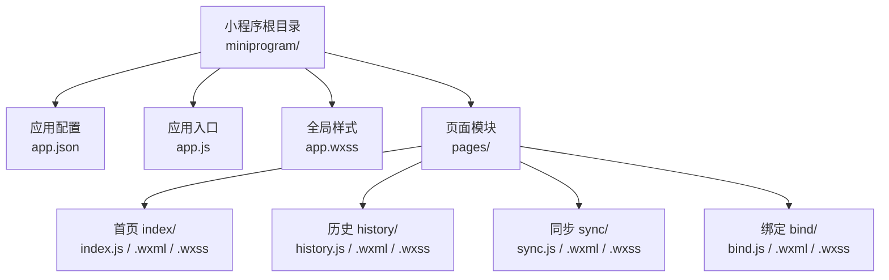
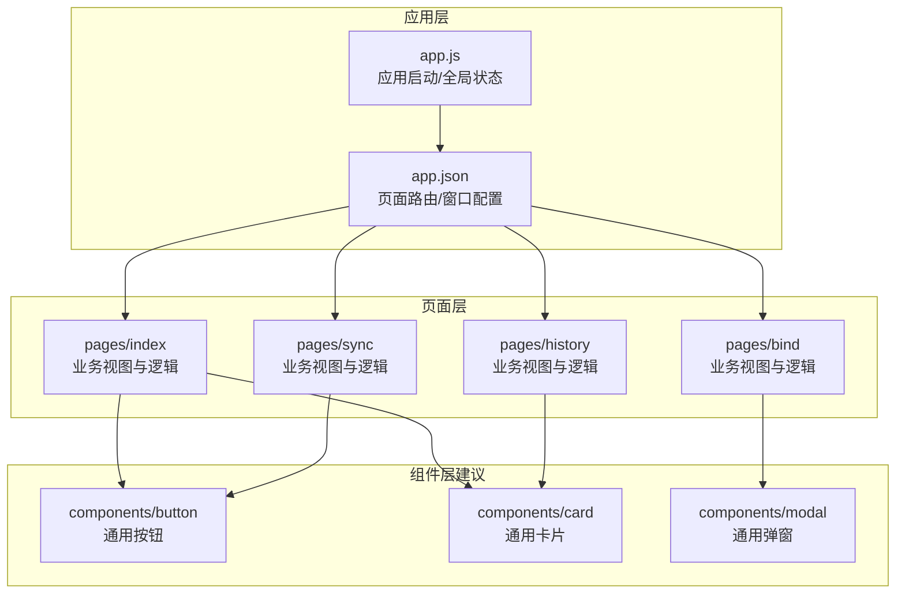
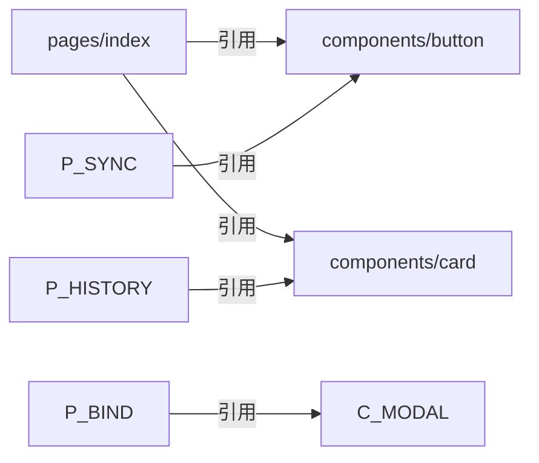

# 通用组件

<cite>
**本文引用的文件**   
- [app.json](file://miniprogram/app.json)
- [app.js](file://miniprogram/app.js)
- [index.js](file://miniprogram/pages/index/index.js)
- [index.wxml](file://miniprogram/pages/index/index.wxml)
- [index.wxss](file://miniprogram/pages/index/index.wxss)
- [history.js](file://miniprogram/pages/history/history.js)
- [history.wxml](file://miniprogram/pages/history/history.wxml)
- [history.wxss](file://miniprogram/pages/history/history.wxss)
- [sync.js](file://miniprogram/pages/sync/sync.js)
- [sync.wxml](file://miniprogram/pages/sync/sync.wxml)
- [bind.js](file://miniprogram/pages/bind/bind.js)
- [bind.wxml](file://miniprogram/pages/bind/bind.wxml)
</cite>

## 目录
1. [简介](#简介)
2. [项目结构](#项目结构)
3. [核心组件](#核心组件)
4. [架构总览](#架构总览)
5. [详细组件分析](#详细组件分析)
6. [依赖分析](#依赖分析)
7. [性能考虑](#性能考虑)
8. [故障排查指南](#故障排查指南)
9. [结论](#结论)
10. [附录](#附录)

## 简介
本文件面向微信小程序“通用组件”的设计与实现，结合仓库中的页面组织与配置，总结可复用组件的设计模式、属性接口与事件系统；阐述插槽机制、样式隔离与主题定制；给出组件通信、状态管理与生命周期钩子的实践要点；并提供测试方法、性能优化、兼容性处理以及组件库构建、版本管理与文档生成的指导原则。内容以仓库现有结构与页面为参考依据，帮助读者快速建立小程序组件化体系。

## 项目结构
当前仓库采用小程序标准目录结构：应用入口位于 miniprogram 目录，页面按功能划分在 pages 下，全局配置与样式在 app.json 与 app.wxss 中。cloudfunctions 为云函数目录，dailysync-ref 为独立工具工程，与小程序组件文档无直接代码关联。

图表来源
- [app.json](file://miniprogram/app.json)
- [app.js](file://miniprogram/app.js)
- [index.js](file://miniprogram/pages/index/index.js)
- [history.js](file://miniprogram/pages/history/history.js)
- [sync.js](file://miniprogram/pages/sync/sync.js)
- [bind.js](file://miniprogram/pages/bind/bind.js)

章节来源
- [app.json](file://miniprogram/app.json)
- [app.js](file://miniprogram/app.js)

## 核心组件
基于仓库现状，尚未发现独立的 components 目录与自定义组件定义。因此，当前项目的“通用组件”应通过以下策略落地：
- 将高频 UI 片段抽象为可复用组件（如按钮、卡片、列表项、弹窗等），统一放置在 components 目录下。
- 使用 properties 定义输入属性，events 定义事件回调，slot/slots 提供插槽能力。
- 通过样式隔离与 CSS 变量实现主题定制。
- 利用组件生命周期进行数据初始化与资源清理。

由于仓库未包含具体组件源码，本节聚焦设计方法与规范，后续章节将结合页面示例说明如何迁移与扩展。

## 架构总览
下图展示小程序应用层与页面之间的交互关系，以及未来引入通用组件后的调用路径。页面作为容器，负责业务逻辑与状态管理；通用组件专注于 UI 渲染与交互封装。

图表来源
- [app.json](file://miniprogram/app.json)
- [index.js](file://miniprogram/pages/index/index.js)
- [history.js](file://miniprogram/pages/history/history.js)
- [sync.js](file://miniprogram/pages/sync/sync.js)
- [bind.js](file://miniprogram/pages/bind/bind.js)

## 详细组件分析
本节从“设计模式、属性接口、事件系统、插槽机制、样式隔离与主题定制、通信与状态管理、生命周期钩子”六个维度，给出通用组件的落地方案与实践要点。由于仓库未包含具体组件源码，本节以方法论为主，并给出与现有页面协作的建议。

### 设计模式与职责边界
- 单一职责：每个组件只负责一个明确的 UI 或交互职责，避免承载业务逻辑。
- 受控与非受控：对外暴露受控属性（由父级控制）与非受控属性（内部维护默认值）。
- 组合优于继承：通过 slots 与 props 组合不同行为，减少继承层级。
- 可配置性：通过 options 与 defaultProps 提供默认行为，允许覆盖。

### 属性接口与事件系统
- 属性（properties）：定义类型、默认值、校验规则；对布尔、数字、字符串、对象、数组分别设置合理默认值。
- 事件（events）：使用 this.triggerEvent 派发事件，命名遵循 onXxx 约定，携带必要 payload。
- 双向绑定：谨慎使用，优先单向数据流；必要时通过 v-model 或自定义 setter 实现。

### 插槽机制
- 具名插槽：用于多区域内容注入（如头部、主体、底部）。
- 匿名插槽：用于默认内容兜底。
- 作用域插槽：向父级暴露子组件内部数据，便于渲染定制。

### 样式隔离与主题定制
- 样式隔离：开启 styleIsolation: 'isolated'，避免样式污染。
- CSS 变量：通过 :root 或组件根节点定义主题变量，支持运行时切换。
- 命名空间：类名前缀唯一，避免冲突。
- 媒体查询与适配：针对小程序屏幕尺寸做响应式处理。

### 组件通信与状态管理
- 父子通信：props 向下传递，事件向上冒泡。
- 兄弟通信：通过公共父组件或全局状态中转。
- 跨层级通信：使用 eventBus 或全局 store（如 app.globalData 或第三方状态库）。
- 状态管理：复杂场景建议使用集中式状态管理，保证可预测性与可调试性。

### 生命周期钩子
- created/attached：初始化数据与订阅事件。
- ready：DOM 就绪后执行布局相关操作。
- detached：清理定时器、监听器与缓存。
- 自定义生命周期：根据业务需要扩展。

### 与现有页面的协作建议
- 将 pages/index、pages/history、pages/sync、pages/bind 中的重复 UI 抽取为通用组件。
- 通过 properties 传入差异化数据，通过 events 回传用户操作结果。
- 使用 slots 灵活填充内容，保持页面简洁。

章节来源
- [index.js](file://miniprogram/pages/index/index.js)
- [index.wxml](file://miniprogram/pages/index/index.wxml)
- [index.wxss](file://miniprogram/pages/index/index.wxss)
- [history.js](file://miniprogram/pages/history/history.js)
- [history.wxml](file://miniprogram/pages/history/history.wxml)
- [history.wxss](file://miniprogram/pages/history/history.wxss)
- [sync.js](file://miniprogram/pages/sync/sync.js)
- [sync.wxml](file://miniprogram/pages/sync/sync.wxml)
- [bind.js](file://miniprogram/pages/bind/bind.js)
- [bind.wxml](file://miniprogram/pages/bind/bind.wxml)

## 依赖分析
当前项目中页面之间相对独立，未见显式的组件间依赖。引入通用组件后，需关注以下依赖关系：
- 页面到组件的引用：通过 JSON 的 usingComponents 声明。
- 组件到基础库 API 的依赖：确保最低基础库版本满足需求。
- 组件间的间接依赖：通过公共 props/events 契约约束，避免强耦合。

图表来源
- [index.js](file://miniprogram/pages/index/index.js)
- [history.js](file://miniprogram/pages/history/history.js)
- [sync.js](file://miniprogram/pages/sync/sync.js)
- [bind.js](file://miniprogram/pages/bind/bind.js)

章节来源
- [app.json](file://miniprogram/app.json)

## 性能考虑
- 组件懒加载：按需引入组件，减少首屏体积。
- 数据最小化：仅传递必要字段，避免大对象频繁更新。
- 事件节流/防抖：对高频事件进行处理，降低渲染压力。
- 列表优化：使用虚拟列表或分页加载，避免一次性渲染大量节点。
- 样式优化：减少重排重绘，合理使用 will-change 与硬件加速。
- 内存管理：及时清理定时器与监听器，防止泄漏。

## 故障排查指南
- 组件未显示：检查 usingComponents 是否正确注册，路径是否匹配。
- 样式不生效：确认样式隔离设置，类名是否冲突，CSS 变量是否定义。
- 事件未触发：检查 triggerEvent 名称与父级绑定是否一致，参数是否正确。
- 性能卡顿：使用开发者工具的 Performance 面板定位瓶颈，优化渲染路径。
- 兼容性问题：核对基础库版本，降级或 polyfill 不支持的 API。

## 结论
本项目目前以页面为主，尚未形成独立的通用组件库。建议在现有页面基础上逐步抽取可复用 UI 与交互逻辑，建立统一的组件设计规范与主题体系，配合完善的测试与文档流程，提升开发效率与代码质量。

## 附录
- 组件库构建与发布：使用 npm + 打包工具生成小程序包，发布至私有仓库或共享库。
- 版本管理：遵循语义化版本控制，变更日志记录破坏性更新与新增特性。
- 文档生成：基于 README 与 JSDoc/TSDoc 自动生成 API 文档，提供在线预览与示例。
- 测试方法：单元测试（逻辑）、快照测试（UI）、端到端测试（关键流程），覆盖率达标。
- 兼容性处理：基础库版本矩阵、设备适配矩阵、灰度发布与回滚策略。