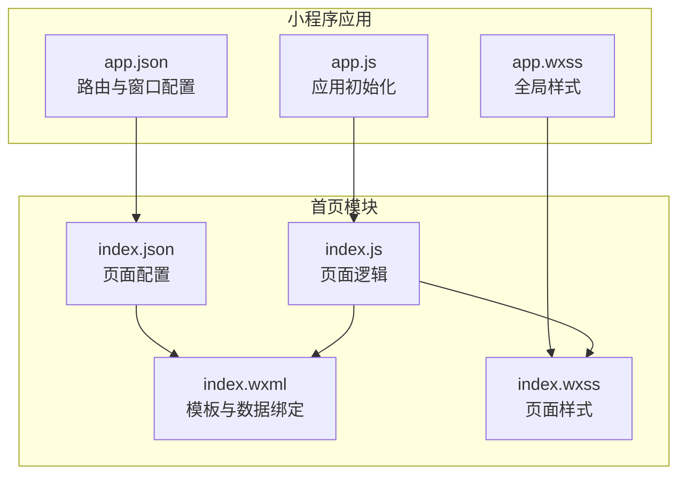
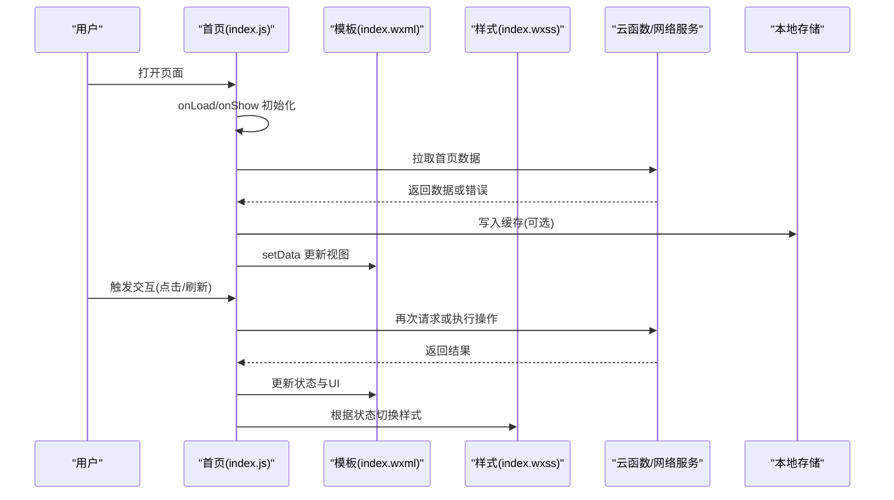
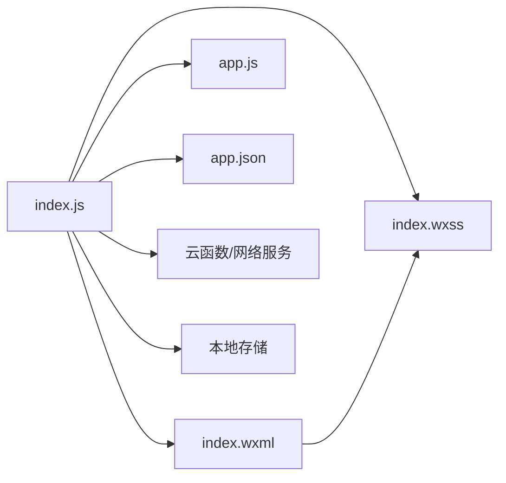

# 首页组件

<cite>
**本文引用的文件**   
- [miniprogram/pages/index/index.wxml](file://miniprogram/pages/index/index.wxml)
- [miniprogram/pages/index/index.wxss](file://miniprogram/pages/index/index.wxss)
- [miniprogram/pages/index/index.js](file://miniprogram/pages/index/index.js)
- [miniprogram/pages/index/index.json](file://miniprogram/pages/index/index.json)
- [miniprogram/app.js](file://miniprogram/app.js)
- [miniprogram/app.json](file://miniprogram/app.json)
- [miniprogram/app.wxss](file://miniprogram/app.wxss)
</cite>

## 目录
1. [简介](#简介)
2. [项目结构](#项目结构)
3. [核心组件](#核心组件)
4. [架构总览](#架构总览)
5. [详细组件分析](#详细组件分析)
6. [依赖分析](#依赖分析)
7. [性能考虑](#性能考虑)
8. [故障排查指南](#故障排查指南)
9. [结论](#结论)
10. [附录](#附录)

## 简介
本文件为小程序“首页”组件的完整技术文档，覆盖页面模板结构、样式设计与 JavaScript 逻辑实现。内容包含数据绑定、事件处理与状态管理示例说明，记录页面生命周期方法、API 调用与错误处理机制，并提供响应式布局适配和无障碍访问支持的最佳实践。读者可据此快速理解并扩展首页功能。

## 项目结构
首页组件位于 miniprogram/pages/index 目录下，由四部分组成：
- index.wxml：页面模板与数据绑定
- index.wxss：页面样式与响应式布局
- index.js：页面逻辑、生命周期、事件处理与 API 调用
- index.json：页面级配置（导航栏、分包等）

此外，应用级入口 app.js、app.json、app.wxss 提供全局配置与基础样式，首页会继承这些全局设置。

图表来源
- [miniprogram/app.js](file://miniprogram/app.js)
- [miniprogram/app.json](file://miniprogram/app.json)
- [miniprogram/app.wxss](file://miniprogram/app.wxss)
- [miniprogram/pages/index/index.wxml](file://miniprogram/pages/index/index.wxml)
- [miniprogram/pages/index/index.wxss](file://miniprogram/pages/index/index.wxss)
- [miniprogram/pages/index/index.js](file://miniprogram/pages/index/index.js)
- [miniprogram/pages/index/index.json](file://miniprogram/pages/index/index.json)

章节来源
- [miniprogram/pages/index/index.wxml](file://miniprogram/pages/index/index.wxml)
- [miniprogram/pages/index/index.wxss](file://miniprogram/pages/index/index.wxss)
- [miniprogram/pages/index/index.js](file://miniprogram/pages/index/index.js)
- [miniprogram/pages/index/index.json](file://miniprogram/pages/index/index.json)
- [miniprogram/app.js](file://miniprogram/app.js)
- [miniprogram/app.json](file://miniprogram/app.json)
- [miniprogram/app.wxss](file://miniprogram/app.wxss)

## 核心组件
首页作为应用入口页，承担以下职责：
- 展示关键业务数据与快捷入口
- 接收用户交互（点击、下拉刷新、滚动等）
- 管理页面级状态与本地缓存
- 调用云函数或网络接口获取数据
- 处理加载态、空态与错误态

在实现上，首页通过模板层进行数据绑定，样式层负责布局与主题，逻辑层负责状态管理与副作用（如请求、缓存）。

章节来源
- [miniprogram/pages/index/index.js](file://miniprogram/pages/index/index.js)
- [miniprogram/pages/index/index.wxml](file://miniprogram/pages/index/index.wxml)
- [miniprogram/pages/index/index.wxss](file://miniprogram/pages/index/index.wxss)

## 架构总览
首页采用典型的小程序三层分离架构：视图层（WXML）、样式层（WXSS）、逻辑层（JS），并通过 JSON 配置控制页面行为。应用层提供全局能力（如路由、主题、全局状态）。

图表来源
- [miniprogram/pages/index/index.js](file://miniprogram/pages/index/index.js)
- [miniprogram/pages/index/index.wxml](file://miniprogram/pages/index/index.wxml)
- [miniprogram/pages/index/index.wxss](file://miniprogram/pages/index/index.wxss)

## 详细组件分析

### 页面模板结构（index.wxml）
- 使用数据绑定将逻辑层状态映射到视图，例如文本、列表项、图片与按钮等
- 条件渲染用于显示加载态、空态与错误态
- 列表渲染用于动态展示数据集合
- 事件绑定用于捕获用户交互，如点击、长按、输入等

最佳实践要点
- 保持模板简洁，复杂逻辑下沉至 JS
- 合理使用 wx:key 提升列表渲染性能
- 为可交互元素添加无障碍属性（aria-* 或 a11y 相关属性）

章节来源
- [miniprogram/pages/index/index.wxml](file://miniprogram/pages/index/index.wxml)

### 样式设计（index.wxss）
- 使用 Flexbox/Grid 构建响应式布局，适配不同屏幕尺寸
- 通过媒体查询与 rpx 单位实现自适应
- 定义统一的色彩、字号、间距与阴影风格
- 针对加载、空态、错误态提供视觉反馈

最佳实践要点
- 优先使用 rpx 保证多端一致性
- 避免过度嵌套，减少重绘与回流
- 使用 CSS 变量统一管理主题色

章节来源
- [miniprogram/pages/index/index.wxss](file://miniprogram/pages/index/index.wxss)
- [miniprogram/app.wxss](file://miniprogram/app.wxss)

### JavaScript 逻辑实现（index.js）
- 生命周期方法
  - onLoad：页面加载时初始化数据、权限检查、埋点上报
  - onShow：页面显示时刷新必要数据
  - onReady：首次渲染完成后执行
  - onHide/onUnload：清理定时器、取消订阅、释放资源
- 数据绑定与状态管理
  - 使用 this.setData 更新视图状态
  - 将频繁读取的状态放入 data，避免重复计算
  - 对异步结果进行合并与去抖处理
- 事件处理
  - 统一封装事件回调，避免内联函数造成内存泄漏
  - 防抖/节流优化高频事件（如滚动、搜索）
- API 调用与错误处理
  - 封装云函数/网络请求，统一错误码与提示
  - 区分网络错误、业务错误与系统异常
  - 失败重试与降级策略（如本地缓存兜底）
- 本地存储
  - 使用 wx.setStorageSync/getStorageSync 缓存关键数据
  - 设置过期时间与版本兼容

代码片段路径（示例说明）
- 页面初始化与数据拉取：[miniprogram/pages/index/index.js](file://miniprogram/pages/index/index.js)
- 事件处理与状态更新：[miniprogram/pages/index/index.js](file://miniprogram/pages/index/index.js)
- 云函数调用与错误处理：[miniprogram/pages/index/index.js](file://miniprogram/pages/index/index.js)

章节来源
- [miniprogram/pages/index/index.js](file://miniprogram/pages/index/index.js)

### 页面配置（index.json）
- 导航栏标题、背景色、返回按钮样式
- 是否启用下拉刷新、上拉加载更多
- 自定义 tabbar 或分享参数
- 分包加载与预加载策略

章节来源
- [miniprogram/pages/index/index.json](file://miniprogram/pages/index/index.json)

### 应用级配置与样式（app.js / app.json / app.wxss）
- app.json：注册页面路由、窗口全局配置、tabBar 配置
- app.js：应用启动流程、全局状态、插件初始化
- app.wxss：全局样式基线、字体、颜色、布局常量

章节来源
- [miniprogram/app.js](file://miniprogram/app.js)
- [miniprogram/app.json](file://miniprogram/app.json)
- [miniprogram/app.wxss](file://miniprogram/app.wxss)

## 依赖分析
首页依赖关系如下：
- 视图层依赖样式层与逻辑层的数据驱动
- 逻辑层依赖应用层的全局配置与工具方法
- 外部依赖包括云函数/网络服务与本地存储

图表来源
- [miniprogram/pages/index/index.js](file://miniprogram/pages/index/index.js)
- [miniprogram/pages/index/index.wxml](file://miniprogram/pages/index/index.wxml)
- [miniprogram/pages/index/index.wxss](file://miniprogram/pages/index/index.wxss)
- [miniprogram/app.js](file://miniprogram/app.js)
- [miniprogram/app.json](file://miniprogram/app.json)

章节来源
- [miniprogram/pages/index/index.js](file://miniprogram/pages/index/index.js)
- [miniprogram/app.js](file://miniprogram/app.js)
- [miniprogram/app.json](file://miniprogram/app.json)

## 性能考虑
- 数据层面
  - 减少 setData 频率与数据量，按需更新字段
  - 列表分页与虚拟列表，避免一次性渲染大量节点
- 渲染层面
  - 避免复杂表达式与函数调用在模板中
  - 使用 wx:if/wx:for-key 优化条件与列表渲染
- 网络层面
  - 并发请求限制与超时控制
  - 缓存热点数据，减少重复请求
- 内存层面
  - 及时清理定时器、监听器与闭包引用
  - 避免在循环中创建大对象

## 故障排查指南
常见问题与定位步骤
- 页面空白或数据不显示
  - 检查 onLoad 是否正确调用与数据赋值
  - 查看控制台报错与网络请求状态码
  - 确认模板绑定字段名与数据结构一致
- 交互无响应
  - 检查事件绑定是否正确，是否存在阻止冒泡
  - 验证 setData 是否成功触发视图更新
- 样式错乱或适配问题
  - 检查媒体查询与 rpx 使用是否合理
  - 对比不同设备与系统版本的渲染差异
- 云函数/网络请求失败
  - 检查权限与域名白名单
  - 查看错误码与日志，必要时增加重试与降级

章节来源
- [miniprogram/pages/index/index.js](file://miniprogram/pages/index/index.js)

## 结论
首页组件通过清晰的三层分离与良好的工程化实践，实现了数据驱动、事件响应与状态管理的闭环。遵循本文档中的最佳实践，可在保证性能与可维护性的同时，快速迭代与扩展首页功能。

## 附录

### 数据绑定与事件处理示例（路径指引）
- 数据绑定与条件渲染：[miniprogram/pages/index/index.wxml](file://miniprogram/pages/index/index.wxml)
- 事件绑定与回调处理：[miniprogram/pages/index/index.js](file://miniprogram/pages/index/index.js)
- 列表渲染与 key 优化：[miniprogram/pages/index/index.wxml](file://miniprogram/pages/index/index.wxml)

### 生命周期方法与 API 调用示例（路径指引）
- 生命周期钩子：onLoad/onShow/onReady/onHide/onUnload
- 云函数/网络请求封装与错误处理：[miniprogram/pages/index/index.js](file://miniprogram/pages/index/index.js)

### 响应式布局适配最佳实践
- 使用 rpx 与媒体查询适配多端
- 基于 Flexbox 的弹性布局与栅格系统
- 避免固定高度与绝对定位滥用

### 无障碍访问支持最佳实践
- 为可交互元素添加语义化标签与 aria-* 属性
- 确保键盘导航与焦点顺序合理
- 提供足够的颜色对比度与替代文本