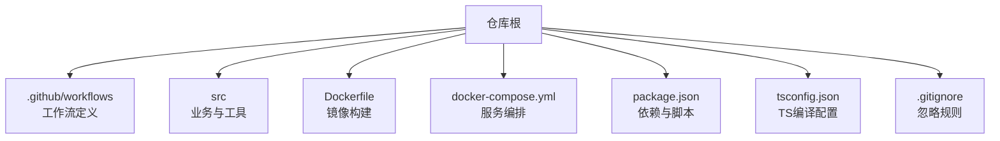
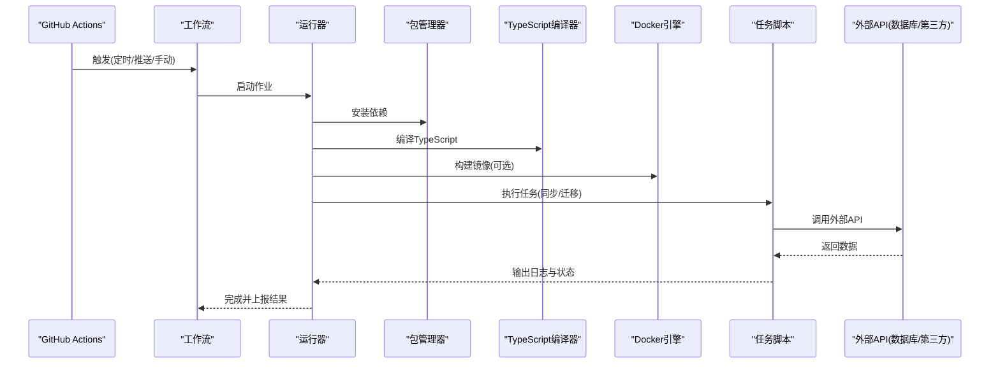
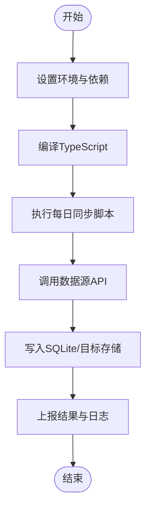
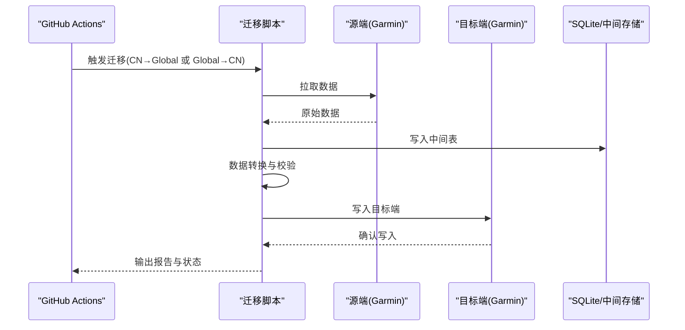
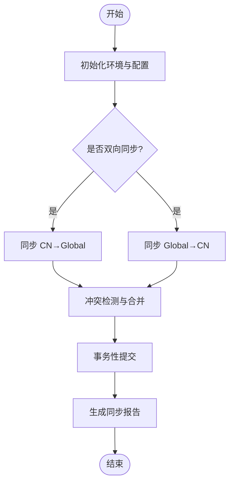
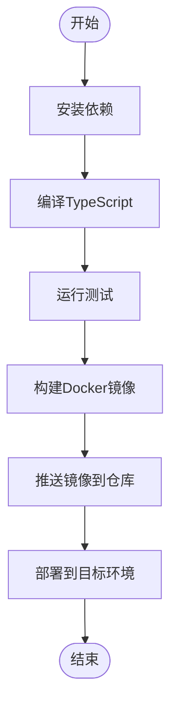
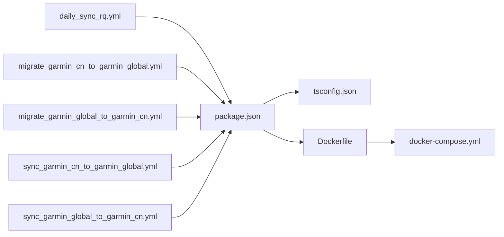

# CI/CD流水线配置

<cite>
**本文档引用的文件**
- [daily_sync_rq.yml](file://dailysync-ref/.github/workflows/daily_sync_rq.yml)
- [migrate_garmin_cn_to_garmin_global.yml](file://dailysync-ref/.github/workflows/migrate_garmin_cn_to_garmin_global.yml)
- [migrate_garmin_global_to_garmin_cn.yml](file://dailysync-ref/.github/workflows/migrate_garmin_global_to_garmin_cn.yml)
- [sync_garmin_cn_to_garmin_global.yml](file://dailysync-ref/.github/workflows/sync_garmin_cn_to_garmin_global.yml)
- [sync_garmin_global_to_garmin_cn.yml](file://dailysync-ref/.github/workflows/sync_garmin_global_to_garmin_cn.yml)
- [Dockerfile](file://dailysync-ref/Dockerfile)
- [docker-compose.yml](file://dailysync-ref/docker-compose.yml)
- [package.json](file://dailysync-ref/package.json)
- [tsconfig.json](file://dailysync-ref/tsconfig.json)
- [.gitignore](file://dailysync-ref/.gitignore)
- [README.md](file://dailysync-ref/README.md)
</cite>

## 目录
1. [简介](#简介)
2. [项目结构](#项目结构)
3. [核心组件](#核心组件)
4. [架构总览](#架构总览)
5. [详细组件分析](#详细组件分析)
6. [依赖关系分析](#依赖关系分析)
7. [性能考虑](#性能考虑)
8. [故障排查指南](#故障排查指南)
9. [结论](#结论)
10. [附录](#附录)

## 简介
本文件面向开发者与运维人员，系统化说明 dailysync-ref 子项目的 CI/CD 流水线设计与实现。内容覆盖：
- GitHub Actions 工作流：每日同步任务、数据迁移任务、双向同步任务的触发与执行流程
- 代码质量检查、测试执行、构建与部署步骤
- 环境变量安全管理、失败重试机制与通知配置
- 流水线监控与故障恢复策略

目标是帮助团队快速理解并维护自动化流水线，确保数据同步与迁移的稳定性和可观测性。

## 项目结构
dailysync-ref 是数据同步与迁移的核心工程，包含 TypeScript 源码、工具库、Docker 化部署与 GitHub Actions 工作流。关键目录与文件：
- .github/workflows：GitHub Actions 工作流定义（每日同步、迁移、双向同步）
- src：业务逻辑与工具（SQLite、Google Sheets、Strava、Garmin CN/Global 等）
- Dockerfile 与 docker-compose.yml：容器化与本地编排
- package.json 与 tsconfig.json：依赖与编译配置
- .gitignore：忽略敏感或生成文件

**图表来源**
- [daily_sync_rq.yml](file://dailysync-ref/.github/workflows/daily_sync_rq.yml)
- [migrate_garmin_cn_to_garmin_global.yml](file://dailysync-ref/.github/workflows/migrate_garmin_cn_to_garmin_global.yml)
- [migrate_garmin_global_to_garmin_cn.yml](file://dailysync-ref/.github/workflows/migrate_garmin_global_to_garmin_cn.yml)
- [sync_garmin_cn_to_garmin_global.yml](file://dailysync-ref/.github/workflows/sync_garmin_cn_to_garmin_global.yml)
- [sync_garmin_global_to_garmin_cn.yml](file://dailysync-ref/.github/workflows/sync_garmin_global_to_garmin_cn.yml)
- [Dockerfile](file://dailysync-ref/Dockerfile)
- [docker-compose.yml](file://dailysync-ref/docker-compose.yml)
- [package.json](file://dailysync-ref/package.json)
- [tsconfig.json](file://dailysync-ref/tsconfig.json)
- [.gitignore](file://dailysync-ref/.gitignore)

**章节来源**
- [README.md](file://dailysync-ref/README.md)
- [package.json](file://dailysync-ref/package.json)
- [tsconfig.json](file://dailysync-ref/tsconfig.json)
- [.gitignore](file://dailysync-ref/.gitignore)

## 核心组件
- 工作流组件
  - 每日同步任务：定时触发，拉取并处理数据源（如 Running Quotient），写入目标存储
  - 数据迁移任务：在 Garmin CN 与 Garmin Global 之间进行单向迁移
  - 双向同步任务：CN 与 Global 之间的双向数据同步
- 运行环境组件
  - Node.js 运行时与 TypeScript 编译链
  - SQLite 作为本地数据存储
  - Google Sheets、Strava、Garmin 等外部 API 集成
- 部署组件
  - Docker 镜像构建与容器编排
  - GitHub Actions 缓存与工件管理

**章节来源**
- [daily_sync_rq.yml](file://dailysync-ref/.github/workflows/daily_sync_rq.yml)
- [migrate_garmin_cn_to_garmin_global.yml](file://dailysync-ref/.github/workflows/migrate_garmin_cn_to_garmin_global.yml)
- [migrate_garmin_global_to_garmin_cn.yml](file://dailysync-ref/.github/workflows/migrate_garmin_global_to_garmin_cn.yml)
- [sync_garmin_cn_to_garmin_global.yml](file://dailysync-ref/.github/workflows/sync_garmin_cn_to_garmin_global.yml)
- [sync_garmin_global_to_garmin_cn.yml](file://dailysync-ref/.github/workflows/sync_garmin_global_to_garmin_cn.yml)
- [Dockerfile](file://dailysync-ref/Dockerfile)
- [docker-compose.yml](file://dailysync-ref/docker-compose.yml)
- [package.json](file://dailysync-ref/package.json)

## 架构总览
CI/CD 整体由 GitHub Actions 驱动，按不同工作流触发相应任务。每个工作流包含：
- 触发条件（定时、推送、手动）
- 环境准备（Node.js、依赖安装、缓存）
- 代码质量检查与测试
- 构建与打包（TypeScript 编译、Docker 镜像）
- 执行任务（同步/迁移）
- 结果上报与通知（成功/失败）

**图表来源**
- [daily_sync_rq.yml](file://dailysync-ref/.github/workflows/daily_sync_rq.yml)
- [migrate_garmin_cn_to_garmin_global.yml](file://dailysync-ref/.github/workflows/migrate_garmin_cn_to_garmin_global.yml)
- [migrate_garmin_global_to_garmin_cn.yml](file://dailysync-ref/.github/workflows/migrate_garmin_global_to_garmin_cn.yml)
- [sync_garmin_cn_to_garmin_global.yml](file://dailysync-ref/.github/workflows/sync_garmin_cn_to_garmin_global.yml)
- [sync_garmin_global_to_garmin_cn.yml](file://dailysync-ref/.github/workflows/sync_garmin_global_to_garmin_cn.yml)
- [Dockerfile](file://dailysync-ref/Dockerfile)
- [package.json](file://dailysync-ref/package.json)

## 详细组件分析

### 每日同步任务（Running Quotient）
- 触发方式：定时触发（cron）
- 主要步骤：
  - 设置 Node.js 版本与环境变量
  - 安装依赖并缓存 node_modules
  - 编译 TypeScript
  - 执行 rq.ts 或相关脚本，拉取数据并落库
  - 记录日志与告警
- 注意事项：
  - 使用 Secrets 管理令牌与密钥
  - 合理设置超时与重试
  - 输出结构化日志便于监控

**图表来源**
- [daily_sync_rq.yml](file://dailysync-ref/.github/workflows/daily_sync_rq.yml)
- [package.json](file://dailysync-ref/package.json)

**章节来源**
- [daily_sync_rq.yml](file://dailysync-ref/.github/workflows/daily_sync_rq.yml)
- [package.json](file://dailysync-ref/package.json)

### 数据迁移任务（Garmin CN ↔ Global）
- 触发方式：手动触发或定时触发
- 主要步骤：
  - 初始化运行环境
  - 加载配置与凭据
  - 读取源端数据（CN 或 Global）
  - 转换与校验数据
  - 写入目标端
  - 失败回滚与重试
- 注意事项：
  - 幂等性与去重策略
  - 增量迁移支持
  - 数据一致性校验

**图表来源**
- [migrate_garmin_cn_to_garmin_global.yml](file://dailysync-ref/.github/workflows/migrate_garmin_cn_to_garmin_global.yml)
- [migrate_garmin_global_to_garmin_cn.yml](file://dailysync-ref/.github/workflows/migrate_garmin_global_to_garmin_cn.yml)
- [package.json](file://dailysync-ref/package.json)

**章节来源**
- [migrate_garmin_cn_to_garmin_global.yml](file://dailysync-ref/.github/workflows/migrate_garmin_cn_to_garmin_global.yml)
- [migrate_garmin_global_to_garmin_cn.yml](file://dailysync-ref/.github/workflows/migrate_garmin_global_to_garmin_cn.yml)
- [package.json](file://dailysync-ref/package.json)

### 双向同步任务（Garmin CN ↔ Global）
- 触发方式：定时触发或事件触发
- 主要步骤：
  - 并行执行两个方向的同步
  - 冲突检测与合并策略
  - 事务性提交与回滚
  - 同步差异统计与报告
- 注意事项：
  - 并发控制与限流
  - 断点续传与幂等
  - 监控与告警阈值

**图表来源**
- [sync_garmin_cn_to_garmin_global.yml](file://dailysync-ref/.github/workflows/sync_garmin_cn_to_garmin_global.yml)
- [sync_garmin_global_to_garmin_cn.yml](file://dailysync-ref/.github/workflows/sync_garmin_global_to_garmin_cn.yml)
- [package.json](file://dailysync-ref/package.json)

**章节来源**
- [sync_garmin_cn_to_garmin_global.yml](file://dailysync-ref/.github/workflows/sync_garmin_cn_to_garmin_global.yml)
- [sync_garmin_global_to_garmin_cn.yml](file://dailysync-ref/.github/workflows/sync_garmin_global_to_garmin_cn.yml)
- [package.json](file://dailysync-ref/package.json)

### 代码质量检查与测试
- 静态检查：ESLint/Prettier（若配置）
- 单元测试：Jest/Mocha（根据 package.json 脚本）
- 类型检查：tsc --noEmit
- 覆盖率：istanbul/nyc（可选）

建议在工作流中增加步骤：
- 安装依赖并缓存
- 执行 lint 与类型检查
- 运行测试套件
- 上传覆盖率报告

**章节来源**
- [package.json](file://dailysync-ref/package.json)
- [tsconfig.json](file://dailysync-ref/tsconfig.json)

### 构建与部署
- 构建：TypeScript 编译为 JavaScript
- 镜像：基于 Dockerfile 构建镜像
- 编排：docker-compose 启动服务（本地或 CI 环境）
- 发布：将制品上传至 GitHub Artifacts 或私有仓库

**图表来源**
- [Dockerfile](file://dailysync-ref/Dockerfile)
- [docker-compose.yml](file://dailysync-ref/docker-compose.yml)
- [package.json](file://dailysync-ref/package.json)

**章节来源**
- [Dockerfile](file://dailysync-ref/Dockerfile)
- [docker-compose.yml](file://dailysync-ref/docker-compose.yml)
- [package.json](file://dailysync-ref/package.json)

### 环境变量安全管理
- 使用 GitHub Secrets 管理敏感信息（API Key、Token、数据库连接串）
- 避免在代码或日志中打印敏感值
- 使用 .env 模板与 .gitignore 排除实际配置文件
- 定期轮换密钥并审计访问

最佳实践：
- 最小权限原则
- 分环境隔离（开发/测试/生产）
- 使用加密与访问控制

**章节来源**
- [.gitignore](file://dailysync-ref/.gitignore)
- [package.json](file://dailysync-ref/package.json)

### 失败重试机制与通知配置
- 重试策略：指数退避、最大重试次数
- 通知渠道：邮件、Slack、企业微信、钉钉
- 失败告警：错误码分类、上下文日志、堆栈跟踪
- 自动恢复：健康检查与自愈脚本

建议在工作流中：
- 设置 continue-on-error 与 retry
- 添加通知步骤（成功/失败）
- 收集失败日志与指标

**章节来源**
- [daily_sync_rq.yml](file://dailysync-ref/.github/workflows/daily_sync_rq.yml)
- [migrate_garmin_cn_to_garmin_global.yml](file://dailysync-ref/.github/workflows/migrate_garmin_cn_to_garmin_global.yml)
- [migrate_garmin_global_to_garmin_cn.yml](file://dailysync-ref/.github/workflows/migrate_garmin_global_to_garmin_cn.yml)
- [sync_garmin_cn_to_garmin_global.yml](file://dailysync-ref/.github/workflows/sync_garmin_cn_to_garmin_global.yml)
- [sync_garmin_global_to_garmin_cn.yml](file://dailysync-ref/.github/workflows/sync_garmin_global_to_garmin_cn.yml)

## 依赖关系分析
工作流与源码、依赖之间的关系如下：

**图表来源**
- [daily_sync_rq.yml](file://dailysync-ref/.github/workflows/daily_sync_rq.yml)
- [migrate_garmin_cn_to_garmin_global.yml](file://dailysync-ref/.github/workflows/migrate_garmin_cn_to_garmin_global.yml)
- [migrate_garmin_global_to_garmin_cn.yml](file://dailysync-ref/.github/workflows/migrate_garmin_global_to_garmin_cn.yml)
- [sync_garmin_cn_to_garmin_global.yml](file://dailysync-ref/.github/workflows/sync_garmin_cn_to_garmin_global.yml)
- [sync_garmin_global_to_garmin_cn.yml](file://dailysync-ref/.github/workflows/sync_garmin_global_to_garmin_cn.yml)
- [package.json](file://dailysync-ref/package.json)
- [tsconfig.json](file://dailysync-ref/tsconfig.json)
- [Dockerfile](file://dailysync-ref/Dockerfile)
- [docker-compose.yml](file://dailysync-ref/docker-compose.yml)

**章节来源**
- [package.json](file://dailysync-ref/package.json)
- [tsconfig.json](file://dailysync-ref/tsconfig.json)
- [Dockerfile](file://dailysync-ref/Dockerfile)
- [docker-compose.yml](file://dailysync-ref/docker-compose.yml)

## 性能考虑
- 依赖缓存：缓存 node_modules 与构建产物
- 并行执行：多任务并行与分片处理
- 资源限制：合理设置 CPU/内存与超时
- I/O优化：批量写入与分页拉取
- 监控指标：耗时、成功率、错误率

[本节为通用指导，不直接分析具体文件]

## 故障排查指南
常见问题与解决思路：
- 依赖安装失败：检查网络代理与镜像源
- 编译错误：核对 TypeScript 配置与依赖版本
- 测试失败：定位用例与修复数据
- 外部API限流：增加重试与退避策略
- 权限不足：检查 Secrets 与角色权限
- 日志缺失：启用详细日志与上下文输出

建议：
- 使用结构化日志与追踪ID
- 建立错误分类与知识库
- 定期演练与复盘

**章节来源**
- [package.json](file://dailysync-ref/package.json)
- [tsconfig.json](file://dailysync-ref/tsconfig.json)
- [Dockerfile](file://dailysync-ref/Dockerfile)
- [docker-compose.yml](file://dailysync-ref/docker-compose.yml)

## 结论
通过系统化的 CI/CD 流水线设计，本项目实现了数据同步与迁移的自动化与可观测性。结合环境变量安全、失败重试与通知机制，能够有效提升稳定性与可维护性。建议持续优化监控与告警，完善故障恢复策略，保障生产环境的稳定运行。

[本节为总结，不直接分析具体文件]

## 附录
- 工作流触发建议：
  - 每日同步：cron 表达式（例如每天凌晨）
  - 迁移任务：手动触发为主，必要时定时
  - 双向同步：定时+事件触发
- 监控与报表：
  - 使用 GitHub Actions 日志与工件
  - 集成外部监控系统（Prometheus/Grafana）
- 文档与规范：
  - 更新 README 与操作手册
  - 制定变更管理与回滚流程

[本节为补充信息，不直接分析具体文件]