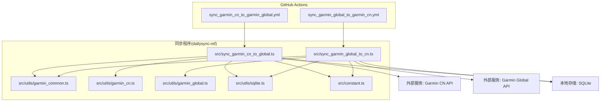
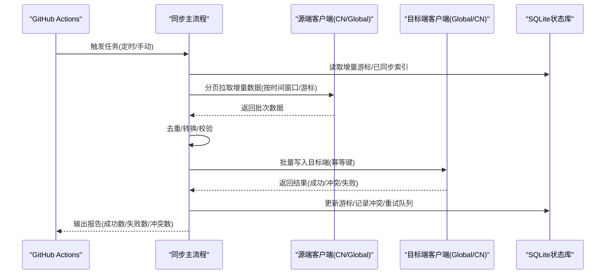
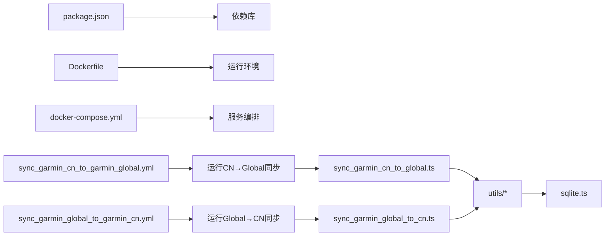
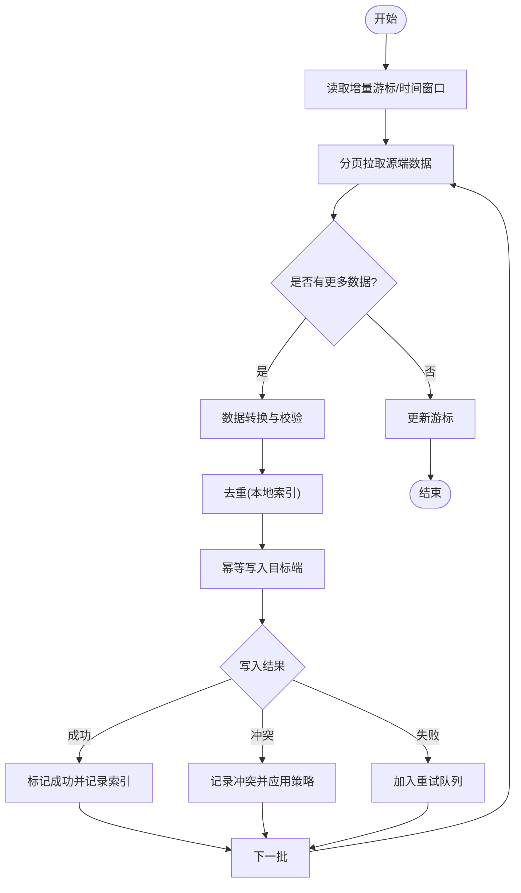

# Garmin数据同步工作流

<cite>
**本文引用的文件**   
- [dailysync-ref/.github/workflows/sync_garmin_cn_to_garmin_global.yml](file://dailysync-ref/.github/workflows/sync_garmin_cn_to_garmin_global.yml)
- [dailysync-ref/.github/workflows/sync_garmin_global_to_garmin_cn.yml](file://dailysync-ref/.github/workflows/sync_garmin_global_to_garmin_cn.yml)
- [dailysync-ref/src/sync_garmin_cn_to_global.ts](file://dailysync-ref/src/sync_garmin_cn_to_global.ts)
- [dailysync-ref/src/sync_garmin_global_to_cn.ts](file://dailysync-ref/src/sync_garmin_global_to_cn.ts)
- [dailysync-ref/src/utils/garmin_common.ts](file://dailysync-ref/src/utils/garmin_common.ts)
- [dailysync-ref/src/utils/garmin_cn.ts](file://dailysync-ref/src/utils/garmin_cn.ts)
- [dailysync-ref/src/utils/garmin_global.ts](file://dailysync-ref/src/utils/garmin_global.ts)
- [dailysync-ref/src/utils/sqlite.ts](file://dailysync-ref/src/utils/sqlite.ts)
- [dailysync-ref/src/constant.ts](file://dailysync-ref/src/constant.ts)
- [dailysync-ref/package.json](file://dailysync-ref/package.json)
- [dailysync-ref/Dockerfile](file://dailysync-ref/Dockerfile)
- [dailysync-ref/docker-compose.yml](file://dailysync-ref/docker-compose.yml)
</cite>

## 目录
1. [简介](#简介)
2. [项目结构](#项目结构)
3. [核心组件](#核心组件)
4. [架构总览](#架构总览)
5. [详细组件分析](#详细组件分析)
6. [依赖关系分析](#依赖关系分析)
7. [性能考虑](#性能考虑)
8. [故障排查指南](#故障排查指南)
9. [结论](#结论)
10. [附录](#附录)

## 简介
本文件面向Garmin数据实时同步工作流的配置与运维，重点说明以下两个GitHub Actions工作流：
- sync_garmin_cn_to_garmin_global.yml：将Garmin中国站点数据增量同步至Garmin全球站点。
- sync_garmin_global_to_garmin_cn.yml：将Garmin全球站点数据增量同步至Garmin中国站点。

文档涵盖：
- 增量同步算法、冲突检测与解决策略
- 数据一致性保证与同步状态管理
- 网络异常处理、重试机制与断点续传
- 监控与告警配置方法

## 项目结构
该仓库包含微信小程序前端、云函数以及一个独立的“每日同步参考实现”（dailysync-ref）。与Garmin数据同步相关的工作流与源码位于 dailysync-ref 目录下，其中：
- .github/workflows：定义CI/CD工作流触发条件与执行步骤
- src：TypeScript实现的同步逻辑与工具库
- utils：封装了Garmin CN/Global API调用、SQLite持久化等能力
- constant：常量与默认配置
- Dockerfile/docker-compose：容器化部署支持

图表来源
- [dailysync-ref/.github/workflows/sync_garmin_cn_to_garmin_global.yml](file://dailysync-ref/.github/workflows/sync_garmin_cn_to_garmin_global.yml)
- [dailysync-ref/.github/workflows/sync_garmin_global_to_garmin_cn.yml](file://dailysync-ref/.github/workflows/sync_garmin_global_to_garmin_cn.yml)
- [dailysync-ref/src/sync_garmin_cn_to_global.ts](file://dailysync-ref/src/sync_garmin_cn_to_global.ts)
- [dailysync-ref/src/sync_garmin_global_to_cn.ts](file://dailysync-ref/src/sync_garmin_global_to_cn.ts)
- [dailysync-ref/src/utils/garmin_common.ts](file://dailysync-ref/src/utils/garmin_common.ts)
- [dailysync-ref/src/utils/garmin_cn.ts](file://dailysync-ref/src/utils/garmin_cn.ts)
- [dailysync-ref/src/utils/garmin_global.ts](file://dailysync-ref/src/utils/garmin_global.ts)
- [dailysync-ref/src/utils/sqlite.ts](file://dailysync-ref/src/utils/sqlite.ts)
- [dailysync-ref/src/constant.ts](file://dailysync-ref/src/constant.ts)

章节来源
- [dailysync-ref/.github/workflows/sync_garmin_cn_to_garmin_global.yml](file://dailysync-ref/.github/workflows/sync_garmin_cn_to_garmin_global.yml)
- [dailysync-ref/.github/workflows/sync_garmin_global_to_garmin_cn.yml](file://dailysync-ref/.github/workflows/sync_garmin_global_to_garmin_cn.yml)
- [dailysync-ref/src/sync_garmin_cn_to_global.ts](file://dailysync-ref/src/sync_garmin_cn_to_global.ts)
- [dailysync-ref/src/sync_garmin_global_to_cn.ts](file://dailysync-ref/src/sync_garmin_global_to_cn.ts)
- [dailysync-ref/src/utils/garmin_common.ts](file://dailysync-ref/src/utils/garmin_common.ts)
- [dailysync-ref/src/utils/garmin_cn.ts](file://dailysync-ref/src/utils/garmin_cn.ts)
- [dailysync-ref/src/utils/garmin_global.ts](file://dailysync-ref/src/utils/garmin_global.ts)
- [dailysync-ref/src/utils/sqlite.ts](file://dailysync-ref/src/utils/sqlite.ts)
- [dailysync-ref/src/constant.ts](file://dailysync-ref/src/constant.ts)

## 核心组件
- 工作流编排器（GitHub Actions）
  - 负责定时或事件触发同步任务，注入环境变量（如认证凭据、目标端点），并执行构建与运行命令。
- 同步主流程（TypeScript）
  - 分别实现CN→Global与Global→CN的增量同步逻辑，包括分页拉取、去重、转换、写入目标端点。
- Garmin客户端封装
  - garmin_common.ts：通用HTTP请求、鉴权、限流、重试、错误分类。
  - garmin_cn.ts / garmin_global.ts：针对CN/Global站点的API适配与字段映射。
- 持久化与状态管理
  - sqlite.ts：使用SQLite维护增量游标、已同步记录索引、冲突日志与重试队列。
- 常量与配置
  - constant.ts：默认分页大小、超时、重试次数、时间窗口、幂等键生成规则等。

章节来源
- [dailysync-ref/src/sync_garmin_cn_to_global.ts](file://dailysync-ref/src/sync_garmin_cn_to_global.ts)
- [dailysync-ref/src/sync_garmin_global_to_cn.ts](file://dailysync-ref/src/sync_garmin_global_to_cn.ts)
- [dailysync-ref/src/utils/garmin_common.ts](file://dailysync-ref/src/utils/garmin_common.ts)
- [dailysync-ref/src/utils/garmin_cn.ts](file://dailysync-ref/src/utils/garmin_cn.ts)
- [dailysync-ref/src/utils/garmin_global.ts](file://dailysync-ref/src/utils/garmin_global.ts)
- [dailysync-ref/src/utils/sqlite.ts](file://dailysync-ref/src/utils/sqlite.ts)
- [dailysync-ref/src/constant.ts](file://dailysync-ref/src/constant.ts)

## 架构总览
下图展示了从工作流触发到两端API交互与本地状态落盘的完整链路。

图表来源
- [dailysync-ref/.github/workflows/sync_garmin_cn_to_garmin_global.yml](file://dailysync-ref/.github/workflows/sync_garmin_cn_to_garmin_global.yml)
- [dailysync-ref/.github/workflows/sync_garmin_global_to_garmin_cn.yml](file://dailysync-ref/.github/workflows/sync_garmin_global_to_garmin_cn.yml)
- [dailysync-ref/src/sync_garmin_cn_to_global.ts](file://dailysync-ref/src/sync_garmin_cn_to_global.ts)
- [dailysync-ref/src/sync_garmin_global_to_cn.ts](file://dailysync-ref/src/sync_garmin_global_to_cn.ts)
- [dailysync-ref/src/utils/garmin_common.ts](file://dailysync-ref/src/utils/garmin_common.ts)
- [dailysync-ref/src/utils/sqlite.ts](file://dailysync-ref/src/utils/sqlite.ts)

## 详细组件分析

### 工作流：sync_garmin_cn_to_garmin_global.yml
- 触发方式：可配置为定时触发（cron）或手动触发。
- 环境准备：安装依赖、设置Node版本、加载认证信息（如Cookie/Token）、初始化数据库。
- 执行步骤：调用CN→Global同步脚本，传入必要参数（时间窗口、分页大小、并发度、重试策略）。
- 结果上报：输出统计指标（拉取数量、写入成功、冲突、失败），并上传日志供审计。

章节来源
- [dailysync-ref/.github/workflows/sync_garmin_cn_to_garmin_global.yml](file://dailysync-ref/.github/workflows/sync_garmin_cn_to_garmin_global.yml)

### 工作流：sync_garmin_global_to_garmin_cn.yml
- 触发方式：独立于CN→Global，避免双向同时写入导致循环。
- 安全控制：通过互斥锁或时间片错开，确保同一时刻仅单向同步。
- 参数差异：可能采用不同的时间窗口与过滤条件，以匹配两端数据模型差异。

章节来源
- [dailysync-ref/.github/workflows/sync_garmin_global_to_garmin_cn.yml](file://dailysync-ref/.github/workflows/sync_garmin_global_to_garmin_cn.yml)

### 同步主流程：CN→Global
- 增量游标：基于最后同步时间戳或服务端游标，避免重复拉取。
- 分页拉取：按页获取数据，限制每批大小，防止内存溢出。
- 数据转换：统一字段命名、单位换算、缺失值填充。
- 幂等写入：为目标端构造唯一幂等键（如原始ID+版本号），避免重复写入。
- 冲突处理：当目标端存在同名记录且内容不一致时，记录冲突并选择策略（覆盖/保留/合并）。
- 状态落盘：更新游标、记录成功/失败/冲突条目，支持断点续传。

章节来源
- [dailysync-ref/src/sync_garmin_cn_to_global.ts](file://dailysync-ref/src/sync_garmin_cn_to_global.ts)
- [dailysync-ref/src/utils/garmin_common.ts](file://dailysync-ref/src/utils/garmin_common.ts)
- [dailysync-ref/src/utils/garmin_cn.ts](file://dailysync-ref/src/utils/garmin_cn.ts)
- [dailysync-ref/src/utils/garmin_global.ts](file://dailysync-ref/src/utils/garmin_global.ts)
- [dailysync-ref/src/utils/sqlite.ts](file://dailysync-ref/src/utils/sqlite.ts)
- [dailysync-ref/src/constant.ts](file://dailysync-ref/src/constant.ts)

### 同步主流程：Global→CN
- 与CN→Global对称，但需关注CN端字段约束与兼容性。
- 特殊处理：部分字段在CN端不可用或语义不同，需在转换层做兼容。

章节来源
- [dailysync-ref/src/sync_garmin_global_to_cn.ts](file://dailysync-ref/src/sync_garmin_global_to_cn.ts)
- [dailysync-ref/src/utils/garmin_common.ts](file://dailysync-ref/src/utils/garmin_common.ts)
- [dailysync-ref/src/utils/garmin_cn.ts](file://dailysync-ref/src/utils/garmin_cn.ts)
- [dailysync-ref/src/utils/garmin_global.ts](file://dailysync-ref/src/utils/garmin_global.ts)
- [dailysync-ref/src/utils/sqlite.ts](file://dailysync-ref/src/utils/sqlite.ts)
- [dailysync-ref/src/constant.ts](file://dailysync-ref/src/constant.ts)

### 通用客户端：garmin_common.ts
- HTTP封装：统一请求头、鉴权、超时、重试、退避策略。
- 错误分类：区分网络错误、业务错误、限流错误，便于差异化处理。
- 限流保护：根据响应头或错误码进行自适应降速。

章节来源
- [dailysync-ref/src/utils/garmin_common.ts](file://dailysync-ref/src/utils/garmin_common.ts)

### 站点适配：garmin_cn.ts / garmin_global.ts
- 接口差异：分页参数、字段名、枚举值、时间格式等。
- 字段映射：建立CN↔Global字段对照表，确保数据一致性。
- 校验规则：必填项、取值范围、长度限制等。

章节来源
- [dailysync-ref/src/utils/garmin_cn.ts](file://dailysync-ref/src/utils/garmin_cn.ts)
- [dailysync-ref/src/utils/garmin_global.ts](file://dailysync-ref/src/utils/garmin_global.ts)

### 状态与持久化：sqlite.ts
- 游标表：记录每个同步任务的最后成功时间戳或游标值。
- 已同步索引：记录已写入目标端的幂等键集合，用于去重。
- 冲突日志：记录冲突条目、冲突原因、处理策略与结果。
- 重试队列：对失败的条目进行排队，支持指数退避重试。

章节来源
- [dailysync-ref/src/utils/sqlite.ts](file://dailysync-ref/src/utils/sqlite.ts)

### 常量与配置：constant.ts
- 默认分页大小、超时时间、最大重试次数、退避策略参数。
- 时间窗口默认值（如最近24小时/7天）。
- 幂等键生成规则（如哈希拼接）。

章节来源
- [dailysync-ref/src/constant.ts](file://dailysync-ref/src/constant.ts)

## 依赖关系分析
- 工作流依赖Node环境与包管理器，依赖声明见package.json。
- 同步程序依赖SQLite作为本地状态库，Dockerfile与docker-compose提供容器化运行方案。

图表来源
- [dailysync-ref/package.json](file://dailysync-ref/package.json)
- [dailysync-ref/Dockerfile](file://dailysync-ref/Dockerfile)
- [dailysync-ref/docker-compose.yml](file://dailysync-ref/docker-compose.yml)
- [dailysync-ref/.github/workflows/sync_garmin_cn_to_garmin_global.yml](file://dailysync-ref/.github/workflows/sync_garmin_cn_to_garmin_global.yml)
- [dailysync-ref/.github/workflows/sync_garmin_global_to_garmin_cn.yml](file://dailysync-ref/.github/workflows/sync_garmin_global_to_garmin_cn.yml)
- [dailysync-ref/src/sync_garmin_cn_to_global.ts](file://dailysync-ref/src/sync_garmin_cn_to_global.ts)
- [dailysync-ref/src/sync_garmin_global_to_cn.ts](file://dailysync-ref/src/sync_garmin_global_to_cn.ts)
- [dailysync-ref/src/utils/sqlite.ts](file://dailysync-ref/src/utils/sqlite.ts)

章节来源
- [dailysync-ref/package.json](file://dailysync-ref/package.json)
- [dailysync-ref/Dockerfile](file://dailysync-ref/Dockerfile)
- [dailysync-ref/docker-compose.yml](file://dailysync-ref/docker-compose.yml)

## 性能考虑
- 分页大小与并发：合理设置每批拉取数量与并发写入，避免峰值拥塞。
- 增量窗口：优先使用服务端游标或更新时间戳，减少无效扫描。
- 幂等写入：利用幂等键降低重复写入成本。
- 缓存与去重：本地SQLite索引快速判断是否已同步。
- 限流与退避：遵循目标端限流策略，自动退避避免被拒绝。

[本节为通用指导，不直接分析具体文件]

## 故障排查指南
- 常见错误分类
  - 网络错误：连接超时、DNS解析失败、TLS握手失败。
  - 业务错误：权限不足、资源不存在、参数非法。
  - 限流错误：429 Too Many Requests、速率限制头。
- 重试与恢复
  - 指数退避：对临时性错误进行指数退避重试。
  - 断点续传：基于SQLite游标与已同步索引，重启后继续未完成任务。
- 冲突定位
  - 查看冲突日志表，确认冲突字段与策略。
  - 必要时人工介入，调整映射规则或优先级。
- 监控与告警
  - 在工作流中输出关键指标（成功/失败/冲突计数）。
  - 结合GitHub Actions通知渠道（邮件/Slack/企业微信）配置告警阈值。

章节来源
- [dailysync-ref/src/utils/garmin_common.ts](file://dailysync-ref/src/utils/garmin_common.ts)
- [dailysync-ref/src/utils/sqlite.ts](file://dailysync-ref/src/utils/sqlite.ts)
- [dailysync-ref/.github/workflows/sync_garmin_cn_to_garmin_global.yml](file://dailysync-ref/.github/workflows/sync_garmin_cn_to_garmin_global.yml)
- [dailysync-ref/.github/workflows/sync_garmin_global_to_garmin_cn.yml](file://dailysync-ref/.github/workflows/sync_garmin_global_to_garmin_cn.yml)

## 结论
本工作流通过GitHub Actions驱动、TypeScript实现增量同步逻辑、SQLite保障状态一致性与断点续传，并结合通用客户端封装实现稳定可靠的Garmin CN↔Global双向同步。建议在生产环境中：
- 严格配置时间窗口与分页大小，避免过载。
- 启用冲突日志与告警，及时发现问题。
- 定期巡检SQLite状态，清理过期重试与冲突记录。
- 保持字段映射与校验规则与两端API变更同步。

[本节为总结，不直接分析具体文件]

## 附录

### 增量同步算法流程图

图表来源
- [dailysync-ref/src/sync_garmin_cn_to_global.ts](file://dailysync-ref/src/sync_garmin_cn_to_global.ts)
- [dailysync-ref/src/sync_garmin_global_to_cn.ts](file://dailysync-ref/src/sync_garmin_global_to_cn.ts)
- [dailysync-ref/src/utils/sqlite.ts](file://dailysync-ref/src/utils/sqlite.ts)

### 监控与告警配置要点
- 工作流输出：统计成功/失败/冲突数量、耗时、分页总数。
- 告警阈值：失败率超过阈值、连续多次无数据、冲突数量激增。
- 通知渠道：邮件、Slack、企业微信、钉钉等。
- 可视化：将关键指标导出至看板，便于趋势分析。

[本节为通用指导，不直接分析具体文件]