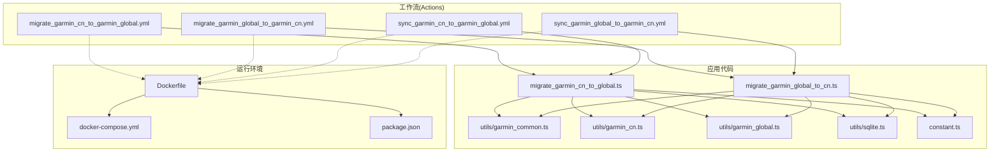
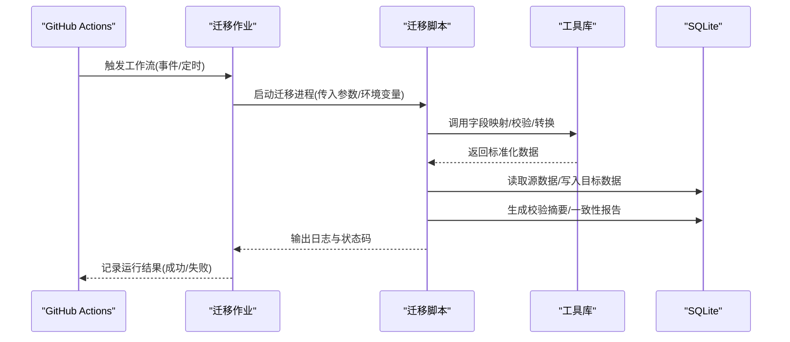
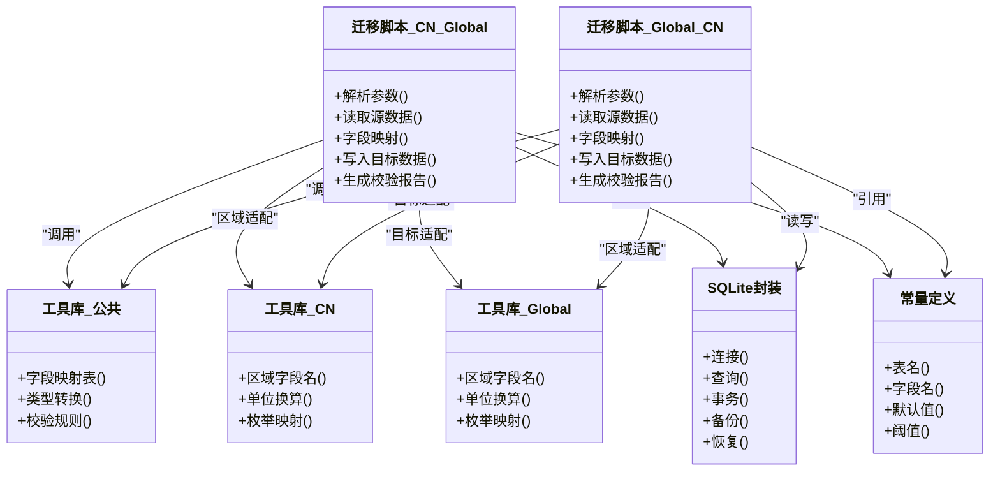

# Garmin数据迁移工作流

<cite>
**本文引用的文件**   
- [migrate_garmin_cn_to_garmin_global.yml](file://dailysync-ref/.github/workflows/migrate_garmin_cn_to_garmin_global.yml)
- [migrate_garmin_global_to_garmin_cn.yml](file://dailysync-ref/.github/workflows/migrate_garmin_global_to_garmin_cn.yml)
- [sync_garmin_cn_to_garmin_global.yml](file://dailysync-ref/.github/workflows/sync_garmin_cn_to_garmin_global.yml)
- [sync_garmin_global_to_garmin_cn.yml](file://dailysync-ref/.github/workflows/sync_garmin_global_to_garmin_cn.yml)
- [migrate_garmin_cn_to_global.ts](file://dailysync-ref/src/migrate_garmin_cn_to_global.ts)
- [migrate_garmin_global_to_cn.ts](file://dailysync-ref/src/migrate_garmin_global_to_cn.ts)
- [garmin_common.ts](file://dailysync-ref/src/utils/garmin_common.ts)
- [garmin_cn.ts](file://dailysync-ref/src/utils/garmin_cn.ts)
- [garmin_global.ts](file://dailysync-ref/src/utils/garmin_global.ts)
- [sqlite.ts](file://dailysync-ref/src/utils/sqlite.ts)
- [constant.ts](file://dailysync-ref/src/constant.ts)
- [docker-compose.yml](file://dailysync-ref/docker-compose.yml)
- [Dockerfile](file://dailysync-ref/Dockerfile)
- [package.json](file://dailysync-ref/package.json)
</cite>

## 目录
1. [简介](#简介)
2. [项目结构](#项目结构)
3. [核心组件](#核心组件)
4. [架构总览](#架构总览)
5. [详细组件分析](#详细组件分析)
6. [依赖关系分析](#依赖关系分析)
7. [性能考量](#性能考量)
8. [故障排查指南](#故障排查指南)
9. [结论](#结论)
10. [附录](#附录)

## 简介
本文件面向Garmin数据双向迁移工作流的配置与实现，聚焦中国版与全球版之间的数据迁移流程。文档涵盖以下关键主题：
- 两个迁移工作流的配置差异与触发机制
- 数据格式转换、字段映射策略
- 冲突解决与数据完整性校验
- 迁移前备份策略与回滚方案
- 运行环境与部署要点（Docker、GitHub Actions）

目标读者包括运维工程师、数据工程师以及需要维护Garmin数据同步与迁移的开发者。

## 项目结构
仓库采用“功能模块+工具库”的组织方式：
- .github/workflows：定义GitHub Actions工作流，包含迁移与同步两类任务
- src：TypeScript源码，包含迁移逻辑、工具函数与常量
- utils：通用工具库，如SQLite操作、Garmin CN/Global适配层等
- Docker相关：容器化构建与编排，便于本地或CI环境运行

图表来源
- [migrate_garmin_cn_to_garmin_global.yml](file://dailysync-ref/.github/workflows/migrate_garmin_cn_to_garmin_global.yml)
- [migrate_garmin_global_to_garmin_cn.yml](file://dailysync-ref/.github/workflows/migrate_garmin_global_to_garmin_cn.yml)
- [migrate_garmin_cn_to_global.ts](file://dailysync-ref/src/migrate_garmin_cn_to_global.ts)
- [migrate_garmin_global_to_cn.ts](file://dailysync-ref/src/migrate_garmin_global_to_cn.ts)
- [garmin_common.ts](file://dailysync-ref/src/utils/garmin_common.ts)
- [garmin_cn.ts](file://dailysync-ref/src/utils/garmin_cn.ts)
- [garmin_global.ts](file://dailysync-ref/src/utils/garmin_global.ts)
- [sqlite.ts](file://dailysync-ref/src/utils/sqlite.ts)
- [constant.ts](file://dailysync-ref/src/constant.ts)
- [Dockerfile](file://dailysync-ref/Dockerfile)
- [docker-compose.yml](file://dailysync-ref/docker-compose.yml)
- [package.json](file://dailysync-ref/package.json)

章节来源
- [migrate_garmin_cn_to_garmin_global.yml](file://dailysync-ref/.github/workflows/migrate_garmin_cn_to_garmin_global.yml)
- [migrate_garmin_global_to_garmin_cn.yml](file://dailysync-ref/.github/workflows/migrate_garmin_global_to_garmin_cn.yml)
- [migrate_garmin_cn_to_global.ts](file://dailysync-ref/src/migrate_garmin_cn_to_global.ts)
- [migrate_garmin_global_to_cn.ts](file://dailysync-ref/src/migrate_garmin_global_to_cn.ts)
- [garmin_common.ts](file://dailysync-ref/src/utils/garmin_common.ts)
- [garmin_cn.ts](file://dailysync-ref/src/utils/garmin_cn.ts)
- [garmin_global.ts](file://dailysync-ref/src/utils/garmin_global.ts)
- [sqlite.ts](file://dailysync-ref/src/utils/sqlite.ts)
- [constant.ts](file://dailysync-ref/src/constant.ts)
- [Dockerfile](file://dailysync-ref/Dockerfile)
- [docker-compose.yml](file://dailysync-ref/docker-compose.yml)
- [package.json](file://dailysync-ref/package.json)

## 核心组件
- 迁移工作流（GitHub Actions）
  - migrate_garmin_cn_to_garmin_global.yml：将中国版数据迁移至全球版
  - migrate_garmin_global_to_garmin_cn.yml：将全球版数据迁移至中国版
  - 两者在触发条件、环境变量、镜像构建与执行命令上存在差异
- 迁移脚本（TypeScript）
  - migrate_garmin_cn_to_global.ts：CN→Global迁移主逻辑
  - migrate_garmin_global_to_cn.ts：Global→CN迁移主逻辑
- 工具库
  - garmin_common.ts：公共字段映射、校验与转换逻辑
  - garmin_cn.ts / garmin_global.ts：区域特定适配（字段名、单位、枚举值等）
  - sqlite.ts：SQLite读写封装，用于持久化中间结果与校验
  - constant.ts：常量定义（表名、字段名、默认值、校验规则等）
- 运行环境
  - Dockerfile：构建Node.js运行环境，安装依赖并准备迁移脚本
  - docker-compose.yml：编排数据库与服务，支持本地调试与CI集成
  - package.json：依赖声明与脚本入口

章节来源
- [migrate_garmin_cn_to_garmin_global.yml](file://dailysync-ref/.github/workflows/migrate_garmin_cn_to_garmin_global.yml)
- [migrate_garmin_global_to_garmin_cn.yml](file://dailysync-ref/.github/workflows/migrate_garmin_global_to_garmin_cn.yml)
- [migrate_garmin_cn_to_global.ts](file://dailysync-ref/src/migrate_garmin_cn_to_global.ts)
- [migrate_garmin_global_to_cn.ts](file://dailysync-ref/src/migrate_garmin_global_to_cn.ts)
- [garmin_common.ts](file://dailysync-ref/src/utils/garmin_common.ts)
- [garmin_cn.ts](file://dailysync-ref/src/utils/garmin_cn.ts)
- [garmin_global.ts](file://dailysync-ref/src/utils/garmin_global.ts)
- [sqlite.ts](file://dailysync-ref/src/utils/sqlite.ts)
- [constant.ts](file://dailysync-ref/src/constant.ts)
- [Dockerfile](file://dailysync-ref/Dockerfile)
- [docker-compose.yml](file://dailysync-ref/docker-compose.yml)
- [package.json](file://dailysync-ref/package.json)

## 架构总览
整体架构由“工作流驱动 + 迁移脚本 + 工具库 + 数据存储”构成。工作流负责调度与参数注入；迁移脚本负责读取源数据、进行字段映射与转换、写入目标存储；工具库提供区域适配与通用能力；SQLite作为中间存储与校验介质。

图表来源
- [migrate_garmin_cn_to_garmin_global.yml](file://dailysync-ref/.github/workflows/migrate_garmin_cn_to_garmin_global.yml)
- [migrate_garmin_global_to_garmin_cn.yml](file://dailysync-ref/.github/workflows/migrate_garmin_global_to_garmin_cn.yml)
- [migrate_garmin_cn_to_global.ts](file://dailysync-ref/src/migrate_garmin_cn_to_global.ts)
- [migrate_garmin_global_to_cn.ts](file://dailysync-ref/src/migrate_garmin_global_to_cn.ts)
- [garmin_common.ts](file://dailysync-ref/src/utils/garmin_common.ts)
- [garmin_cn.ts](file://dailysync-ref/src/utils/garmin_cn.ts)
- [garmin_global.ts](file://dailysync-ref/src/utils/garmin_global.ts)
- [sqlite.ts](file://dailysync-ref/src/utils/sqlite.ts)

## 详细组件分析

### 工作流对比：migrate_garmin_cn_to_garmin_global vs migrate_garmin_global_to_garmin_cn
- 触发条件
  - 通常通过push事件或手动触发，具体取决于工作流配置
  - 两个工作流可能使用不同的分支或标签触发
- 环境变量
  - 源/目标端标识（CN/Global）、数据库连接信息、认证凭据、批处理大小、重试次数等
  - 不同方向的环境变量命名可能对称但含义相反
- 构建与执行
  - 构建Node镜像、安装依赖、执行对应迁移脚本
  - 日志输出路径、失败策略（continue-on-error或fail-fast）
- 差异点总结
  - 脚本入口不同（CN→Global vs Global→CN）
  - 环境变量中源/目标角色互换
  - 可能的权限与网络访问差异（API限流、地区限制）

章节来源
- [migrate_garmin_cn_to_garmin_global.yml](file://dailysync-ref/.github/workflows/migrate_garmin_cn_to_garmin_global.yml)
- [migrate_garmin_global_to_garmin_cn.yml](file://dailysync-ref/.github/workflows/migrate_garmin_global_to_garmin_cn.yml)

### 迁移脚本：migrate_garmin_cn_to_global.ts 与 migrate_garmin_global_to_cn.ts
- 职责
  - 解析输入参数与环境变量
  - 读取源数据（SQLite或其他存储）
  - 调用工具库进行字段映射与格式转换
  - 写入目标存储并生成校验摘要
  - 输出迁移统计与错误明细
- 关键流程
  - 初始化与校验：检查必要参数、连接数据库、加载常量
  - 数据读取：分页或批量读取源记录
  - 字段映射：根据区域差异进行名称、单位、枚举转换
  - 数据写入：事务性写入目标表，确保原子性
  - 校验与报告：计算哈希/计数比对，输出一致性报告
  - 清理与回滚：失败时回滚事务，保留备份快照

章节来源
- [migrate_garmin_cn_to_global.ts](file://dailysync-ref/src/migrate_garmin_cn_to_global.ts)
- [migrate_garmin_global_to_cn.ts](file://dailysync-ref/src/migrate_garmin_global_to_cn.ts)

### 工具库：字段映射与区域适配
- garmin_common.ts
  - 提供公共字段映射表、类型转换、校验规则
  - 统一异常与错误码，便于工作流捕获
- garmin_cn.ts / garmin_global.ts
  - 定义区域特定的字段名、单位换算、枚举映射
  - 处理时间戳、坐标、距离、配速等常见字段的差异
- sqlite.ts
  - 封装连接、查询、事务、备份与恢复接口
  - 提供一致性校验（计数、哈希、抽样比对）
- constant.ts
  - 集中管理表名、字段名、默认值、校验阈值、批大小等常量

章节来源
- [garmin_common.ts](file://dailysync-ref/src/utils/garmin_common.ts)
- [garmin_cn.ts](file://dailysync-ref/src/utils/garmin_cn.ts)
- [garmin_global.ts](file://dailysync-ref/src/utils/garmin_global.ts)
- [sqlite.ts](file://dailysync-ref/src/utils/sqlite.ts)
- [constant.ts](file://dailysync-ref/src/constant.ts)

### 运行环境：Docker与依赖
- Dockerfile
  - 基于Node镜像，复制源码与依赖清单
  - 安装依赖、设置工作目录、暴露端口（如需）
- docker-compose.yml
  - 编排迁移服务与SQLite数据库卷
  - 支持本地调试与CI集成，便于快速验证
- package.json
  - 声明依赖与脚本入口（如npm run migrate:cn2global）

章节来源
- [Dockerfile](file://dailysync-ref/Dockerfile)
- [docker-compose.yml](file://dailysync-ref/docker-compose.yml)
- [package.json](file://dailysync-ref/package.json)

## 依赖关系分析
迁移脚本依赖工具库与常量定义；工作流依赖Docker构建与脚本执行；SQLite作为中间存储贯穿整个流程。

图表来源
- [migrate_garmin_cn_to_global.ts](file://dailysync-ref/src/migrate_garmin_cn_to_global.ts)
- [migrate_garmin_global_to_cn.ts](file://dailysync-ref/src/migrate_garmin_global_to_cn.ts)
- [garmin_common.ts](file://dailysync-ref/src/utils/garmin_common.ts)
- [garmin_cn.ts](file://dailysync-ref/src/utils/garmin_cn.ts)
- [garmin_global.ts](file://dailysync-ref/src/utils/garmin_global.ts)
- [sqlite.ts](file://dailysync-ref/src/utils/sqlite.ts)
- [constant.ts](file://dailysync-ref/src/constant.ts)

章节来源
- [migrate_garmin_cn_to_global.ts](file://dailysync-ref/src/migrate_garmin_cn_to_global.ts)
- [migrate_garmin_global_to_cn.ts](file://dailysync-ref/src/migrate_garmin_global_to_cn.ts)
- [garmin_common.ts](file://dailysync-ref/src/utils/garmin_common.ts)
- [garmin_cn.ts](file://dailysync-ref/src/utils/garmin_cn.ts)
- [garmin_global.ts](file://dailysync-ref/src/utils/garmin_global.ts)
- [sqlite.ts](file://dailysync-ref/src/utils/sqlite.ts)
- [constant.ts](file://dailysync-ref/src/constant.ts)

## 性能考量
- 批处理与分页
  - 合理设置批大小，避免内存溢出与超时
  - 使用分页读取减少单次I/O压力
- 事务与原子性
  - 写入目标表时使用事务，保证一致性
  - 失败时自动回滚，避免部分写入导致的数据不一致
- 并发与限流
  - 控制并发度，避免对下游存储造成压力
  - 针对外部API（如有）实施指数退避与重试
- 缓存与索引
  - 为常用查询字段建立索引，提升读取性能
  - 必要时引入缓存层以减少重复计算
- 监控与可观测性
  - 输出详细的进度与统计指标
  - 记录慢查询与异常堆栈，便于定位瓶颈

[本节为通用指导，不直接分析具体文件]

## 故障排查指南
- 常见问题
  - 环境变量缺失或错误：检查源/目标端标识、数据库连接字符串、认证凭据
  - 字段映射失败：核对区域字段名与单位换算，确认枚举值映射正确
  - 数据不一致：查看校验报告，定位差异记录并人工复核
  - 事务失败：检查锁竞争与约束冲突，调整批大小或重试策略
- 诊断步骤
  - 启用详细日志，记录每个阶段的输入输出
  - 使用SQLite备份与恢复功能，快速回滚到已知状态
  - 抽样比对源与目标数据，验证关键字段的一致性
- 回滚方案
  - 迁移前创建完整快照（表级或库级）
  - 失败时自动回滚事务，并恢复快照
  - 保留迁移日志与校验报告，便于审计与复盘

章节来源
- [sqlite.ts](file://dailysync-ref/src/utils/sqlite.ts)
- [garmin_common.ts](file://dailysync-ref/src/utils/garmin_common.ts)
- [garmin_cn.ts](file://dailysync-ref/src/utils/garmin_cn.ts)
- [garmin_global.ts](file://dailysync-ref/src/utils/garmin_global.ts)
- [constant.ts](file://dailysync-ref/src/constant.ts)

## 结论
本工作流通过GitHub Actions驱动迁移脚本，结合工具库的区域适配与SQLite的持久化能力，实现了Garmin中国版与全球版之间的安全、可控的双向数据迁移。通过完善的字段映射、冲突解决与完整性校验机制，以及备份与回滚策略，确保了数据的一致性与可恢复性。建议在生产环境中严格配置环境变量、开启详细日志与监控，并定期演练回滚流程以保障稳定性。

[本节为总结性内容，不直接分析具体文件]

## 附录
- 术语说明
  - 中国版（CN）：Garmin中国区数据格式与字段约定
  - 全球版（Global）：Garmin国际区数据格式与字段约定
  - 字段映射：将源字段转换为目标字段的过程
  - 冲突解决：当源与目标数据不一致时的处理策略
  - 完整性校验：验证迁移前后数据一致性的方法
- 最佳实践
  - 小步快跑：分批次迁移，逐步验证
  - 灰度发布：先迁移少量样本数据，验证无误后再全量迁移
  - 自动化测试：编写单元测试与集成测试覆盖关键路径
  - 文档更新：每次变更同步更新字段映射与校验规则

[本节为补充信息，不直接分析具体文件]