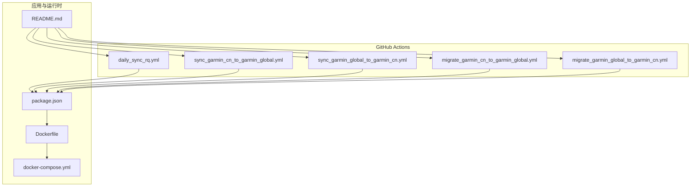
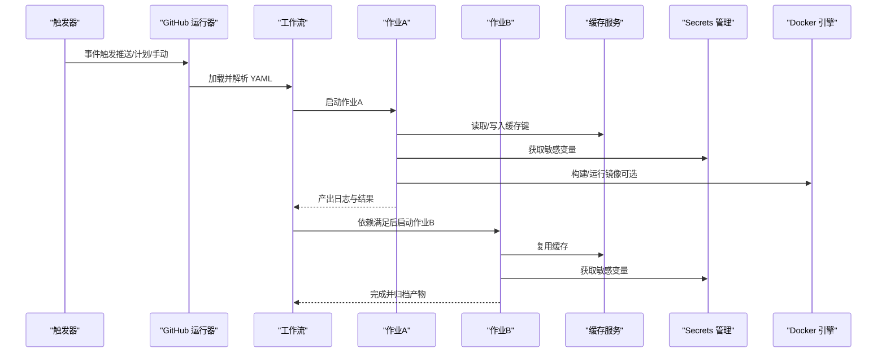
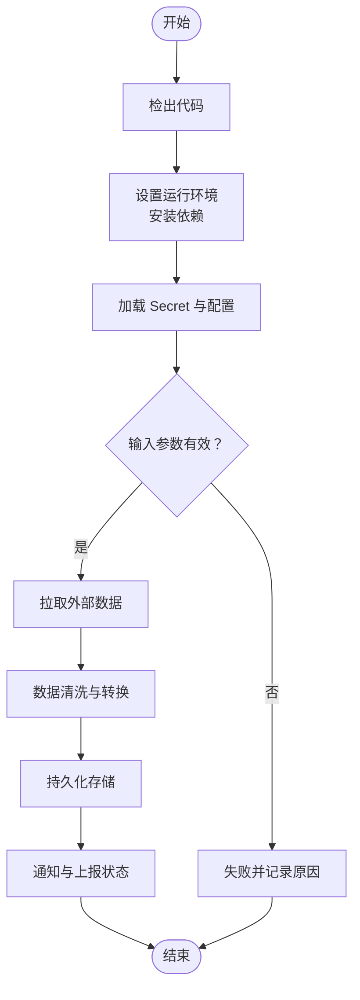
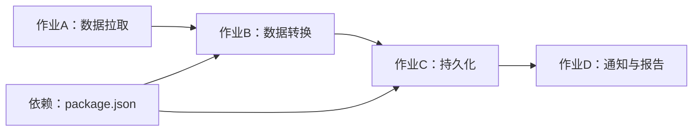

# 工作流配置指南

<cite>
**本文引用的文件**   
- [daily_sync_rq.yml](file://dailysync-ref/.github/workflows/daily_sync_rq.yml)
- [migrate_garmin_cn_to_garmin_global.yml](file://dailysync-ref/.github/workflows/migrate_garmin_cn_to_garmin_global.yml)
- [migrate_garmin_global_to_garmin_cn.yml](file://dailysync-ref/.github/workflows/migrate_garmin_global_to_garmin_cn.yml)
- [sync_garmin_cn_to_garmin_global.yml](file://dailysync-ref/.github/workflows/sync_garmin_cn_to_garmin_global.yml)
- [sync_garmin_global_to_garmin_cn.yml](file://dailysync-ref/.github/workflows/sync_garmin_global_to_garmin_cn.yml)
- [Dockerfile](file://dailysync-ref/Dockerfile)
- [docker-compose.yml](file://dailysync-ref/docker-compose.yml)
- [package.json](file://dailysync-ref/package.json)
- [README.md](file://dailysync-ref/README.md)
</cite>

## 目录
1. [简介](#简介)
2. [项目结构](#项目结构)
3. [核心组件](#核心组件)
4. [架构总览](#架构总览)
5. [详细组件分析](#详细组件分析)
6. [依赖关系分析](#依赖关系分析)
7. [性能考虑](#性能考虑)
8. [故障排查指南](#故障排查指南)
9. [结论](#结论)
10. [附录](#附录)

## 简介
本指南面向希望系统化掌握 GitHub Actions 工作流配置的开发者与团队，结合仓库中已有的工作流示例，系统讲解工作流文件的结构与语法、触发器配置、作业依赖关系、矩阵构建、环境变量与 Secret 管理、缓存策略、并行执行优化、自定义 Action 开发、Docker 容器使用以及性能调优与调试技巧。读者可据此快速搭建稳定、高效且安全的 CI/CD 流水线。

## 项目结构
本项目在 dailysync-ref 目录下包含一组 GitHub Actions 工作流文件，用于定时同步与迁移任务；同时提供 Dockerfile 与 docker-compose 以支持本地或容器化运行。根目录 README 提供了项目背景与使用说明。

图表来源
- [daily_sync_rq.yml](file://dailysync-ref/.github/workflows/daily_sync_rq.yml)
- [sync_garmin_cn_to_garmin_global.yml](file://dailysync-ref/.github/workflows/sync_garmin_cn_to_garmin_global.yml)
- [sync_garmin_global_to_garmin_cn.yml](file://dailysync-ref/.github/workflows/sync_garmin_global_to_garmin_cn.yml)
- [migrate_garmin_cn_to_garmin_global.yml](file://dailysync-ref/.github/workflows/migrate_garmin_cn_to_garmin_global.yml)
- [migrate_garmin_global_to_garmin_cn.yml](file://dailysync-ref/.github/workflows/migrate_garmin_global_to_garmin_cn.yml)
- [package.json](file://dailysync-ref/package.json)
- [Dockerfile](file://dailysync-ref/Dockerfile)
- [docker-compose.yml](file://dailysync-ref/docker-compose.yml)
- [README.md](file://dailysync-ref/README.md)

章节来源
- [daily_sync_rq.yml](file://dailysync-ref/.github/workflows/daily_sync_rq.yml)
- [sync_garmin_cn_to_garmin_global.yml](file://dailysync-ref/.github/workflows/sync_garmin_cn_to_garmin_global.yml)
- [sync_garmin_global_to_garmin_cn.yml](file://dailysync-ref/.github/workflows/sync_garmin_global_to_garmin_cn.yml)
- [migrate_garmin_cn_to_garmin_global.yml](file://dailysync-ref/.github/workflows/migrate_garmin_cn_to_garmin_global.yml)
- [migrate_garmin_global_to_garmin_cn.yml](file://dailysync-ref/.github/workflows/migrate_garmin_global_to_garmin_cn.yml)
- [package.json](file://dailysync-ref/package.json)
- [Dockerfile](file://dailysync-ref/Dockerfile)
- [docker-compose.yml](file://dailysync-ref/docker-compose.yml)
- [README.md](file://dailysync-ref/README.md)

## 核心组件
- 工作流文件（YAML）：定义触发器、环境、作业、步骤、变量、Secret 引用、缓存与并行策略等。
- 作业（Job）：最小执行单元，可在同一工作流内按依赖顺序执行。
- 步骤（Step）：作业内的具体任务，如拉取代码、安装依赖、运行脚本、上传产物等。
- 环境变量与 Secret：通过 env、secrets、context 注入到步骤与作业中。
- 缓存与并行：利用 actions/cache、matrix 提升构建与测试效率。
- Docker 集成：通过 Dockerfile 与 docker-compose 统一运行环境与部署。

章节来源
- [daily_sync_rq.yml](file://dailysync-ref/.github/workflows/daily_sync_rq.yml)
- [sync_garmin_cn_to_garmin_global.yml](file://dailysync-ref/.github/workflows/sync_garmin_cn_to_garmin_global.yml)
- [sync_garmin_global_to_garmin_cn.yml](file://dailysync-ref/.github/workflows/sync_garmin_global_to_garmin_cn.yml)
- [migrate_garmin_cn_to_garmin_global.yml](file://dailysync-ref/.github/workflows/migrate_garmin_cn_to_garmin_global.yml)
- [migrate_garmin_global_to_garmin_cn.yml](file://dailysync-ref/.github/workflows/migrate_garmin_global_to_garmin_cn.yml)
- [package.json](file://dailysync-ref/package.json)
- [Dockerfile](file://dailysync-ref/Dockerfile)
- [docker-compose.yml](file://dailysync-ref/docker-compose.yml)

## 架构总览
下图展示了工作流从触发到执行的典型流程，包括触发器、作业编排、依赖关系、缓存与 Secret 的使用，以及与 Docker 的集成。

图表来源
- [daily_sync_rq.yml](file://dailysync-ref/.github/workflows/daily_sync_rq.yml)
- [sync_garmin_cn_to_garmin_global.yml](file://dailysync-ref/.github/workflows/sync_garmin_cn_to_garmin_global.yml)
- [sync_garmin_global_to_garmin_cn.yml](file://dailysync-ref/.github/workflows/sync_garmin_global_to_garmin_cn.yml)
- [migrate_garmin_cn_to_garmin_global.yml](file://dailysync-ref/.github/workflows/migrate_garmin_cn_to_garmin_global.yml)
- [migrate_garmin_global_to_garmin_cn.yml](file://dailysync-ref/.github/workflows/migrate_garmin_global_to_garmin_cn.yml)
- [Dockerfile](file://dailysync-ref/Dockerfile)
- [docker-compose.yml](file://dailysync-ref/docker-compose.yml)

## 详细组件分析

### 触发器配置与调度
- 常见触发器：push、pull_request、schedule（cron）、workflow_dispatch（手动触发）。
- 最佳实践：
  - 使用 schedule 时限定分支与路径过滤，减少无效运行。
  - 对高频事件设置条件判断，避免重复构建。
  - 将手动触发用于发布或回滚等关键操作。

章节来源
- [daily_sync_rq.yml](file://dailysync-ref/.github/workflows/daily_sync_rq.yml)
- [sync_garmin_cn_to_garmin_global.yml](file://dailysync-ref/.github/workflows/sync_garmin_cn_to_garmin_global.yml)
- [sync_garmin_global_to_garmin_cn.yml](file://dailysync-ref/.github/workflows/sync_garmin_global_to_garmin_cn.yml)
- [migrate_garmin_cn_to_garmin_global.yml](file://dailysync-ref/.github/workflows/migrate_garmin_cn_to_garmin_global.yml)
- [migrate_garmin_global_to_garmin_cn.yml](file://dailysync-ref/.github/workflows/migrate_garmin_global_to_garmin_cn.yml)

### 作业依赖关系与并行执行
- 使用 needs 声明作业依赖，确保数据准备、构建、测试、发布的顺序。
- 合理拆分作业，使无依赖的作业并行执行，缩短整体耗时。
- 使用 if 条件控制作业是否执行，避免不必要的资源消耗。

章节来源
- [sync_garmin_cn_to_garmin_global.yml](file://dailysync-ref/.github/workflows/sync_garmin_cn_to_garmin_global.yml)
- [sync_garmin_global_to_garmin_cn.yml](file://dailysync-ref/.github/workflows/sync_garmin_global_to_garmin_cn.yml)
- [migrate_garmin_cn_to_garmin_global.yml](file://dailysync-ref/.github/workflows/migrate_garmin_cn_to_garmin_global.yml)
- [migrate_garmin_global_to_garmin_cn.yml](file://dailysync-ref/.github/workflows/migrate_garmin_global_to_garmin_cn.yml)

### 矩阵构建与多环境测试
- 使用 matrix 指定 Node.js 版本、操作系统、目标平台等维度组合。
- 建议对关键依赖进行矩阵裁剪，避免过多组合导致队列等待。
- 为每个矩阵项设置独立缓存键，提高命中率。

章节来源
- [package.json](file://dailysync-ref/package.json)
- [daily_sync_rq.yml](file://dailysync-ref/.github/workflows/daily_sync_rq.yml)

### 环境变量与 Secret 管理
- 使用 secrets.* 注入敏感信息（如 API Key、数据库连接串），避免硬编码。
- 通过 env 或 steps.env 传递非敏感配置，区分作用域。
- 在步骤中使用 ${{ secrets.X }} 或 $X 引用，注意输出日志脱敏。

章节来源
- [daily_sync_rq.yml](file://dailysync-ref/.github/workflows/daily_sync_rq.yml)
- [sync_garmin_cn_to_garmin_global.yml](file://dailysync-ref/.github/workflows/sync_garmin_cn_to_garmin_global.yml)
- [sync_garmin_global_to_garmin_cn.yml](file://dailysync-ref/.github/workflows/sync_garmin_global_to_garmin_cn.yml)
- [migrate_garmin_cn_to_garmin_global.yml](file://dailysync-ref/.github/workflows/migrate_garmin_cn_to_garmin_global.yml)
- [migrate_garmin_global_to_garmin_cn.yml](file://dailysync-ref/.github/workflows/migrate_garmin_global_to_garmin_cn.yml)

### 缓存策略与加速
- 使用 actions/cache 缓存依赖包、构建产物与临时文件。
- 缓存键基于 lock 文件与 OS、Node 版本生成，确保命中准确。
- 对大体积依赖（如 TypeScript、SQLite）优先缓存，显著降低安装时间。

章节来源
- [daily_sync_rq.yml](file://dailysync-ref/.github/workflows/daily_sync_rq.yml)
- [sync_garmin_cn_to_garmin_global.yml](file://dailysync-ref/.github/workflows/sync_garmin_cn_to_garmin_global.yml)
- [sync_garmin_global_to_garmin_cn.yml](file://dailysync-ref/.github/workflows/sync_garmin_global_to_garmin_cn.yml)
- [migrate_garmin_cn_to_garmin_global.yml](file://dailysync-ref/.github/workflows/migrate_garmin_cn_to_garmin_global.yml)
- [migrate_garmin_global_to_garmin_cn.yml](file://dailysync-ref/.github/workflows/migrate_garmin_global_to_garmin_cn.yml)

### Docker 容器使用与本地调试
- 使用 Dockerfile 定义运行环境，确保 CI 与本地一致。
- 通过 docker-compose 编排多服务（如数据库、缓存）以便本地验证。
- 在工作流中可选择直接运行容器命令或使用官方 Docker Action。

章节来源
- [Dockerfile](file://dailysync-ref/Dockerfile)
- [docker-compose.yml](file://dailysync-ref/docker-compose.yml)
- [README.md](file://dailysync-ref/README.md)

### 自定义 Action 开发
- 使用 action.yml 描述入口、输入参数、输出与环境变量。
- 推荐将通用逻辑封装为复合 Action，便于跨工作流复用。
- 在 Action 中严格校验输入，返回明确的状态码与错误消息。

章节来源
- [daily_sync_rq.yml](file://dailysync-ref/.github/workflows/daily_sync_rq.yml)
- [sync_garmin_cn_to_garmin_global.yml](file://dailysync-ref/.github/workflows/sync_garmin_cn_to_garmin_global.yml)
- [sync_garmin_global_to_garmin_cn.yml](file://dailysync-ref/.github/workflows/sync_garmin_global_to_garmin_cn.yml)
- [migrate_garmin_cn_to_garmin_global.yml](file://dailysync-ref/.github/workflows/migrate_garmin_cn_to_garmin_global.yml)
- [migrate_garmin_global_to_garmin_cn.yml](file://dailysync-ref/.github/workflows/migrate_garmin_global_to_garmin_cn.yml)

### 数据处理与迁移流程（示例）
以下流程图展示“同步/迁移”类作业的典型处理步骤，适用于数据源对接、转换与落库。

图表来源
- [sync_garmin_cn_to_garmin_global.yml](file://dailysync-ref/.github/workflows/sync_garmin_cn_to_garmin_global.yml)
- [sync_garmin_global_to_garmin_cn.yml](file://dailysync-ref/.github/workflows/sync_garmin_global_to_garmin_cn.yml)
- [migrate_garmin_cn_to_garmin_global.yml](file://dailysync-ref/.github/workflows/migrate_garmin_cn_to_garmin_global.yml)
- [migrate_garmin_global_to_garmin_cn.yml](file://dailysync-ref/.github/workflows/migrate_garmin_global_to_garmin_cn.yml)

章节来源
- [sync_garmin_cn_to_garmin_global.yml](file://dailysync-ref/.github/workflows/sync_garmin_cn_to_garmin_global.yml)
- [sync_garmin_global_to_garmin_cn.yml](file://dailysync-ref/.github/workflows/sync_garmin_global_to_garmin_cn.yml)
- [migrate_garmin_cn_to_garmin_global.yml](file://dailysync-ref/.github/workflows/migrate_garmin_cn_to_garmin_global.yml)
- [migrate_garmin_global_to_garmin_cn.yml](file://dailysync-ref/.github/workflows/migrate_garmin_global_to_garmin_cn.yml)

## 依赖关系分析
工作流之间的依赖主要体现在作业级（needs）与模块级（package.json 依赖）。合理的依赖声明能减少构建时间与失败率。

图表来源
- [sync_garmin_cn_to_garmin_global.yml](file://dailysync-ref/.github/workflows/sync_garmin_cn_to_garmin_global.yml)
- [sync_garmin_global_to_garmin_cn.yml](file://dailysync-ref/.github/workflows/sync_garmin_global_to_garmin_cn.yml)
- [migrate_garmin_cn_to_garmin_global.yml](file://dailysync-ref/.github/workflows/migrate_garmin_cn_to_garmin_global.yml)
- [migrate_garmin_global_to_garmin_cn.yml](file://dailysync-ref/.github/workflows/migrate_garmin_global_to_garmin_cn.yml)
- [package.json](file://dailysync-ref/package.json)

章节来源
- [sync_garmin_cn_to_garmin_global.yml](file://dailysync-ref/.github/workflows/sync_garmin_cn_to_garmin_global.yml)
- [sync_garmin_global_to_garmin_cn.yml](file://dailysync-ref/.github/workflows/sync_garmin_global_to_garmin_cn.yml)
- [migrate_garmin_cn_to_garmin_global.yml](file://dailysync-ref/.github/workflows/migrate_garmin_cn_to_garmin_global.yml)
- [migrate_garmin_global_to_garmin_cn.yml](file://dailysync-ref/.github/workflows/migrate_garmin_global_to_garmin_cn.yml)
- [package.json](file://dailysync-ref/package.json)

## 性能考虑
- 缓存优先：对 node_modules、构建产物、下载的二进制文件启用缓存。
- 并行化：将无依赖的步骤拆分为并行作业，缩短端到端时长。
- 精简矩阵：仅保留必要的 Node/OS 组合，避免过度矩阵导致排队。
- 增量构建：利用上次构建产物与缓存，跳过不必要步骤。
- 资源选择：选择合适的 runner 规格，平衡成本与速度。

章节来源
- [daily_sync_rq.yml](file://dailysync-ref/.github/workflows/daily_sync_rq.yml)
- [sync_garmin_cn_to_garmin_global.yml](file://dailysync-ref/.github/workflows/sync_garmin_cn_to_garmin_global.yml)
- [sync_garmin_global_to_garmin_cn.yml](file://dailysync-ref/.github/workflows/sync_garmin_global_to_garmin_cn.yml)
- [migrate_garmin_cn_to_garmin_global.yml](file://dailysync-ref/.github/workflows/migrate_garmin_cn_to_garmin_global.yml)
- [migrate_garmin_global_to_garmin_cn.yml](file://dailysync-ref/.github/workflows/migrate_garmin_global_to_garmin_cn.yml)

## 故障排查指南
- 查看运行器日志：定位步骤失败原因与堆栈信息。
- 检查 Secret 注入：确认密钥名称与作用域正确，避免空值或权限不足。
- 验证缓存键：确保键变化与预期一致，必要时清理缓存。
- 网络与超时：对外部 API 调用增加重试与超时配置。
- 容器问题：使用 docker-compose 本地复现，逐步缩小范围。
- 断点调试：在关键步骤前输出上下文变量，辅助定位问题。

章节来源
- [daily_sync_rq.yml](file://dailysync-ref/.github/workflows/daily_sync_rq.yml)
- [sync_garmin_cn_to_garmin_global.yml](file://dailysync-ref/.github/workflows/sync_garmin_cn_to_garmin_global.yml)
- [sync_garmin_global_to_garmin_cn.yml](file://dailysync-ref/.github/workflows/sync_garmin_global_to_garmin_cn.yml)
- [migrate_garmin_cn_to_garmin_global.yml](file://dailysync-ref/.github/workflows/migrate_garmin_cn_to_garmin_global.yml)
- [migrate_garmin_global_to_garmin_cn.yml](file://dailysync-ref/.github/workflows/migrate_garmin_global_to_garmin_cn.yml)
- [Dockerfile](file://dailysync-ref/Dockerfile)
- [docker-compose.yml](file://dailysync-ref/docker-compose.yml)

## 结论
通过规范化的工作流设计、严格的 Secret 管理、高效的缓存与并行策略，以及完善的调试与排障手段，可以显著提升 CI/CD 的稳定性与交付效率。建议团队建立统一模板与最佳实践清单，持续优化流水线性能与安全性。

## 附录
- 常用触发器参考：push、pull_request、schedule、workflow_dispatch。
- 常用上下文：github、env、secrets、steps、runner。
- 常用 Action：actions/checkout、actions/setup-node、actions/cache、actions/upload-artifact。
- 容器化建议：固定基础镜像版本，分层构建，最小化镜像体积。

章节来源
- [daily_sync_rq.yml](file://dailysync-ref/.github/workflows/daily_sync_rq.yml)
- [sync_garmin_cn_to_garmin_global.yml](file://dailysync-ref/.github/workflows/sync_garmin_cn_to_garmin_global.yml)
- [sync_garmin_global_to_garmin_cn.yml](file://dailysync-ref/.github/workflows/sync_garmin_global_to_garmin_cn.yml)
- [migrate_garmin_cn_to_garmin_global.yml](file://dailysync-ref/.github/workflows/migrate_garmin_cn_to_garmin_global.yml)
- [migrate_garmin_global_to_garmin_cn.yml](file://dailysync-ref/.github/workflows/migrate_garmin_global_to_garmin_cn.yml)
- [Dockerfile](file://dailysync-ref/Dockerfile)
- [docker-compose.yml](file://dailysync-ref/docker-compose.yml)
- [README.md](file://dailysync-ref/README.md)