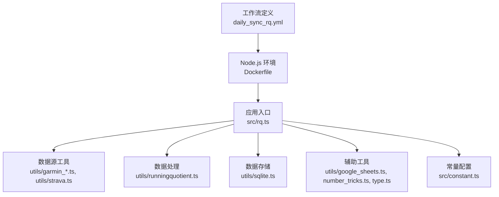
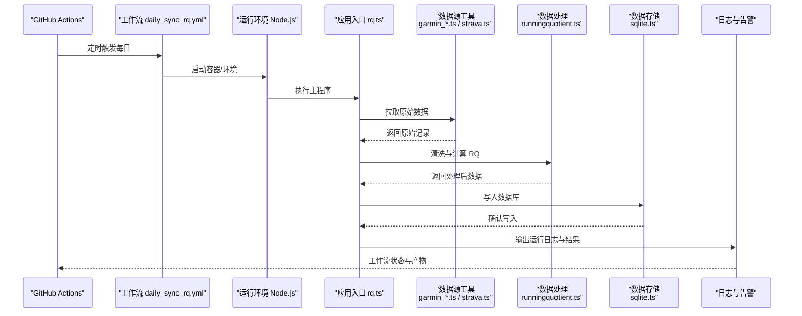
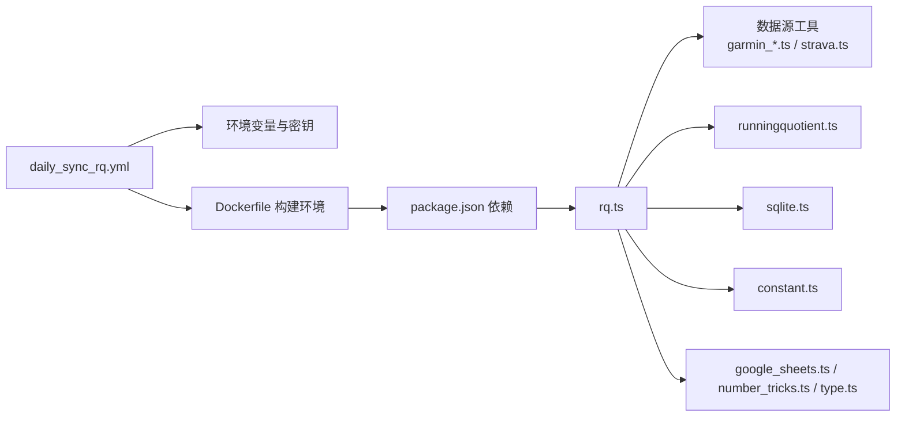

# 每日同步工作流

<cite>
**本文引用的文件**   
- [daily_sync_rq.yml](file://dailysync-ref/.github/workflows/daily_sync_rq.yml)
- [rq.ts](file://dailysync-ref/src/rq.ts)
- [runningquotient.ts](file://dailysync-ref/src/utils/runningquotient.ts)
- [sqlite.ts](file://dailysync-ref/src/utils/sqlite.ts)
- [garmin_common.ts](file://dailysync-ref/src/utils/garmin_common.ts)
- [garmin_cn.ts](file://dailysync-ref/src/utils/garmin_cn.ts)
- [garmin_global.ts](file://dailysync-ref/src/utils/garmin_global.ts)
- [google_sheets.ts](file://dailysync-ref/src/utils/google_sheets.ts)
- [strava.ts](file://dailysync-ref/src/utils/strava.ts)
- [number_tricks.ts](file://dailysync-ref/src/utils/number_tricks.ts)
- [type.ts](file://dailysync-ref/src/utils/type.ts)
- [constant.ts](file://dailysync-ref/src/constant.ts)
- [docker-compose.yml](file://dailysync-ref/docker-compose.yml)
- [Dockerfile](file://dailysync-ref/Dockerfile)
- [package.json](file://dailysync-ref/package.json)
</cite>

## 目录
1. [简介](#简介)
2. [项目结构](#项目结构)
3. [核心组件](#核心组件)
4. [架构总览](#架构总览)
5. [详细组件分析](#详细组件分析)
6. [依赖关系分析](#依赖关系分析)
7. [性能考虑](#性能考虑)
8. [故障排查指南](#故障排查指南)
9. [结论](#结论)
10. [附录](#附录)

## 简介
本文件为“每日同步工作流”的详细配置与使用说明，聚焦于 GitHub Actions 中的 daily_sync_rq.yml 工作流。该工作流负责每日自动获取 Running Quotient（RQ）相关数据，完成清洗、计算、入库与校验，并输出可观测的日志与结果。文档涵盖触发条件、执行环境、任务步骤、环境变量、错误处理与日志记录机制，并提供故障排查与性能优化建议，帮助读者快速部署与维护该流程。

## 项目结构
dailysync-ref 目录包含工作流定义、TypeScript 源码、工具库与容器化配置：
- .github/workflows：GitHub Actions 工作流定义，其中 daily_sync_rq.yml 为每日 RQ 同步主流程。
- src：核心逻辑与工具实现，包括 rq.ts（RQ 同步入口）、utils 下的各类数据源与存储工具。
- docker-compose.yml 与 Dockerfile：本地或 CI 环境的容器化运行方式。
- package.json：依赖与脚本定义。

图表来源 
- [daily_sync_rq.yml](file://dailysync-ref/.github/workflows/daily_sync_rq.yml)
- [Dockerfile](file://dailysync-ref/Dockerfile)
- [rq.ts](file://dailysync-ref/src/rq.ts)
- [runningquotient.ts](file://dailysync-ref/src/utils/runningquotient.ts)
- [sqlite.ts](file://dailysync-ref/src/utils/sqlite.ts)
- [garmin_common.ts](file://dailysync-ref/src/utils/garmin_common.ts)
- [garmin_cn.ts](file://dailysync-ref/src/utils/garmin_cn.ts)
- [garmin_global.ts](file://dailysync-ref/src/utils/garmin_global.ts)
- [google_sheets.ts](file://dailysync-ref/src/utils/google_sheets.ts)
- [strava.ts](file://dailysync-ref/src/utils/strava.ts)
- [number_tricks.ts](file://dailysync-ref/src/utils/number_tricks.ts)
- [type.ts](file://dailysync-ref/src/utils/type.ts)
- [constant.ts](file://dailysync-ref/src/constant.ts)

章节来源
- [daily_sync_rq.yml](file://dailysync-ref/.github/workflows/daily_sync_rq.yml)
- [Dockerfile](file://dailysync-ref/Dockerfile)
- [docker-compose.yml](file://dailysync-ref/docker-compose.yml)
- [package.json](file://dailysync-ref/package.json)

## 核心组件
- 工作流触发器与作业编排：由 daily_sync_rq.yml 定义定时触发、运行环境与任务步骤。
- 应用入口：rq.ts 作为 RQ 同步的主程序，协调数据获取、处理、存储与验证。
- 数据源工具：garmin_* 系列与 strava.ts 提供不同平台的数据拉取能力。
- 数据处理：runningquotient.ts 实现 RQ 指标的计算与转换。
- 数据存储：sqlite.ts 负责将处理后的数据持久化到 SQLite。
- 辅助工具：google_sheets.ts、number_tricks.ts、type.ts 提供扩展能力与类型保障。
- 常量配置：constant.ts 集中管理关键常量与默认值。

章节来源
- [rq.ts](file://dailysync-ref/src/rq.ts)
- [runningquotient.ts](file://dailysync-ref/src/utils/runningquotient.ts)
- [sqlite.ts](file://dailysync-ref/src/utils/sqlite.ts)
- [garmin_common.ts](file://dailysync-ref/src/utils/garmin_common.ts)
- [garmin_cn.ts](file://dailysync-ref/src/utils/garmin_cn.ts)
- [garmin_global.ts](file://dailysync-ref/src/utils/garmin_global.ts)
- [google_sheets.ts](file://dailysync-ref/src/utils/google_sheets.ts)
- [strava.ts](file://dailysync-ref/src/utils/strava.ts)
- [number_tricks.ts](file://dailysync-ref/src/utils/number_tricks.ts)
- [type.ts](file://dailysync-ref/src/utils/type.ts)
- [constant.ts](file://dailysync-ref/src/constant.ts)

## 架构总览
下图展示了从工作流触发到数据落库与校验的整体调用链，以及各模块之间的依赖关系。

图表来源 
- [daily_sync_rq.yml](file://dailysync-ref/.github/workflows/daily_sync_rq.yml)
- [rq.ts](file://dailysync-ref/src/rq.ts)
- [garmin_common.ts](file://dailysync-ref/src/utils/garmin_common.ts)
- [garmin_cn.ts](file://dailysync-ref/src/utils/garmin_cn.ts)
- [garmin_global.ts](file://dailysync-ref/src/utils/garmin_global.ts)
- [strava.ts](file://dailysync-ref/src/utils/strava.ts)
- [runningquotient.ts](file://dailysync-ref/src/utils/runningquotient.ts)
- [sqlite.ts](file://dailysync-ref/src/utils/sqlite.ts)

## 详细组件分析

### 工作流 daily_sync_rq.yml
- 触发条件：按日定时触发，确保每天在固定时间执行 RQ 同步任务。
- 执行环境：基于 Node.js 的容器镜像，安装依赖后运行主程序。
- 任务步骤：
  - 设置环境变量（如数据源凭据、数据库路径等）。
  - 初始化运行环境（安装依赖、准备数据库文件）。
  - 执行主程序（调用 rq.ts 进行数据同步）。
  - 收集日志与结果，标记工作流成功或失败。

章节来源
- [daily_sync_rq.yml](file://dailysync-ref/.github/workflows/daily_sync_rq.yml)

### 应用入口 rq.ts
- 职责：协调数据源拉取、数据处理、存储与验证；统一异常捕获与日志输出。
- 关键流程：
  - 读取环境变量与常量配置。
  - 调用数据源工具获取原始记录。
  - 调用数据处理模块计算 RQ 指标。
  - 将结果写入 SQLite，并进行一致性校验。
  - 输出统计信息与错误摘要。

章节来源
- [rq.ts](file://dailysync-ref/src/rq.ts)

### 数据处理 runningquotient.ts
- 职责：对原始运动数据进行清洗、归一化与 RQ 指标计算。
- 关键点：
  - 数据字段映射与单位换算。
  - 异常值过滤与缺失值处理。
  - 计算窗口与聚合策略。
  - 输出结构化结果供存储使用。

章节来源
- [runningquotient.ts](file://dailysync-ref/src/utils/runningquotient.ts)

### 数据存储 sqlite.ts
- 职责：SQLite 连接管理、表结构初始化、批量插入与查询校验。
- 关键点：
  - 连接池与事务控制。
  - 幂等写入与冲突处理。
  - 数据完整性检查与回滚。

章节来源
- [sqlite.ts](file://dailysync-ref/src/utils/sqlite.ts)

### 数据源工具 garmin_* 与 strava.ts
- garmin_common.ts：通用 Garmin 接口封装、鉴权与重试策略。
- garmin_cn.ts：Garmin 中国区域适配（域名、参数差异）。
- garmin_global.ts：Garmin 全球区域适配。
- strava.ts：Strava 数据拉取与解析。
- 共同特性：
  - 速率限制与退避重试。
  - 错误码分类与用户友好提示。
  - 分页与增量拉取支持。

章节来源
- [garmin_common.ts](file://dailysync-ref/src/utils/garmin_common.ts)
- [garmin_cn.ts](file://dailysync-ref/src/utils/garmin_cn.ts)
- [garmin_global.ts](file://dailysync-ref/src/utils/garmin_global.ts)
- [strava.ts](file://dailysync-ref/src/utils/strava.ts)

### 辅助工具 google_sheets.ts、number_tricks.ts、type.ts
- google_sheets.ts：可选地将结果导出至 Google Sheets，便于可视化与共享。
- number_tricks.ts：数值格式化、精度控制与单位换算工具。
- type.ts：公共类型定义，保证数据结构一致性与编译期校验。

章节来源
- [google_sheets.ts](file://dailysync-ref/src/utils/google_sheets.ts)
- [number_tricks.ts](file://dailysync-ref/src/utils/number_tricks.ts)
- [type.ts](file://dailysync-ref/src/utils/type.ts)

### 常量配置 constant.ts
- 职责：集中管理默认阈值、窗口大小、API 超时、重试次数等关键常量。
- 建议：通过环境变量覆盖默认值，以适配不同运行环境。

章节来源
- [constant.ts](file://dailysync-ref/src/constant.ts)

## 依赖关系分析
- 运行时依赖：Node.js 版本、SQLite 驱动、第三方 API SDK（Garmin、Strava）。
- 内部依赖：rq.ts 依赖 utils 下各模块；constants 被多处引用。
- 外部依赖：GitHub Actions 环境、SQLite 文件存储、可能的 Google Sheets 服务。

图表来源 
- [daily_sync_rq.yml](file://dailysync-ref/.github/workflows/daily_sync_rq.yml)
- [Dockerfile](file://dailysync-ref/Dockerfile)
- [package.json](file://dailysync-ref/package.json)
- [rq.ts](file://dailysync-ref/src/rq.ts)
- [constant.ts](file://dailysync-ref/src/constant.ts)

章节来源
- [package.json](file://dailysync-ref/package.json)
- [Dockerfile](file://dailysync-ref/Dockerfile)
- [docker-compose.yml](file://dailysync-ref/docker-compose.yml)

## 性能考虑
- 并发与限流：对数据源 API 实施合理的并发与速率限制，避免触发配额限制。
- 增量拉取：优先使用增量更新减少数据传输与处理量。
- 批处理写入：SQLite 写入采用事务与批量插入，降低 I/O 开销。
- 内存与缓存：对中间结果进行必要缓存，避免重复计算。
- 资源隔离：在容器中运行，限制 CPU 与内存上限，防止影响其他任务。

[本节为通用指导，不直接分析具体文件]

## 故障排查指南
- 常见错误与定位：
  - 数据源鉴权失败：检查环境变量中的凭据是否正确，网络可达性与代理设置。
  - API 限流或超时：查看重试策略与退避间隔，必要时降低并发或延长超时。
  - 数据格式异常：核对字段映射与单位换算，确认上游数据变更。
  - 数据库写入失败：检查 SQLite 文件权限、磁盘空间与事务回滚情况。
- 日志与诊断：
  - 工作流日志：在 GitHub Actions 中查看步骤输出与错误堆栈。
  - 应用日志：关注 rq.ts 与 utils 模块的日志输出，定位问题阶段。
  - 数据校验：对比输入与输出记录数量与关键字段，确认一致性。
- 恢复措施：
  - 清理临时状态与锁文件，重新执行工作流。
  - 回滚到最近一次成功快照，逐步排查变更点。

章节来源
- [daily_sync_rq.yml](file://dailysync-ref/.github/workflows/daily_sync_rq.yml)
- [rq.ts](file://dailysync-ref/src/rq.ts)
- [sqlite.ts](file://dailysync-ref/src/utils/sqlite.ts)
- [garmin_common.ts](file://dailysync-ref/src/utils/garmin_common.ts)
- [strava.ts](file://dailysync-ref/src/utils/strava.ts)

## 结论
daily_sync_rq.yml 工作流通过标准化的触发、环境与任务编排，结合 rq.ts 与各工具模块，实现了 Running Quotient 数据的自动化同步与计算。通过合理的环境变量配置、健壮的错误处理与完善的日志记录，能够在生产环境中稳定运行。配合性能优化与故障排查指南，可进一步提升系统的可靠性与可维护性。

[本节为总结性内容，不直接分析具体文件]

## 附录
- 环境变量清单（示例）：
  - 数据源凭据：Garmin/Strava 的访问令牌与密钥。
  - 数据库路径：SQLite 文件路径与备份策略。
  - 日志级别：调试、信息、警告、错误等级别开关。
  - 功能开关：是否启用 Google Sheets 导出、是否开启增量拉取等。
- 运行方式：
  - 本地开发：使用 docker-compose 启动容器，挂载配置文件与数据卷。
  - CI/CD：在 GitHub Actions 中配置 Secrets 与定时触发规则。

[本节为补充说明，不直接分析具体文件]