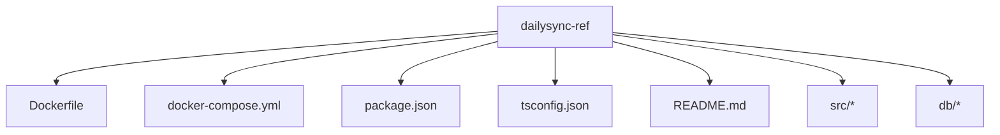
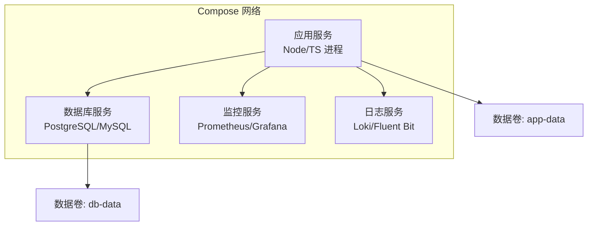
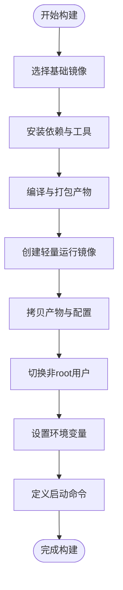
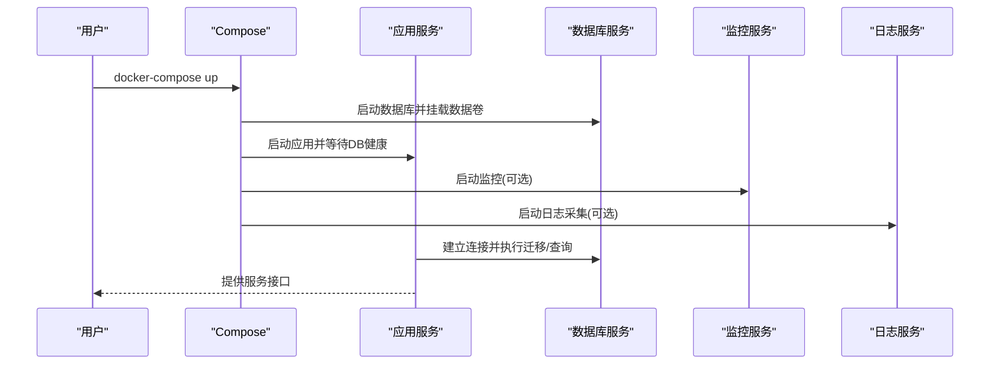
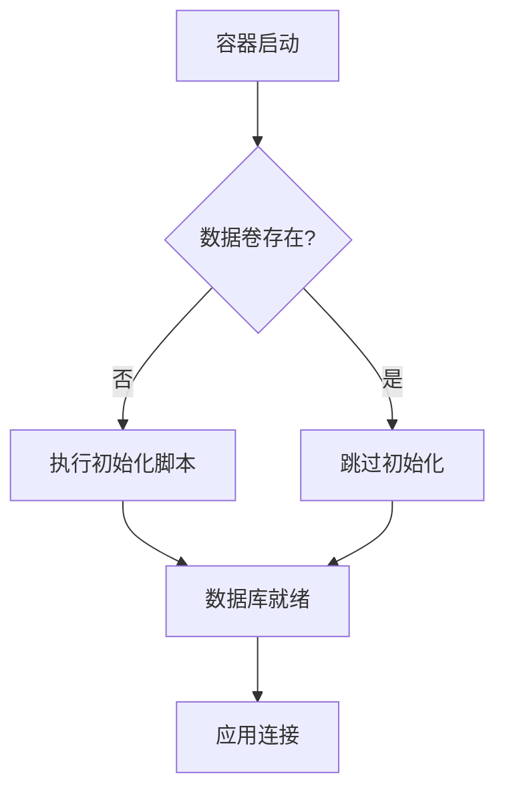
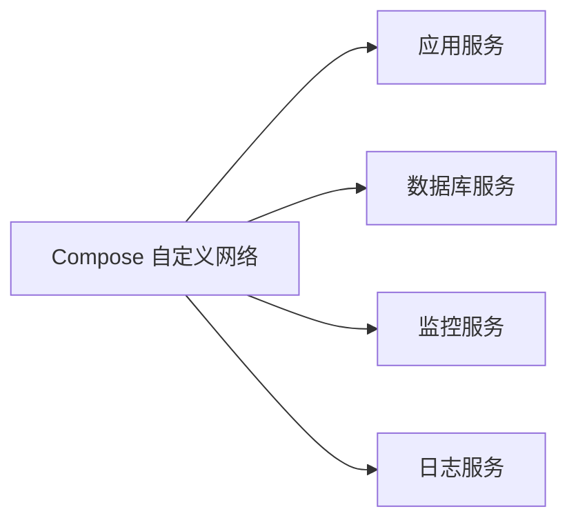
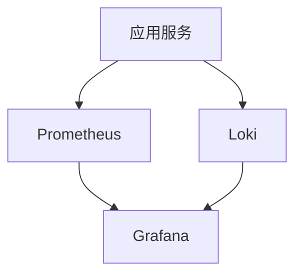
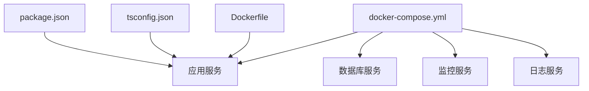

# Docker容器化部署

<cite>
**本文档引用的文件**   
- [Dockerfile](file://dailysync-ref/Dockerfile)
- [docker-compose.yml](file://dailysync-ref/docker-compose.yml)
- [package.json](file://dailysync-ref/package.json)
- [tsconfig.json](file://dailysync-ref/tsconfig.json)
- [README.md](file://dailysync-ref/README.md)
</cite>

## 目录
1. [简介](#简介)
2. [项目结构](#项目结构)
3. [核心组件](#核心组件)
4. [架构总览](#架构总览)
5. [详细组件分析](#详细组件分析)
6. [依赖关系分析](#依赖关系分析)
7. [性能考虑](#性能考虑)
8. [故障排查指南](#故障排查指南)
9. [结论](#结论)
10. [附录](#附录)

## 简介
本文件面向希望将 dailysync-ref 服务进行容器化部署的工程师与运维人员，提供基于 Docker 与 docker-compose 的完整部署说明。内容涵盖：
- Dockerfile 构建选项与多阶段构建优化
- docker-compose.yml 服务编排、网络与数据持久化
- 数据库容器配置与环境变量管理
- 镜像体积优化与安全加固建议
- 监控与日志收集方案（Prometheus + Grafana + Loki）
- 常见问题定位与排错流程

## 项目结构
dailysync-ref 是一个基于 TypeScript 的同步服务，包含构建脚本、源码与配置文件。容器化相关的关键文件位于 dailysync-ref 目录下：
- Dockerfile：定义镜像构建步骤与运行环境
- docker-compose.yml：编排应用、数据库、可选的监控与日志组件
- package.json：Node.js 依赖与脚本入口
- tsconfig.json：TypeScript 编译配置
- README.md：项目说明与使用说明

图表来源
- [Dockerfile](file://dailysync-ref/Dockerfile)
- [docker-compose.yml](file://dailysync-ref/docker-compose.yml)
- [package.json](file://dailysync-ref/package.json)
- [tsconfig.json](file://dailysync-ref/tsconfig.json)
- [README.md](file://dailysync-ref/README.md)

章节来源
- [Dockerfile](file://dailysync-ref/Dockerfile)
- [docker-compose.yml](file://dailysync-ref/docker-compose.yml)
- [package.json](file://dailysync-ref/package.json)
- [tsconfig.json](file://dailysync-ref/tsconfig.json)
- [README.md](file://dailysync-ref/README.md)

## 核心组件
- 应用镜像构建（Dockerfile）
  - 基础镜像选择与 Node.js 版本锁定
  - 多阶段构建：构建阶段安装依赖并编译 TS；运行阶段仅拷贝产物
  - 非 root 用户运行与最小权限原则
  - 环境变量注入与运行时参数
- 服务编排（docker-compose.yml）
  - 应用服务、数据库服务、缓存/队列（可选）、监控与日志组件
  - 网络隔离与端口映射
  - 数据卷挂载与备份策略
  - 健康检查与重启策略
- 数据库配置
  - PostgreSQL/MySQL 等容器的初始化脚本与数据持久化
  - 连接参数通过环境变量传入
- 环境变量管理
  - .env 文件与 compose 覆盖
  - 敏感信息使用 secrets 或外部密钥管理

章节来源
- [Dockerfile](file://dailysync-ref/Dockerfile)
- [docker-compose.yml](file://dailysync-ref/docker-compose.yml)
- [package.json](file://dailysync-ref/package.json)
- [tsconfig.json](file://dailysync-ref/tsconfig.json)

## 架构总览
下图展示了容器化后的典型部署拓扑：应用服务通过内部网络访问数据库与可选的监控/日志组件，数据通过卷持久化到宿主机。

图表来源
- [docker-compose.yml](file://dailysync-ref/docker-compose.yml)

## 详细组件分析

### Dockerfile 分析与最佳实践
- 多阶段构建
  - 构建阶段：安装依赖、执行类型检查与编译，生成可运行产物
  - 运行阶段：仅包含运行时必要文件，显著减小镜像体积
- 安全加固
  - 使用非 root 用户运行进程
  - 固定基础镜像版本，避免漂移
- 环境变量与启动命令
  - 通过 ENV 设置默认值，运行时通过 -e 或 compose 覆盖
  - CMD/ENTRYPOINT 明确主进程，便于信号处理与优雅退出

图表来源
- [Dockerfile](file://dailysync-ref/Dockerfile)

章节来源
- [Dockerfile](file://dailysync-ref/Dockerfile)

### docker-compose.yml 服务编排与依赖管理
- 服务定义
  - 应用服务：指定镜像/上下文、端口映射、环境变量、依赖服务与健康检查
  - 数据库服务：镜像、端口、环境变量、数据卷挂载、初始化脚本
  - 可选监控/日志服务：暴露指标与日志采集
- 网络与存储
  - 自定义网络隔离服务间通信
  - 命名卷持久化数据库与应用数据
- 生命周期管理
  - depends_on 控制启动顺序
  - healthcheck 确保服务就绪
  - restart 策略保障可用性

图表来源
- [docker-compose.yml](file://dailysync-ref/docker-compose.yml)

章节来源
- [docker-compose.yml](file://dailysync-ref/docker-compose.yml)

### 数据库容器配置
- 镜像选择与版本锁定
- 环境变量：用户名、密码、数据库名、时区、字符集等
- 数据持久化：挂载命名卷或绑定路径
- 初始化脚本：在首次启动时执行建库/建表/导入数据
- 健康检查：基于 SQL 或客户端探测

图表来源
- [docker-compose.yml](file://dailysync-ref/docker-compose.yml)

章节来源
- [docker-compose.yml](file://dailysync-ref/docker-compose.yml)

### 网络设置
- 自定义桥接网络隔离应用与数据库
- 服务间通过服务名解析，无需硬编码 IP
- 对外暴露端口需严格限制，优先使用反向代理

图表来源
- [docker-compose.yml](file://dailysync-ref/docker-compose.yml)

章节来源
- [docker-compose.yml](file://dailysync-ref/docker-compose.yml)

### 数据持久化
- 数据库数据卷：命名卷或宿主路径，定期快照与备份
- 应用数据卷：上传文件、缓存、临时文件分离
- 备份策略：cron 任务或外部备份工具，保留策略与恢复演练

章节来源
- [docker-compose.yml](file://dailysync-ref/docker-compose.yml)

### 环境变量管理与安全
- 使用 .env 集中管理键值对，按环境拆分（开发/测试/生产）
- 敏感信息通过 Docker secrets 或外部密钥管理服务注入
- 运行时覆盖：命令行 -e、compose override、环境变量优先级

章节来源
- [docker-compose.yml](file://dailysync-ref/docker-compose.yml)
- [package.json](file://dailysync-ref/package.json)

### 镜像优化与多阶段构建
- 分层缓存：先复制依赖清单再安装依赖，提升缓存命中率
- 清理缓存与临时文件，减少镜像层大小
- 使用 .dockerignore 排除无关文件
- 扫描漏洞与许可证合规

章节来源
- [Dockerfile](file://dailysync-ref/Dockerfile)

### 监控与日志收集方案
- 指标采集：应用暴露 Prometheus 指标端点，Grafana 可视化
- 日志采集：应用输出结构化 JSON 日志，由 Fluent Bit/Filebeat 采集至 Loki/Elasticsearch
- 告警规则：基于关键指标与错误率配置告警

图表来源
- [docker-compose.yml](file://dailysync-ref/docker-compose.yml)

章节来源
- [docker-compose.yml](file://dailysync-ref/docker-compose.yml)

## 依赖关系分析
- 应用依赖 Node.js 运行时与 TypeScript 编译产物
- 数据库依赖持久化卷与初始化脚本
- 监控/日志为可选依赖，不影响核心功能

图表来源
- [package.json](file://dailysync-ref/package.json)
- [tsconfig.json](file://dailysync-ref/tsconfig.json)
- [Dockerfile](file://dailysync-ref/Dockerfile)
- [docker-compose.yml](file://dailysync-ref/docker-compose.yml)

章节来源
- [package.json](file://dailysync-ref/package.json)
- [tsconfig.json](file://dailysync-ref/tsconfig.json)
- [Dockerfile](file://dailysync-ref/Dockerfile)
- [docker-compose.yml](file://dailysync-ref/docker-compose.yml)

## 性能考虑
- 镜像体积与启动时间
  - 多阶段构建与精简基础镜像
  - 合理分层与缓存策略
- 资源限制
  - CPU/内存限制与请求限流
  - 数据库连接池与超时配置
- I/O 与存储
  - 数据库索引与查询优化
  - 读写分离与缓存层（Redis）
- 可观测性
  - 指标采样与日志级别调优
  - 慢查询与错误率监控

[本节为通用指导，不直接分析具体文件]

## 故障排查指南
- 构建失败
  - 检查 Node.js 版本与依赖兼容性
  - 查看构建日志定位编译错误
- 启动失败
  - 确认环境变量与密钥正确注入
  - 检查端口冲突与服务健康状态
- 数据库连接问题
  - 验证网络连通性与凭据
  - 查看初始化脚本是否执行成功
- 性能问题
  - 分析指标与慢查询日志
  - 调整连接池与资源限制

章节来源
- [Dockerfile](file://dailysync-ref/Dockerfile)
- [docker-compose.yml](file://dailysync-ref/docker-compose.yml)
- [package.json](file://dailysync-ref/package.json)

## 结论
通过多阶段构建与合理的 compose 编排，可将 dailysync-ref 服务稳定地部署到任意支持 Docker 的环境。结合监控与日志体系，可实现全链路可观测与快速排障。建议在生产环境中严格执行镜像安全扫描、最小权限与密钥管理策略，并制定完善的备份与回滚计划。

[本节为总结性内容，不直接分析具体文件]

## 附录
- 常用命令
  - 构建镜像：docker build -t dailysync-ref .
  - 启动服务：docker-compose up -d
  - 查看日志：docker-compose logs -f
  - 进入容器：docker-compose exec app sh
- 参考文档
  - [README.md](file://dailysync-ref/README.md)

章节来源
- [README.md](file://dailysync-ref/README.md)