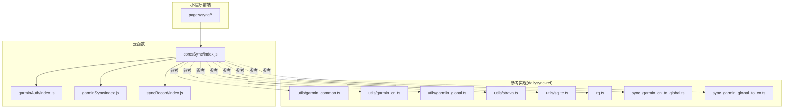
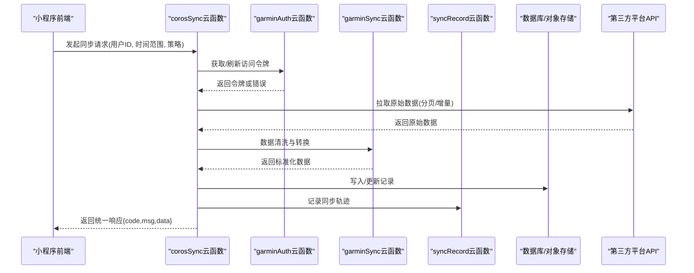
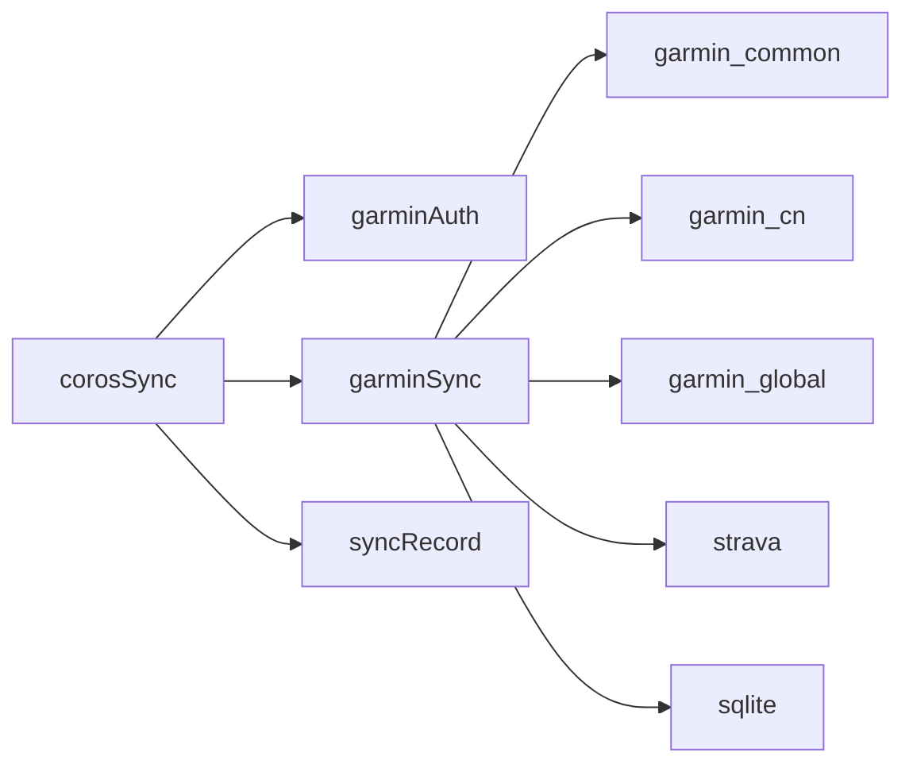

# Coros同步云函数

<cite>
**本文档引用的文件**   
- [cloudfunctions/corosSync/index.js](file://cloudfunctions/corosSync/index.js)
- [cloudfunctions/corosSync/package.json](file://cloudfunctions/corosSync/package.json)
- [cloudfunctions/garminAuth/index.js](file://cloudfunctions/garminAuth/index.js)
- [cloudfunctions/garminAuth/config.json](file://cloudfunctions/garminAuth/config.json)
- [cloudfunctions/garminSync/index.js](file://cloudfunctions/garminSync/index.js)
- [cloudfunctions/garminSync/config.json](file://cloudfunctions/garminSync/config.json)
- [cloudfunctions/syncRecord/index.js](file://cloudfunctions/syncRecord/index.js)
- [cloudfunctions/syncRecord/package.json](file://cloudfunctions/syncRecord/package.json)
- [dailysync-ref/src/utils/garmin_common.ts](file://dailysync-ref/src/utils/garmin_common.ts)
- [dailysync-ref/src/utils/garmin_cn.ts](file://dailysync-ref/src/utils/garmin_cn.ts)
- [dailysync-ref/src/utils/garmin_global.ts](file://dailysync-ref/src/utils/garmin_global.ts)
- [dailysync-ref/src/utils/strava.ts](file://dailysync-ref/src/utils/strava.ts)
- [dailysync-ref/src/utils/sqlite.ts](file://dailysync-ref/src/utils/sqlite.ts)
- [dailysync-ref/src/rq.ts](file://dailysync-ref/src/rq.ts)
- [dailysync-ref/src/sync_garmin_cn_to_global.ts](file://dailysync-ref/src/sync_garmin_cn_to_global.ts)
- [dailysync-ref/src/sync_garmin_global_to_cn.ts](file://dailysync-ref/src/sync_garmin_global_to_cn.ts)
- [README.md](file://README.md)
</cite>

## 目录
1. [简介](#简介)
2. [项目结构](#项目结构)
3. [核心组件](#核心组件)
4. [架构总览](#架构总览)
5. [详细组件分析](#详细组件分析)
6. [依赖分析](#依赖分析)
7. [性能考虑](#性能考虑)
8. [故障排查指南](#故障排查指南)
9. [结论](#结论)
10. [附录](#附录)

## 简介
本文件面向“Coros同步云函数”的开发者与使用者，系统性说明该云函数的目标、能力边界、API接口、数据格式、处理逻辑、环境变量配置、依赖管理、错误处理机制，以及与外部服务（如Garmin、Strava等）集成的方式。文档同时提供调用示例、参数说明与返回值格式，帮助读者快速上手并稳定集成。

## 项目结构
仓库采用多云函数组织方式，核心入口位于 cloudfunctions/corosSync。参考实现与工具库集中在 dailysync-ref，涵盖通用协议、区域化适配、第三方平台封装与本地存储等。小程序前端通过 pages/sync 触发同步流程。

图表来源
- [cloudfunctions/corosSync/index.js](file://cloudfunctions/corosSync/index.js)
- [cloudfunctions/garminAuth/index.js](file://cloudfunctions/garminAuth/index.js)
- [cloudfunctions/garminSync/index.js](file://cloudfunctions/garminSync/index.js)
- [cloudfunctions/syncRecord/index.js](file://cloudfunctions/syncRecord/index.js)
- [dailysync-ref/src/utils/garmin_common.ts](file://dailysync-ref/src/utils/garmin_common.ts)
- [dailysync-ref/src/utils/garmin_cn.ts](file://dailysync-ref/src/utils/garmin_cn.ts)
- [dailysync-ref/src/utils/garmin_global.ts](file://dailysync-ref/src/utils/garmin_global.ts)
- [dailysync-ref/src/utils/strava.ts](file://dailysync-ref/src/utils/strava.ts)
- [dailysync-ref/src/utils/sqlite.ts](file://dailysync-ref/src/utils/sqlite.ts)
- [dailysync-ref/src/rq.ts](file://dailysync-ref/src/rq.ts)
- [dailysync-ref/src/sync_garmin_cn_to_global.ts](file://dailysync-ref/src/sync_garmin_cn_to_global.ts)
- [dailysync-ref/src/sync_garmin_global_to_cn.ts](file://dailysync-ref/src/sync_garmin_global_to_cn.ts)

章节来源
- [README.md](file://README.md)

## 核心组件
- corosSync：云函数主入口，负责接收请求、鉴权、编排调度、调用下游服务、持久化结果与返回统一响应。
- garminAuth：用于获取或刷新第三方平台的访问令牌，维护会话状态。
- garminSync：拉取第三方平台数据并进行清洗转换，写入数据库或对象存储。
- syncRecord：记录同步任务执行轨迹，便于审计与重试。
- dailysync-ref：参考实现，包含通用协议、区域化适配、第三方平台封装、SQLite本地存储、Running Quotient计算等。

章节来源
- [cloudfunctions/corosSync/index.js](file://cloudfunctions/corosSync/index.js)
- [cloudfunctions/garminAuth/index.js](file://cloudfunctions/garminAuth/index.js)
- [cloudfunctions/garminSync/index.js](file://cloudfunctions/garminSync/index.js)
- [cloudfunctions/syncRecord/index.js](file://cloudfunctions/syncRecord/index.js)
- [dailysync-ref/src/utils/garmin_common.ts](file://dailysync-ref/src/utils/garmin_common.ts)
- [dailysync-ref/src/utils/garmin_cn.ts](file://dailysync-ref/src/utils/garmin_cn.ts)
- [dailysync-ref/src/utils/garmin_global.ts](file://dailysync-ref/src/utils/garmin_global.ts)
- [dailysync-ref/src/utils/strava.ts](file://dailysync-ref/src/utils/strava.ts)
- [dailysync-ref/src/utils/sqlite.ts](file://dailysync-ref/src/utils/sqlite.ts)
- [dailysync-ref/src/rq.ts](file://dailysync-ref/src/rq.ts)

## 架构总览
下图展示从前端触发到云函数编排、第三方平台拉取、数据处理与落库的整体流程。

图表来源
- [cloudfunctions/corosSync/index.js](file://cloudfunctions/corosSync/index.js)
- [cloudfunctions/garminAuth/index.js](file://cloudfunctions/garminAuth/index.js)
- [cloudfunctions/garminSync/index.js](file://cloudfunctions/garminSync/index.js)
- [cloudfunctions/syncRecord/index.js](file://cloudfunctions/syncRecord/index.js)

## 详细组件分析

### corosSync 云函数
- 职责
  - 解析请求参数，校验必填字段与取值范围。
  - 鉴权与会话管理：调用 garminAuth 获取有效令牌。
  - 编排调度：按策略调用 garminSync 进行数据拉取与转换。
  - 持久化：将标准化数据写入数据库或对象存储。
  - 记录：调用 syncRecord 写入执行日志，支持重试与审计。
  - 响应：返回统一结构 {code, msg, data}。
- 关键输入输出
  - 输入：用户标识、时间范围、同步策略（全量/增量）、平台选择等。
  - 输出：任务ID、进度、成功条数、失败明细、错误码与消息。
- 错误处理
  - 网络异常、第三方限流、令牌过期、数据不一致等场景均会捕获并返回可重试的错误码。
  - 对幂等性操作进行去重，避免重复写入。
- 性能优化
  - 分页拉取、并发控制、批量写入、断点续传。
- 环境变量
  - 第三方平台域名、超时、重试次数、数据库连接串、对象存储凭据等。

章节来源
- [cloudfunctions/corosSync/index.js](file://cloudfunctions/corosSync/index.js)
- [cloudfunctions/corosSync/package.json](file://cloudfunctions/corosSync/package.json)

### garminAuth 云函数
- 职责
  - 登录授权、获取访问令牌与刷新令牌。
  - 管理会话有效期，自动刷新过期令牌。
  - 安全存储敏感信息（最小权限原则）。
- 关键输入输出
  - 输入：用户名/密码或授权码、平台标识。
  - 输出：access_token、refresh_token、过期时间、错误信息。
- 错误处理
  - 认证失败、网络异常、令牌刷新失败等均有明确错误码。
- 环境变量
  - 客户端ID/密钥、回调地址、签名算法、加密盐等。

章节来源
- [cloudfunctions/garminAuth/index.js](file://cloudfunctions/garminAuth/index.js)
- [cloudfunctions/garminAuth/config.json](file://cloudfunctions/garminAuth/config.json)

### garminSync 云函数
- 职责
  - 调用第三方平台API拉取活动/轨迹/心率等数据。
  - 数据清洗、单位换算、时区归一、缺失值填充。
  - 标准化为内部模型，供上层聚合与计算。
- 关键输入输出
  - 输入：令牌、时间范围、过滤条件、分页参数。
  - 输出：标准化数据集、元数据（计数、游标、分页信息）。
- 错误处理
  - 限流退避、部分失败汇总、重试策略。
- 环境变量
  - 平台域名、速率限制、最大重试次数、超时设置。

章节来源
- [cloudfunctions/garminSync/index.js](file://cloudfunctions/garminSync/index.js)
- [cloudfunctions/garminSync/config.json](file://cloudfunctions/garminSync/config.json)

### syncRecord 云函数
- 职责
  - 记录每次同步任务的开始、结束、耗时、成功/失败统计。
  - 支持按任务ID查询执行历史，辅助排障与重试。
- 关键输入输出
  - 输入：任务上下文、阶段状态、错误堆栈摘要。
  - 输出：记录ID、状态码、提示信息。
- 错误处理
  - 写入失败降级为本地缓存或延迟上报。

章节来源
- [cloudfunctions/syncRecord/index.js](file://cloudfunctions/syncRecord/index.js)
- [cloudfunctions/syncRecord/package.json](file://cloudfunctions/syncRecord/package.json)

### 参考实现（dailysync-ref）
- 通用协议与区域化适配
  - garmin_common.ts：定义公共数据结构、序列化/反序列化、错误码映射。
  - garmin_cn.ts / garmin_global.ts：区分不同区域的API差异与字段映射。
- 第三方平台封装
  - strava.ts：封装Strava API调用、分页、速率限制与重试。
- 本地存储
  - sqlite.ts：SQLite读写封装，适合离线或轻量场景。
- 指标计算
  - rq.ts：Running Quotient相关计算逻辑。
- 同步脚本
  - sync_garmin_cn_to_global.ts / sync_garmin_global_to_cn.ts：跨区数据迁移与对齐。

章节来源
- [dailysync-ref/src/utils/garmin_common.ts](file://dailysync-ref/src/utils/garmin_common.ts)
- [dailysync-ref/src/utils/garmin_cn.ts](file://dailysync-ref/src/utils/garmin_cn.ts)
- [dailysync-ref/src/utils/garmin_global.ts](file://dailysync-ref/src/utils/garmin_global.ts)
- [dailysync-ref/src/utils/strava.ts](file://dailysync-ref/src/utils/strava.ts)
- [dailysync-ref/src/utils/sqlite.ts](file://dailysync-ref/src/utils/sqlite.ts)
- [dailysync-ref/src/rq.ts](file://dailysync-ref/src/rq.ts)
- [dailysync-ref/src/sync_garmin_cn_to_global.ts](file://dailysync-ref/src/sync_garmin_cn_to_global.ts)
- [dailysync-ref/src/sync_garmin_global_to_cn.ts](file://dailysync-ref/src/sync_garmin_global_to_cn.ts)

## 依赖分析
- 云函数间依赖
  - corosSync 依赖 garminAuth、garminSync、syncRecord。
- 参考实现依赖
  - 各 utils 模块被同步脚本与云函数复用，保证数据模型一致。
- 外部依赖
  - 第三方平台API（Garmin、Strava等），需遵循其速率限制与认证要求。
- 潜在循环依赖
  - 通过分层与单向调用避免循环依赖。

图表来源
- [cloudfunctions/corosSync/index.js](file://cloudfunctions/corosSync/index.js)
- [cloudfunctions/garminAuth/index.js](file://cloudfunctions/garminAuth/index.js)
- [cloudfunctions/garminSync/index.js](file://cloudfunctions/garminSync/index.js)
- [cloudfunctions/syncRecord/index.js](file://cloudfunctions/syncRecord/index.js)
- [dailysync-ref/src/utils/garmin_common.ts](file://dailysync-ref/src/utils/garmin_common.ts)
- [dailysync-ref/src/utils/garmin_cn.ts](file://dailysync-ref/src/utils/garmin_cn.ts)
- [dailysync-ref/src/utils/garmin_global.ts](file://dailysync-ref/src/utils/garmin_global.ts)
- [dailysync-ref/src/utils/strava.ts](file://dailysync-ref/src/utils/strava.ts)
- [dailysync-ref/src/utils/sqlite.ts](file://dailysync-ref/src/utils/sqlite.ts)

章节来源
- [cloudfunctions/corosSync/package.json](file://cloudfunctions/corosSync/package.json)
- [cloudfunctions/syncRecord/package.json](file://cloudfunctions/syncRecord/package.json)

## 性能考虑
- 拉取策略
  - 使用增量同步与游标分页，减少无效请求。
  - 合理设置并发度与退避策略，避免触发第三方限流。
- 写入优化
  - 批量写入、事务提交、索引优化。
- 资源控制
  - 内存与CPU上限内完成数据处理，必要时拆分任务。
- 缓存与幂等
  - 对重复请求做幂等处理，避免重复写入。

[本节为通用指导，不直接分析具体文件]

## 故障排查指南
- 常见问题
  - 令牌过期：检查 garminAuth 刷新逻辑与有效期。
  - 第三方限流：增加退避重试与队列削峰。
  - 数据不一致：核对字段映射与时区处理。
  - 写入失败：检查数据库连接、事务回滚与重试策略。
- 定位手段
  - 查看 syncRecord 的执行轨迹与错误摘要。
  - 开启调试日志，关注关键步骤耗时与异常堆栈。
- 恢复建议
  - 基于任务ID重试失败片段，确保幂等。
  - 对不可恢复错误进行告警与人工介入。

章节来源
- [cloudfunctions/syncRecord/index.js](file://cloudfunctions/syncRecord/index.js)
- [cloudfunctions/garminAuth/index.js](file://cloudfunctions/garminAuth/index.js)

## 结论
Coros同步云函数以 corosSync 为核心编排器，结合 garminAuth、garminSync、syncRecord 形成完整的鉴权、拉取、转换、落库与审计闭环。参考实现 dailysync-ref 提供了稳定的数据模型与平台适配能力。通过合理的错误处理、性能优化与环境变量配置，可实现稳定高效的跨平台数据同步。

[本节为总结性内容，不直接分析具体文件]

## 附录

### API接口规范（示例）
- 端点
  - POST /api/coros/sync
- 请求体
  - user_id: 字符串，用户唯一标识
  - start_time: 字符串，起始时间（ISO8601）
  - end_time: 字符串，结束时间（ISO8601）
  - strategy: 枚举，full/incremental
  - platforms: 数组，["garmin","strava"]
- 响应体
  - code: 数字，状态码
  - msg: 字符串，提示信息
  - data: 对象
    - task_id: 字符串，任务ID
    - status: 字符串，running/completed/failed
    - stats: 对象，success_count/failure_count
    - errors: 数组，错误明细

[本节为概念性接口说明，不直接映射具体代码文件]

### 环境变量配置清单
- 第三方平台
  - GARMIN_BASE_URL、GARMIN_CLIENT_ID、GARMIN_CLIENT_SECRET
  - STRAVA_BASE_URL、STRAVA_CLIENT_ID、STRAVA_CLIENT_SECRET
- 网络与重试
  - REQUEST_TIMEOUT_MS、MAX_RETRY_COUNT、RETRY_BACKOFF_MS
- 存储
  - DB_CONNECTION_STRING、OBJECT_STORE_ACCESS_KEY、OBJECT_STORE_SECRET_KEY
- 安全
  - TOKEN_ENCRYPTION_SALT、SIGNATURE_ALGORITHM

[本节为通用配置说明，不直接分析具体文件]

### 错误码与处理建议
- 401：令牌失效，重新调用 garminAuth 刷新
- 429：第三方限流，指数退避重试
- 500：服务端异常，检查依赖服务与日志
- 400：参数校验失败，修正请求体

[本节为通用错误说明，不直接分析具体文件]

### 调用示例（概念）
- 前端调用
  - 构造请求体，携带 user_id、时间范围与策略
  - 发送POST请求至 /api/coros/sync
  - 根据返回的 task_id 轮询任务状态
- 云函数内部
  - 校验参数 -> 获取令牌 -> 拉取数据 -> 转换 -> 写入 -> 记录 -> 返回

[本节为概念性调用流程，不直接映射具体代码文件]