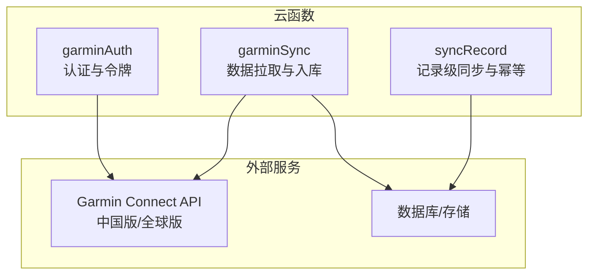
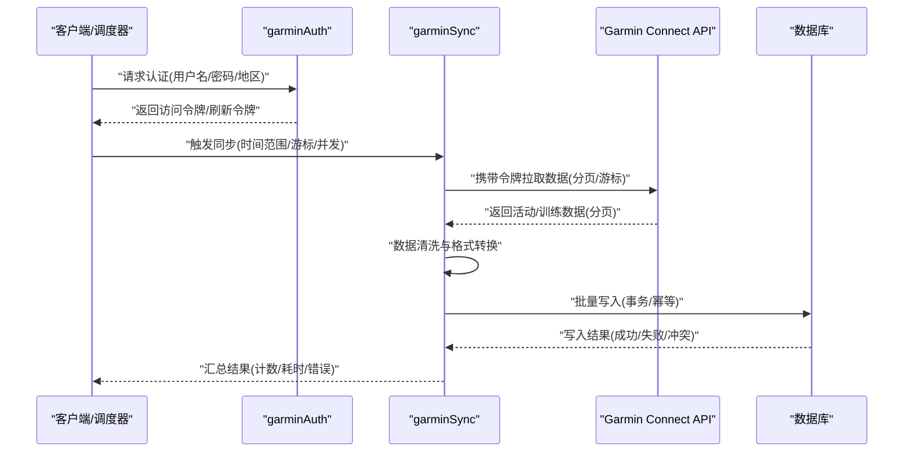
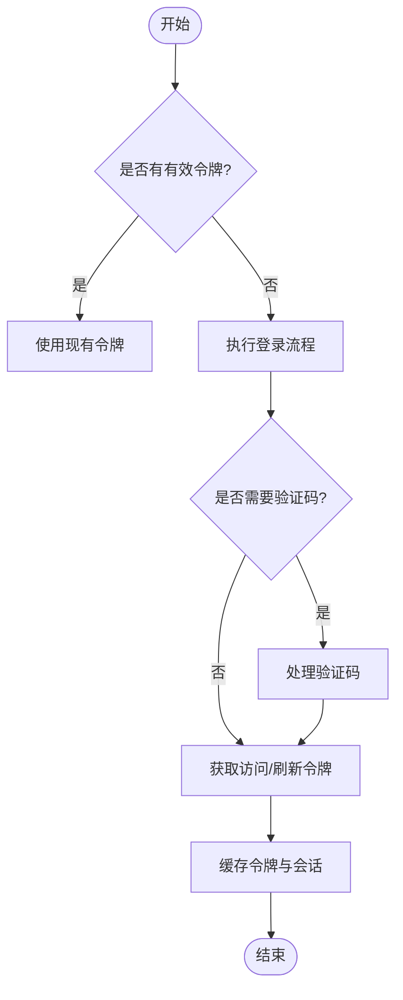
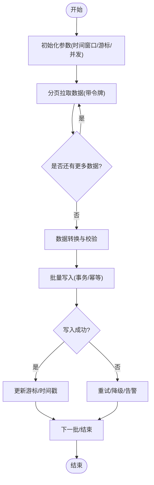
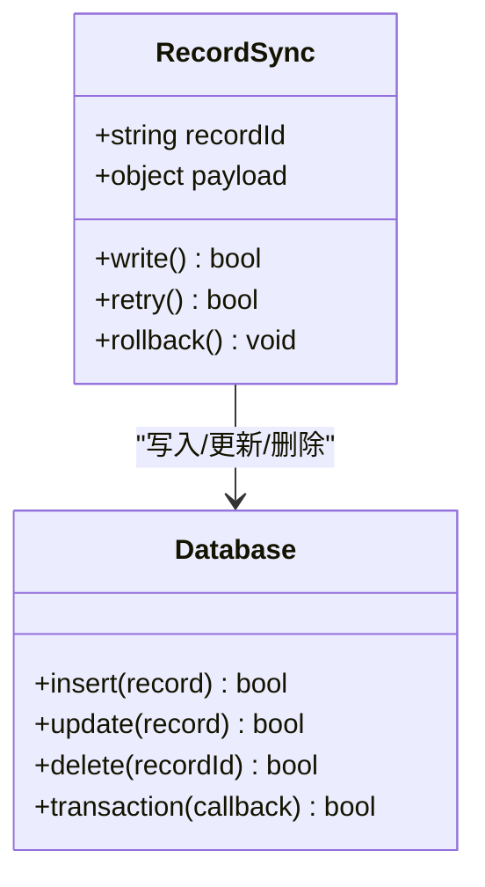
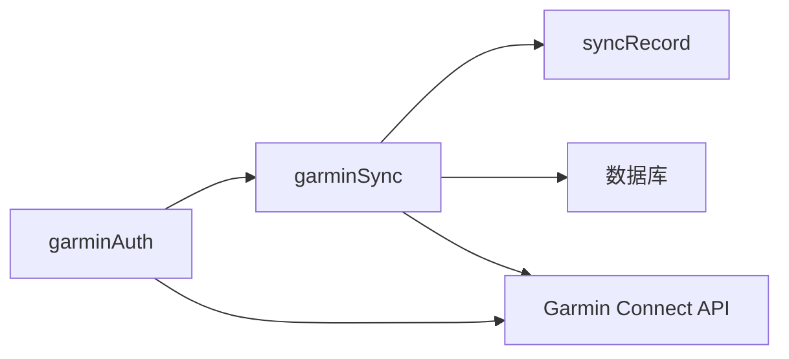

# Garmin数据同步云函数

<cite>
**本文引用的文件**   
- [cloudfunctions/garminAuth/index.js](file://cloudfunctions/garminAuth/index.js)
- [cloudfunctions/garminAuth/config.json](file://cloudfunctions/garminAuth/config.json)
- [cloudfunctions/garminSync/index.js](file://cloudfunctions/garminSync/index.js)
- [cloudfunctions/garminSync/config.json](file://cloudfunctions/garminSync/config.json)
- [cloudfunctions/syncRecord/index.js](file://cloudfunctions/syncRecord/index.js)
- [dailysync-ref/src/utils/garmin_common.ts](file://dailysync-ref/src/utils/garmin_common.ts)
- [dailysync-ref/src/utils/garmin_cn.ts](file://dailysync-ref/src/utils/garmin_cn.ts)
- [dailysync-ref/src/utils/garmin_global.ts](file://dailysync-ref/src/utils/garmin_global.ts)
- [dailysync-ref/src/constant.ts](file://dailysync-ref/src/constant.ts)
- [dailysync-ref/src/sync_garmin_cn_to_global.ts](file://dailysync-ref/src/sync_garmin_cn_to_global.ts)
- [dailysync-ref/src/sync_garmin_global_to_cn.ts](file://dailysync-ref/src/sync_garmin_global_to_cn.ts)
</cite>

## 目录
1. [简介](#简介)
2. [项目结构](#项目结构)
3. [核心组件](#核心组件)
4. [架构总览](#架构总览)
5. [详细组件分析](#详细组件分析)
6. [依赖关系分析](#依赖关系分析)
7. [性能考量](#性能考量)
8. [故障排查指南](#故障排查指南)
9. [结论](#结论)
10. [附录](#附录)

## 简介
本文件面向Garmin数据同步云函数的实现与使用，重点说明：
- 数据同步的核心逻辑与增量同步策略
- 数据处理流程、格式转换与批量处理
- 配置参数、API调用限制与错误重试机制
- 与Garmin Connect API的交互模式与状态管理
- 性能优化建议与常见问题排查

该文档同时结合dailysync-ref中的参考实现，帮助理解跨域（中国版/全球版）数据同步与迁移的整体思路。

## 项目结构
本项目包含多个云函数与参考实现：
- garminAuth：负责Garmin账号认证与令牌管理
- garminSync：负责从Garmin Connect拉取数据并入库
- syncRecord：负责记录级同步与幂等写入
- dailysync-ref：参考实现，提供中国版与全球版之间的数据同步与迁移工具链

图表来源
- [cloudfunctions/garminAuth/index.js](file://cloudfunctions/garminAuth/index.js)
- [cloudfunctions/garminSync/index.js](file://cloudfunctions/garminSync/index.js)
- [cloudfunctions/syncRecord/index.js](file://cloudfunctions/syncRecord/index.js)

章节来源
- [cloudfunctions/garminAuth/index.js](file://cloudfunctions/garminAuth/index.js)
- [cloudfunctions/garminSync/index.js](file://cloudfunctions/garminSync/index.js)
- [cloudfunctions/syncRecord/index.js](file://cloudfunctions/syncRecord/index.js)

## 核心组件
- 认证模块（garminAuth）
  - 职责：登录、获取访问令牌、刷新令牌、维护会话状态
  - 关键输入：用户名、密码、地区标识（CN/GLOBAL）
  - 关键输出：访问令牌、刷新令牌、会话ID
  - 错误处理：网络异常、验证码、账户锁定、令牌过期
- 同步模块（garminSync）
  - 职责：按时间窗口或游标增量拉取活动/训练数据，转换为统一模型，批量写入数据库
  - 关键输入：用户ID、时间范围、分页游标、并发度
  - 关键输出：成功条数、失败条数、耗时、错误日志
  - 错误处理：限流、超时、数据校验失败、幂等冲突
- 记录级同步（syncRecord）
  - 职责：以记录为单位进行幂等写入，支持去重、回滚、补偿
  - 关键输入：记录ID、原始数据、目标表结构
  - 关键输出：写入结果、冲突处理结果

章节来源
- [cloudfunctions/garminAuth/index.js](file://cloudfunctions/garminAuth/index.js)
- [cloudfunctions/garminSync/index.js](file://cloudfunctions/garminSync/index.js)
- [cloudfunctions/syncRecord/index.js](file://cloudfunctions/syncRecord/index.js)

## 架构总览
整体数据流遵循“认证→增量拉取→转换→批量入库→状态更新”的流水线。

图表来源
- [cloudfunctions/garminAuth/index.js](file://cloudfunctions/garminAuth/index.js)
- [cloudfunctions/garminSync/index.js](file://cloudfunctions/garminSync/index.js)
- [cloudfunctions/syncRecord/index.js](file://cloudfunctions/syncRecord/index.js)

## 详细组件分析

### 认证模块（garminAuth）
- 功能要点
  - 登录流程：根据地区选择对应登录端点，提交凭据，处理验证码与二次验证
  - 令牌管理：缓存访问令牌与刷新令牌，自动刷新过期令牌
  - 会话保持：维持Cookie/Session上下文，避免频繁登录
- 配置参数
  - 地区标识：CN/GLOBAL
  - 超时设置：连接超时、读取超时
  - 重试策略：指数退避、最大重试次数
- 错误处理
  - 网络异常：重试+退避
  - 认证失败：提示重新绑定或检查凭据
  - 令牌过期：自动刷新或引导重新登录

图表来源
- [cloudfunctions/garminAuth/index.js](file://cloudfunctions/garminAuth/index.js)
- [cloudfunctions/garminAuth/config.json](file://cloudfunctions/garminAuth/config.json)

章节来源
- [cloudfunctions/garminAuth/index.js](file://cloudfunctions/garminAuth/index.js)
- [cloudfunctions/garminAuth/config.json](file://cloudfunctions/garminAuth/config.json)

### 同步模块（garminSync）
- 功能要点
  - 增量同步：基于时间戳或游标的分页拉取，避免重复拉取
  - 数据转换：将Garmin原始数据转换为统一模型，字段映射与类型转换
  - 批量写入：分批提交，控制批次大小与并发度，提升吞吐
  - 幂等写入：基于记录ID去重，防止重复入库
- 配置参数
  - 时间窗口：起始时间、结束时间、步长
  - 分页参数：页大小、游标键
  - 并发与批大小：并发拉取数、批写入大小
  - 重试策略：指数退避、最大重试次数、退避间隔
- 错误处理
  - 限流：等待并重试，记录限流事件
  - 数据校验失败：跳过并记录错误详情
  - 写入冲突：幂等处理或回滚批次

图表来源
- [cloudfunctions/garminSync/index.js](file://cloudfunctions/garminSync/index.js)
- [cloudfunctions/garminSync/config.json](file://cloudfunctions/garminSync/config.json)

章节来源
- [cloudfunctions/garminSync/index.js](file://cloudfunctions/garminSync/index.js)
- [cloudfunctions/garminSync/config.json](file://cloudfunctions/garminSync/config.json)

### 记录级同步（syncRecord）
- 功能要点
  - 幂等写入：基于唯一键（如activity_id）去重
  - 事务保障：批量写入在事务中执行，失败回滚
  - 补偿机制：对失败记录进行重试或人工干预
- 配置参数
  - 唯一键定义：主键/业务键
  - 事务大小：每批事务的记录数
  - 重试策略：最大重试次数、退避间隔
- 错误处理
  - 约束冲突：忽略或更新
  - 数据不一致：记录差异并告警
  - 系统异常：重试与降级

图表来源
- [cloudfunctions/syncRecord/index.js](file://cloudfunctions/syncRecord/index.js)

章节来源
- [cloudfunctions/syncRecord/index.js](file://cloudfunctions/syncRecord/index.js)

### 参考实现（dailysync-ref）
- 通用工具
  - garmin_common.ts：公共方法、常量、通用转换逻辑
  - garmin_cn.ts / garmin_global.ts：地区特定适配（端点、字段映射、鉴权差异）
  - sqlite.ts：本地SQLite操作（用于测试/迁移）
  - number_tricks.ts：数值处理工具
- 同步脚本
  - sync_garmin_cn_to_global.ts：中国版到全球版的同步
  - sync_garmin_global_to_cn.ts：全球版到中国版的同步
  - migrate_garmin_cn_to_global.ts / migrate_garmin_global_to_cn.ts：数据迁移
- 常量与类型
  - constant.ts：全局常量、字段映射、枚举
  - type.ts：类型定义

章节来源
- [dailysync-ref/src/utils/garmin_common.ts](file://dailysync-ref/src/utils/garmin_common.ts)
- [dailysync-ref/src/utils/garmin_cn.ts](file://dailysync-ref/src/utils/garmin_cn.ts)
- [dailysync-ref/src/utils/garmin_global.ts](file://dailysync-ref/src/utils/garmin_global.ts)
- [dailysync-ref/src/constant.ts](file://dailysync-ref/src/constant.ts)
- [dailysync-ref/src/sync_garmin_cn_to_global.ts](file://dailysync-ref/src/sync_garmin_cn_to_global.ts)
- [dailysync-ref/src/sync_garmin_global_to_cn.ts](file://dailysync-ref/src/sync_garmin_global_to_cn.ts)

## 依赖关系分析
- 内部依赖
  - garminSync依赖garminAuth获取令牌
  - syncRecord被garminSync调用进行幂等写入
- 外部依赖
  - Garmin Connect API（中国版/全球版）
  - 数据库/存储服务
- 潜在循环依赖
  - 通过模块化拆分避免循环引用
- 接口契约
  - 认证接口：返回令牌与会话
  - 同步接口：返回统计与错误信息
  - 写入接口：返回成功/失败与冲突处理结果

图表来源
- [cloudfunctions/garminAuth/index.js](file://cloudfunctions/garminAuth/index.js)
- [cloudfunctions/garminSync/index.js](file://cloudfunctions/garminSync/index.js)
- [cloudfunctions/syncRecord/index.js](file://cloudfunctions/syncRecord/index.js)

章节来源
- [cloudfunctions/garminAuth/index.js](file://cloudfunctions/garminAuth/index.js)
- [cloudfunctions/garminSync/index.js](file://cloudfunctions/garminSync/index.js)
- [cloudfunctions/syncRecord/index.js](file://cloudfunctions/syncRecord/index.js)

## 性能考量
- 增量同步
  - 使用时间戳或游标减少不必要的数据拉取
  - 合理设置时间窗口与步长，平衡实时性与负载
- 批量处理
  - 调整批大小与并发度，避免过大导致内存压力或过小导致延迟
  - 使用事务保证一致性，降低锁竞争
- 缓存与复用
  - 缓存令牌与会话，减少认证开销
  - 缓存热点数据（如用户配置、字段映射）
- 限流与退避
  - 识别限流响应，实施指数退避与随机抖动
  - 监控API配额，动态调整并发
- 资源隔离
  - 为不同租户或任务分配独立资源，避免相互影响
- 监控与可观测性
  - 记录关键指标：拉取量、写入量、失败率、耗时
  - 告警阈值：错误率、延迟、配额使用

[本节为通用指导，不直接分析具体文件]

## 故障排查指南
- 认证失败
  - 检查凭据与地区标识
  - 查看验证码与二次验证流程
  - 确认令牌是否过期并刷新
- 数据拉取失败
  - 检查网络连通性与超时设置
  - 查看限流与配额使用情况
  - 确认分页游标与时间窗口是否正确
- 数据转换错误
  - 核对字段映射与类型转换规则
  - 检查数据完整性与必填项
- 写入失败
  - 查看约束冲突与幂等键
  - 检查事务回滚与补偿机制
  - 确认数据库连接与权限
- 性能问题
  - 调整批大小与并发度
  - 优化查询与索引
  - 启用缓存与预热

章节来源
- [cloudfunctions/garminAuth/index.js](file://cloudfunctions/garminAuth/index.js)
- [cloudfunctions/garminSync/index.js](file://cloudfunctions/garminSync/index.js)
- [cloudfunctions/syncRecord/index.js](file://cloudfunctions/syncRecord/index.js)

## 结论
本方案通过认证、增量拉取、转换、批量写入与幂等控制的完整流水线，实现了稳定高效的Garmin数据同步。结合参考实现，可灵活适配中国版与全球版的差异，并通过合理的配置与监控，确保系统在大规模场景下的可靠性与性能。

[本节为总结，不直接分析具体文件]

## 附录
- 配置参数清单
  - 认证：用户名、密码、地区标识、超时、重试策略
  - 同步：时间窗口、分页参数、并发度、批大小、重试策略
  - 写入：唯一键、事务大小、重试策略
- API调用限制
  - 速率限制：每分钟请求数、并发上限
  - 配额管理：每日拉取上限、存储空间限制
- 错误码与处理
  - 认证错误：401/403，重新登录或刷新令牌
  - 限流错误：429，指数退避与降级
  - 数据错误：4xx/5xx，记录错误详情并告警
- 最佳实践
  - 使用增量同步与游标
  - 批量写入与事务保障
  - 幂等写入与冲突处理
  - 监控与告警

[本节为补充信息，不直接分析具体文件]