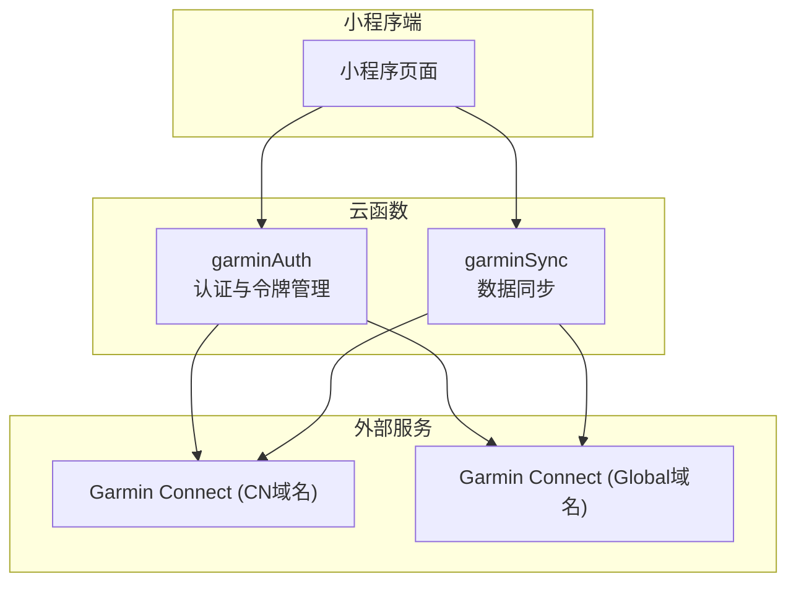
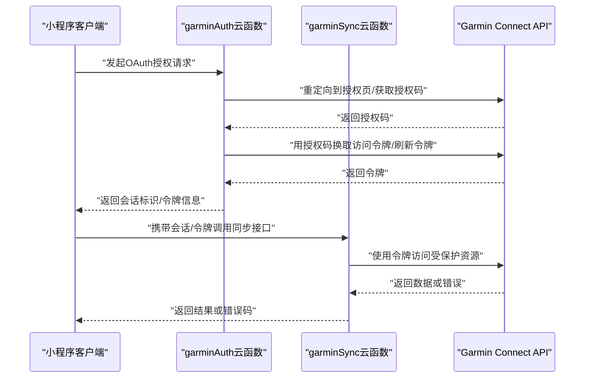
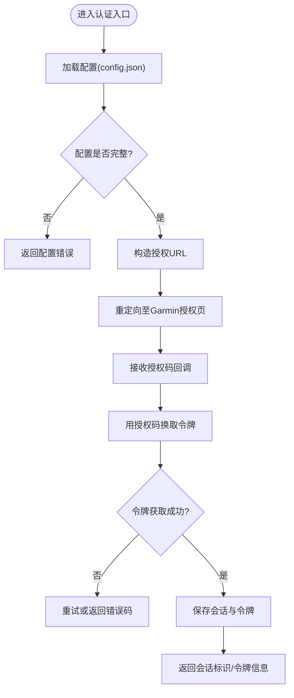
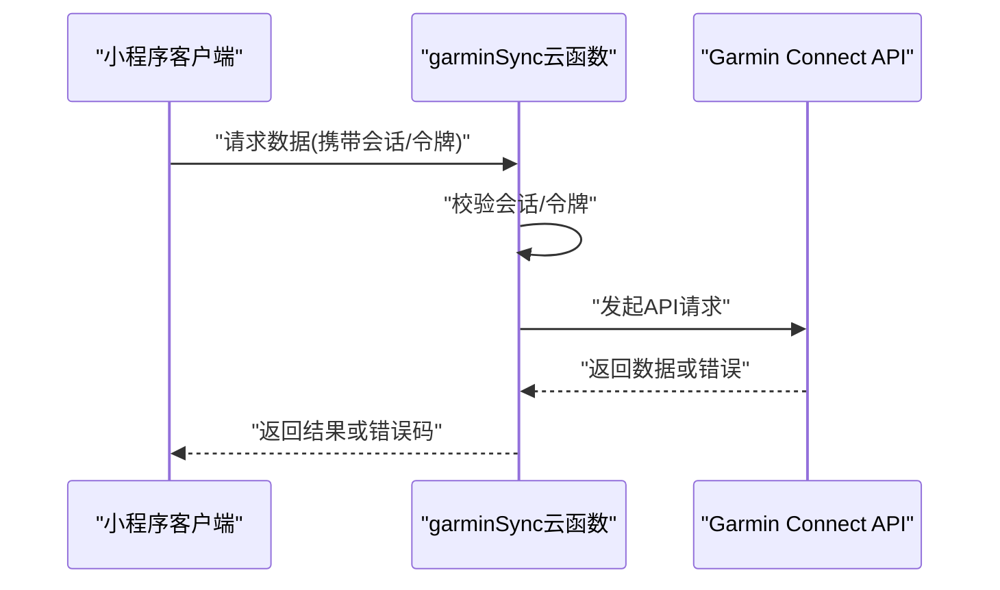
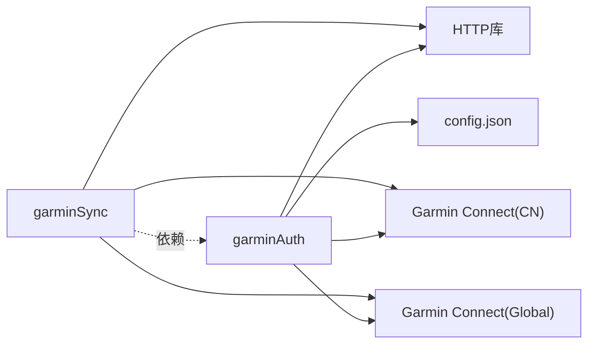

# Garmin认证云函数

<cite>
**本文引用的文件**   
- [cloudfunctions/garminAuth/index.js](file://cloudfunctions/garminAuth/index.js)
- [cloudfunctions/garminAuth/config.json](file://cloudfunctions/garminAuth/config.json)
- [cloudfunctions/garminAuth/package.json](file://cloudfunctions/garminAuth/package.json)
- [cloudfunctions/garminSync/index.js](file://cloudfunctions/garminSync/index.js)
- [cloudfunctions/garminSync/config.json](file://cloudfunctions/garminSync/config.json)
- [cloudfunctions/garminSync/package.json](file://cloudfunctions/garminSync/package.json)
- [dailysync-ref/src/utils/garmin_common.ts](file://dailysync-ref/src/utils/garmin_common.ts)
- [dailysync-ref/src/utils/garmin_cn.ts](file://dailysync-ref/src/utils/garmin_cn.ts)
- [dailysync-ref/src/utils/garmin_global.ts](file://dailysync-ref/src/utils/garmin_global.ts)
</cite>

## 目录
1. [简介](#简介)
2. [项目结构](#项目结构)
3. [核心组件](#核心组件)
4. [架构总览](#架构总览)
5. [详细组件分析](#详细组件分析)
6. [依赖关系分析](#依赖关系分析)
7. [性能考虑](#性能考虑)
8. [故障排查指南](#故障排查指南)
9. [结论](#结论)
10. [附录](#附录)

## 简介
本文件面向Garmin认证云函数的设计与实现，聚焦以下目标：
- OAuth认证流程与令牌管理（访问令牌、刷新令牌、会话）
- 安全配置与API密钥管理
- config.json配置文件详解
- 认证接口调用示例、错误码说明与重试机制
- 与Garmin Connect API的安全集成方式

该文档既适合开发者快速上手，也便于非技术读者理解整体流程。

## 项目结构
本项目采用“小程序 + 云函数”的架构，其中与Garmin相关的功能主要位于cloudfunctions目录下：
- garminAuth：负责OAuth授权、令牌获取与刷新、会话管理、安全配置加载
- garminSync：负责从Garmin Connect同步数据，使用已认证的会话/令牌进行API调用
- dailysync-ref：参考实现，包含对Garmin CN/Global域名的适配与通用工具

图表来源
- [cloudfunctions/garminAuth/index.js](file://cloudfunctions/garminAuth/index.js)
- [cloudfunctions/garminSync/index.js](file://cloudfunctions/garminSync/index.js)

章节来源
- [cloudfunctions/garminAuth/index.js](file://cloudfunctions/garminAuth/index.js)
- [cloudfunctions/garminSync/index.js](file://cloudfunctions/garminSync/index.js)

## 核心组件
- 认证入口（garminAuth）
  - 负责初始化配置、处理OAuth授权请求、生成并维护会话、管理令牌生命周期
  - 提供统一的错误码与重试策略
- 同步入口（garminSync）
  - 基于已认证的会话或令牌调用Garmin Connect API
  - 处理分页、限流、重试与失败回退

章节来源
- [cloudfunctions/garminAuth/index.js](file://cloudfunctions/garminAuth/index.js)
- [cloudfunctions/garminSync/index.js](file://cloudfunctions/garminSync/index.js)

## 架构总览
下图展示小程序通过云函数完成Garmin OAuth认证，并使用会话/令牌调用Garmin Connect API的整体流程。

图表来源
- [cloudfunctions/garminAuth/index.js](file://cloudfunctions/garminAuth/index.js)
- [cloudfunctions/garminSync/index.js](file://cloudfunctions/garminSync/index.js)
- [dailysync-ref/src/utils/garmin_common.ts](file://dailysync-ref/src/utils/garmin_common.ts)

## 详细组件分析

### 认证云函数（garminAuth）
职责
- 读取config.json中的配置项（如域名、客户端ID、密钥、回调地址等）
- 处理OAuth授权流程：构造授权URL、接收授权码、换取令牌
- 管理会话：创建、校验、续期、销毁
- 令牌管理：存储访问令牌与刷新令牌，支持自动刷新
- 错误处理：统一错误码、日志记录、重试策略

关键流程
- 初始化：加载配置、校验必填项、设置默认值
- 授权：根据用户选择（CN/Global）构造不同域名与参数
- 令牌交换：将授权码换为访问令牌与刷新令牌
- 会话绑定：将用户会话与令牌关联，设置过期时间
- 刷新：在访问令牌过期前使用刷新令牌更新

图表来源
- [cloudfunctions/garminAuth/index.js](file://cloudfunctions/garminAuth/index.js)
- [cloudfunctions/garminAuth/config.json](file://cloudfunctions/garminAuth/config.json)

章节来源
- [cloudfunctions/garminAuth/index.js](file://cloudfunctions/garminAuth/index.js)
- [cloudfunctions/garminAuth/config.json](file://cloudfunctions/garminAuth/config.json)

### 同步云函数（garminSync）
职责
- 接收来自小程序的请求，校验会话/令牌有效性
- 调用Garmin Connect API获取运动记录、设备信息等
- 处理分页、限流、重试与失败回退
- 返回标准化响应格式

关键流程
- 鉴权：验证会话/令牌，必要时触发刷新
- 请求构建：组装查询参数、签名（如需）、头部
- 调用API：发送HTTP请求，处理响应体与状态码
- 错误处理：区分网络错误、业务错误、权限错误，按策略重试或降级

图表来源
- [cloudfunctions/garminSync/index.js](file://cloudfunctions/garminSync/index.js)

章节来源
- [cloudfunctions/garminSync/index.js](file://cloudfunctions/garminSync/index.js)

### 参考实现（dailysync-ref）
作用
- 提供对Garmin CN与Global域名的适配逻辑
- 封装通用工具方法（请求、解析、错误处理）
- 作为云函数实现的参考与对照

章节来源
- [dailysync-ref/src/utils/garmin_common.ts](file://dailysync-ref/src/utils/garmin_common.ts)
- [dailysync-ref/src/utils/garmin_cn.ts](file://dailysync-ref/src/utils/garmin_cn.ts)
- [dailysync-ref/src/utils/garmin_global.ts](file://dailysync-ref/src/utils/garmin_global.ts)

## 依赖关系分析
- garminAuth依赖
  - 配置：config.json（域名、客户端ID、密钥、回调地址、超时、重试次数等）
  - 运行时：Node.js环境、HTTP库（用于请求Garmin授权与令牌交换）
- garminSync依赖
  - 会话/令牌：由garminAuth提供或小程序端传递
  - HTTP库：用于调用Garmin Connect API
- 外部依赖
  - Garmin Connect API（CN/Global域名）
  - 可能的第三方服务（如数据库、缓存）用于持久化会话与令牌

图表来源
- [cloudfunctions/garminAuth/config.json](file://cloudfunctions/garminAuth/config.json)
- [cloudfunctions/garminAuth/index.js](file://cloudfunctions/garminAuth/index.js)
- [cloudfunctions/garminSync/index.js](file://cloudfunctions/garminSync/index.js)

章节来源
- [cloudfunctions/garminAuth/config.json](file://cloudfunctions/garminAuth/config.json)
- [cloudfunctions/garminAuth/index.js](file://cloudfunctions/garminAuth/index.js)
- [cloudfunctions/garminSync/index.js](file://cloudfunctions/garminSync/index.js)

## 性能考虑
- 令牌缓存与会话复用：避免频繁授权与令牌交换
- 请求合并与分页优化：减少网络往返，批量拉取数据
- 超时与重试策略：合理设置超时时间、指数退避、最大重试次数
- 限流与背压：遵循Garmin API速率限制，避免被限流或封禁
- 资源清理：及时释放连接、关闭无效会话，防止内存泄漏

[本节为通用指导，不直接分析具体文件]

## 故障排查指南
常见问题与定位步骤
- 配置错误
  - 检查config.json中必填项是否齐全（域名、客户端ID、密钥、回调地址）
  - 确认环境变量与部署配置一致
- 授权失败
  - 检查回调地址是否与注册的一致
  - 确认授权域名为CN或Global且与配置匹配
- 令牌失效
  - 检查刷新令牌是否有效，必要时重新授权
  - 查看令牌过期时间与刷新策略
- 网络错误
  - 检查DNS、代理、防火墙设置
  - 增加重试次数与退避策略
- 权限不足
  - 确认用户已授予所需权限范围
  - 检查API调用所需的Scope是否正确

章节来源
- [cloudfunctions/garminAuth/index.js](file://cloudfunctions/garminAuth/index.js)
- [cloudfunctions/garminSync/index.js](file://cloudfunctions/garminSync/index.js)

## 结论
本方案通过云函数集中处理Garmin OAuth认证与令牌管理，结合会话机制保障安全性与可用性；同步云函数基于已认证上下文调用Garmin Connect API，具备完善的错误处理与重试策略。参考实现提供了CN/Global域名适配与通用工具，便于扩展与维护。

[本节为总结性内容，不直接分析具体文件]

## 附录

### config.json配置详解
- 域名与端点
  - cn_domain/global_domain：分别对应Garmin CN与Global域名
  - auth_endpoint/token_endpoint：授权与令牌交换端点
- 客户端凭据
  - client_id/client_secret：应用注册的客户端ID与密钥
  - redirect_uri：回调地址，需与注册一致
- 安全与超时
  - timeout_ms：请求超时时间
  - retry_count：最大重试次数
  - retry_delay_ms：重试间隔（可配合指数退避）
- 会话与令牌
  - session_ttl_ms：会话有效期
  - token_refresh_threshold_ms：提前刷新阈值
- 其他
  - log_level：日志级别
  - feature_flags：功能开关（如启用特定API）

章节来源
- [cloudfunctions/garminAuth/config.json](file://cloudfunctions/garminAuth/config.json)

### API密钥管理与安全配置
- 密钥存储
  - 建议通过环境变量或密钥管理服务注入，避免硬编码
- 传输安全
  - 强制HTTPS，校验证书链
- 最小权限原则
  - 仅申请必要的Scope，定期审计权限
- 敏感信息脱敏
  - 日志中避免输出密钥、令牌等敏感字段

章节来源
- [cloudfunctions/garminAuth/config.json](file://cloudfunctions/garminAuth/config.json)
- [cloudfunctions/garminAuth/index.js](file://cloudfunctions/garminAuth/index.js)

### 会话处理
- 会话创建
  - 授权成功后创建会话，绑定用户与令牌
- 会话校验
  - 每次请求校验会话有效性，必要时触发刷新
- 会话续期
  - 基于过期时间动态续期，避免频繁刷新
- 会话销毁
  - 用户登出或长时间未使用后清理会话

章节来源
- [cloudfunctions/garminAuth/index.js](file://cloudfunctions/garminAuth/index.js)

### 认证接口调用示例
- 发起授权
  - 请求：调用认证云函数，传入用户选择（CN/Global）与回调地址
  - 响应：返回授权URL，引导用户完成授权
- 令牌交换
  - 请求：携带授权码调用令牌交换接口
  - 响应：返回访问令牌与刷新令牌
- 同步数据
  - 请求：携带会话/令牌调用同步云函数，指定数据类型与分页参数
  - 响应：返回数据列表或错误码

章节来源
- [cloudfunctions/garminAuth/index.js](file://cloudfunctions/garminAuth/index.js)
- [cloudfunctions/garminSync/index.js](file://cloudfunctions/garminSync/index.js)

### 错误码说明
- 配置类错误
  - 缺少必填配置、配置格式错误
- 授权类错误
  - 授权码无效、回调地址不匹配、域名不一致
- 令牌类错误
  - 令牌过期、刷新失败、权限不足
- 网络类错误
  - 超时、DNS解析失败、连接中断
- 业务类错误
  - 数据不存在、分页参数非法、频率限制

章节来源
- [cloudfunctions/garminAuth/index.js](file://cloudfunctions/garminAuth/index.js)
- [cloudfunctions/garminSync/index.js](file://cloudfunctions/garminSync/index.js)

### 重试机制
- 适用场景
  - 网络抖动、临时限流、服务端不稳定
- 策略建议
  - 指数退避：初始延迟递增，避免雪崩
  - 最大重试次数：防止无限重试
  - 幂等性：确保重复请求不影响数据一致性
- 失败回退
  - 降级策略：返回缓存数据或提示用户稍后重试

章节来源
- [cloudfunctions/garminAuth/index.js](file://cloudfunctions/garminAuth/index.js)
- [cloudfunctions/garminSync/index.js](file://cloudfunctions/garminSync/index.js)

### 与Garmin Connect API的安全集成
- 域名选择
  - 根据用户所在地区选择CN或Global域名
- 权限控制
  - 精确申请所需Scope，避免过度授权
- 请求签名
  - 如需签名，确保密钥安全存储与计算
- 日志与审计
  - 记录关键操作与错误，便于追踪与合规

章节来源
- [dailysync-ref/src/utils/garmin_common.ts](file://dailysync-ref/src/utils/garmin_common.ts)
- [dailysync-ref/src/utils/garmin_cn.ts](file://dailysync-ref/src/utils/garmin_cn.ts)
- [dailysync-ref/src/utils/garmin_global.ts](file://dailysync-ref/src/utils/garmin_global.ts)