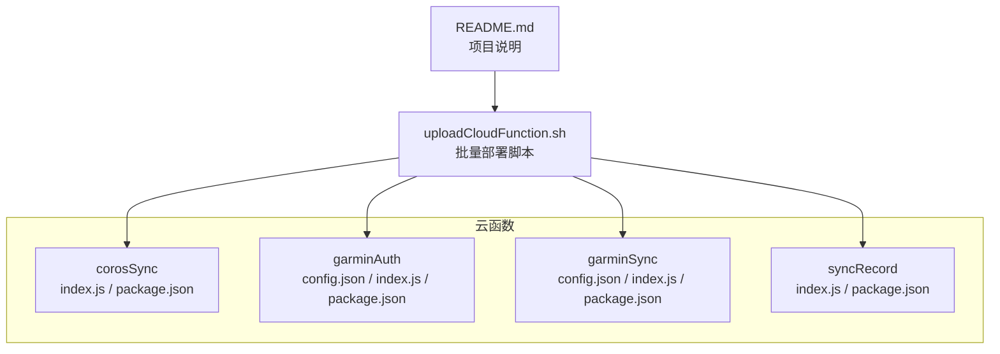
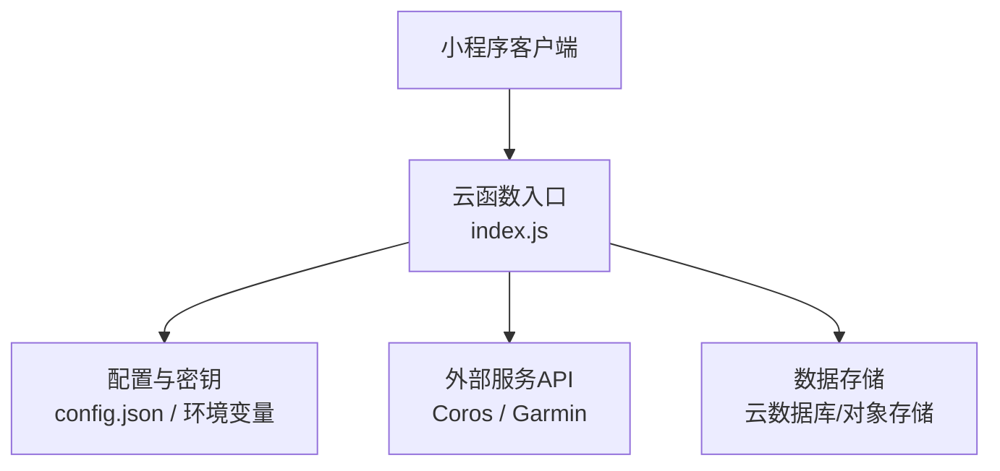
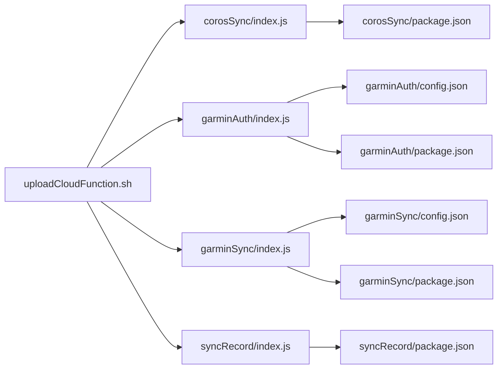

# 云函数部署

<cite>
**本文引用的文件**   
- [uploadCloudFunction.sh](file://uploadCloudFunction.sh)
- [corosSync/index.js](file://cloudfunctions/corosSync/index.js)
- [corosSync/package.json](file://cloudfunctions/corosSync/package.json)
- [garminAuth/config.json](file://cloudfunctions/garminAuth/config.json)
- [garminAuth/index.js](file://cloudfunctions/garminAuth/index.js)
- [garminAuth/package.json](file://cloudfunctions/garminAuth/package.json)
- [garminSync/config.json](file://cloudfunctions/garminSync/config.json)
- [garminSync/index.js](file://cloudfunctions/garminSync/index.js)
- [garminSync/package.json](file://cloudfunctions/garminSync/package.json)
- [syncRecord/index.js](file://cloudfunctions/syncRecord/index.js)
- [syncRecord/package.json](file://cloudfunctions/syncRecord/package.json)
- [README.md](file://README.md)
</cite>

## 目录
1. [简介](#简介)
2. [项目结构](#项目结构)
3. [核心组件](#核心组件)
4. [架构总览](#架构总览)
5. [详细组件分析](#详细组件分析)
6. [依赖分析](#依赖分析)
7. [性能考虑](#性能考虑)
8. [故障排除指南](#故障排除指南)
9. [结论](#结论)
10. [附录](#附录)（如有需要）

## 简介
本指南面向使用微信小程序云开发进行数据同步与第三方服务集成的团队，提供基于 uploadCloudFunction.sh 脚本的批量部署方法，并详细说明各云函数的功能、配置与环境变量设置。文档还涵盖权限配置、错误处理、监控与日志查看、故障排除以及性能优化建议与最佳实践，帮助读者快速、稳定地完成云函数上线与运维。

## 项目结构
本项目采用“按功能划分”的云函数组织方式，每个云函数独立目录包含入口文件 index.js 与依赖声明 package.json，部分函数通过 config.json 管理运行时配置。根目录提供一键上传脚本 uploadCloudFunction.sh，用于批量部署所有云函数。小程序前端位于 miniprogram 目录，与本指南关系较小。

图表来源
- [uploadCloudFunction.sh](file://uploadCloudFunction.sh)
- [corosSync/index.js](file://cloudfunctions/corosSync/index.js)
- [corosSync/package.json](file://cloudfunctions/corosSync/package.json)
- [garminAuth/config.json](file://cloudfunctions/garminAuth/config.json)
- [garminAuth/index.js](file://cloudfunctions/garminAuth/index.js)
- [garminAuth/package.json](file://cloudfunctions/garminAuth/package.json)
- [garminSync/config.json](file://cloudfunctions/garminSync/config.json)
- [garminSync/index.js](file://cloudfunctions/garminSync/index.js)
- [garminSync/package.json](file://cloudfunctions/garminSync/package.json)
- [syncRecord/index.js](file://cloudfunctions/syncRecord/index.js)
- [syncRecord/package.json](file://cloudfunctions/syncRecord/package.json)
- [README.md](file://README.md)

章节来源
- [README.md](file://README.md)
- [uploadCloudFunction.sh](file://uploadCloudFunction.sh)

## 核心组件
- 批量部署脚本：uploadCloudFunction.sh
  - 作用：遍历 cloudfunctions 目录下各云函数子目录，执行云函数上传/部署命令，支持批量更新与增量发布。
  - 关键能力：自动识别函数目录、读取依赖、调用云开发 CLI 完成部署、输出部署结果与错误信息。
  - 使用要点：确保已安装并登录云开发 CLI；脚本需具备可执行权限；建议在 CI/CD 中复用该脚本实现自动化发布。

- 云函数模块
  - corosSync：负责 Coros 平台数据同步逻辑。
  - garminAuth：负责 Garmin 账号认证与令牌管理。
  - garminSync：负责 Garmin 平台数据同步逻辑。
  - syncRecord：负责记录或同步运动记录的通用逻辑。

章节来源
- [uploadCloudFunction.sh](file://uploadCloudFunction.sh)
- [corosSync/index.js](file://cloudfunctions/corosSync/index.js)
- [garminAuth/config.json](file://cloudfunctions/garminAuth/config.json)
- [garminAuth/index.js](file://cloudfunctions/garminAuth/index.js)
- [garminSync/config.json](file://cloudfunctions/garminSync/config.json)
- [garminSync/index.js](file://cloudfunctions/garminSync/index.js)
- [syncRecord/index.js](file://cloudfunctions/syncRecord/index.js)

## 架构总览
下图展示了云函数在整体系统中的角色与交互关系：小程序端触发云函数，云函数根据各自职责调用外部服务（如 Coros/Garmin API），并通过环境变量与配置文件获取敏感信息与运行参数。

图表来源
- [corosSync/index.js](file://cloudfunctions/corosSync/index.js)
- [garminAuth/index.js](file://cloudfunctions/garminAuth/index.js)
- [garminSync/index.js](file://cloudfunctions/garminSync/index.js)
- [syncRecord/index.js](file://cloudfunctions/syncRecord/index.js)

## 详细组件分析

### 批量部署脚本：uploadCloudFunction.sh
- 功能概述
  - 扫描 cloudfunctions 下的每个云函数目录。
  - 对每个函数执行依赖安装与云函数上传/部署。
  - 汇总输出部署状态与错误信息，便于定位问题。
- 使用方法
  - 本地环境：赋予脚本执行权限后直接运行。
  - CI/CD：在流水线中调用脚本，结合环境变量控制部署目标与版本。
- 注意事项
  - 提前登录云开发 CLI，避免交互式授权。
  - 确保网络可达，避免超时导致部署失败。
  - 如需灰度或回滚，可在脚本外层增加版本号与发布策略。

章节来源
- [uploadCloudFunction.sh](file://uploadCloudFunction.sh)

### 云函数：corosSync
- 职责
  - 与 Coros 平台进行数据同步，包括拉取用户活动、健康指标等。
- 配置
  - 通过环境变量注入 Coros 相关密钥与端点。
  - 依赖包由 package.json 声明。
- 部署
  - 由 uploadCloudFunction.sh 自动发现并部署。

章节来源
- [corosSync/index.js](file://cloudfunctions/corosSync/index.js)
- [corosSync/package.json](file://cloudfunctions/corosSync/package.json)

### 云函数：garminAuth
- 职责
  - 处理 Garmin 账号认证流程，获取并刷新访问令牌。
- 配置
  - 使用 config.json 管理客户端 ID、回调地址等基础配置。
  - 敏感信息（如密钥）通过环境变量注入。
- 部署
  - 由 uploadCloudFunction.sh 自动发现并部署。

章节来源
- [garminAuth/config.json](file://cloudfunctions/garminAuth/config.json)
- [garminAuth/index.js](file://cloudfunctions/garminAuth/index.js)
- [garminAuth/package.json](file://cloudfunctions/garminAuth/package.json)

### 云函数：garminSync
- 职责
  - 与 Garmin 平台进行数据同步，包括拉取运动记录、设备信息等。
- 配置
  - 通过环境变量注入 Garmin 相关密钥与端点。
  - 依赖包由 package.json 声明。
- 部署
  - 由 uploadCloudFunction.sh 自动发现并部署。

章节来源
- [garminSync/config.json](file://cloudfunctions/garminSync/config.json)
- [garminSync/index.js](file://cloudfunctions/garminSync/index.js)
- [garminSync/package.json](file://cloudfunctions/garminSync/package.json)

### 云函数：syncRecord
- 职责
  - 统一的数据记录与同步逻辑，可能用于聚合多源数据或持久化到云数据库。
- 配置
  - 通过环境变量注入存储端点与鉴权信息。
  - 依赖包由 package.json 声明。
- 部署
  - 由 uploadCloudFunction.sh 自动发现并部署。

章节来源
- [syncRecord/index.js](file://cloudfunctions/syncRecord/index.js)
- [syncRecord/package.json](file://cloudfunctions/syncRecord/package.json)

## 依赖分析
- 脚本与云函数的耦合
  - uploadCloudFunction.sh 通过约定式路径扫描 cloudfunctions 目录，与每个云函数的 index.js 和 package.json 形成弱耦合。
- 云函数对外部服务的依赖
  - garminAuth 与 garminSync 依赖 Garmin API；corosSync 依赖 Coros API；syncRecord 依赖数据存储接口。
- 配置与环境的解耦
  - 通过 config.json 与环境变量分离静态配置与敏感信息，降低部署风险。

图表来源
- [uploadCloudFunction.sh](file://uploadCloudFunction.sh)
- [corosSync/index.js](file://cloudfunctions/corosSync/index.js)
- [corosSync/package.json](file://cloudfunctions/corosSync/package.json)
- [garminAuth/config.json](file://cloudfunctions/garminAuth/config.json)
- [garminAuth/index.js](file://cloudfunctions/garminAuth/index.js)
- [garminAuth/package.json](file://cloudfunctions/garminAuth/package.json)
- [garminSync/config.json](file://cloudfunctions/garminSync/config.json)
- [garminSync/index.js](file://cloudfunctions/garminSync/index.js)
- [garminSync/package.json](file://cloudfunctions/garminSync/package.json)
- [syncRecord/index.js](file://cloudfunctions/syncRecord/index.js)
- [syncRecord/package.json](file://cloudfunctions/syncRecord/package.json)

章节来源
- [uploadCloudFunction.sh](file://uploadCloudFunction.sh)
- [garminAuth/config.json](file://cloudfunctions/garminAuth/config.json)
- [garminSync/config.json](file://cloudfunctions/garminSync/config.json)

## 性能考虑
- 冷启动优化
  - 减少顶层依赖体积，按需引入模块。
  - 将初始化逻辑延迟到首次请求时执行，避免不必要的预热开销。
- 并发与限流
  - 合理设置云函数实例上限与并发阈值，避免外部 API 限流导致失败。
  - 对高频调用场景引入队列或批处理机制。
- I/O 优化
  - 使用连接池与缓存策略，减少重复网络请求。
  - 对大响应数据进行分页与压缩。
- 资源隔离
  - 不同云函数拆分职责，避免单函数过重导致内存与 CPU 瓶颈。

[本节为通用指导，不直接分析具体文件]

## 故障排除指南
- 常见问题与排查步骤
  - 部署失败
    - 检查云开发 CLI 是否已登录且权限正确。
    - 确认网络连通性与代理设置。
    - 查看脚本输出中的错误堆栈与返回码。
  - 运行时错误
    - 检查环境变量是否正确注入，尤其是密钥与端点。
    - 查看云函数日志，定位异常位置与上下文。
  - 外部服务限流
    - 调整重试与退避策略，避免雪崩。
    - 增加并发限制与队列缓冲。
- 监控与日志
  - 使用云控制台查看函数调用量、错误率与耗时分布。
  - 开启结构化日志，便于检索与告警。
- 回滚与恢复
  - 保留历史版本，出现问题时快速回滚。
  - 对关键操作增加幂等性设计与补偿机制。

章节来源
- [uploadCloudFunction.sh](file://uploadCloudFunction.sh)
- [garminAuth/index.js](file://cloudfunctions/garminAuth/index.js)
- [garminSync/index.js](file://cloudfunctions/garminSync/index.js)
- [corosSync/index.js](file://cloudfunctions/corosSync/index.js)
- [syncRecord/index.js](file://cloudfunctions/syncRecord/index.js)

## 结论
通过 uploadCloudFunction.sh 脚本可实现云函数的标准化批量部署，配合合理的配置与环境变量管理，能够显著提升发布效率与稳定性。建议在生产环境中结合 CI/CD、监控告警与回滚策略，持续优化云函数的性能与可靠性。

[本节为总结性内容，不直接分析具体文件]

## 附录
- 环境变量清单（示例）
  - GARMIN_CLIENT_ID、GARMIN_CLIENT_SECRET、GARMIN_CALLBACK_URL
  - COROS_API_KEY、COROS_API_SECRET、COROS_BASE_URL
  - STORAGE_ENDPOINT、STORAGE_ACCESS_KEY、STORAGE_SECRET_KEY
- 权限最小化原则
  - 仅授予云函数所需的最小权限，避免过度授权。
- 安全最佳实践
  - 不在代码中硬编码密钥，全部通过环境变量注入。
  - 定期轮换密钥与令牌，启用审计日志。

[本节为补充信息，不直接分析具体文件]