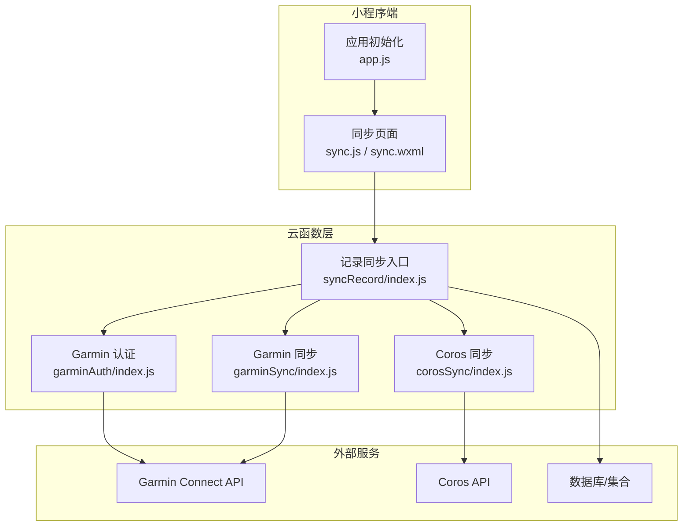
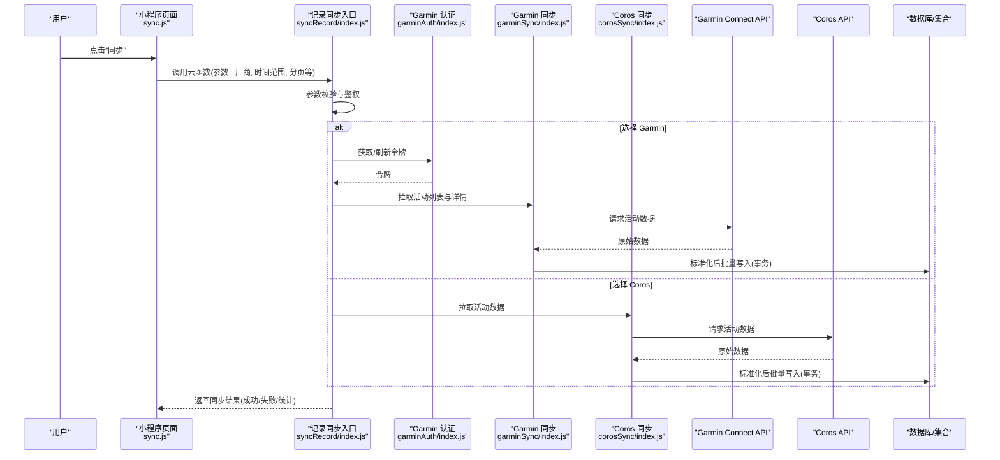
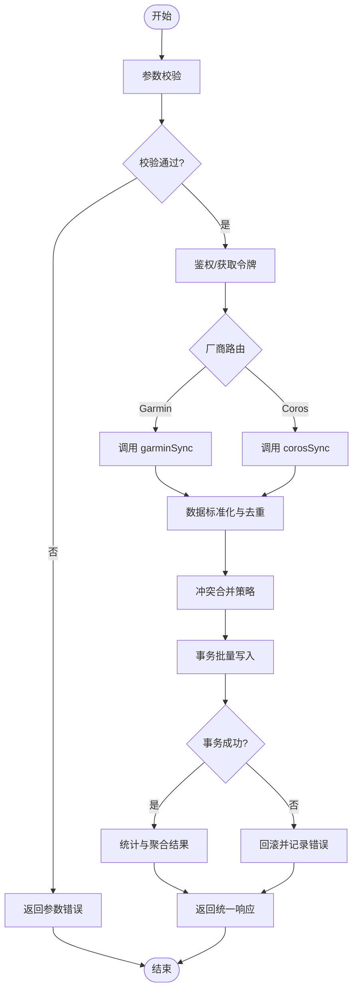
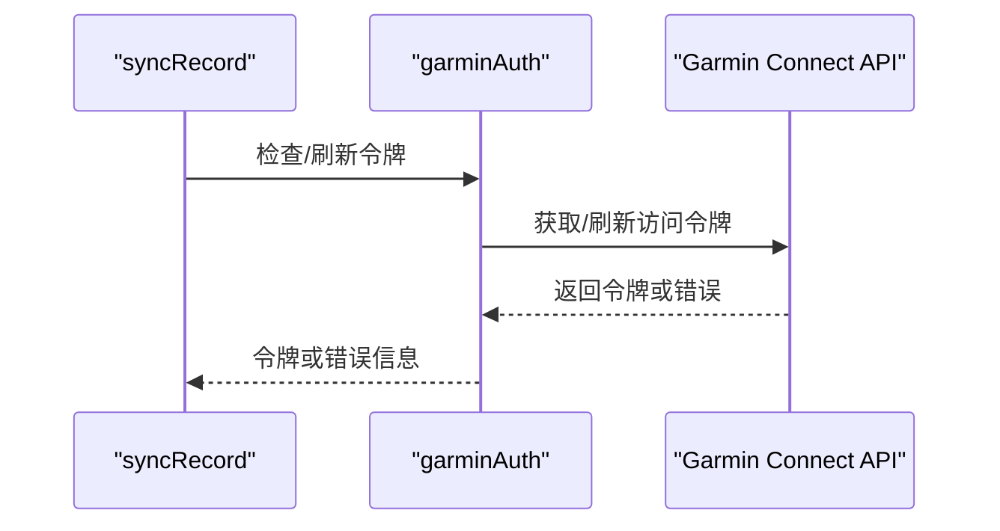
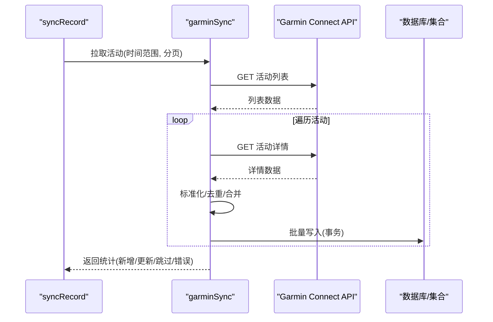
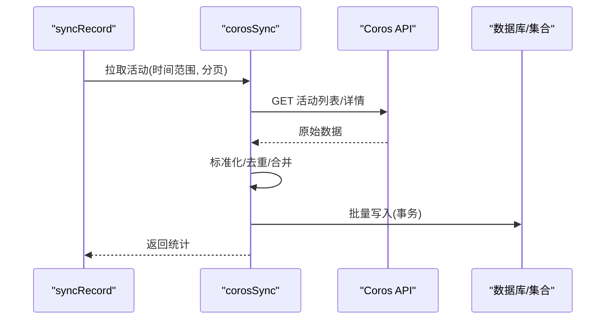
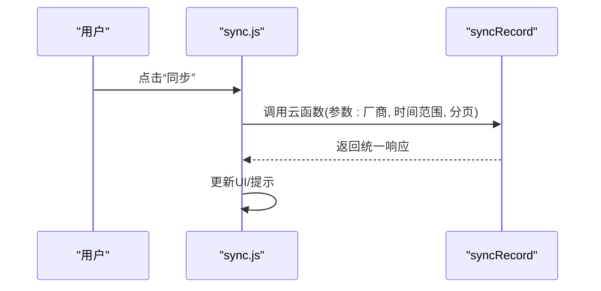
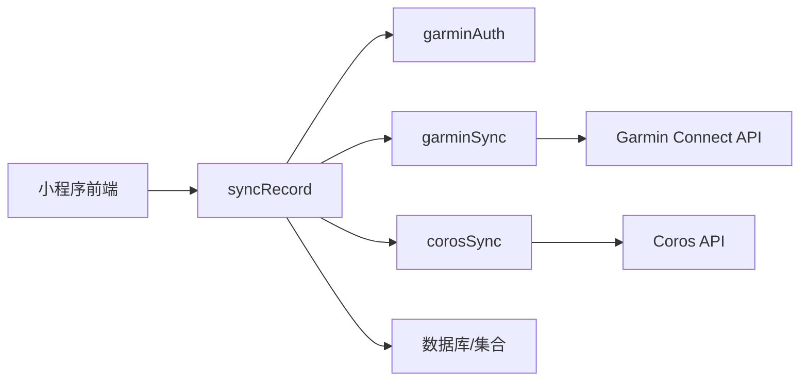

# 记录同步云函数

<cite>
**本文档引用的文件**   
- [cloudfunctions/syncRecord/index.js](file://cloudfunctions/syncRecord/index.js)
- [cloudfunctions/syncRecord/package.json](file://cloudfunctions/syncRecord/package.json)
- [cloudfunctions/corosSync/index.js](file://cloudfunctions/corosSync/index.js)
- [cloudfunctions/corosSync/package.json](file://cloudfunctions/corosSync/package.json)
- [cloudfunctions/garminAuth/index.js](file://cloudfunctions/garminAuth/index.js)
- [cloudfunctions/garminAuth/config.json](file://cloudfunctions/garminAuth/config.json)
- [cloudfunctions/garminAuth/package.json](file://cloudfunctions/garminAuth/package.json)
- [cloudfunctions/garminSync/index.js](file://cloudfunctions/garminSync/index.js)
- [cloudfunctions/garminSync/config.json](file://cloudfunctions/garminSync/config.json)
- [cloudfunctions/garminSync/package.json](file://cloudfunctions/garminSync/package.json)
- [miniprogram/pages/sync/sync.js](file://miniprogram/pages/sync/sync.js)
- [miniprogram/pages/sync/sync.wxml](file://miniprogram/pages/sync/sync.wxml)
- [miniprogram/app.js](file://miniprogram/app.js)
</cite>

## 目录
1. [简介](#简介)
2. [项目结构](#项目结构)
3. [核心组件](#核心组件)
4. [架构总览](#架构总览)
5. [详细组件分析](#详细组件分析)
6. [依赖关系分析](#依赖关系分析)
7. [性能考虑](#性能考虑)
8. [故障排查指南](#故障排查指南)
9. [结论](#结论)
10. [附录](#附录)

## 简介
本文件面向“记录同步云函数”的完整技术文档，聚焦运动记录的云端同步能力。内容涵盖：
- 同步逻辑与流程（拉取、去重、合并、写入）
- 数据格式处理与映射规则
- 冲突解决策略（时间戳优先、字段级合并等）
- API 接口定义、参数校验与响应格式
- 批量操作与事务处理实现细节
- 与其他云函数的协作关系与数据流转

该文档旨在帮助开发者快速理解并扩展记录同步能力，同时为运维与排障提供清晰指引。

## 项目结构
本项目采用微信小程序 + 云开发架构，关键目录说明如下：
- cloudfunctions：云函数集合，包含 Garmin/Coros 认证与同步、通用记录同步入口等
- miniprogram：小程序前端，包含同步页面与调用入口
- dailysync-ref：参考实现（TypeScript），用于对齐数据模型与同步算法

图表来源
- [cloudfunctions/syncRecord/index.js](file://cloudfunctions/syncRecord/index.js)
- [cloudfunctions/garminAuth/index.js](file://cloudfunctions/garminAuth/index.js)
- [cloudfunctions/garminSync/index.js](file://cloudfunctions/garminSync/index.js)
- [cloudfunctions/corosSync/index.js](file://cloudfunctions/corosSync/index.js)
- [miniprogram/pages/sync/sync.js](file://miniprogram/pages/sync/sync.js)
- [miniprogram/pages/sync/sync.wxml](file://miniprogram/pages/sync/sync.wxml)
- [miniprogram/app.js](file://miniprogram/app.js)

章节来源
- [cloudfunctions/syncRecord/index.js](file://cloudfunctions/syncRecord/index.js)
- [cloudfunctions/garminAuth/index.js](file://cloudfunctions/garminAuth/index.js)
- [cloudfunctions/garminSync/index.js](file://cloudfunctions/garminSync/index.js)
- [cloudfunctions/corosSync/index.js](file://cloudfunctions/corosSync/index.js)
- [miniprogram/pages/sync/sync.js](file://miniprogram/pages/sync/sync.js)
- [miniprogram/pages/sync/sync.wxml](file://miniprogram/pages/sync/sync.wxml)
- [miniprogram/app.js](file://miniprogram/app.js)

## 核心组件
- 记录同步入口（syncRecord）
  - 职责：统一接收前端请求，进行参数校验、鉴权、调度各厂商同步任务，聚合结果返回
  - 关键点：批量拉取、去重、合并、事务写入、错误回滚与重试
- Garmin 认证（garminAuth）
  - 职责：获取/刷新访问令牌，管理会话状态
- Garmin 同步（garminSync）
  - 职责：调用 Garmin API 拉取活动/配速/心率等数据，标准化并落库
- Coros 同步（corosSync）
  - 职责：调用 Coros API 拉取运动数据，标准化并落库

章节来源
- [cloudfunctions/syncRecord/index.js](file://cloudfunctions/syncRecord/index.js)
- [cloudfunctions/garminAuth/index.js](file://cloudfunctions/garminAuth/index.js)
- [cloudfunctions/garminSync/index.js](file://cloudfunctions/garminSync/index.js)
- [cloudfunctions/corosSync/index.js](file://cloudfunctions/corosSync/index.js)

## 架构总览
整体时序从前端触发到云端执行，再到外部 API 与数据库交互，形成闭环。

图表来源
- [cloudfunctions/syncRecord/index.js](file://cloudfunctions/syncRecord/index.js)
- [cloudfunctions/garminAuth/index.js](file://cloudfunctions/garminAuth/index.js)
- [cloudfunctions/garminSync/index.js](file://cloudfunctions/garminSync/index.js)
- [cloudfunctions/corosSync/index.js](file://cloudfunctions/corosSync/index.js)
- [miniprogram/pages/sync/sync.js](file://miniprogram/pages/sync/sync.js)

## 详细组件分析

### 记录同步入口（syncRecord）
- 功能要点
  - 参数校验：必填项（如厂商、用户标识）、可选项（时间范围、分页大小、是否强制覆盖）
  - 鉴权与会话：根据厂商类型调用对应认证或读取本地会话
  - 任务调度：按厂商路由至 garminSync 或 corosSync
  - 批量与事务：对拉取的记录进行去重与合并，使用事务保证一致性
  - 结果聚合：统计新增/更新/跳过数量，汇总错误信息
- 数据流
  - 输入：前端请求体（含厂商、时间范围、分页、覆盖策略等）
  - 处理：校验→鉴权→拉取→标准化→去重→合并→事务写入
  - 输出：统一响应体（状态码、消息、统计数据、错误明细）

图表来源
- [cloudfunctions/syncRecord/index.js](file://cloudfunctions/syncRecord/index.js)

章节来源
- [cloudfunctions/syncRecord/index.js](file://cloudfunctions/syncRecord/index.js)
- [cloudfunctions/syncRecord/package.json](file://cloudfunctions/syncRecord/package.json)

### Garmin 认证（garminAuth）
- 功能要点
  - 登录与令牌获取：支持用户名密码或第三方授权流程
  - 令牌刷新：过期自动刷新，缓存会话
  - 错误处理：网络异常、验证码、账号锁定等
- 与入口协作
  - 入口在调用 garminSync 前确保令牌有效；必要时先调用 garminAuth

图表来源
- [cloudfunctions/garminAuth/index.js](file://cloudfunctions/garminAuth/index.js)
- [cloudfunctions/garminAuth/config.json](file://cloudfunctions/garminAuth/config.json)

章节来源
- [cloudfunctions/garminAuth/index.js](file://cloudfunctions/garminAuth/index.js)
- [cloudfunctions/garminAuth/config.json](file://cloudfunctions/garminAuth/config.json)
- [cloudfunctions/garminAuth/package.json](file://cloudfunctions/garminAuth/package.json)

### Garmin 同步（garminSync）
- 功能要点
  - 拉取活动列表：分页获取，过滤时间范围
  - 拉取活动详情：步频、心率、海拔、轨迹等
  - 数据标准化：统一字段名、单位换算、缺失值填充
  - 去重与合并：基于唯一键（如 activityId）与时间戳判断
  - 批量写入：使用事务提交，失败回滚
- 与入口协作
  - 入口负责调度与结果聚合；garminSync 专注数据拉取与落库

图表来源
- [cloudfunctions/garminSync/index.js](file://cloudfunctions/garminSync/index.js)
- [cloudfunctions/garminSync/config.json](file://cloudfunctions/garminSync/config.json)

章节来源
- [cloudfunctions/garminSync/index.js](file://cloudfunctions/garminSync/index.js)
- [cloudfunctions/garminSync/config.json](file://cloudfunctions/garminSync/config.json)
- [cloudfunctions/garminSync/package.json](file://cloudfunctions/garminSync/package.json)

### Coros 同步（corosSync）
- 功能要点
  - 拉取活动：分页与时间过滤
  - 数据标准化：统一字段、单位转换、缺失值处理
  - 去重与合并：基于唯一键与时间戳
  - 批量写入：事务保障一致性
- 与入口协作
  - 同 garminSync 模式，由入口统一调度与聚合

图表来源
- [cloudfunctions/corosSync/index.js](file://cloudfunctions/corosSync/index.js)

章节来源
- [cloudfunctions/corosSync/index.js](file://cloudfunctions/corosSync/index.js)
- [cloudfunctions/corosSync/package.json](file://cloudfunctions/corosSync/package.json)

### 小程序前端（sync）
- 功能要点
  - 触发同步：收集用户选择的厂商、时间范围、分页大小等
  - 调用云函数：封装请求体，处理加载态与错误提示
  - 展示结果：显示同步进度、统计信息与错误明细
- 与云函数协作
  - 通过云开发 SDK 调用 syncRecord 云函数，解析统一响应体

图表来源
- [miniprogram/pages/sync/sync.js](file://miniprogram/pages/sync/sync.js)
- [miniprogram/pages/sync/sync.wxml](file://miniprogram/pages/sync/sync.wxml)

章节来源
- [miniprogram/pages/sync/sync.js](file://miniprogram/pages/sync/sync.js)
- [miniprogram/pages/sync/sync.wxml](file://miniprogram/pages/sync/sync.wxml)
- [miniprogram/app.js](file://miniprogram/app.js)

## 依赖关系分析
- 模块耦合
  - syncRecord 作为入口，强依赖 garminAuth、garminSync、corosSync
  - garminSync 依赖 garminAuth 的令牌能力
  - 前端仅依赖 syncRecord 的统一接口
- 外部依赖
  - Garmin/Coros API 的网络稳定性与限流策略影响同步性能
  - 数据库/集合的事务能力决定写入一致性与回滚行为

图表来源
- [cloudfunctions/syncRecord/index.js](file://cloudfunctions/syncRecord/index.js)
- [cloudfunctions/garminAuth/index.js](file://cloudfunctions/garminAuth/index.js)
- [cloudfunctions/garminSync/index.js](file://cloudfunctions/garminSync/index.js)
- [cloudfunctions/corosSync/index.js](file://cloudfunctions/corosSync/index.js)

章节来源
- [cloudfunctions/syncRecord/index.js](file://cloudfunctions/syncRecord/index.js)
- [cloudfunctions/garminAuth/index.js](file://cloudfunctions/garminAuth/index.js)
- [cloudfunctions/garminSync/index.js](file://cloudfunctions/garminSync/index.js)
- [cloudfunctions/corosSync/index.js](file://cloudfunctions/corosSync/index.js)

## 性能考虑
- 批量操作
  - 建议以固定批次大小拉取与写入，避免单次过大导致超时或内存溢出
- 并发控制
  - 对同一用户的不同厂商同步可并行，但需限制最大并发数，防止 API 限流
- 缓存与会话
  - 令牌与会话应缓存以减少重复认证开销
- 去重与合并
  - 使用唯一键与时间戳索引加速查找与比较，降低 O(n^2) 风险
- 事务与回滚
  - 将一次同步视为一个事务单元，失败时快速回滚，减少脏数据
- 监控与指标
  - 记录拉取耗时、写入耗时、错误率、重试次数，便于容量规划与优化

[本节为通用指导，不直接分析具体文件]

## 故障排查指南
- 常见错误
  - 参数校验失败：检查必填字段、类型与取值范围
  - 认证失败：确认账号状态、令牌有效期与刷新策略
  - API 限流：增加退避重试、降低并发与批次大小
  - 事务失败：检查数据完整性、唯一约束与外键关系
- 定位方法
  - 查看云函数日志中的错误堆栈与请求ID
  - 核对前后端参数映射与字段命名
  - 验证数据库索引与约束配置
- 恢复策略
  - 针对部分失败的数据进行增量重试
  - 清理临时状态与锁，避免死锁

章节来源
- [cloudfunctions/syncRecord/index.js](file://cloudfunctions/syncRecord/index.js)
- [cloudfunctions/garminAuth/index.js](file://cloudfunctions/garminAuth/index.js)
- [cloudfunctions/garminSync/index.js](file://cloudfunctions/garminSync/index.js)
- [cloudfunctions/corosSync/index.js](file://cloudfunctions/corosSync/index.js)

## 结论
记录同步云函数通过统一的入口协调多厂商数据源，结合标准化、去重、合并与事务写入，实现了稳定可靠的运动记录同步。建议在后续迭代中持续完善：
- 更细粒度的冲突解决策略（字段级合并、版本向量）
- 更强的容错与重试机制（指数退避、幂等性）
- 完善的监控与告警（延迟、错误率、资源使用）
- 可扩展的厂商接入框架（插件化、配置驱动）

[本节为总结性内容，不直接分析具体文件]

## 附录
- API 接口定义（建议）
  - 路径：/cloudfunctions/syncRecord
  - 方法：POST
  - 请求体字段
    - vendor: 字符串，枚举 ["garmin", "coros"]
    - userId: 字符串，用户唯一标识
    - startTime: 字符串，ISO8601 起始时间
    - endTime: 字符串，ISO8601 结束时间
    - pageSize: 整数，每页条数（默认 50）
    - forceOverwrite: 布尔，是否强制覆盖旧数据
  - 响应体字段
    - code: 整数，状态码
    - message: 字符串，提示信息
    - stats: 对象，{ added, updated, skipped, failed }
    - errors: 数组，错误明细
- 数据映射规则（建议）
  - 统一字段：activityId、vendor、userId、startTime、endTime、distance、duration、calories、avgHeartRate、maxHeartRate、elevationGain、pace、cadence、routePoints
  - 单位换算：距离（米）、海拔（米）、心率（bpm）、卡路里（kcal）
  - 缺失值处理：默认 null 或 0，并在统计中标记
- 冲突解决策略（建议）
  - 主键冲突：以更新时间戳较新者为准
  - 字段级冲突：按优先级合并（如心率取最新，轨迹取最长）
  - 覆盖策略：forceOverwrite=true 时忽略时间戳比较，直接覆盖
- 批量与事务（建议）
  - 批次大小：50~200 条
  - 事务边界：一次同步为一个事务，失败全量回滚
  - 幂等性：基于 activityId 与版本号保证重复请求安全

[本节为概念性补充，不直接分析具体文件]