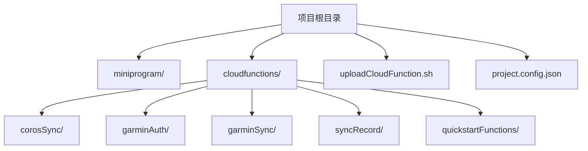
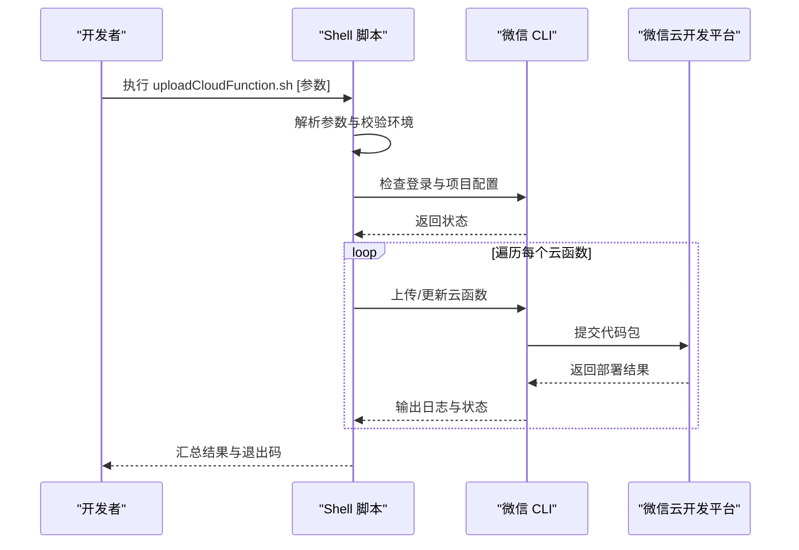
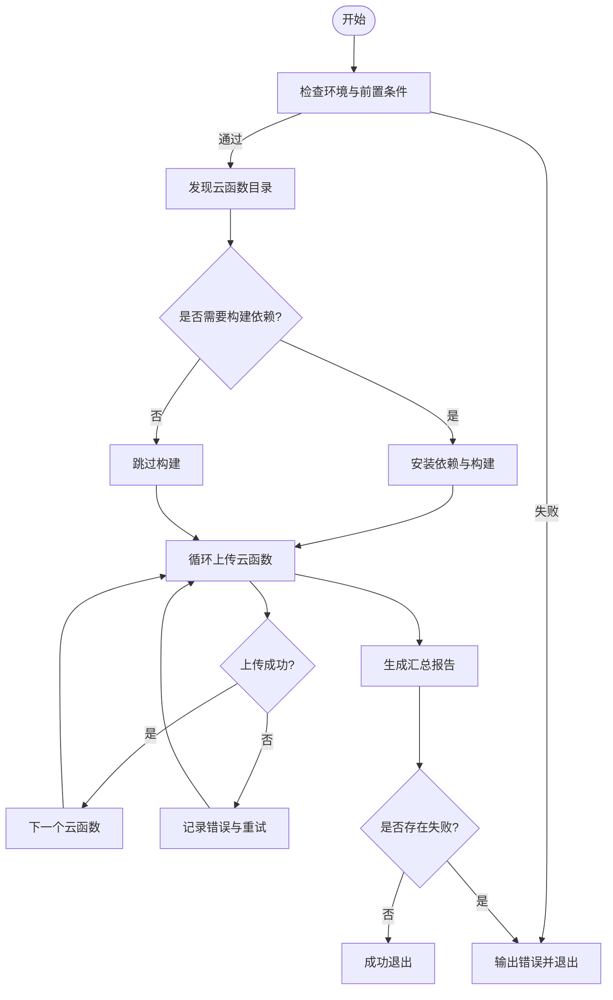
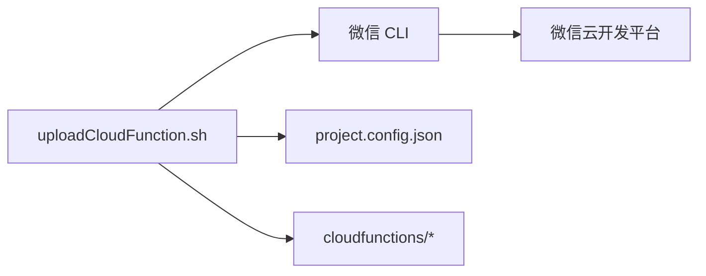

# 部署脚本使用

<cite>
**本文引用的文件**   
- [uploadCloudFunction.sh](file://uploadCloudFunction.sh)
- [project.config.json](file://project.config.json)
- [README.md](file://README.md)
</cite>

## 目录
1. [简介](#简介)
2. [项目结构](#项目结构)
3. [核心组件](#核心组件)
4. [架构总览](#架构总览)
5. [详细组件分析](#详细组件分析)
6. [依赖分析](#依赖分析)
7. [性能考虑](#性能考虑)
8. [故障排除指南](#故障排除指南)
9. [结论](#结论)
10. [附录](#附录)

## 简介
本文件为微信云开发小程序项目的“部署脚本使用”文档，聚焦于根目录下的 uploadCloudFunction.sh 脚本。该脚本用于将 cloudfunctions 目录下的多个云函数代码批量上传至微信云开发平台。文档涵盖：
- 脚本功能与工作原理
- 执行环境与权限要求
- 参数配置与使用方法
- 错误处理机制
- 常见部署场景示例
- 批量上传流程与注意事项
- 常见问题排查

## 项目结构
本项目包含微信小程序前端（miniprogram）、云函数集合（cloudfunctions）以及部署脚本（uploadCloudFunction.sh）。云函数按功能目录划分，每个云函数通常包含入口文件与依赖声明。项目根目录的配置文件用于定义云开发相关设置。

**图表来源**
- [uploadCloudFunction.sh](file://uploadCloudFunction.sh)
- [project.config.json](file://project.config.json)

**章节来源**
- [README.md](file://README.md)
- [project.config.json](file://project.config.json)

## 核心组件
- 部署脚本：uploadCloudFunction.sh
  - 负责扫描 cloudfunctions 目录，识别各云函数子目录，并逐个调用微信 CLI 进行上传或更新操作。
  - 支持通过命令行参数控制目标环境、是否强制覆盖、是否跳过构建等。
- 项目配置：project.config.json
  - 定义云开发相关的基础配置，如项目名称、环境 ID、默认运行环境等，供 CLI 读取。

**章节来源**
- [uploadCloudFunction.sh](file://uploadCloudFunction.sh)
- [project.config.json](file://project.config.json)

## 架构总览
脚本的工作流大致如下：
- 解析命令行参数与环境变量
- 校验前置条件（CLI 安装、登录状态、项目配置）
- 遍历 cloudfunctions 下所有云函数目录
- 对每个云函数执行上传/更新命令
- 汇总结果并输出报告，失败时返回非零退出码

**图表来源**
- [uploadCloudFunction.sh](file://uploadCloudFunction.sh)
- [project.config.json](file://project.config.json)

## 详细组件分析

### 脚本功能与参数
- 主要能力
  - 自动发现 cloudfunctions 下的云函数目录
  - 批量调用 CLI 完成上传/更新
  - 支持指定目标环境、是否覆盖、是否构建依赖
  - 统一日志输出与错误聚合
- 常用参数（以实际脚本为准）
  - --env 或 -e：指定目标环境（如 dev/test/prod）
  - --force 或 -f：强制覆盖已存在的云函数版本
  - --skip-build 或 -b：跳过本地依赖安装与构建
  - --dry-run：仅打印将要执行的命令，不实际上传
  - --help：显示帮助信息
- 环境变量（可选）
  - WX_CLI_TOKEN：若需免交互登录，可传入令牌
  - NODE_ENV：影响依赖安装策略
  - DEBUG：开启更详细的调试输出

**章节来源**
- [uploadCloudFunction.sh](file://uploadCloudFunction.sh)

### 执行环境与权限
- 系统要求
  - 支持 POSIX shell 的环境（bash/zsh）
  - Node.js 与 npm/yarn（用于依赖安装与构建，视脚本实现而定）
  - 微信 CLI 已安装且可用
- 权限要求
  - 对 cloudfunctions 目录具有读权限
  - 对 project.config.json 具有读权限
  - 网络访问微信云开发平台的权限
- 登录与认证
  - 首次执行前需通过 CLI 完成登录授权
  - 可使用令牌或扫码方式完成认证

**章节来源**
- [uploadCloudFunction.sh](file://uploadCloudFunction.sh)
- [project.config.json](file://project.config.json)

### 错误处理机制
- 前置校验失败
  - 未安装 CLI、未登录、项目配置缺失或不合法时，脚本会提前终止并提示修复步骤
- 单个云函数上传失败
  - 记录失败原因与上下文（云函数名、错误码、错误消息）
  - 继续处理其他云函数，最后汇总失败清单
- 网络与超时
  - 重试策略（次数与间隔）由脚本内部决定
  - 超时后给出明确提示与恢复建议
- 退出码约定
  - 0：全部成功
  - 非 0：存在失败项，具体失败数量与详情见输出日志

**章节来源**
- [uploadCloudFunction.sh](file://uploadCloudFunction.sh)

### 批量上传流程
- 发现阶段
  - 扫描 cloudfunctions 目录，过滤出有效的云函数子目录（包含入口文件与 package.json）
- 准备阶段
  - 根据参数决定是否安装依赖与构建
  - 校验项目配置与环境选择
- 执行阶段
  - 逐个调用 CLI 上传/更新云函数
  - 收集每次操作的日志与状态
- 收尾阶段
  - 生成汇总报告（成功数、失败数、失败明细）
  - 返回合适的退出码

**图表来源**
- [uploadCloudFunction.sh](file://uploadCloudFunction.sh)

**章节来源**
- [uploadCloudFunction.sh](file://uploadCloudFunction.sh)

### 与微信 CLI 的集成点
- 登录与鉴权
  - 通过 CLI 的登录接口完成身份验证
- 项目配置读取
  - 读取 project.config.json 中的项目元数据与环境设置
- 云函数上传
  - 调用 CLI 的云函数上传/更新命令，传递目标环境、覆盖策略等参数
- 结果反馈
  - 解析 CLI 的输出与返回码，转换为脚本的统一状态

**章节来源**
- [uploadCloudFunction.sh](file://uploadCloudFunction.sh)
- [project.config.json](file://project.config.json)

## 依赖分析
- 外部依赖
  - 微信 CLI：必须安装且版本兼容
  - Node.js/npm/yarn：用于依赖安装与构建（视云函数需求）
- 内部依赖
  - project.config.json：提供项目基础配置
  - cloudfunctions/*：待部署的云函数源码与依赖声明

**图表来源**
- [uploadCloudFunction.sh](file://uploadCloudFunction.sh)
- [project.config.json](file://project.config.json)

**章节来源**
- [uploadCloudFunction.sh](file://uploadCloudFunction.sh)
- [project.config.json](file://project.config.json)

## 性能考虑
- 并行与串行
  - 若脚本支持并行上传，需注意并发上限与平台限流；否则采用串行保证稳定性
- 构建优化
  - 合理使用缓存（依赖安装、构建产物），避免重复工作
- 增量上传
  - 尽量只上传变更的云函数，减少网络传输与平台处理时间
- 网络优化
  - 选择合适的网络出口与代理设置，避免超时与丢包

[本节为通用指导，不直接分析具体文件]

## 故障排除指南
- 无法登录或鉴权失败
  - 确认 CLI 已正确安装并完成登录
  - 检查网络连通性与代理设置
- 项目配置错误
  - 核对 project.config.json 的项目名称、环境 ID、默认环境等字段
- 依赖安装失败
  - 检查 Node.js 版本与 npm/yarn 可用性
  - 查看云函数的 package.json 依赖是否有效
- 上传失败或超时
  - 观察日志中的错误码与消息
  - 尝试降低并发或增加超时时间
- 权限不足
  - 确保对 cloudfunctions 与 project.config.json 有读权限
  - 确认当前用户具备云开发平台的发布权限

**章节来源**
- [uploadCloudFunction.sh](file://uploadCloudFunction.sh)
- [project.config.json](file://project.config.json)

## 结论
uploadCloudFunction.sh 提供了面向微信云开发的便捷批量部署能力，结合 project.config.json 的配置与微信 CLI 的能力，可实现稳定高效的云函数发布流程。建议在 CI/CD 中集成该脚本，配合缓存与增量策略提升整体效率，并通过完善的日志与错误处理保障问题快速定位与恢复。

[本节为总结性内容，不直接分析具体文件]

## 附录
- 常见用法示例
  - 基本上传：在仓库根目录执行脚本，默认上传所有云函数到默认环境
  - 指定环境：通过参数指定目标环境（如测试或生产）
  - 强制覆盖：在需要覆盖历史版本时使用
  - 仅预览：使用干跑模式查看即将执行的命令
- 最佳实践
  - 在 CI 中固定 Node.js 与 CLI 版本，确保一致性
  - 使用环境变量管理敏感信息（如令牌）
  - 合理拆分云函数，减少单次上传体积
  - 启用构建缓存与增量上传，缩短流水线时长

[本节为补充说明，不直接分析具体文件]