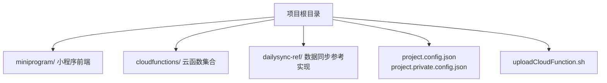
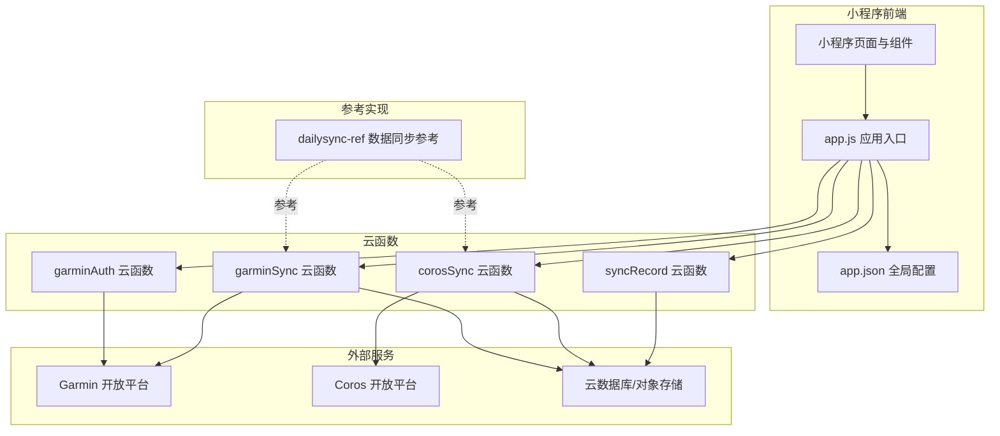
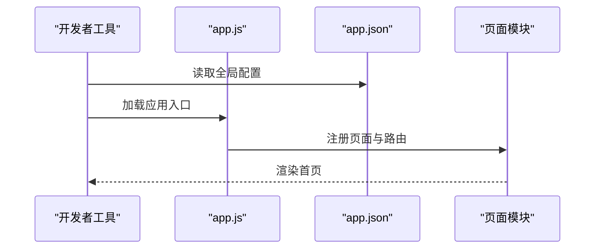
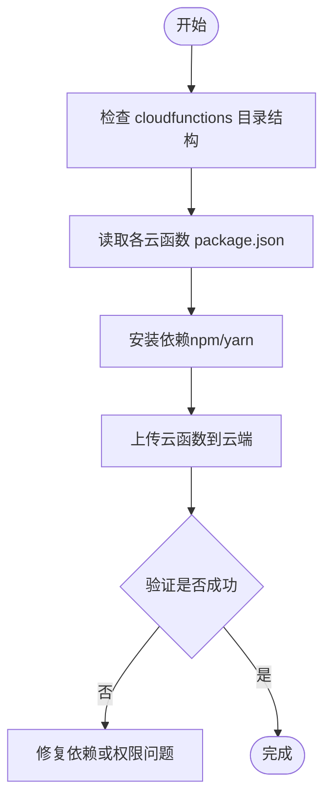
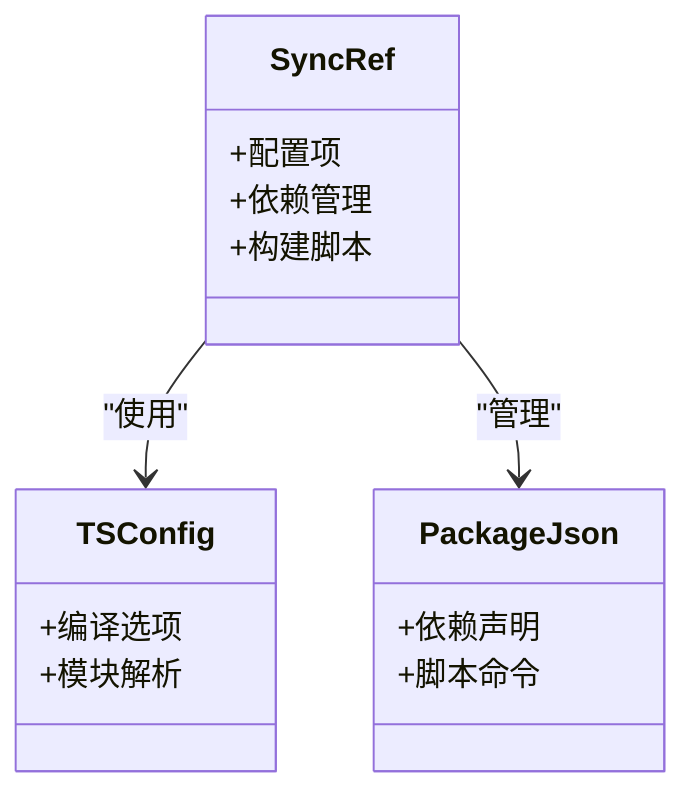

# 本地开发环境搭建

<cite>
**本文引用的文件**   
- [project.config.json](file://project.config.json)
- [project.private.config.json](file://project.private.config.json)
- [miniprogram/app.js](file://miniprogram/app.js)
- [miniprogram/app.json](file://miniprogram/app.json)
- [miniprogram/sitemap.json](file://miniprogram/sitemap.json)
- [cloudfunctions/corosSync/index.js](file://cloudfunctions/corosSync/index.js)
- [cloudfunctions/corosSync/package.json](file://cloudfunctions/corosSync/package.json)
- [cloudfunctions/garminAuth/index.js](file://cloudfunctions/garminAuth/index.js)
- [cloudfunctions/garminAuth/config.json](file://cloudfunctions/garminAuth/config.json)
- [cloudfunctions/garminAuth/package.json](file://cloudfunctions/garminAuth/package.json)
- [cloudfunctions/garminSync/index.js](file://cloudfunctions/garminSync/index.js)
- [cloudfunctions/garminSync/config.json](file://cloudfunctions/garminSync/config.json)
- [cloudfunctions/garminSync/package.json](file://cloudfunctions/garminSync/package.json)
- [cloudfunctions/syncRecord/index.js](file://cloudfunctions/syncRecord/index.js)
- [cloudfunctions/syncRecord/package.json](file://cloudfunctions/syncRecord/package.json)
- [dailysync-ref/package.json](file://dailysync-ref/package.json)
- [dailysync-ref/tsconfig.json](file://dailysync-ref/tsconfig.json)
- [uploadCloudFunction.sh](file://uploadCloudFunction.sh)
</cite>

## 目录
1. [简介](#简介)
2. [项目结构](#项目结构)
3. [核心组件](#核心组件)
4. [架构总览](#架构总览)
5. [详细组件分析](#详细组件分析)
6. [依赖与配置分析](#依赖与配置分析)
7. [性能注意事项](#性能注意事项)
8. [故障排查指南](#故障排查指南)
9. [结论](#结论)
10. [附录](#附录)

## 简介
本指南面向首次接触该微信小程序项目的开发者，目标是帮助你在本地快速搭建完整的开发环境，包括：
- 安装并正确配置微信开发者工具
- 理解并设置项目配置文件（小程序端与云函数端）
- 初始化云开发环境与必要的环境变量
- 安装依赖包、上传云函数
- 常见环境问题定位与调试技巧

通过本指南，你将能够顺利运行小程序前端、调用云函数，并在本地进行开发与联调。

## 项目结构
本项目由三大部分组成：
- 小程序前端代码位于 miniprogram 目录
- 云函数位于 cloudfunctions 目录，每个子目录为一个独立的云函数
- dailysync-ref 为数据同步参考实现（TypeScript），用于说明数据迁移与同步逻辑

**图表来源**
- [project.config.json](file://project.config.json)
- [project.private.config.json](file://project.private.config.json)
- [uploadCloudFunction.sh](file://uploadCloudFunction.sh)

**章节来源**
- [project.config.json](file://project.config.json)
- [project.private.config.json](file://project.private.config.json)
- [uploadCloudFunction.sh](file://uploadCloudFunction.sh)

## 核心组件
- 小程序入口与页面
  - app.js：应用生命周期与全局状态管理
  - app.json：小程序全局配置（页面路由、窗口样式、插件等）
  - sitemap.json：站点地图配置
- 云函数
  - corosSync：Coros 数据同步相关
  - garminAuth：Garmin 授权相关
  - garminSync：Garmin 数据同步相关
  - syncRecord：记录同步相关
- 数据同步参考实现
  - dailysync-ref：包含 TypeScript 源码、构建配置与脚本，用于理解数据迁移与同步流程

**章节来源**
- [miniprogram/app.js](file://miniprogram/app.js)
- [miniprogram/app.json](file://miniprogram/app.json)
- [miniprogram/sitemap.json](file://miniprogram/sitemap.json)
- [cloudfunctions/corosSync/index.js](file://cloudfunctions/corosSync/index.js)
- [cloudfunctions/garminAuth/index.js](file://cloudfunctions/garminAuth/index.js)
- [cloudfunctions/garminSync/index.js](file://cloudfunctions/garminSync/index.js)
- [cloudfunctions/syncRecord/index.js](file://cloudfunctions/syncRecord/index.js)

## 架构总览
下图展示了小程序前端与云函数的交互关系，以及数据同步参考模块的定位。

**图表来源**
- [miniprogram/app.js](file://miniprogram/app.js)
- [miniprogram/app.json](file://miniprogram/app.json)
- [cloudfunctions/garminAuth/index.js](file://cloudfunctions/garminAuth/index.js)
- [cloudfunctions/garminSync/index.js](file://cloudfunctions/garminSync/index.js)
- [cloudfunctions/corosSync/index.js](file://cloudfunctions/corosSync/index.js)
- [cloudfunctions/syncRecord/index.js](file://cloudfunctions/syncRecord/index.js)

## 详细组件分析

### 小程序端配置与启动流程
- app.json 负责定义小程序的页面路由、窗口行为、插件与分包等关键配置。确保 pages 字段中列出的页面路径与实际文件一致，避免启动时报错。
- app.js 负责应用初始化、生命周期钩子与全局状态。若涉及云开发或第三方 SDK 初始化，应在此处完成。
- sitemap.json 控制搜索引擎索引策略，通常保持默认即可。

**图表来源**
- [miniprogram/app.js](file://miniprogram/app.js)
- [miniprogram/app.json](file://miniprogram/app.json)

**章节来源**
- [miniprogram/app.js](file://miniprogram/app.js)
- [miniprogram/app.json](file://miniprogram/app.json)
- [miniprogram/sitemap.json](file://miniprogram/sitemap.json)

### 云函数结构与部署
- 每个云函数是一个独立目录，包含 index.js（主入口）与 package.json（依赖声明）。部分云函数还包含 config.json 用于敏感配置或运行时参数。
- 推荐使用微信开发者工具的“云开发”功能进行本地调试与云端部署；也可使用 uploadCloudFunction.sh 脚本批量上传。

**图表来源**
- [cloudfunctions/garminAuth/package.json](file://cloudfunctions/garminAuth/package.json)
- [cloudfunctions/garminSync/package.json](file://cloudfunctions/garminSync/package.json)
- [cloudfunctions/corosSync/package.json](file://cloudfunctions/corosSync/package.json)
- [cloudfunctions/syncRecord/package.json](file://cloudfunctions/syncRecord/package.json)
- [uploadCloudFunction.sh](file://uploadCloudFunction.sh)

**章节来源**
- [cloudfunctions/garminAuth/index.js](file://cloudfunctions/garminAuth/index.js)
- [cloudfunctions/garminAuth/config.json](file://cloudfunctions/garminAuth/config.json)
- [cloudfunctions/garminAuth/package.json](file://cloudfunctions/garminAuth/package.json)
- [cloudfunctions/garminSync/index.js](file://cloudfunctions/garminSync/index.js)
- [cloudfunctions/garminSync/config.json](file://cloudfunctions/garminSync/config.json)
- [cloudfunctions/garminSync/package.json](file://cloudfunctions/garminSync/package.json)
- [cloudfunctions/corosSync/index.js](file://cloudfunctions/corosSync/index.js)
- [cloudfunctions/corosSync/package.json](file://cloudfunctions/corosSync/package.json)
- [cloudfunctions/syncRecord/index.js](file://cloudfunctions/syncRecord/index.js)
- [cloudfunctions/syncRecord/package.json](file://cloudfunctions/syncRecord/package.json)
- [uploadCloudFunction.sh](file://uploadCloudFunction.sh)

### 数据同步参考实现（dailysync-ref）
- 该模块使用 TypeScript，提供数据迁移与同步的参考实现，便于理解后端逻辑与数据结构。
- 通过 tsconfig.json 配置编译选项，package.json 管理依赖与脚本。

**图表来源**
- [dailysync-ref/tsconfig.json](file://dailysync-ref/tsconfig.json)
- [dailysync-ref/package.json](file://dailysync-ref/package.json)

**章节来源**
- [dailysync-ref/tsconfig.json](file://dailysync-ref/tsconfig.json)
- [dailysync-ref/package.json](file://dailysync-ref/package.json)

## 依赖与配置分析

### 项目级配置
- project.config.json：项目根级配置，包含项目名称、appid、编译配置、云开发环境 ID 等。请确保 appid 与你的小程序账号一致，云开发环境 ID 指向正确的环境。
- project.private.config.json：私有配置，通常包含本地调试偏好（如端口、预览模式等），请勿提交至版本库。

建议操作：
- 在微信开发者工具中打开项目后，确认“项目设置”中的 appid 与云开发环境 ID 正确。
- 如需覆盖默认行为，可在 project.private.config.json 中添加本地专属配置。

**章节来源**
- [project.config.json](file://project.config.json)
- [project.private.config.json](file://project.private.config.json)

### 环境变量与敏感配置
- 云函数中的敏感信息（如 API Key、Token、数据库连接串等）建议通过环境变量注入，或在云函数目录下的 config.json 中管理。
- 在本地调试时，可通过微信开发者工具的“云函数环境变量”面板设置；在云端部署时，请在云开发控制台配置对应环境变量。

注意：
- 不要将敏感信息硬编码在源代码中。
- 确保本地与云端的环境变量名称与值保持一致。

**章节来源**
- [cloudfunctions/garminAuth/config.json](file://cloudfunctions/garminAuth/config.json)
- [cloudfunctions/garminSync/config.json](file://cloudfunctions/garminSync/config.json)

### 依赖包安装与云函数上传
- 每个云函数目录下有独立的 package.json，需在该目录下执行依赖安装命令（npm install 或 yarn install）。
- 可使用 uploadCloudFunction.sh 脚本批量上传云函数，确保脚本具备执行权限。

建议步骤：
- 进入每个云函数目录，安装依赖。
- 在微信开发者工具中点击“上传云函数”，或使用脚本一键上传。
- 上传成功后，在云开发控制台查看函数日志与运行状态。

**章节来源**
- [cloudfunctions/garminAuth/package.json](file://cloudfunctions/garminAuth/package.json)
- [cloudfunctions/garminSync/package.json](file://cloudfunctions/garminSync/package.json)
- [cloudfunctions/corosSync/package.json](file://cloudfunctions/corosSync/package.json)
- [cloudfunctions/syncRecord/package.json](file://cloudfunctions/syncRecord/package.json)
- [uploadCloudFunction.sh](file://uploadCloudFunction.sh)

## 性能注意事项
- 云函数冷启动：首次调用可能较慢，建议在高频调用场景下保持函数实例活跃或合理拆分函数粒度。
- 依赖体积：避免在云函数中引入不必要的依赖，减小包体以提升加载速度。
- 网络请求：对第三方 API 的请求应做好缓存与重试机制，减少超时与失败率。
- 数据库查询：尽量使用索引与分页，避免全表扫描与大结果集返回。

[本节为通用指导，不直接分析具体文件]

## 故障排查指南

常见问题与解决思路：
- 无法登录或授权失败
  - 检查 garminAuth 云函数的环境变量与 config.json 配置是否正确。
  - 确认小程序 appid 与云开发环境 ID 匹配。
- 云函数调用报错
  - 查看云开发控制台的函数日志，定位错误堆栈。
  - 检查依赖是否安装完整，必要时重新安装。
- 页面空白或路由异常
  - 核对 app.json 中 pages 字段与实际文件路径是否一致。
  - 检查页面 wxml/wxss/js 是否存在语法错误。
- 数据同步失败
  - 参考 dailysync-ref 的实现，对比云函数逻辑差异。
  - 检查第三方 API 的访问限制与配额。

调试技巧：
- 使用微信开发者工具的“调试器”查看网络请求与错误堆栈。
- 在云函数中使用 console.log 输出关键变量，配合云开发控制台日志进行定位。
- 对于跨域或鉴权问题，优先检查请求头与签名生成逻辑。

**章节来源**
- [cloudfunctions/garminAuth/index.js](file://cloudfunctions/garminAuth/index.js)
- [cloudfunctions/garminAuth/config.json](file://cloudfunctions/garminAuth/config.json)
- [miniprogram/app.json](file://miniprogram/app.json)

## 结论
通过本指南，你已了解如何搭建微信小程序本地开发环境，包括工具安装、项目配置、云函数部署与依赖管理。建议在实际开发中遵循以下最佳实践：
- 严格区分开发与生产环境配置
- 使用环境变量管理敏感信息
- 定期更新依赖并清理无用包
- 利用云开发控制台与开发者工具进行高效调试

[本节为总结性内容，不直接分析具体文件]

## 附录

### 快速上手清单
- 安装微信开发者工具并创建/导入项目
- 配置 project.config.json 与 project.private.config.json
- 初始化云开发环境并设置环境变量
- 在各云函数目录安装依赖
- 上传云函数并验证调用
- 在开发者工具中调试小程序与云函数

[本节为补充信息，不直接分析具体文件]