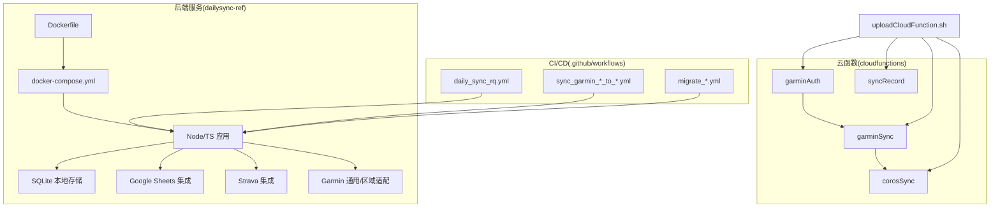
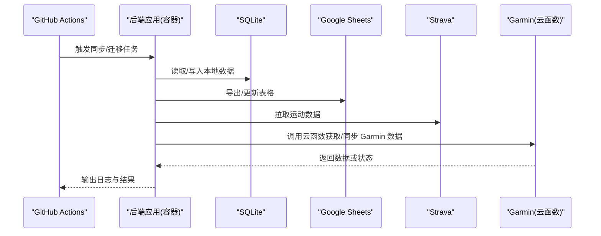
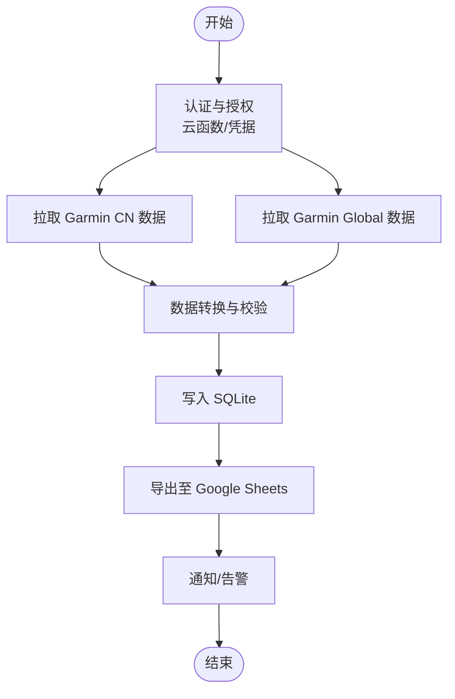
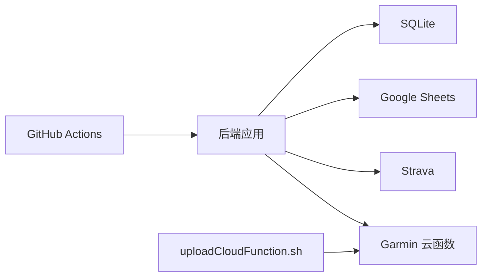

# 生产环境部署

<cite>
**本文引用的文件**   
- [README.md](file://README.md)
- [docker-compose.yml](file://dailysync-ref/docker-compose.yml)
- [Dockerfile](file://dailysync-ref/Dockerfile)
- [package.json](file://dailysync-ref/package.json)
- [tsconfig.json](file://dailysync-ref/tsconfig.json)
- [.github/workflows/daily_sync_rq.yml](file://dailysync-ref/.github/workflows/daily_sync_rq.yml)
- [.github/workflows/migrate_garmin_cn_to_garmin_global.yml](file://dailysync-ref/.github/workflows/migrate_garmin_cn_to_garmin_global.yml)
- [.github/workflows/migrate_garmin_global_to_garmin_cn.yml](file://dailysync-ref/.github/workflows/migrate_garmin_global_to_garmin_cn.yml)
- [.github/workflows/sync_garmin_cn_to_garmin_global.yml](file://dailysync-ref/.github/workflows/sync_garmin_cn_to_garmin_global.yml)
- [.github/workflows/sync_garmin_global_to_garmin_cn.yml](file://dailysync-ref/.github/workflows/sync_garmin_global_to_garmin_cn.yml)
- [src/constant.ts](file://dailysync-ref/src/constant.ts)
- [src/utils/sqlite.ts](file://dailysync-ref/src/utils/sqlite.ts)
- [src/utils/google_sheets.ts](file://dailysync-ref/src/utils/google_sheets.ts)
- [src/utils/strava.ts](file://dailysync-ref/src/utils/strava.ts)
- [src/utils/garmin_common.ts](file://dailysync-ref/src/utils/garmin_common.ts)
- [src/utils/garmin_cn.ts](file://dailysync-ref/src/utils/garmin_cn.ts)
- [src/utils/garmin_global.ts](file://dailysync-ref/src/utils/garmin_global.ts)
- [src/rq.ts](file://dailysync-ref/src/rq.ts)
- [src/sync_garmin_cn_to_global.ts](file://dailysync-ref/src/sync_garmin_cn_to_global.ts)
- [src/sync_garmin_global_to_cn.ts](file://dailysync-ref/src/sync_garmin_global_to_cn.ts)
- [src/migrate_garmin_cn_to_global.ts](file://dailysync-ref/src/migrate_garmin_cn_to_global.ts)
- [src/migrate_garmin_global_to_cn.ts](file://dailysync-ref/src/migrate_garmin_global_to_cn.ts)
- [cloudfunctions/corosSync/index.js](file://cloudfunctions/corosSync/index.js)
- [cloudfunctions/corosSync/package.json](file://cloudfunctions/corosSync/package.json)
- [cloudfunctions/garminAuth/config.json](file://cloudfunctions/garminAuth/config.json)
- [cloudfunctions/garminAuth/index.js](file://cloudfunctions/garminAuth/index.js)
- [cloudfunctions/garminAuth/package.json](file://cloudfunctions/garminAuth/package.json)
- [cloudfunctions/garminSync/config.json](file://cloudfunctions/garminSync/config.json)
- [cloudfunctions/garminSync/index.js](file://cloudfunctions/garminSync/index.js)
- [cloudfunctions/garminSync/package.json](file://cloudfunctions/garminSync/package.json)
- [cloudfunctions/syncRecord/index.js](file://cloudfunctions/syncRecord/index.js)
- [cloudfunctions/syncRecord/package.json](file://cloudfunctions/syncRecord/package.json)
- [uploadCloudFunction.sh](file://uploadCloudFunction.sh)
</cite>

## 目录
1. [简介](#简介)
2. [项目结构](#项目结构)
3. [核心组件](#核心组件)
4. [架构总览](#架构总览)
5. [详细组件分析](#详细组件分析)
6. [依赖分析](#依赖分析)
7. [性能考虑](#性能考虑)
8. [故障排查指南](#故障排查指南)
9. [结论](#结论)
10. [附录](#附录)

## 简介
本指南面向将该项目投入生产环境的工程师与运维人员，覆盖服务器要求、安全配置、性能调优、监控设置、数据库初始化、第三方服务集成、SSL 证书配置、备份策略、灾难恢复与扩容方案等关键主题。文档基于仓库中的 Docker 化后端（TypeScript）、GitHub Actions 工作流、微信小程序云函数以及数据同步脚本进行说明，确保读者能够按步骤完成从构建到上线的全流程。

## 项目结构
本项目包含以下主要部分：
- dailysync-ref：基于 TypeScript 的定时同步与迁移工具，提供 Docker 镜像构建与 docker-compose 编排能力，并通过 GitHub Actions 执行定时任务。
- cloudfunctions：微信小程序云函数集合，用于认证、数据同步与记录同步等云端逻辑。
- miniprogram：微信小程序前端代码（非本次重点）。
- 根目录脚本：如上传云函数的脚本。

图表来源
- [Dockerfile](file://dailysync-ref/Dockerfile)
- [docker-compose.yml](file://dailysync-ref/docker-compose.yml)
- [.github/workflows/daily_sync_rq.yml](file://dailysync-ref/.github/workflows/daily_sync_rq.yml)
- [.github/workflows/sync_garmin_cn_to_garmin_global.yml](file://dailysync-ref/.github/workflows/sync_garmin_cn_to_garmin_global.yml)
- [.github/workflows/sync_garmin_global_to_garmin_cn.yml](file://dailysync-ref/.github/workflows/sync_garmin_global_to_garmin_cn.yml)
- [.github/workflows/migrate_garmin_cn_to_garmin_global.yml](file://dailysync-ref/.github/workflows/migrate_garmin_cn_to_garmin_global.yml)
- [.github/workflows/migrate_garmin_global_to_garmin_cn.yml](file://dailysync-ref/.github/workflows/migrate_garmin_global_to_garmin_cn.yml)
- [src/utils/google_sheets.ts](file://dailysync-ref/src/utils/google_sheets.ts)
- [src/utils/strava.ts](file://dailysync-ref/src/utils/strava.ts)
- [src/utils/garmin_common.ts](file://dailysync-ref/src/utils/garmin_common.ts)
- [src/utils/garmin_cn.ts](file://dailysync-ref/src/utils/garmin_cn.ts)
- [src/utils/garmin_global.ts](file://dailysync-ref/src/utils/garmin_global.ts)
- [cloudfunctions/garminAuth/index.js](file://cloudfunctions/garminAuth/index.js)
- [cloudfunctions/garminSync/index.js](file://cloudfunctions/garminSync/index.js)
- [cloudfunctions/corosSync/index.js](file://cloudfunctions/corosSync/index.js)
- [cloudfunctions/syncRecord/index.js](file://cloudfunctions/syncRecord/index.js)
- [uploadCloudFunction.sh](file://uploadCloudFunction.sh)

章节来源
- [README.md](file://README.md)
- [docker-compose.yml](file://dailysync-ref/docker-compose.yml)
- [Dockerfile](file://dailysync-ref/Dockerfile)
- [package.json](file://dailysync-ref/package.json)
- [tsconfig.json](file://dailysync-ref/tsconfig.json)

## 核心组件
- 数据同步与迁移
  - Garmin CN/Global 双向同步脚本与迁移脚本，负责在不同区域或平台间拉取、转换与写入数据。
  - 运行入口由工作流触发，支持定时与手动触发。
- 数据存储
  - SQLite 作为本地持久化存储，适合单机部署与轻量级场景。
- 第三方服务集成
  - Google Sheets：用于数据导出或报表展示。
  - Strava：运动数据源之一。
  - Garmin：通过云函数完成认证与数据同步。
- 微信小程序云函数
  - garminAuth：处理 Garmin 登录与令牌管理。
  - garminSync：拉取并同步 Garmin 数据。
  - corosSync：Coros 数据同步。
  - syncRecord：记录同步相关逻辑。

章节来源
- [src/sync_garmin_cn_to_global.ts](file://dailysync-ref/src/sync_garmin_cn_to_global.ts)
- [src/sync_garmin_global_to_cn.ts](file://dailysync-ref/src/sync_garmin_global_to_cn.ts)
- [src/migrate_garmin_cn_to_global.ts](file://dailysync-ref/src/migrate_garmin_cn_to_global.ts)
- [src/migrate_garmin_global_to_cn.ts](file://dailysync-ref/src/migrate_garmin_global_to_cn.ts)
- [src/utils/sqlite.ts](file://dailysync-ref/src/utils/sqlite.ts)
- [src/utils/google_sheets.ts](file://dailysync-ref/src/utils/google_sheets.ts)
- [src/utils/strava.ts](file://dailysync-ref/src/utils/strava.ts)
- [src/utils/garmin_common.ts](file://dailysync-ref/src/utils/garmin_common.ts)
- [src/utils/garmin_cn.ts](file://dailysync-ref/src/utils/garmin_cn.ts)
- [src/utils/garmin_global.ts](file://dailysync-ref/src/utils/garmin_global.ts)
- [cloudfunctions/garminAuth/index.js](file://cloudfunctions/garminAuth/index.js)
- [cloudfunctions/garminSync/index.js](file://cloudfunctions/garminSync/index.js)
- [cloudfunctions/corosSync/index.js](file://cloudfunctions/corosSync/index.js)
- [cloudfunctions/syncRecord/index.js](file://cloudfunctions/syncRecord/index.js)

## 架构总览
下图展示了生产环境的关键组件与交互关系：后端服务通过 Docker 容器化运行，使用 SQLite 存储；CI/CD 通过 GitHub Actions 触发同步与迁移任务；微信小程序云函数负责与 Garmin 等第三方服务的认证与数据同步。

图表来源
- [.github/workflows/daily_sync_rq.yml](file://dailysync-ref/.github/workflows/daily_sync_rq.yml)
- [docker-compose.yml](file://dailysync-ref/docker-compose.yml)
- [src/utils/google_sheets.ts](file://dailysync-ref/src/utils/google_sheets.ts)
- [src/utils/strava.ts](file://dailysync-ref/src/utils/strava.ts)
- [cloudfunctions/garminAuth/index.js](file://cloudfunctions/garminAuth/index.js)
- [cloudfunctions/garminSync/index.js](file://cloudfunctions/garminSync/index.js)

## 详细组件分析

### 容器化与编排（Docker + Compose）
- Dockerfile 定义 Node 运行时与依赖安装、构建产物复制与启动命令。
- docker-compose.yml 编排容器网络、环境变量注入、卷挂载（用于持久化 SQLite 与日志），便于在生产环境快速部署与扩展。

建议的生产要点
- 使用只读文件系统与非 root 用户运行容器。
- 通过环境变量管理敏感信息（密钥、令牌、连接字符串）。
- 为 SQLite 数据目录挂载持久卷，避免容器重启丢失数据。
- 限制 CPU/内存资源，启用健康检查与自动重启策略。

章节来源
- [Dockerfile](file://dailysync-ref/Dockerfile)
- [docker-compose.yml](file://dailysync-ref/docker-compose.yml)

### 数据同步与迁移（Garmin CN/Global）
- 同步脚本负责在 Garmin CN 与 Global 之间拉取、转换与写入数据。
- 迁移脚本用于历史数据的格式转换与跨库迁移。
- 工作流根据命名约定区分不同区域的同步与迁移任务。

图表来源
- [src/sync_garmin_cn_to_global.ts](file://dailysync-ref/src/sync_garmin_cn_to_global.ts)
- [src/sync_garmin_global_to_cn.ts](file://dailysync-ref/src/sync_garmin_global_to_cn.ts)
- [src/migrate_garmin_cn_to_global.ts](file://dailysync-ref/src/migrate_garmin_cn_to_global.ts)
- [src/migrate_garmin_global_to_cn.ts](file://dailysync-ref/src/migrate_garmin_global_to_cn.ts)
- [src/utils/google_sheets.ts](file://dailysync-ref/src/utils/google_sheets.ts)
- [cloudfunctions/garminAuth/index.js](file://cloudfunctions/garminAuth/index.js)

章节来源
- [src/sync_garmin_cn_to_global.ts](file://dailysync-ref/src/sync_garmin_cn_to_global.ts)
- [src/sync_garmin_global_to_cn.ts](file://dailysync-ref/src/sync_garmin_global_to_cn.ts)
- [src/migrate_garmin_cn_to_global.ts](file://dailysync-ref/src/migrate_garmin_cn_to_global.ts)
- [src/migrate_garmin_global_to_cn.ts](file://dailysync-ref/src/migrate_garmin_global_to_cn.ts)
- [src/utils/google_sheets.ts](file://dailysync-ref/src/utils/google_sheets.ts)
- [src/utils/strava.ts](file://dailysync-ref/src/utils/strava.ts)
- [src/utils/garmin_common.ts](file://dailysync-ref/src/utils/garmin_common.ts)
- [src/utils/garmin_cn.ts](file://dailysync-ref/src/utils/garmin_cn.ts)
- [src/utils/garmin_global.ts](file://dailysync-ref/src/utils/garmin_global.ts)

### 数据库初始化与 SQLite 配置
- SQLite 作为本地文件数据库，需确保数据目录可写且具备持久化卷挂载。
- 建议在首次启动时执行初始化脚本，创建必要表结构与索引。
- 生产环境应定期备份 SQLite 文件，并在升级前进行快照。

章节来源
- [src/utils/sqlite.ts](file://dailysync-ref/src/utils/sqlite.ts)

### 第三方服务集成（Google Sheets、Strava、Garmin）
- Google Sheets：通过 OAuth 或服务账号访问，实现数据导出与报表更新。
- Strava：通过 API 拉取运动数据，注意速率限制与重试策略。
- Garmin：通过云函数完成认证与数据同步，避免在前端暴露敏感凭据。

章节来源
- [src/utils/google_sheets.ts](file://dailysync-ref/src/utils/google_sheets.ts)
- [src/utils/strava.ts](file://dailysync-ref/src/utils/strava.ts)
- [cloudfunctions/garminAuth/index.js](file://cloudfunctions/garminAuth/index.js)
- [cloudfunctions/garminSync/index.js](file://cloudfunctions/garminSync/index.js)

### 微信小程序云函数部署
- 使用 uploadCloudFunction.sh 脚本批量上传云函数。
- 各云函数独立 package.json，便于依赖管理与版本控制。
- 建议在云函数中集中管理密钥与环境变量，避免硬编码。

章节来源
- [uploadCloudFunction.sh](file://uploadCloudFunction.sh)
- [cloudfunctions/corosSync/package.json](file://cloudfunctions/corosSync/package.json)
- [cloudfunctions/garminAuth/package.json](file://cloudfunctions/garminAuth/package.json)
- [cloudfunctions/garminSync/package.json](file://cloudfunctions/garminSync/package.json)
- [cloudfunctions/syncRecord/package.json](file://cloudfunctions/syncRecord/package.json)

### CI/CD 工作流（GitHub Actions）
- daily_sync_rq.yml：每日运行跑步配额计算任务。
- sync_garmin_*_to_*.yml：定时或手动触发 Garmin 区域间同步。
- migrate_*.yml：执行历史数据迁移任务。
- 建议为每个工作流配置独立的权限与作用域，最小化令牌范围。

章节来源
- [.github/workflows/daily_sync_rq.yml](file://dailysync-ref/.github/workflows/daily_sync_rq.yml)
- [.github/workflows/sync_garmin_cn_to_garmin_global.yml](file://dailysync-ref/.github/workflows/sync_garmin_cn_to_garmin_global.yml)
- [.github/workflows/sync_garmin_global_to_garmin_cn.yml](file://dailysync-ref/.github/workflows/sync_garmin_global_to_garmin_cn.yml)
- [.github/workflows/migrate_garmin_cn_to_garmin_global.yml](file://dailysync-ref/.github/workflows/migrate_garmin_cn_to_garmin_global.yml)
- [.github/workflows/migrate_garmin_global_to_garmin_cn.yml](file://dailysync-ref/.github/workflows/migrate_garmin_global_to_garmin_cn.yml)

## 依赖分析
- 运行时依赖
  - Node.js 运行时与 TypeScript 编译产物。
  - SQLite 驱动与文件 IO。
  - HTTP 客户端用于调用第三方 API（Google Sheets、Strava、Garmin）。
- 外部依赖
  - Google Sheets API（OAuth 或服务账号）。
  - Strava API（开发者应用与令牌）。
  - Garmin 云函数（认证与数据接口）。
- 部署依赖
  - Docker 与 docker-compose。
  - GitHub Actions 工作流与 Secrets 管理。

图表来源
- [package.json](file://dailysync-ref/package.json)
- [src/utils/sqlite.ts](file://dailysync-ref/src/utils/sqlite.ts)
- [src/utils/google_sheets.ts](file://dailysync-ref/src/utils/google_sheets.ts)
- [src/utils/strava.ts](file://dailysync-ref/src/utils/strava.ts)
- [cloudfunctions/garminAuth/index.js](file://cloudfunctions/garminAuth/index.js)
- [uploadCloudFunction.sh](file://uploadCloudFunction.sh)

章节来源
- [package.json](file://dailysync-ref/package.json)
- [tsconfig.json](file://dailysync-ref/tsconfig.json)

## 性能考虑
- 容器资源限制
  - 为容器设置合理的 CPU/内存上限，避免争用。
  - 启用健康检查与自动重启，提升可用性。
- 数据库优化
  - 对高频查询字段建立索引。
  - 定期 VACUUM 与 PRAGMA 优化 SQLite 性能。
  - 读写分离不可行时，采用分库分表或引入缓存层。
- 网络与第三方 API
  - 实施请求重试与退避策略。
  - 使用连接池与超时配置，避免阻塞。
  - 对速率限制进行监控与告警。
- 日志与监控
  - 结构化日志输出，便于聚合与分析。
  - 指标采集（QPS、延迟、错误率）与可视化面板。

[本节为通用指导，不直接分析具体文件]

## 故障排查指南
- 常见问题定位
  - 容器启动失败：检查环境变量、端口占用、卷权限。
  - 数据库写入失败：确认 SQLite 文件路径与权限，查看事务回滚日志。
  - 第三方 API 限流：观察响应码与错误消息，调整重试间隔。
- 日志收集
  - 统一日志格式，包含请求 ID、时间戳、模块名与级别。
  - 将日志输出到标准输出，由容器编排系统收集。
- 告警与回滚
  - 针对关键错误（5xx、超时、认证失败）设置告警。
  - 发布新版本前保留旧版本镜像与数据快照，支持快速回滚。

章节来源
- [docker-compose.yml](file://dailysync-ref/docker-compose.yml)
- [src/utils/sqlite.ts](file://dailysync-ref/src/utils/sqlite.ts)
- [src/utils/google_sheets.ts](file://dailysync-ref/src/utils/google_sheets.ts)
- [src/utils/strava.ts](file://dailysync-ref/src/utils/strava.ts)
- [cloudfunctions/garminAuth/index.js](file://cloudfunctions/garminAuth/index.js)

## 结论
通过将后端服务容器化、使用 SQLite 简化存储、借助 GitHub Actions 自动化同步与迁移、并通过云函数隔离第三方认证与数据同步，项目具备了在生产环境稳定运行的基础。配合完善的监控、备份与灾备策略，可实现高可用与可扩展的部署目标。

[本节为总结性内容，不直接分析具体文件]

## 附录

### 服务器要求
- 操作系统：Linux（推荐 Ubuntu/Debian/CentOS）
- 运行时：Node.js LTS（与 Dockerfile 一致）
- 存储：SSD 磁盘，预留足够空间给 SQLite 与日志
- 网络：出站访问 Google Sheets、Strava、Garmin API

### 安全配置
- 环境变量与密钥管理：使用 Secret Manager 或 .env 文件（不在代码中硬编码）
- 最小权限原则：API 令牌仅授予必要作用域
- 传输加密：HTTPS 与 TLS 证书管理（见下节）
- 容器安全：非 root 用户、只读文件系统、镜像漏洞扫描

### SSL 证书配置
- 使用反向代理（Nginx/Traefik）终止 TLS，配置证书自动续期（Let’s Encrypt）
- 强制 HTTPS，禁用不安全协议与弱密码套件
- 为内部服务通信启用 mTLS（可选）

### 数据库初始化
- 首次启动执行初始化脚本，创建表结构与索引
- 提供迁移脚本以支持版本演进
- 定期备份 SQLite 文件，并在升级前做快照

### 第三方服务集成
- Google Sheets：配置 OAuth 或服务账号，限制访问范围
- Strava：注册开发者应用，保存 Access Token 与 Refresh Token
- Garmin：通过云函数完成认证，避免前端泄露凭据

### 备份策略
- 每日增量备份，每周全量备份
- 异地多副本（对象存储或异地磁盘）
- 定期演练恢复流程，验证备份有效性

### 灾难恢复
- 制定 RTO/RPO 目标，明确恢复优先级
- 准备回滚方案与应急联系人
- 事件复盘与改进措施

### 扩容方案
- 水平扩展：无状态服务多实例，共享 SQLite 不适合横向扩展，需引入分布式数据库或分片
- 垂直扩展：增加 CPU/内存与磁盘容量
- 缓存层：引入 Redis 减少重复计算与 IO

### 性能监控
- 指标：CPU、内存、磁盘 IO、网络、QPS、延迟、错误率
- 工具：Prometheus + Grafana 或云厂商监控服务
- 告警：阈值告警与异常检测

### 错误追踪
- 结构化日志与链路追踪（Trace ID）
- 错误上报至集中式平台（Sentry、ELK）
- 用户反馈收集：表单、邮件、在线聊天

### 用户反馈收集
- 小程序内嵌反馈入口
- 埋点统计关键行为与转化漏斗
- 定期分析用户反馈，持续优化体验

[本节为通用指导，不直接分析具体文件]