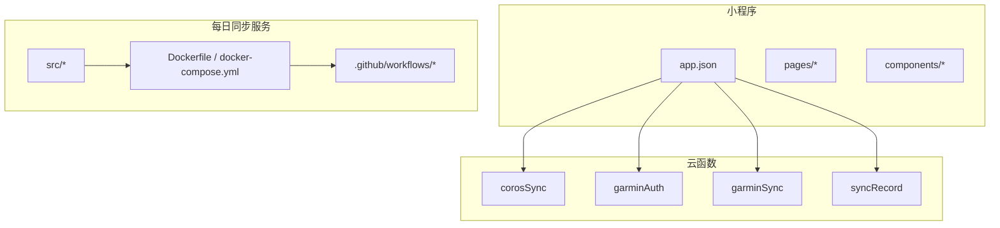
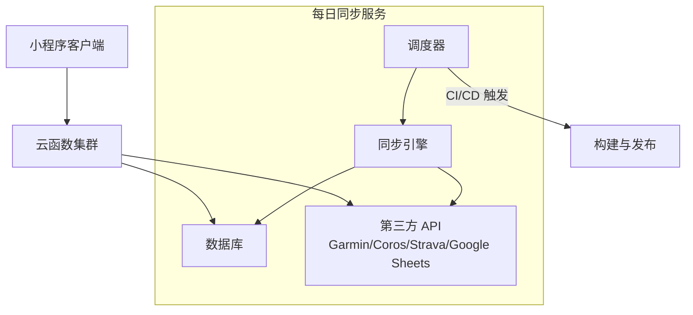
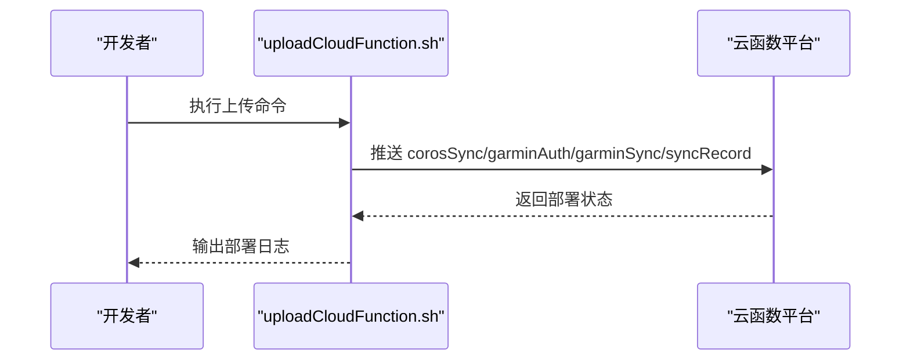
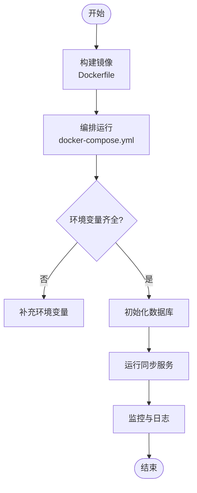
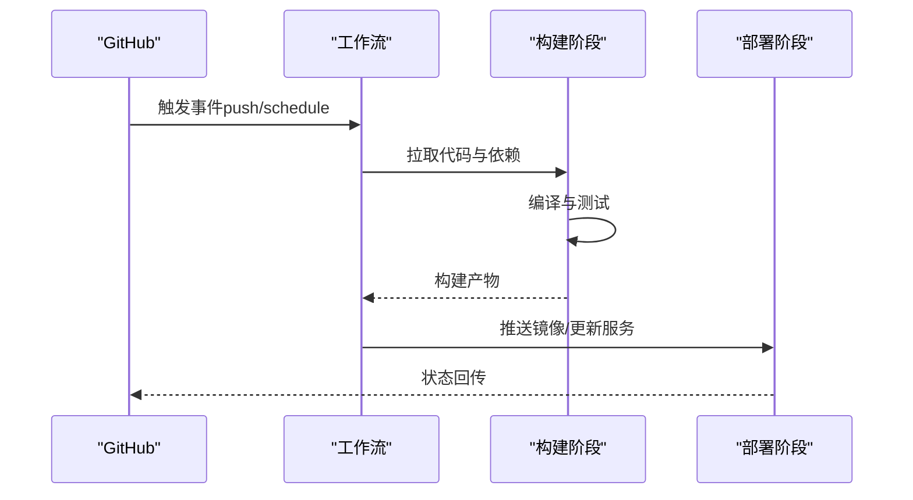
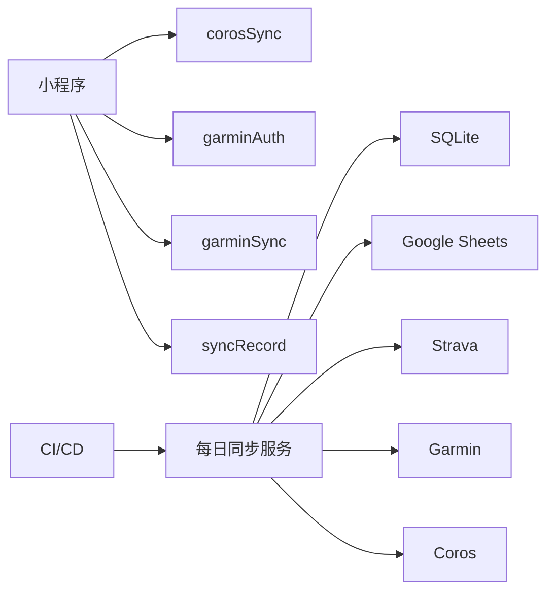

# 部署指南

<cite>
**本文引用的文件**   
- [README.md](file://README.md)
- [project.config.json](file://project.config.json)
- [uploadCloudFunction.sh](file://uploadCloudFunction.sh)
- [miniprogram/app.json](file://miniprogram/app.json)
- [miniprogram/app.js](file://miniprogram/app.js)
- [cloudfunctions/corosSync/index.js](file://cloudfunctions/corosSync/index.js)
- [cloudfunctions/corosSync/package.json](file://cloudfunctions/corosSync/package.json)
- [cloudfunctions/garminAuth/config.json](file://cloudfunctions/garminAuth/config.json)
- [cloudfunctions/garminAuth/index.js](file://cloudfunctions/garminAuth/index.js)
- [cloudfunctions/garminAuth/package.json](file://cloudfunctions/garminAuth/package.json)
- [cloudfunctions/garminSync/config.json](file://cloudfunctions/garminSync/config.json)
- [cloudfunctions/garminSync/index.js](file://cloudfunctions/garminSync/index.js)
- [cloudfunctions/garminSync/package.json](file://cloudfunctions/garminSync/package.json)
- [cloudfunctions/syncRecord/index.js](file://cloudfunctions/syncRecord/index.js)
- [cloudfunctions/syncRecord/package.json](file://cloudfunctions/syncRecord/package.json)
- [dailysync-ref/Dockerfile](file://dailysync-ref/Dockerfile)
- [dailysync-ref/docker-compose.yml](file://dailysync-ref/docker-compose.yml)
- [dailysync-ref/package.json](file://dailysync-ref/package.json)
- [dailysync-ref/src/constant.ts](file://dailysync-ref/src/constant.ts)
- [dailysync-ref/src/utils/sqlite.ts](file://dailysync-ref/src/utils/sqlite.ts)
- [dailysync-ref/src/utils/google_sheets.ts](file://dailysync-ref/src/utils/google_sheets.ts)
- [dailysync-ref/src/utils/strava.ts](file://dailysync-ref/src/utils/strava.ts)
- [dailysync-ref/.github/workflows/daily_sync_rq.yml](file://dailysync-ref/.github/workflows/daily_sync_rq.yml)
- [dailysync-ref/.github/workflows/migrate_garmin_cn_to_garmin_global.yml](file://dailysync-ref/.github/workflows/migrate_garmin_cn_to_garmin_global.yml)
- [dailysync-ref/.github/workflows/migrate_garmin_global_to_garmin_cn.yml](file://dailysync-ref/.github/workflows/migrate_garmin_global_to_garmin_cn.yml)
- [dailysync-ref/.github/workflows/sync_garmin_cn_to_garmin_global.yml](file://dailysync-ref/.github/workflows/sync_garmin_cn_to_garmin_global.yml)
- [dailysync-ref/.github/workflows/sync_garmin_global_to_garmin_cn.yml](file://dailysync-ref/.github/workflows/sync_garmin_global_to_garmin_cn.yml)
</cite>

## 目录
1. [简介](#简介)
2. [项目结构](#项目结构)
3. [核心组件](#核心组件)
4. [架构总览](#架构总览)
5. [详细组件分析](#详细组件分析)
6. [依赖关系分析](#依赖关系分析)
7. [性能与容量规划](#性能与容量规划)
8. [故障排查指南](#故障排查指南)
9. [结论](#结论)
10. [附录](#附录)

## 简介
本指南面向微信小程序与云函数、以及每日同步服务（dailysync-ref）的完整部署，覆盖本地开发环境搭建、云函数上传、Docker 容器化部署与 CI/CD 流水线配置。文档还包含环境变量管理、数据库初始化、第三方服务集成、生产最佳实践、监控与告警、以及自动化脚本使用与故障恢复方案。读者无需深厚的工程背景即可按步骤完成从开发到生产的端到端部署。

## 项目结构
本项目由三大部分组成：
- 小程序前端：位于 miniprogram 目录，包含页面、组件与小程序配置文件。
- 云函数：位于 cloudfunctions 目录，包含多个独立云函数模块，每个模块有 index.js 与 package.json，部分模块含 config.json。
- 每日同步服务：位于 dailysync-ref 目录，提供 TypeScript 源码、Docker 构建与编排、以及 GitHub Actions 工作流。

图表来源
- [miniprogram/app.json](file://miniprogram/app.json)
- [cloudfunctions/corosSync/index.js](file://cloudfunctions/corosSync/index.js)
- [cloudfunctions/garminAuth/index.js](file://cloudfunctions/garminAuth/index.js)
- [cloudfunctions/garminSync/index.js](file://cloudfunctions/garminSync/index.js)
- [cloudfunctions/syncRecord/index.js](file://cloudfunctions/syncRecord/index.js)
- [dailysync-ref/Dockerfile](file://dailysync-ref/Dockerfile)
- [dailysync-ref/docker-compose.yml](file://dailysync-ref/docker-compose.yml)
- [dailysync-ref/.github/workflows/daily_sync_rq.yml](file://dailysync-ref/.github/workflows/daily_sync_rq.yml)

章节来源
- [README.md](file://README.md)
- [project.config.json](file://project.config.json)
- [miniprogram/app.json](file://miniprogram/app.json)
- [miniprogram/app.js](file://miniprogram/app.js)

## 核心组件
- 小程序应用入口与路由：通过 app.json 定义页面与窗口行为，app.js 负责初始化与全局状态。
- 云函数集合：
  - corosSync：用于 Coros 数据同步的云函数。
  - garminAuth：Garmin 认证相关逻辑。
  - garminSync：Garmin 数据同步逻辑。
  - syncRecord：记录同步任务或结果。
- 每日同步服务：基于 TypeScript 的数据同步与迁移工具，支持 SQLite、Google Sheets、Strava 等第三方服务，并提供 Docker 镜像与 CI/CD 工作流。

章节来源
- [miniprogram/app.json](file://miniprogram/app.json)
- [miniprogram/app.js](file://miniprogram/app.js)
- [cloudfunctions/corosSync/index.js](file://cloudfunctions/corosSync/index.js)
- [cloudfunctions/corosSync/package.json](file://cloudfunctions/corosSync/package.json)
- [cloudfunctions/garminAuth/index.js](file://cloudfunctions/garminAuth/index.js)
- [cloudfunctions/garminAuth/config.json](file://cloudfunctions/garminAuth/config.json)
- [cloudfunctions/garminAuth/package.json](file://cloudfunctions/garminAuth/package.json)
- [cloudfunctions/garminSync/index.js](file://cloudfunctions/garminSync/index.js)
- [cloudfunctions/garminSync/config.json](file://cloudfunctions/garminSync/config.json)
- [cloudfunctions/garminSync/package.json](file://cloudfunctions/garminSync/package.json)
- [cloudfunctions/syncRecord/index.js](file://cloudfunctions/syncRecord/index.js)
- [cloudfunctions/syncRecord/package.json](file://cloudfunctions/syncRecord/package.json)

## 架构总览
整体架构分为三层：
- 小程序层：用户交互与调用云函数。
- 云函数层：处理业务逻辑、鉴权与数据同步。
- 每日同步服务层：定时任务、数据迁移与外部系统集成，容器化运行并通过 CI/CD 触发。

图表来源
- [cloudfunctions/corosSync/index.js](file://cloudfunctions/corosSync/index.js)
- [cloudfunctions/garminAuth/index.js](file://cloudfunctions/garminAuth/index.js)
- [cloudfunctions/garminSync/index.js](file://cloudfunctions/garminSync/index.js)
- [cloudfunctions/syncRecord/index.js](file://cloudfunctions/syncRecord/index.js)
- [dailysync-ref/src/utils/sqlite.ts](file://dailysync-ref/src/utils/sqlite.ts)
- [dailysync-ref/src/utils/google_sheets.ts](file://dailysync-ref/src/utils/google_sheets.ts)
- [dailysync-ref/src/utils/strava.ts](file://dailysync-ref/src/utils/strava.ts)
- [dailysync-ref/.github/workflows/daily_sync_rq.yml](file://dailysync-ref/.github/workflows/daily_sync_rq.yml)

## 详细组件分析

### 小程序部署与配置
- 本地开发环境：安装微信开发者工具，导入 miniprogram 目录，确保 project.config.json 中已配置 AppID 与基础库版本。
- 应用配置：检查 app.json 中的页面注册、窗口样式与导航栏设置；在 app.js 中初始化必要的全局变量与服务。
- 云函数关联：在小程序项目中启用云开发并绑定对应云环境，确保云函数路径正确。

章节来源
- [project.config.json](file://project.config.json)
- [miniprogram/app.json](file://miniprogram/app.json)
- [miniprogram/app.js](file://miniprogram/app.js)

### 云函数上传与发布
- 上传脚本：使用 uploadCloudFunction.sh 批量上传 cloudfunctions 下的各函数模块至云环境。
- 函数模块：每个云函数目录包含 index.js（入口）、package.json（依赖），部分含 config.json（配置）。
- 环境变量：在云函数配置中注入必要的密钥与端点，避免硬编码敏感信息。

图表来源
- [uploadCloudFunction.sh](file://uploadCloudFunction.sh)
- [cloudfunctions/corosSync/index.js](file://cloudfunctions/corosSync/index.js)
- [cloudfunctions/garminAuth/index.js](file://cloudfunctions/garminAuth/index.js)
- [cloudfunctions/garminSync/index.js](file://cloudfunctions/garminSync/index.js)
- [cloudfunctions/syncRecord/index.js](file://cloudfunctions/syncRecord/index.js)

章节来源
- [uploadCloudFunction.sh](file://uploadCloudFunction.sh)
- [cloudfunctions/corosSync/package.json](file://cloudfunctions/corosSync/package.json)
- [cloudfunctions/garminAuth/package.json](file://cloudfunctions/garminAuth/package.json)
- [cloudfunctions/garminSync/package.json](file://cloudfunctions/garminSync/package.json)
- [cloudfunctions/syncRecord/package.json](file://cloudfunctions/syncRecord/package.json)

### 每日同步服务容器化部署
- 构建镜像：使用 dailysync-ref/Dockerfile 构建镜像，包含 Node 运行时与依赖。
- 编排运行：docker-compose.yml 定义服务、网络、卷挂载与环境变量。
- 环境变量：在 compose 或宿主环境中注入数据库连接串、第三方服务凭据。
- 数据库初始化：启动时执行 SQLite 初始化脚本或迁移任务。

图表来源
- [dailysync-ref/Dockerfile](file://dailysync-ref/Dockerfile)
- [dailysync-ref/docker-compose.yml](file://dailysync-ref/docker-compose.yml)
- [dailysync-ref/src/utils/sqlite.ts](file://dailysync-ref/src/utils/sqlite.ts)

章节来源
- [dailysync-ref/Dockerfile](file://dailysync-ref/Dockerfile)
- [dailysync-ref/docker-compose.yml](file://dailysync-ref/docker-compose.yml)
- [dailysync-ref/package.json](file://dailysync-ref/package.json)
- [dailysync-ref/src/constant.ts](file://dailysync-ref/src/constant.ts)

### CI/CD 流水线配置
- 工作流文件：dailysync-ref/.github/workflows 下包含每日同步、数据迁移与双向同步的工作流。
- 触发条件：可按分支、标签或定时触发，执行构建、测试与部署。
- 密钥管理：通过 GitHub Secrets 注入敏感信息，避免泄露。

图表来源
- [dailysync-ref/.github/workflows/daily_sync_rq.yml](file://dailysync-ref/.github/workflows/daily_sync_rq.yml)
- [dailysync-ref/.github/workflows/migrate_garmin_cn_to_garmin_global.yml](file://dailysync-ref/.github/workflows/migrate_garmin_cn_to_garmin_global.yml)
- [dailysync-ref/.github/workflows/migrate_garmin_global_to_garmin_cn.yml](file://dailysync-ref/.github/workflows/migrate_garmin_global_to_garmin_cn.yml)
- [dailysync-ref/.github/workflows/sync_garmin_cn_to_garmin_global.yml](file://dailysync-ref/.github/workflows/sync_garmin_cn_to_garmin_global.yml)
- [dailysync-ref/.github/workflows/sync_garmin_global_to_garmin_cn.yml](file://dailysync-ref/.github/workflows/sync_garmin_global_to_garmin_cn.yml)

章节来源
- [dailysync-ref/.github/workflows/daily_sync_rq.yml](file://dailysync-ref/.github/workflows/daily_sync_rq.yml)
- [dailysync-ref/.github/workflows/migrate_garmin_cn_to_garmin_global.yml](file://dailysync-ref/.github/workflows/migrate_garmin_cn_to_garmin_global.yml)
- [dailysync-ref/.github/workflows/migrate_garmin_global_to_garmin_cn.yml](file://dailysync-ref/.github/workflows/migrate_garmin_global_to_garmin_cn.yml)
- [dailysync-ref/.github/workflows/sync_garmin_cn_to_garmin_global.yml](file://dailysync-ref/.github/workflows/sync_garmin_cn_to_garmin_global.yml)
- [dailysync-ref/.github/workflows/sync_garmin_global_to_garmin_cn.yml](file://dailysync-ref/.github/workflows/sync_garmin_global_to_garmin_cn.yml)

### 第三方服务集成
- Garmin/Coros/Strava：云函数与每日同步服务通过各自 SDK 或 HTTP 接口访问第三方平台。
- Google Sheets：用于数据导出或报表生成，需配置 OAuth 或 Service Account。
- 安全建议：所有凭据通过环境变量注入，禁止写入代码仓库。

章节来源
- [cloudfunctions/garminAuth/config.json](file://cloudfunctions/garminAuth/config.json)
- [cloudfunctions/garminSync/config.json](file://cloudfunctions/garminSync/config.json)
- [dailysync-ref/src/utils/google_sheets.ts](file://dailysync-ref/src/utils/google_sheets.ts)
- [dailysync-ref/src/utils/strava.ts](file://dailysync-ref/src/utils/strava.ts)

## 依赖关系分析
- 小程序依赖云函数进行业务处理与数据同步。
- 每日同步服务依赖 SQLite 存储与第三方 API。
- CI/CD 工作流依赖 GitHub Actions 与容器镜像仓库。

图表来源
- [miniprogram/app.json](file://miniprogram/app.json)
- [cloudfunctions/corosSync/index.js](file://cloudfunctions/corosSync/index.js)
- [cloudfunctions/garminAuth/index.js](file://cloudfunctions/garminAuth/index.js)
- [cloudfunctions/garminSync/index.js](file://cloudfunctions/garminSync/index.js)
- [cloudfunctions/syncRecord/index.js](file://cloudfunctions/syncRecord/index.js)
- [dailysync-ref/src/utils/sqlite.ts](file://dailysync-ref/src/utils/sqlite.ts)
- [dailysync-ref/src/utils/google_sheets.ts](file://dailysync-ref/src/utils/google_sheets.ts)
- [dailysync-ref/src/utils/strava.ts](file://dailysync-ref/src/utils/strava.ts)
- [dailysync-ref/.github/workflows/daily_sync_rq.yml](file://dailysync-ref/.github/workflows/daily_sync_rq.yml)

章节来源
- [miniprogram/app.json](file://miniprogram/app.json)
- [dailysync-ref/package.json](file://dailysync-ref/package.json)

## 性能与容量规划
- 云函数：合理拆分函数粒度，避免单函数过大；利用缓存与异步任务提升吞吐。
- 每日同步服务：为 I/O 密集型任务预留足够 CPU 与内存；对数据库连接池进行调优。
- 容器化：限制资源配额，启用健康检查与自动重启策略。
- 监控：接入日志采集与指标上报，设置阈值告警。

[本节为通用指导，不直接分析具体文件]

## 故障排查指南
- 云函数上传失败：检查 uploadCloudFunction.sh 权限与网络连通性；查看云函数控制台日志定位错误。
- 环境变量缺失：确认云函数与容器环境均注入必要变量；核对密钥有效期与作用域。
- 数据库初始化失败：检查 SQLite 文件路径与权限；验证迁移脚本是否成功执行。
- 第三方 API 限流：实现重试与退避策略；记录请求耗时与错误码。
- CI/CD 失败：查看工作流日志，确认 Secrets 配置与依赖安装步骤。

章节来源
- [uploadCloudFunction.sh](file://uploadCloudFunction.sh)
- [cloudfunctions/garminAuth/config.json](file://cloudfunctions/garminAuth/config.json)
- [cloudfunctions/garminSync/config.json](file://cloudfunctions/garminSync/config.json)
- [dailysync-ref/src/utils/sqlite.ts](file://dailysync-ref/src/utils/sqlite.ts)
- [dailysync-ref/.github/workflows/daily_sync_rq.yml](file://dailysync-ref/.github/workflows/daily_sync_rq.yml)

## 结论
通过本指南，您可以完成从小程序到云函数再到每日同步服务的完整部署链路。遵循环境变量管理、容器化与 CI/CD 的最佳实践，结合监控与故障恢复策略，可保障系统在稳定与高效的状态下运行。

[本节为总结性内容，不直接分析具体文件]

## 附录
- 本地开发清单：
  - 安装微信开发者工具并导入 miniprogram。
  - 配置 project.config.json 的 AppID 与基础库版本。
  - 准备云函数环境变量与密钥。
- 生产部署清单：
  - 构建并推送容器镜像。
  - 配置 docker-compose 环境变量与卷挂载。
  - 初始化数据库并验证迁移。
  - 启用监控与告警。
- 常用命令参考：
  - 上传云函数：执行 uploadCloudFunction.sh。
  - 构建镜像：进入 dailysync-ref 目录执行 docker build。
  - 编排运行：docker-compose up -d。
  - 查看日志：docker logs 或使用云平台日志中心。

[本节为操作清单与参考，不直接分析具体文件]