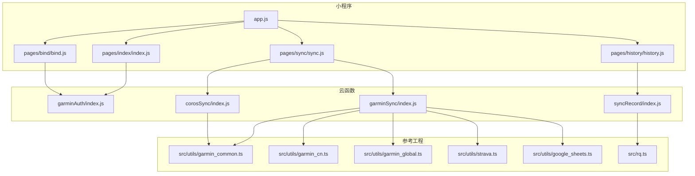
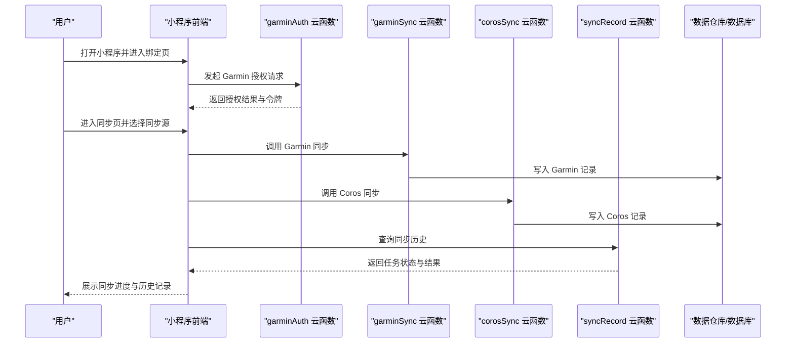
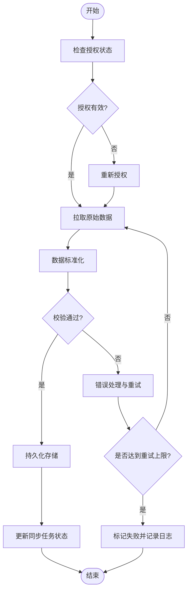
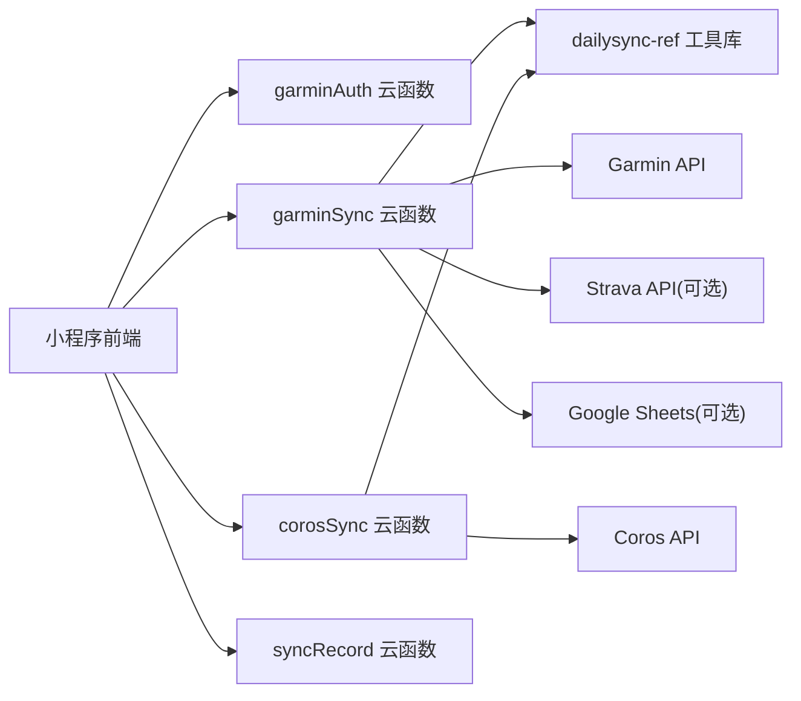

# 项目概览

<cite>
**本文引用的文件**   
- [README.md](file://README.md)
- [project.config.json](file://project.config.json)
- [miniprogram/app.js](file://miniprogram/app.js)
- [miniprogram/app.json](file://miniprogram/app.json)
- [miniprogram/pages/index/index.js](file://miniprogram/pages/index/index.js)
- [miniprogram/pages/bind/bind.js](file://miniprogram/pages/bind/bind.js)
- [miniprogram/pages/sync/sync.js](file://miniprogram/pages/sync/sync.js)
- [miniprogram/pages/history/history.js](file://miniprogram/pages/history/history.js)
- [cloudfunctions/garminAuth/index.js](file://cloudfunctions/garminAuth/index.js)
- [cloudfunctions/garminSync/index.js](file://cloudfunctions/garminSync/index.js)
- [cloudfunctions/corosSync/index.js](file://cloudfunctions/corosSync/index.js)
- [cloudfunctions/syncRecord/index.js](file://cloudfunctions/syncRecord/index.js)
- [dailysync-ref/src/utils/garmin_common.ts](file://dailysync-ref/src/utils/garmin_common.ts)
- [dailysync-ref/src/utils/garmin_cn.ts](file://dailysync-ref/src/utils/garmin_cn.ts)
- [dailysync-ref/src/utils/garmin_global.ts](file://dailysync-ref/src/utils/garmin_global.ts)
- [dailysync-ref/src/utils/strava.ts](file://dailysync-ref/src/utils/strava.ts)
- [dailysync-ref/src/utils/google_sheets.ts](file://dailysync-ref/src/utils/google_sheets.ts)
- [dailysync-ref/src/rq.ts](file://dailysync-ref/src/rq.ts)
</cite>

## 目录
1. [简介](#简介)
2. [项目结构](#项目结构)
3. [核心组件](#核心组件)
4. [架构总览](#架构总览)
5. [详细组件分析](#详细组件分析)
6. [依赖关系分析](#依赖关系分析)
7. [性能考量](#性能考量)
8. [故障排查指南](#故障排查指南)
9. [结论](#结论)
10. [附录](#附录)

## 简介
本项目是一个微信小程序，面向运动爱好者与数据管理用户，提供与 Garmin（含中国区与全球区）及 Coros 等运动生态的数据同步能力。小程序通过云函数完成授权、拉取与入库，结合参考工程 dailysync-ref 的算法与工具库，实现跨平台数据的标准化、计算与导出。核心价值在于：
- 一键授权并安全获取 Garmin/Coros 数据
- 将多源运动记录统一为结构化数据，便于后续分析与可视化
- 支持增量同步与历史记录查看，降低重复请求与网络开销
- 以云函数为核心后端，简化部署与运维成本

目标用户包括：
- 个人运动爱好者：希望集中查看与管理来自不同设备的运动数据
- 教练与数据分析人员：需要稳定、可追溯的数据来源进行训练计划与复盘
- 开发者与研究者：基于标准数据结构进行二次开发或研究

与其他组件的关系：
- 小程序前端负责交互与状态展示
- 云函数承担鉴权、数据拉取、转换与落库
- dailysync-ref 提供 Garmin/Strava/Google Sheets 等工具与 Running Quotient 计算逻辑

[无具体代码片段引用]

## 项目结构
项目采用“小程序 + 云函数 + 参考工程”的分层组织方式：
- miniprogram：小程序前端页面与入口配置
- cloudfunctions：按功能划分的云函数（授权、Garmin 同步、Coros 同步、记录同步）
- dailysync-ref：参考工程，包含 Garmin CN/Global、Strava、Google Sheets 工具与 RQ 计算
- 根级配置文件：项目配置与上传脚本

图表来源
- [miniprogram/app.js](file://miniprogram/app.js)
- [miniprogram/pages/index/index.js](file://miniprogram/pages/index/index.js)
- [miniprogram/pages/bind/bind.js](file://miniprogram/pages/bind/bind.js)
- [miniprogram/pages/sync/sync.js](file://miniprogram/pages/sync/sync.js)
- [miniprogram/pages/history/history.js](file://miniprogram/pages/history/history.js)
- [cloudfunctions/garminAuth/index.js](file://cloudfunctions/garminAuth/index.js)
- [cloudfunctions/garminSync/index.js](file://cloudfunctions/garminSync/index.js)
- [cloudfunctions/corosSync/index.js](file://cloudfunctions/corosSync/index.js)
- [cloudfunctions/syncRecord/index.js](file://cloudfunctions/syncRecord/index.js)
- [dailysync-ref/src/utils/garmin_common.ts](file://dailysync-ref/src/utils/garmin_common.ts)
- [dailysync-ref/src/utils/garmin_cn.ts](file://dailysync-ref/src/utils/garmin_cn.ts)
- [dailysync-ref/src/utils/garmin_global.ts](file://dailysync-ref/src/utils/garmin_global.ts)
- [dailysync-ref/src/utils/strava.ts](file://dailysync-ref/src/utils/strava.ts)
- [dailysync-ref/src/utils/google_sheets.ts](file://dailysync-ref/src/utils/google_sheets.ts)
- [dailysync-ref/src/rq.ts](file://dailysync-ref/src/rq.ts)

章节来源
- [project.config.json](file://project.config.json)
- [miniprogram/app.json](file://miniprogram/app.json)

## 核心组件
- 小程序入口与路由
  - app.js：应用初始化与全局状态
  - app.json：页面路由、窗口样式与 tabBar 配置
- 主要页面
  - index：首页，引导用户进入绑定与同步流程
  - bind：绑定 Garmin/Coros 账号，触发云函数授权流程
  - sync：发起数据同步，调用对应云函数执行拉取与入库
  - history：查看历史同步结果与记录列表
- 云函数
  - garminAuth：处理 Garmin 授权与令牌管理
  - garminSync：拉取 Garmin 数据并进行标准化处理
  - corosSync：拉取 Coros 数据并进行标准化处理
  - syncRecord：记录同步任务与结果，供前端查询与展示

章节来源
- [miniprogram/app.js](file://miniprogram/app.js)
- [miniprogram/app.json](file://miniprogram/app.json)
- [miniprogram/pages/index/index.js](file://miniprogram/pages/index/index.js)
- [miniprogram/pages/bind/bind.js](file://miniprogram/pages/bind/bind.js)
- [miniprogram/pages/sync/sync.js](file://miniprogram/pages/sync/sync.js)
- [miniprogram/pages/history/history.js](file://miniprogram/pages/history/history.js)
- [cloudfunctions/garminAuth/index.js](file://cloudfunctions/garminAuth/index.js)
- [cloudfunctions/garminSync/index.js](file://cloudfunctions/garminSync/index.js)
- [cloudfunctions/corosSync/index.js](file://cloudfunctions/corosSync/index.js)
- [cloudfunctions/syncRecord/index.js](file://cloudfunctions/syncRecord/index.js)

## 架构总览
系统采用“前端轻交互 + 云函数重逻辑”的架构模式：
- 小程序仅承载 UI 与轻量业务编排，避免敏感信息泄露
- 云函数负责第三方 API 调用、鉴权、数据清洗与持久化
- 参考工程提供领域知识与工具方法，确保数据一致性与可计算性

图表来源
- [miniprogram/pages/bind/bind.js](file://miniprogram/pages/bind/bind.js)
- [miniprogram/pages/sync/sync.js](file://miniprogram/pages/sync/sync.js)
- [miniprogram/pages/history/history.js](file://miniprogram/pages/history/history.js)
- [cloudfunctions/garminAuth/index.js](file://cloudfunctions/garminAuth/index.js)
- [cloudfunctions/garminSync/index.js](file://cloudfunctions/garminSync/index.js)
- [cloudfunctions/corosSync/index.js](file://cloudfunctions/corosSync/index.js)
- [cloudfunctions/syncRecord/index.js](file://cloudfunctions/syncRecord/index.js)

## 详细组件分析

### 小程序前端组件
- 入口与路由
  - app.js：初始化全局配置、环境信息与错误上报
  - app.json：定义页面路由、导航栏样式与 TabBar
- 页面模块
  - index：首页引导，跳转至绑定与同步
  - bind：触发授权流程，处理回调与本地缓存
  - sync：选择同步源（Garmin/Coros），调用云函数并展示进度
  - history：分页加载历史任务，支持筛选与详情查看

章节来源
- [miniprogram/app.js](file://miniprogram/app.js)
- [miniprogram/app.json](file://miniprogram/app.json)
- [miniprogram/pages/index/index.js](file://miniprogram/pages/index/index.js)
- [miniprogram/pages/bind/bind.js](file://miniprogram/pages/bind/bind.js)
- [miniprogram/pages/sync/sync.js](file://miniprogram/pages/sync/sync.js)
- [miniprogram/pages/history/history.js](file://miniprogram/pages/history/history.js)

### 云函数：授权与同步
- garminAuth
  - 职责：处理 Garmin OAuth 流程，生成并维护访问令牌
  - 输入：用户标识、回调地址、授权参数
  - 输出：授权成功标志、令牌有效期与刷新策略
- garminSync
  - 职责：调用 Garmin 接口拉取活动与数据，使用参考工程工具进行标准化
  - 输入：时间范围、数据类型、分页参数
  - 输出：标准化后的记录集合与统计摘要
- corosSync
  - 职责：调用 Coros 接口拉取活动与数据，进行字段映射与校验
  - 输入：时间范围、数据类型、分页参数
  - 输出：标准化后的记录集合与统计摘要
- syncRecord
  - 职责：记录每次同步任务的元数据与结果，供前端查询
  - 输入：任务类型、来源、时间范围、状态
  - 输出：任务列表、状态码、错误信息

章节来源
- [cloudfunctions/garminAuth/index.js](file://cloudfunctions/garminAuth/index.js)
- [cloudfunctions/garminSync/index.js](file://cloudfunctions/garminSync/index.js)
- [cloudfunctions/corosSync/index.js](file://cloudfunctions/corosSync/index.js)
- [cloudfunctions/syncRecord/index.js](file://cloudfunctions/syncRecord/index.js)

### 参考工程：工具与算法
- garmin_common.ts：Garmin 通用工具，如时间戳处理、单位换算、字段映射
- garmin_cn.ts / garmin_global.ts：区分中国区与全球区的差异处理
- strava.ts：Strava 数据接入工具（扩展能力）
- google_sheets.ts：Google Sheets 导出/导入工具（扩展能力）
- rq.ts：Running Quotient 计算逻辑，用于评估训练负荷与恢复建议

章节来源
- [dailysync-ref/src/utils/garmin_common.ts](file://dailysync-ref/src/utils/garmin_common.ts)
- [dailysync-ref/src/utils/garmin_cn.ts](file://dailysync-ref/src/utils/garmin_cn.ts)
- [dailysync-ref/src/utils/garmin_global.ts](file://dailysync-ref/src/utils/garmin_global.ts)
- [dailysync-ref/src/utils/strava.ts](file://dailysync-ref/src/utils/strava.ts)
- [dailysync-ref/src/utils/google_sheets.ts](file://dailysync-ref/src/utils/google_sheets.ts)
- [dailysync-ref/src/rq.ts](file://dailysync-ref/src/rq.ts)

### 关键流程图：数据同步

图表来源
- [cloudfunctions/garminSync/index.js](file://cloudfunctions/garminSync/index.js)
- [cloudfunctions/corosSync/index.js](file://cloudfunctions/corosSync/index.js)
- [cloudfunctions/syncRecord/index.js](file://cloudfunctions/syncRecord/index.js)

## 依赖关系分析
- 前端依赖云函数接口，遵循最小权限原则，不直接持有敏感密钥
- 云函数依赖参考工程的工具库，保证数据格式一致与算法复用
- 外部依赖包括 Garmin/Coros 开放 API、可选的 Strava 与 Google Sheets

图表来源
- [miniprogram/pages/sync/sync.js](file://miniprogram/pages/sync/sync.js)
- [cloudfunctions/garminSync/index.js](file://cloudfunctions/garminSync/index.js)
- [cloudfunctions/corosSync/index.js](file://cloudfunctions/corosSync/index.js)
- [cloudfunctions/syncRecord/index.js](file://cloudfunctions/syncRecord/index.js)
- [dailysync-ref/src/utils/garmin_common.ts](file://dailysync-ref/src/utils/garmin_common.ts)
- [dailysync-ref/src/utils/strava.ts](file://dailysync-ref/src/utils/strava.ts)
- [dailysync-ref/src/utils/google_sheets.ts](file://dailysync-ref/src/utils/google_sheets.ts)

章节来源
- [miniprogram/app.json](file://miniprogram/app.json)
- [cloudfunctions/garminSync/index.js](file://cloudfunctions/garminSync/index.js)
- [cloudfunctions/corosSync/index.js](file://cloudfunctions/corosSync/index.js)
- [cloudfunctions/syncRecord/index.js](file://cloudfunctions/syncRecord/index.js)

## 性能考量
- 增量同步：优先拉取新增数据，减少全量请求与带宽消耗
- 分页与限流：合理设置分页大小与请求间隔，避免触发第三方 API 限制
- 缓存策略：对令牌与常用配置进行短期缓存，降低重复鉴权开销
- 异步任务：长耗时操作通过云函数后台执行，前端轮询或事件通知
- 数据压缩：传输大体积数据时启用压缩，提升网络效率

[无具体代码片段引用]

## 故障排查指南
- 授权失败
  - 检查回调地址与域名白名单配置
  - 确认令牌有效期与刷新机制
  - 查看云函数日志中的错误码与堆栈
- 同步中断
  - 检查网络连通性与第三方 API 状态
  - 验证时间范围与分页参数是否正确
  - 观察重试策略与失败阈值
- 数据不一致
  - 对比原始数据与标准化字段映射
  - 校验单位换算与时间戳格式
  - 核对去重规则与主键冲突处理

章节来源
- [cloudfunctions/garminAuth/index.js](file://cloudfunctions/garminAuth/index.js)
- [cloudfunctions/garminSync/index.js](file://cloudfunctions/garminSync/index.js)
- [cloudfunctions/corosSync/index.js](file://cloudfunctions/corosSync/index.js)
- [cloudfunctions/syncRecord/index.js](file://cloudfunctions/syncRecord/index.js)

## 结论
本项目以小程序为载体、云函数为核心、参考工程为知识支撑，构建了稳定可靠的 Garmin/Coros 数据同步方案。通过清晰的职责划分与模块化设计，既满足普通用户的易用需求，也为开发者提供了可扩展的技术基础。建议在后续迭代中持续优化增量同步、错误恢复与监控告警，以提升用户体验与系统韧性。

[无具体代码片段引用]

## 附录
- 常见用例
  - 首次绑定 Garmin：在绑定页完成授权后，进入同步页选择时间范围并执行同步
  - 每日增量同步：设置定时任务或手动触发，仅拉取昨日至今的数据
  - 查看历史记录：在历史页筛选任务状态，定位失败任务并查看详情
- 术语说明
  - 授权：通过 OAuth 获取访问令牌，允许云函数代表用户调用第三方 API
  - 标准化：将不同来源的数据转换为统一结构与单位
  - 增量同步：仅拉取新增或变更的数据，避免重复处理

[无具体代码片段引用]